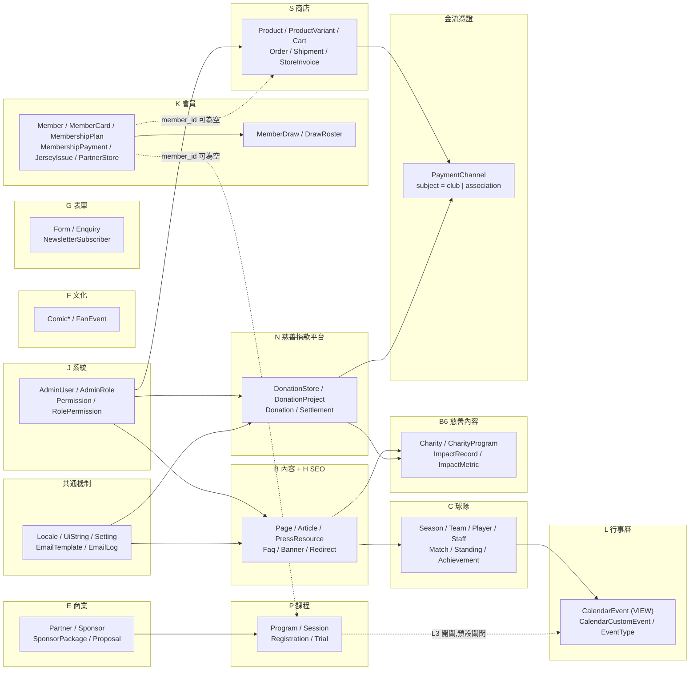

# 12 — 資料庫綱要（技術中立邏輯模型）

> 來源：規劃書 §5（**行 1328–1460**）、§6（**行 1461–1507**）、§4（**行 777–1327**）、§8（**行 1536–1550**）。
> **行號依主站 v3.0（1691 行）。**
>
> 🔴 **本檔尚未完成 v3.0 的同步——動工前必讀下方「v3.0 落差」段落。**
>
> **本檔是 [`04-data-model.md`](04-data-model.md) 的實作展開**：`04` 說「有哪些型別、哪些關係不能搞錯」，
> 本檔說「落到資料表長什麼樣」。衝突時序：**規劃書 → `04` → 本檔**。
>
> 🔵 **DBMS 已定案為 Azure SQL Database**（2026-09-18，見 [`17-deployment.md`](17-deployment.md)）。
> 規劃書仍不涉及技術選型，選型結果只記在導航層。本檔**仍不寫 DDL、不附 seed SQL**，邏輯模型維持可攜；
> 與 DBMS 相關的抉擇集中在 [§1.4](#14-dbms-相依的五件事已定案)，**型別對照見 [§1.1](#11-型別對照)**。
> **`*_i18n` 側表的欄位清單在 [`12c-i18n-tables.md`](12c-i18n-tables.md)**（本檔 §4 只用 🌐 標「有沒有側表」，不列欄位）。
>
> **不含行動 App 的十一個型別**（`AdSlot`／`Advertiser`／`AdCampaign`／`AdCreative`／`AdEvent`／`AdDailyStat`／
> `AppDevice`／`PushTopicSubscription`／`PushMessage`／`AppRelease`／`AppDiagnosticReport`），見 [`11-mobile-app.md`](11-mobile-app.md)。
> **App 開發前不得建立這些表**，屆時另出延伸設計。
> ⚠️ **`Club` 與 `Competition` 屬於本檔範圍**（主站 v3.0 起定義於主站型別表），不在上列十個之中。
>
> **本檔沒有任何日誌表**（委託方指示），代價與補償見 [§13.1](#131-沒有稽核與登入日誌表)。
>
> **本組共三份，章節編號沿用原檔不變**（舊的「`docs/12` §6」這類引用仍然有效）：
>
> | 檔案 | 收哪幾節 | 什麼時候讀 |
> |---|---|---|
> | [`12-database-schema.md`](12-database-schema.md) | 檔頭、v3.0 落差、§0–§4、§12–§15 | **入口**。型別詞彙、雙語策略、模組地圖、資料表總覽、踩雷點、落差、檢核表 |
> | [`12a-database-erd.md`](12a-database-erd.md) | §5 ER 圖（17 張） | 要看關聯圖 |
> | [`12b-database-tables.md`](12b-database-tables.md) | §6–§11 | 要寫欄位：明細、權限模型、受限欄位、快照、匯入匯出、索引與唯一鍵 |

---

---

## ✅ v3.0 同步（2026-09-20 完成）

主站規劃書已升 **v3.11**（多俱樂部架構 v3.0、後台圖片欄位直傳 v3.5、上傳即縮圖 v3.9、§5.4 清單補齊 v3.10、**欄位敘述對齊 v3.11**）、藍鯨規劃書 **v1.8**、慈善規劃書 **v2.5**、App 規劃書 **v3.12**。
**本檔的表結構、ERD 與欄位清單已逐一改寫完成。** 下表保留 13 項的對照供追溯；**僅第 3 項餘下三張表的 `club_id` 歸類待補**（見 [§4.13](#413-club_id-尚未歸類的三張表)）。

| # | 本檔現在怎麼寫 | 正確的是什麼 | 依據 |
|---|---|---|---|
| 1 | 「女足是 `Page`，不建 `Team`／`Player`／`Match`」「`team.type` 預留 `women` 但不啟用」 | **已推翻。** 藍鯨是第二個俱樂部，`Team`（`BW1`）／`Player`／`Staff`／`Match`／`Season` 全部建立。**`type` 的 `women` 值廢除，改用獨立的 `Team.gender`（`men`／`women`／`mixed`）**；`first_team` 由「全站僅一筆」改為「每俱樂部至多一筆」 | 主站 v3.0 §3.6、4.3 C1、5.1 |
| 2 | 沒有 `Club`／`Competition` 兩張表 | **必須新增。** `Team.club_id` 是必填外鍵，主站表不能指向本檔沒有的型別 | 主站 v3.0 §5.1 |
| 3 | ✅ **已完成**（2026-09-20） | **50 張必填 `club_id`、9 張可為空（＝兩隊共同）、43 張不加**，與主站 §5.4 逐名一致 | 主站 v3.10 §5.4 |
| 4 | `Member` 帶 `tier`／`membership_start_on`／`membership_end_on` | **三欄移入新的 `Membership` 表**（`member_id` × `club_id` × `season_id`）。`Member` 維持一人一帳號、**不加 `club_id`** | 主站 v3.0 §5.1 |
| 5 | `MemberCard` 掛在 `Member` 上 | **`membership_id` 必填——每份會籍一張卡。**「一張卡一組 token」與「驗證頁不得加適用球隊欄位」**兩條未變** | 主站 v3.0 §5.1、§3.14 |
| 6 | `RolePermission.scope_value json`（只存不查） | **刪除。** 改由新增的 `AdminUserClub`（含授權起訖）與 `AdminUserTeam` 承載；`AdminRole` 加 `scope_mode`、`AdminUser` 加 `primary_club_id`、`Permission` 加 `is_club_scoped` | 主站 v3.0 §5.3、§6 |
| 7 | `PaymentChannel.subject enum(club, association)` | **改為 `owner_club_id`**，唯一鍵改 `(owner_club_id, channel_type, environment)`。主站只會有俱樂部一列 | 主站 v3.0 §5.1 |
| 8 | 含慈善 `N` 模組 8 張表 | **移出本檔。** 慈善平台已改為獨立後台與獨立資料庫（另約 22 張表：8 張 `N` ＋ 約 14 張機制表），`Donation` 完全不屬於本系統 | 慈善 v2.0 §2 |
| 9 | `EmailLog.type` 有 13 個值 | **降為 9 個**（會員 5 ＋ 商店 4）。慈善的 4 封隨獨立後台移出 | 主站 v3.0 §5.1 |
| 10 | `Order` 只有 `member_id` | **加 `selling_club_id`（受益方）與 `collecting_club_id`（收款法人）**，`OrderItem`／`StoreInvoice` 一併值複製；`Cart.club_id` 必填（**不得跨俱樂部混買**） | 主站 v3.0 §5.1、4.13 |
| 11 | 唯一鍵：`Page.slug`／`Setting.setting_key`／`Redirect.from_path`／`Season.code`／`NewsletterSubscriber.email` 單欄唯一 | **全部改為 `(club_id, …)` 複合唯一。** 但 `Team.code`／`Article.slug`／`ProductVariant.sku`／`Order.order_no`／`Member.email` **維持全站唯一** | 主站 v3.0 §5.4 |
| 12 | ✅ **已結案**（2026-09-20） | §1.4 五件全部定案，見 [§1.4](#14-dbms-相依的五件事已定案)。第 5 件採**弱讀法 ＋ 路由優先順序**，不再擋轉 DDL | 主站 v3.0 §5.4 |
| 13 | ✅ **已完成**（2026-09-20） | **三張表全部移除。** 圖片改為**該表自己的欄位組**（`*_key` 物件鍵、`*_width`、`*_height`、`*_alt_zh`／`*_alt_en`）；多圖以子表承載。已知須改的外鍵 10 處：`Article` 封面、`Banner`、`Partner`／`Sponsor` 的 `logo_dark_id`／`logo_light_id`、`ProposalFile`、`ProductImage`、`ComicPage`、`Charity.logo_id`。**新增 `PressResource`**（7.8 媒體專區）。`club_id` 可為空由 8 張降為 **7 張**。⚠️ **`*_width`／`*_height` 存的是縮圖後的主檔尺寸**（長邊 ≤ 2560px），不是上傳檔的原始尺寸；1280／640／320 與 160px 方形縮圖的鍵由主鍵推導，**不另存欄位**（v3.9） | 主站 v3.9 §4.0、§5.1、§5.4 |

**進度**（轉 DDL 前必做）：

| | 工作 |
|---|---|
| ✅ | §0 一分鐘理解、§1.4 五件事、§7 權限模型與資料範圍 |
| ✅ | **§4 資料表總覽**（2026-09-20）：逐張標 `club_id`、加入 `Club`／`Competition`／`Membership`／`AdminUserClub`／`AdminUserTeam`、移出 `N` 模組 8 張、`EmailLog` 降為 9 個值、`PaymentChannel` 改 `owner_club_id` |
| ✅ | **§11 唯一鍵、索引與外鍵行為**重寫（2026-09-20，[`12b`](12b-database-tables.md)） |
| ✅ | **§6 關鍵資料表明細**重寫（2026-09-20）：`Team`／`Member`／`MemberCard`／`Order`／`PaymentChannel` 五節更新，新增 `Club`／`Membership` 兩節，移除 `Donation`／`Settlement`（[`12b`](12b-database-tables.md)） |
| ✅ | **§5 ERD 重繪**（2026-09-20，[`12a`](12a-database-erd.md)）：加 `Club`／`Competition`／`Membership`／`AdminUserClub`／`AdminUserTeam`，56 處補上 `club_id`；移除 `N` 群（5.10 改為指向 `docs/16`）。**14 張圖** |
| ✅ | **§14 型別對照檢核表**重算（2026-09-20）：主站 §5.1 現列 50 個型別，49 建表、`Donation` 依規劃書明文不在本系統 |
| ✅ | 慈善獨立庫已另出 [`16-charity-schema.md`](16-charity-schema.md)（2026-09-20，**23 張表**） |
| ✅ | **兩項規劃書內部矛盾已修**（2026-09-20，S0-4c）：主站 **v3.11** 把 §4.12 L3 補上「圖示」、§5.1 `MemberDraw` 補上「封面圖」 |
| ✅ | **`F` 漫畫 ERD 已補**（2026-09-20，S0-4d）：[`12a`](12a-database-erd.md) 新增 **§5.5b F 文化模組 — 漫畫**，ERD 由 14 張增為 **15 張** |
| ✅ | **ERD 圖片欄位盤點完成**（2026-09-20，S0-4b）：補回 `Player.photo_key`／`Staff.photo_key`／`Program.cover_key`／`CalendarCustomEvent.cover_key`／`CharityProgram.cover_key`＋新子表 `CharityProgramImage`／`MemberDraw.cover_key`。`Page` 經查證**本來就沒有**（內文插圖存於 `PageBlock.content json`，主站 §4.0 行 969）；`Venue` 是刻意不加。⚠️ **兩項待裁決見下** |

> ✅ **`MembershipPlan`／`MembershipBenefit`／`PartnerStore` 已於主站 v3.10 補進 §5.4**，本檔隨之標註完成。
>
> ✅ **S0-4b 查證時發現的兩處規劃書內部矛盾已於主站 v3.11 修正**：
> ① §4.12 L3 的賽事類型欄位補上「**圖示**（自系統預設圖示集選擇，**不是上傳圖片**）」——
> 這也確認了 ERD 的 `event_type.icon string_64` 是對的，**不需要改成 `_key`**。
> ② §5.1 的 `MemberDraw` 補上「**封面圖**」，與 §4.11 K5 的欄位清單一致。

---

## 0. 一分鐘理解

| 項目 | 內容 |
|---|---|
| 涵蓋範圍 | 主站全部（含站內商店 `S`）＋ 後台帳號與權限 `J`。⚠️ **慈善 `N` 已於 v3.0 移出**（獨立資料庫） |
| 排除範圍 | **行動 App 的十一個型別**（`M` 模組與 `E4–E6`）；**慈善捐款平台的全部資料表**（獨立系統） |
| 型別覆蓋 | ⚠️ **待重算**：主站 v3.0 新增 `Club`／`Competition`／`Membership`／`MemberCard`／`AdminUserClub`／`AdminUserTeam`，移出慈善 6 個 |
| 資料表 | **107 張**（`CalendarEvent` 是**視圖**）＋ 約 40 張 `*_i18n` 側表。逐張見 [§4](#4-資料表總覽)。**S1-8 新增 `FaqEmbedSlot`／`FaqEmbedSlotLink` 兩張，105 → 107**。⚠️ **本檔的計數口徑是「§4 逐列」，非逐張實體 DDL 檔比對**——`db/club-schema.sql` 實際 `CREATE TABLE` 另有 `SponsorPackageLink`（§4.4）與 `ImpactRecordImage`（§4.12 的圖集子表模式，比照 `CharityProgramImage`）兩張已建但本節尚未收錄，屬既有落差、不在本次（`S1-3` 補 `AdminRefreshToken`）範圍內 |
| 型別詞彙 | `uuid`／`string(n)`／`text`／`int`／`decimal(p,s)`／`bool`／`date`／`datetime`／`json`／`enum` |
| ER 圖 | 12 張 `erDiagram` ＋ 2 張 `flowchart`，每張 ≤ 12 實體 |

**五條硬規則，一句話版**

1. **值複製快照不得回頭 join**：`OrderItem`、`DrawRoster`、`StoreInvoice`、`MembershipPayment` 是凍結的歷史，母表改名改價一律不追溯。
2. **`Order.member_id` 與 `Registration.member_id` 可為空**：非會員能結帳、能報名，任何 `NOT NULL` 都是錯的。
3. **`CalendarEvent` 是視圖不是資料表**：唯一的行事曆自有資料是 `CalendarCustomEvent`。
4. **五種商業對象五張表、彼此零外鍵**：`Partner`／`Sponsor`／`PartnerStore`／`DonationStore`（／`Advertiser`，本檔不建）。**`Club` 不是第六種**——它是內容主體，不計曝光、無金流、無分潤。
5. **（v3.0）`club_id` 為空＝兩隊共同，且對受範圍限制的帳號一律唯讀**：只有超管能建立與修改。否則「查得到共同內容」與「不能改到別人的內容」無法同時成立。

---

## 1. 通用型別詞彙與共通慣例

### 1.1 型別對照

| 本檔寫法 | 意思 | Azure SQL 的對應（已定案） |
|---|---|---|
| `uuid` | 128-bit 識別碼 | **`uniqueidentifier`**。⚠️ 主鍵設為**非叢集**，另加不對外的 `bigint IDENTITY` 叢集鍵，見 [§1.2](#12-主鍵外鍵與命名慣例) |
| `string(n)` | 有長度上限的單行文字 | **`nvarchar(n)`**——一律以 Unicode 字元數計，非位元組 |
| `text` | 無長度上限的多行文字 | **`nvarchar(max)`**。富文本與區塊內容另見 `json` |
| `int` | 整數。**所有金額欄位都是 `int`，單位「元」** | **`int`**。見 [§1.3](#13-共通欄位) 的金額規則 |
| `decimal(5,2)` | 百分比，`0.00`–`100.00` | **`decimal(5,2)`**。**只有分潤百分比用**，金額不用 |
| `bool` | 真／假 | **`bit`** |
| `date` / `datetime` | 日期／時間戳。`datetime` 一律存 **UTC**，前台依 `Asia/Taipei` 呈現 | **`date`** / **`datetime2(3)`**。⚠️ SQL Server 沒有 `timestamptz`，時區語意由應用層保證（EF Core 設 `DateTimeKind.Utc` convention） |
| `json` | 結構化但不需查詢的資料（區塊內容） | **原生 `json` 型別**（Azure SQL 已 GA，二進位儲存），不用 `nvarchar(max)`。**設計紀律仍是「只存不查」**，見 §1.4 |
| `enum(a,b,c)` | 有限值域 | **`nvarchar` ＋ CHECK 約束**（不用查表、不用數字碼）——值域演進最容易，且後台介面要顯示日常中文（[`06`](06-conventions.md)） |
| `slug` | `string(160)`，`[a-z0-9-]`，**全站唯一或表內唯一**（逐表註明） | |

### 1.2 主鍵、外鍵與命名慣例

| 項目 | 規則 |
|---|---|
| 主鍵 | 一律 `id uuid`。**不用自增整數**——匯入客戶素材與跨環境搬移時會撞號 |
| **叢集鍵**（Azure SQL 定案） | 🔴 **主鍵設為非叢集，另加一欄不對外的 `bigint IDENTITY` 當叢集鍵。** SQL Server 的 `uniqueidentifier` **比較位元組的順序是反的**（先比 byte 10–15，byte 0–3 最後），所以連 **UUIDv7 也無法**取得索引區域性——它的時間戳正好落在最低優先的位元組。`NEWSEQUENTIALID()` 由伺服器端產生，應用層無法在 INSERT 前先知道 id。<br>**這不違反上一列的「不用自增整數」**——那句針對的是對外識別碼，`bigint` 叢集鍵**不對外、不進 API、不進 URL**。詳見 [`17-deployment.md`](17-deployment.md) §6 |
| 外鍵 | `<單數表名>_id`，如 `team_id`、`order_id` |
| 表名 | 文中用 PascalCase（`ProductVariant`）以對應規劃書型別名；**物理表名定為 snake_case 複數**（`product_variants`）。⚠️ **[`12a`](12a-database-erd.md) 的 ERD 用單數只是為了好讀，不是物理表名** |
| 關聯表 | `<A><B>` 或 `<A>_<B>`，複合主鍵，如 `ArticleTag(article_id, tag_id)` |
| i18n 側表 | **物理表名同樣是複數 ＋ `_i18n`**（`articles_i18n`、`product_variants_i18n`），複合主鍵 `(<單數實體>_id, locale)`——**表名複數、外鍵欄位單數**。文中與 ERD 寫 `article_i18n` 是簡寫 |
| 布林欄位 | `is_*` / `has_*` / `can_*` |
| 時間欄位 | `*_at`（時間戳）／`*_on`（純日期） |
| 排序 | `sort_order int`，小到大，預設 `0` |
| 狀態 | `status`，值域逐表定義，**不共用一套全域狀態** |

### 1.3 共通欄位

所有實體表都有：

| 欄位 | 型別 | 說明 |
|---|---|---|
| `id` | `uuid` | 主鍵 |
| `created_at` / `updated_at` | `datetime` | |
| `created_by` / `updated_by` | `uuid` ✓ | → `AdminUser.id`。**保留（本檔沒有日誌表，這兩欄是唯一的追蹤線索）**；系統自動產生的列為空 |

具前台展示的內容表另有：

| 欄位 | 型別 | 說明 |
|---|---|---|
| `slug` | `slug` | URL 識別；客戶素材匯入時作為對應鍵 |
| `status` | `enum(draft,published,scheduled)` | |
| `published_at` | `datetime` ✓ | 排程發布 |
| `seo_title` / `seo_description` / `og_image_id` | | 單頁 SEO（後台 `H`）；**雙語部分落在 i18n 側表** |

**金額規則（重要）**：**所有金額欄位都是 `int`，單位是「元」。**
台幣無角分；慈善站 §8.3 明訂分潤「**無條件捨去至整數元**」。用 `decimal(10,2)` 會製造永遠對不上的尾差。
唯一的例外是**百分比**（`store_share_pct`、`project_share_pct` 及其快照），用 `decimal(5,2)`。

**核心價值標籤**：`value_tags[]`（五大核心價值，可掛任何內容型別）以 `ValueTagLink(entity_type, entity_id, value_tag)` 多型關聯表實作，**不用陣列欄位**（見 §1.4）。

### 1.4 DBMS 相依的五件事（已定案）

本檔刻意迴避的五個 DBMS 相依決策。**DBMS 已定於 Azure SQL Database**，以下為定案結果；
完整脈絡與取捨理由見 [`17-deployment.md`](17-deployment.md) §6。

| # | 議題 | 本檔的技術中立寫法 | **Azure SQL 定案** |
|---|---|---|---|
| 1 | **陣列欄位** | 一律以關聯表表達：`team_codes[]` → `CalendarEventTeam`；`value_tags[]` → `ValueTagLink`；FAQ 複選分類 → `FaqCategoryLink` | **維持關聯表。** SQL Server 無陣列型別，且 `ValueTagLink` 是多型關聯、要能反查「哪些內容掛了這個標籤」，關聯表本來就是對的形狀 |
| 2 | **JSON 欄位的查詢** | `json` 欄位一律「**只存不查**」：`PageBlock.content` 等。任何需要篩選、排序、統計的資料都拉成實欄位。⚠️ **`RolePermission.scope_value` 已於 v3.0 刪除**——它正是「只存不查」害的：資料範圍需要能被查詢，改由 `AdminUserClub`／`AdminUserTeam` 承載 | **用原生 `json` 型別**（已 GA，二進位儲存、`JSON_VALUE` 相容、JSON 索引推出中），不用 `nvarchar(max)`。**「只存不查」維持為設計紀律**，原生型別只是保留逃生口。<br>🔴 **本機用 SQL Server 2022 容器驗證 DDL 時要先把 `json` 換成 `nvarchar(max)`**——原生 `json` 型別只在 Azure SQL Database 與 SQL Server 2025 有，2022 會報 `Msg 2715 Cannot find data type json`。**這是驗證環境的限制，不是 DDL 寫錯** |
| 3 | **`CalendarEvent` 的實作形式** | 定義為**視圖**（`source_type` + `source_id` UNION）。若效能不足，改為**索引表**並以來源模組的寫入觸發同步 | **第一期用一般 VIEW。** 🔴 **SQL Server 的 indexed view 明文禁止 `UNION`／`UNION ALL`**，所以**沒有 materialized view 這條升級路**——不要去試。效能不足時直接走索引表 ＋ 寫入時同步，或先由 Redis 吸收 |
| 4 | **全文檢索**（G-02 站內搜尋） | 綱要不含任何搜尋索引表，搜尋屬應用層 | **第一期用跨表 `LIKE` 比對**，不建搜尋索引表、不預先加索引（資料量在數百至數千列，掃描可接受）。升級路徑是 **Azure SQL 內建全文檢索**（有中文斷詞），**不需要外掛 Meilisearch／Typesense**。⚠️ 第一期做不到 G-02 要求的分類篩選與關鍵字高亮，屬**已知功能落差** |
| **5** | **可為空的 `club_id` 出現在唯一鍵裡的 NULL 語意** | 技術中立寫法：「`(club_id, slug)` 唯一，**且 `club_id` 為空時 `slug` 亦須全站唯一**」 | **採弱讀法，`UNIQUE (club_id, slug)` 就夠**——SQL Server 的唯一索引**把 NULL 當成相等**，複合唯一鍵本身已擋掉兩筆 `(NULL, 'about')`。**不加篩選唯一索引、不加觸發器**；「哪一筆對應這個網址」由路由的優先順序解決，見下 |

> ✅ **第 5 件已定案（2026-09-20）：弱讀法 ＋ 路由優先順序。**
>
> ⚠️ **SQL Server 的唯一索引把 NULL 當成相等**（與 PostgreSQL 相反）。所以 `UNIQUE (club_id, slug)`
> 本身就擋掉了兩筆 `(NULL, 'about')`——**不需要另加 `WHERE club_id IS NULL` 的篩選唯一索引。**
>
> **允許併存**：`(NULL, 'about')`、`(1, 'about')`、`(2, 'about')`。
> 「某個站台的 `/about/` 對應哪一筆」不靠唯一鍵解決，靠**查詢的優先順序**——
> **俱樂部專屬優先，沒有才回退共同內容**：
>
> ```sql
> WHERE slug = @slug AND (club_id = @club_id OR club_id IS NULL)
> ORDER BY CASE WHEN club_id IS NULL THEN 1 ELSE 0 END
> ```
>
> 這同時換到一個有用的行為：**共同內容可以被單一俱樂部覆寫**（藍鯨想自己寫一份〈關於〉就建一筆專屬的，
> 不必動共同那筆）。索引 `(slug, club_id)` 支撐這個查詢。
>
> **為什麼不採強讀法**（「有 `(NULL,'about')` 時任何俱樂部都不得再有 `about`」）：它無法用唯一索引表達，
> 得加並行安全的觸發器。頁面是數十筆、由自己人在後台維護，**維護成本高過它擋掉的風險**。
> 🟡 後台可在建立專屬頁遮蔽到同名共同頁時給一句提示，**屬選配，不是約束**。

> ⛔ **另有一份「不得讀快取」清單**——庫存、金流回呼冪等檢查、會員卡 `/m/<token>` 驗證、會籍與訂單狀態、購物車
> 一律不得走 Redis。清單與規格依據在 [`17-deployment.md`](17-deployment.md) §4，[§12 踩雷點](#12-踩雷點)亦有提示。

---

## 2. 雙語策略

### 2.1 為什麼不用並排的 `zh_*` / `en_*` 欄位

規劃書**同一頁**寫了兩件互相拉扯的事（行 1297、行 1300，`docs/04` §2 原則①，`docs/05` §1）：

> 所有具前台展示的型別皆需支援 **zh / en 雙語欄位**，並保留擴充第三語系的能力。
> 英文可以留空（fallback 繁中並標示），但**欄位必須存在**，且架構要能再加第三語系**而不改程式**。

| 面向 | 並排欄位 `zh_*`／`en_*` | **側表 `<entity>_i18n`（本檔採用）** |
|---|---|---|
| 加第三語系 | **改 DDL、改每個查詢、改每個表單**——直接違反「不改程式」 | **`INSERT` 一列 `Locale`**，零 DDL |
| 翻譯人員權限（§6：僅能編輯 `en` 欄位） | **欄位級 ACL**，多數框架做不好，只能靠 UI 硬擋 | **列級 ACL**：`WHERE locale <> 'zh-Hant'`，權限系統天然支援 |
| I 模組「翻譯狀態總覽矩陣」（行 1013–1015） | 要逐表 count 數十個 nullable `en_*` 欄位，新增欄位就漏 | 一次 `LEFT JOIN` 算出缺哪個語系，新欄位自動納入 |
| Fallback 規則（未翻譯顯示繁中或隱藏） | 每個欄位各自 `COALESCE` | 查不到列就 fallback，**一條規則管全站** |
| 讀取成本 | 少一次 join | 多一次 join（可用視圖包起來） |
| 與規劃書字面一致 | ✅ 完全一致 | ❌ **需記為執行層決定**，見 [§13](#13-與規劃書的已知落差) |

**結論**：`zh_*`／`en_*` 是**列舉了目前啟用的兩個語系**，不是指定物理欄位形狀。側表是唯一能同時滿足兩句話的做法。

**不採單一多型 EAV 表**（`Translation(entity_type, entity_id, field, value)`）：失去型別、失去外鍵、失去唯一鍵、索引爆炸、查詢不可讀。**每個實體一張側表，欄位是真欄位。**

### 2.2 側表形狀

```
Article                          article_i18n
├─ id            uuid  PK        ├─ article_id   uuid  PK,FK
├─ slug          slug            ├─ locale       string(10) PK,FK → Locale.code
├─ status        enum            ├─ title        string(200)
├─ published_at  datetime        ├─ summary      text
└─ …非語系欄位                    ├─ body         json
                                 ├─ seo_title    string(200)
                                 └─ seo_description string(300)
```

- 複合主鍵 `(<entity>_id, locale)`。
- `locale` 外鍵指向 `Locale.code`（`zh-Hant` 預設、`en`；`ja` 等日後 INSERT 即可）。
- **`zh-Hant` 那一列必存**，`en` 那一列可不存（＝未翻譯）。
- 刪除母列時側表 cascade。

### 2.3 三個例外（不走側表）

| 例外 | 做法 | 理由 |
|---|---|---|
| **快照表** | 直接存字串，不做 i18n | `OrderItem`、`DrawRoster`、`SettlementLine`、`StoreInvoice`、`DonationInvoice`、`MembershipPayment` 是**值複製當下的字串**，不隨語系變、不隨母表變 |
| **後台專用表** | 用並排 `name_zh` / `name_en` 欄位 | `AdminRole`、`Permission`。規劃書的雙語要求範圍是「**所有具前台展示的型別**」（行 1297），後台角色名稱不在其中；後台介面文案走 `UiString` |
| **UI 字串** | `UiString` + `UiStringTranslation` | I 模組「字串翻譯表」（按鈕、表單標籤、提示、錯誤訊息）與內容翻譯是**兩套機制**，不要混用 |

### 2.4 與規劃書字面寫法的對應

| 規劃書欄位 | 本檔落點 |
|---|---|
| `Match.opponent_en`、`venue_en`（v2.5 新增，行 1251） | `match_i18n(match_id, locale, opponent, venue)`。**對手與場地是自由文字不是實體**，仍照側表走 |
| K5 各欄「中／英」（行 1287） | `member_draw_i18n(name, prize_description, rules, notes)` |
| `MembershipBenefit`「須 zh／en 雙欄位、不得做成圖片」（行 673） | `membership_benefit_i18n(group_label, free_value, paid_value)` |
| `Partner`／`Sponsor`「名稱（中／英）」（行 1259–1260） | `partner_i18n`、`sponsor_i18n` |
| 慈善站 §9.4「zh / en 雙欄位」 | `donation_store_i18n`、`donation_project_i18n`；站台文案走 `Setting` + `setting_i18n` |

### 2.5 翻譯狀態矩陣與翻譯人員權限怎麼落地

- **翻譯狀態總覽**（I 模組）：對每張 `<entity>_i18n` 做 `LEFT JOIN Locale`，缺列即「缺英文」。新增可翻譯實體時矩陣自動涵蓋。
- **翻譯人員角色**（§6 註記：僅能編輯 `en`，不得改繁中原文與發布狀態）：權限碼 `*.translate` 搭配 `RolePermission.scope_type = 'translate_only'`，執行期條件為「**只能寫 `<entity>_i18n` 且 `locale <> 'zh-Hant'`**」，母表一律唯讀。

---

## 3. 模組地圖

十四個資料域與跨域連線。**這不是 ER 圖**——只畫域邊界，看的是「哪些域彼此有關、哪些刻意零連線」。



**這張圖要看出來的三件事**

1. `K1 → S1` 與 `K1 → P1` 是**虛線**：`member_id` 可為空，非會員能結帳、能報名。
2. `P1 → L1` 是**虛線且標註「預設關閉」**：課程時段永不進行事曆，只有 `Trial` 由 L3 開關決定。
3. `E1`（`Partner`／`Sponsor`）與 `K1`（`PartnerStore`）、`N1`（`DonationStore`）之間**沒有任何連線**——五種商業對象刻意零外鍵，見 [§5.5](12a-database-erd.md#55-e-商業模組-＋-五種商業對象的邊界)。

---

## 4. 資料表總覽

**107 張**（`CalendarEvent` 是視圖），另有約 40 張 `*_i18n` 側表。⚠️ 計數口徑見 [§0](#0-一分鐘理解)。
圖例：🌐 有 i18n 側表｜🔒 含受限或加密欄位｜📸 值複製快照，不可回頭 join。
**`club_id` 欄**：**●** 必填｜**○** 可為空（＝兩隊共同）｜**—** 不加。
判定準則與逐表清單見主站規劃書 **§5.4**（行 1533–1579）。

> 🔴 **`club_id` 為空的資料，對受範圍限制的帳號（`scope_mode = own_clubs`）一律唯讀**，只有超級管理員能建立與修改。
> 否則「藍鯨看得到共同內容」與「藍鯨不能改到共同內容」無法同時成立。
>
> 🔴 **四類絕對不可為空**：有唯一路徑衝突者、承載個資者、有金流稅務歸屬者、**所有值複製快照表**
> （快照的意義是凍結歸屬，NULL 是「未知」不是「共同」）。

> **本檔的標註與主站 §5.4 逐名一致**：**50 張必填、9 張可為空**（v3.10 補齊三張）。
> **`PaymentChannel`（標 ●⁺）的欄位名是 `owner_club_id` 不是 `club_id`**，依 v3.0 落差第 7 項。

### 4.0 共通機制（7）

| 表 | `club_id` | 用途 | 標記 |
|---|---|---|---|
| `Locale` | — | 啟用語系（`code`、名稱、是否預設、fallback 對象、排序）。**加第三語系＝INSERT 一列** | |
| `UiString` | — | 介面字串鍵（按鈕、標籤、提示、錯誤訊息）與所屬分組 | |
| `UiStringTranslation` | — | `(ui_string_id, locale) → value` | |
| `ValueTagLink` | — | 五大核心價值標籤的多型關聯 `(entity_type, entity_id, value_tag)` | |
| `Setting` | **●** | 全域設定鍵值（含商店設定、聯絡資訊、社群連結、政策頁、維護模式）；文案類另有 `setting_i18n`。**唯一鍵 `(club_id, setting_key)`** | 🌐 |
| `EmailTemplate` | **●** | 系統信樣板 | 🌐 |
| `EmailLog` | **●** | 系統信寄送紀錄。**`type` 值域 9 個**：會員五封 ＋ 商店四封 | 🔒 |

> ⚠️ `EmailLog` **不是操作日誌，是功能單元**（後台要查「這封信寄出去了沒」）。不在本檔移除日誌表的範圍內。
> ⚠️ **中獎人的人工聯繫不得寫入 `EmailLog`**——系統信維持既有封數，抽獎不新增通知信。

### 4.1 B 內容管理 ＋ H 搜尋與 AI 能見度（18）

| 表 | `club_id` | 用途 | 標記 | 後台 |
|---|---|---|---|---|
| `Page` | **●** | 靜態頁面主檔。**藍鯨官網入口頁亦屬此型別**。唯一鍵 `(club_id, slug)` | 🌐 | B1 |
| `PageBlock` | — | 頁面區塊（12 種型別，規劃書第 1012 行），`content json`（**只存不查**）、`sort_order`。**由 `Page` 推導** | 🌐 | B1 |
| `PageVersion` | — | 版本歷程與還原點、預覽分享 token。**這是內容版本不是操作日誌** | | B1 |
| `Article` | **○** | 新聞與故事。**空＝兩隊共同**；`slug` **維持全站唯一**（共同文章須有單一 canonical） | 🌐 | B2 |
| `ArticleCategory` | — | 7.1–7.8 八分類。**刻意不加**——分類是內容主題，加了八個會變十六個 | 🌐 | B2 |
| `Tag` | — | 標籤。**刻意不加**，同上 | 🌐 | B2 |
| `ArticleTag` | — | `(article_id, tag_id)` | | B2 |
| `ArticleRelation` | — | 文章的多型關聯 `(article_id, target_type, target_id)` | | B2 |
| `PressResource` | **○** | 媒體資源（新聞稿／品牌識別包／高解析圖）。`status` **收斂為 `draft`／`published`**（S1-8，見 [§12 第 33 點](#12-踩雷點)） | 🌐 | B6 |
| `Banner` | **●** | 首頁 Hero 輪播（≤5）：**`media_type`（`image`／`video`）**、素材（圖片欄位組 `image_key`／`image_width`／`image_height`／`image_alt`＋影片模式另有 `video_key`）、CTA、上下架期間、排序（S1-8 補影片欄位與圖片欄位組，行 1023）。**`status`（`draft`／`published`，預設 `draft`，v3.14）**：新增或上傳後為草稿，發布後**依既有 `start_at`／`end_at`（上架期間）自動顯示與下架**——這是查詢時的區間過濾，不是排程轉態，**不比照 `Article`／`Page` 接 `ScheduledPublishRunner`、不加 `scheduled` 值** | 🌐 | B3 |
| `HomeSection` | **●** | 首頁九大區塊的開關、排序，**僅 Hero 有精選指定**（`featured_banner_id`）。✅ **S1-8 已逐區塊核對**：其餘八區塊或為自動查詢（依時間／排序），或已有各自機制（「最新消息」精選靠 `Article.is_featured`），規劃書未要求可指定的區塊不加欄位 | | B3 |
| `Faq` | **○** | 常見問題；👍／👎 計數。`status` **收斂為 `draft`／`published`**（S1-8） | 🌐 | B4 |
| `FaqCategory` | — | 主題分類（10 個）。**刻意不加 `club_id`**，同 `ArticleCategory`。**新增 `is_enabled`**（S1-8，行 1027「新增／排序／停用分類」）：真正的軟停用，取代先前「用刪除湊停用」的作法 | 🌐 | B5 |
| `FaqCategoryLink` | — | `(faq_id, faq_category_id)`——**一題可屬多分類** | | B5 |
| `FaqEmbedSlot` | — | **G-12 快捷區塊掛載點字典**（S1-8 新增，行 1029）：站內已知掛載位置（`academy_admission`／`program_detail`／`trials`／`sponsorship`）。**刻意不加 `club_id`**——掛載點是站台結構代號，兩站共用同一套頁面骨架，是否命中依該俱樂部實際有無對應頁面 | | B4 |
| `FaqEmbedSlotLink` | — | `(faq_id, faq_embed_slot_id)`——**該題額外指定出現於哪個 G-12 掛載點**，疊加在「由分類自動對應」之上（不是取代，見 [§12 第 34 點](#12-踩雷點)） | | B4 |
| `FaqSearchMiss` | **●** | 零結果搜尋關鍵字與次數。**這是成效統計不是日誌** | | B5 |
| `Redirect` | **●** | 301 對照（`from_path`、`to_path`、`is_active`）。唯一鍵 `(club_id, from_path)`——兩站都會有 `/zh/about/` | | H |

### 4.2 C 球隊管理（15）

| 表 | `club_id` | 用途 | 標記 |
|---|---|---|---|
| `Competition` | **●** | **賽事系列**（`code`、名稱、類型、`season_id`）。v3.0 新增，App 的賽事篩選與 12 個月完整賽程靠它。`status` **收斂為 `draft`／`published`**（S1-8，見 [§12 第 33 點](#12-踩雷點)） | 🌐 |
| `Season` | **●** | 賽季（`code` 如 `2026-27`、起訖日）。唯一鍵 `(club_id, code)`——**兩隊球季不同步** | |
| `Team` | **●** | 球隊。**`code` UNIQUE（全站唯一，不得改複合鍵）**，值域 `D1`／**`BW1`**／`U15`／`U14`／`U12`；`type` = `first_team`／`academy`；**`gender`（`men`／`women`／`mixed`）**。`first_team` 為**每俱樂部至多一筆** | 🌐 |
| `Player` | **●** | 球員：背號、位置、生日、身高體重、國籍、慣用腳、加入日期、狀態。**新增 `portrait_consent_status`**（肖像同意，S1-8，見 [§12 第 32 點](#12-踩雷點)） | 🌐 |
| `PlayerSeasonStat` | — | 逐季數據 `(player_id, season_id)`。**由 `Player` 推導** | |
| `Staff` | **○** | 教練與團隊成員：證照、專長、分組。**空＝兩隊共同**（行政與醫療多為共用）。**新增 `portrait_consent_status`**（同 `Player`，S1-8） | 🌐 |
| `StaffTeam` | — | `(staff_id, team_id)` 帶職務 | |
| `Match` | **●** | 賽事。`competition_id`（可空）、**`status`（`scheduled`／`live`／`played`／`postponed`／`cancelled`，五值，v3.14 補齊 `cancelled` 並加上 CHECK 約束，見 [§12 第 31 點](#12-踩雷點)）**；**`match_no`（場次編號，聯賽官方配發，與 `round_no`／輪次是兩回事，同一輪可能有多場、可為空）**；**`original_match_on`／`original_kickoff`（v3.13 新增，僅 `status = 'postponed'` 時有值，記錄延賽前的原定日期時間，皆可為空、無 CHECK 約束）**；對手與場地的英文走 `match_i18n` | 🌐 |
| `MatchTeam` | — | 本方參賽隊 `(match_id, team_id)` | |
| `MatchGoal` | — | 進球（球員、時間、類型） | |
| `MatchCard` | — | 黃紅牌 | |
| `MatchLineup` | — | 先發與替補名單 | |
| `Standing` | **●** | 積分榜 `(season_id, team_name, ...)`。**對手隊名是自由文字不是 `Team`** | |
| `Achievement` | **●** | 榮譽（年份、賽事、名次、隊伍） | |
| `Milestone` | **●** | 里程碑時間軸 | 🌐 |

> ⚠️ **`Team` 是兩隊各自的隊伍**：磐石 `D1`／`U15`／`U14`／`U12`，藍鯨 `BW1` 與其青年隊。
> **兩隊都有「一線隊」，所以任何同時呈現兩隊賽事的畫面，每張卡片都必須標球隊。**
> ⚠️ `Match.opponent`、`Standing` 的對手都是**字串**，不建對手球隊表——賽事全部人工維護。
> ✅ **`Season`／`Standing`／`Achievement` 不建 `*_i18n` 側表**（2026-09-22 核實）：規劃書與 ERD 全文查無這三張的
> 任何文字型欄位（`Standing.team_name`、`Achievement.competition_name`／`placing` 已是主表自由文字，非側表候選；
> `Season` 全文沒有描述任何文字欄位）。此前 🌐 標記過寬，`db/club-schema.sql` 已核實不建 `seasons_i18n`／
> `standings_i18n`／`achievements_i18n`（各表建表註解同理由）。若日後規劃書真的新增雙語需求（例如球季別名），
> 才需要先改規劃書再補側表。

### 4.3 P 課程與活動（6）

| 表 | `club_id` | 用途 | 標記 |
|---|---|---|---|
| `Program` | **●** | 課程／營隊／專項項目：類型、對象、年齡區間、區塊內容 | 🌐 |
| `ProgramStaff` | — | `(program_id, staff_id)` 教練團 | |
| `ProgramPartner` | — | `(program_id, partner_id)` 合作單位 | |
| `Session` | **●** | 梯次／場次：期間、時段、場地、名額、已報名數、價格、報名起訖、狀態。**永不進 `CalendarEvent`** | |
| `Registration` | **●** | 報名。**`member_id` 可為空**（非會員可報名）；**繳費線下** | 🔒 |
| `Trial` | **●** | 試訓場次：日期、場地、對象、名額、截止。**同步行事曆由 L3 開關決定，預設關閉** | 🌐 |

> ✅ **`Session` 不建 `*_i18n` 側表**（2026-09-22 核實）：規劃書與 ERD 全文查無任何文字型欄位（全部是日期／數字／
> 狀態），`db/club-schema.sql` 已核實不建 `sessions_i18n`。此前 🌐 標記過寬。**`Trial` 保留 🌐**——`docs/12c` §4
> 列有低信心度候選欄位（`audience`），`db/club-schema.sql` 目前選擇不建 `trials_i18n`，仍待確認非本輪裁決範圍。

### 4.4 E 商業模組（5）

| 表 | `club_id` | 用途 | 標記 |
|---|---|---|---|
| `Partner` | **●** | 合作夥伴（B2B Logo 牆）：Logo **深底／淺底兩版**、類型、國家、合作內容與期間、官網、排序、曝光位置 | 🌐 |
| `Sponsor` | **●** | 贊助商：Logo 兩版、**等級**、合約期間、贊助內容、聯絡窗口、到期提醒、排序 | 🌐 |
| `SponsorPackage` | **●** | 贊助方案（9 種）：內容、權益清單、適合對象、價格區間（**可設不公開**）、上下架。`status` **收斂為 `draft`／`published`**（S1-8） | 🌐 |
| `Proposal` | **●** | 提案簡介（多版本、多語 PDF） | |
| `ProposalFile` | — | `(proposal_id, locale, file_key, version)` | |

> 🔴 **兩隊的夥伴與贊助商須分區呈現不得混列**（合約是各自簽的）。同一家公司同時是兩隊的夥伴時**各建一筆**。
> ⚠️ **提案下載的 Lead 名單仍走 `Enquiry`**，不另建 Lead 表。
> ✅ **`Proposal` 不建 `*_i18n` 側表**（2026-09-22 核實）：規劃書行 1111「多版本／多語系」指的是 **PDF 檔案本身**
> 的語系，由 `ProposalFile(locale, file_key)` 承載；`proposal.title` 是單一欄位，不是要有中英文標題。此前 🌐
> 標記是把「檔案多語」誤讀成「資料列多語」，`db/club-schema.sql` 已核實不建 `proposals_i18n`。
> ⚠️ 商品一律在 `S1` 維護，`ProductShowcase` **綱要中不存在**。**`E4` 現在是「廣告主與版位管理」**（行動 App），看到舊文件寫 `E4 商品櫥窗` 一律視為錯誤。

### 4.5 F 文化模組（5）

| 表 | `club_id` | 用途 | 標記 |
|---|---|---|---|
| `ComicCharacter` | **●** | 漫畫角色，`player_id` **可為空**（可對應真實球員為原型） | 🌐 |
| `ComicEpisode` | **●** | 集數、閱讀數 | 🌐 |
| `ComicPage` | — | 內頁 `(episode_id, sort_order, image_key)` | |
| `FanEvent` | **●** | 球迷會活動 | 🌐 |
| `FanEventRegistration` | **●** | 活動報名，`member_id` 可為空 | 🔒 |

> ⚠️ 漫畫**全部免費公開、不設付費牆、不需登入**——沒有任何權限或購買欄位。
> ⚠️ **會員名單、會籍方案與權益對照表在 `K`，不在 `F`**。

### 4.6 G 表單與詢問（5）

| 表 | `club_id` | 用途 | 標記 |
|---|---|---|---|
| `Form` | **●** | 表單定義（7 類 ＋ 提案下載 ＋ 捐助洽詢）：通知信收件者、自動回覆樣板、CAPTCHA 開關、送出後導向 | 🌐 |
| `FormField` | — | 動態欄位（型別、必填、驗證、排序） | 🌐 |
| `Enquiry` | **●** | 收件：來源頁、UTM、狀態、`assignee_admin_user_id`、備註、標籤 | 🔒 |
| `EnquiryAnswer` | — | `(enquiry_id, form_field_id, value)` | 🔒 |
| `NewsletterSubscriber` | **●** | 電子報名單：來源、訂閱／退訂狀態。唯一鍵 `(club_id, email)`——**法遵：同一人可以只退訂其中一站** | 🔒 |

> ⚠️ **沒有志工報名表**。11 章 CTA 由三種收斂為兩種，有需求走 10.7 一般聯絡表單。
> ✅ **`Form` 的 🌐 範圍已限縮並拍板（2026-09-22，使用者拍板）**：`forms_i18n` **只有 `auto_reply_body`**（自動回覆信文案）
> 一個語系化欄位，`db/club-schema.sql` 已如此建表。**表單顯示名稱（如「10.1 Join as a Player 加入球隊」）維持規劃書
> §3.10 固定表格寫死，不建 `name` 側表、不開放後台編輯**——規劃書 3.10 本來就用固定表格列出 7 類表單的中英名稱，
> 屬介面文案（`UiString` 範疇），不是逐筆可管理的資料。`FormField` 的 🌐 維持原狀未決——`docs/12c` §4 僅列出低信心度
> 候選欄位（`label`／`placeholder`），`db/club-schema.sql` 目前選擇不建 `form_fields_i18n`，非本輪裁決範圍。
> ✅ **`Form.form_code` 九碼目錄拍板（S1-10，2026-09-25，`backend-engineer` 判斷）**：規劃書
> §3.10 只用中文標題列出 7 類表單＋提案下載＋捐助洽詢共 9 種，未定義程式用代碼字串，本輪定案：
> `join_player`（10.1）／`academy_children_training`（10.2）／`camp_registration`（10.3）／
> `international_player_enquiry`（10.4）／`partnership_sponsorship`（10.5）／`media_enquiry`
> （10.6）／`general_contact`（10.7）／`proposal_download`（9.4 CTA 提案下載，`docs/12a` 早已
> 引用這個字面值）／`donation_enquiry`（捐助洽詢——**規劃書全文未曾定義這個表單的實際欄位**，
> 只在 G2 收件匣分頁清單與 `Enquiry` 型別說明兩處被提及，見 `apps/api/README.md`「S1-10」段的
> 完整說明）。九筆 `Form`／預設 `FormField` 種子資料見 `db/seed/generate-club-seed-sql.py`
> 對應段落，兩俱樂部（`tcrfc`／`bw`）各自種一份，欄位內容依規劃書 §3.10 逐表單的欄位清單設定
> 為預設值，允許後台 G1 表單設計器事後調整（新增／編輯／刪除動態欄位）。

### 4.7 I 網站設定（2）

| 表 | `club_id` | 用途 | 標記 |
|---|---|---|---|
| `MenuItem` | **●** | 主選單／Mega Menu／Footer：多層級（`parent_id`）、排序、外部連結 | 🌐 |
| `Venue` | — | 場地：地址、**`lat`／`lng`**、交通說明、照片。**刻意不加**——場地是地理實體，兩隊共用同一座球場；重複建會產生兩組人工標的座標 | 🌐 |

> 其餘 I 模組內容（多語系、聯絡資訊、外部服務、全域設定、商店設定）走 `Locale`／`UiString`／`Setting`。
> ⚠️ **LINE Pay 與發票憑證不在 `Setting`**，在 `PaymentChannel`（S6，僅系統管理員）。

### 4.8 J 系統管理（9）

| 表 | `club_id` | 用途 | 標記 |
|---|---|---|---|
| `Club` | — | **俱樂部主檔**（v3.0 新增，後台 `J4`）：`code`、名稱（中／英）、標誌（**含 @2x／@3x 與深色版**）、品牌色、網域。**它自己就是俱樂部** | 🌐 |
| `AdminUser` | — | 後台帳號。**`username` 是唯一登入識別，不是 Email**；**`primary_club_id`** 只是站台切換器的預設值，**不是資料範圍** | 🔒 |
| `AdminRole` | — | 角色。**`scope_mode`（`all_clubs`／`own_clubs`）**。規劃書角色是 `is_system = true` 的種子資料 | |
| `AdminUserRole` | — | `(admin_user_id, role_id)`，多角色取聯集 | |
| `AdminUserClub` | — | **資料範圍（v3.0 新增）**：`(admin_user_id, club_id)` ＋ `granted_on`／`expires_on`（可空）／`granted_by`／`is_active`。**到期自動失效不需人工回收** | |
| `AdminUserTeam` | — | **資料範圍（v3.0 新增）**：`(admin_user_id, team_id)` ＋ `expires_on`／`is_active` | |
| `Permission` | — | 權限碼字典 ＋ **`is_club_scoped`** | |
| `RolePermission` | — | `(role_id, permission_id)`。⚠️ **`scope_value json` 已刪除**——資料範圍需要能被查詢，改由 `AdminUserClub`／`AdminUserTeam` 承載 | |
| `AdminRefreshToken` | — | **更新權杖的工作階段狀態**（`S1-3` 新增，2026-09-23 補文件）：`token_hash`（只存雜湊）、`issued_at`／`expires_at`、`revoked_at`、`replaced_by_id`（輪替鏈）。**登入輪替與重放偵測的必要狀態，不是權限模型的一部分**。⚠️ **刻意不存來源 IP 與裝置字串**（2026-09-23 使用者裁決拿掉，理由見 [§7.7](12b-database-tables.md#77-admin_refresh_tokens更新權杖的工作階段狀態s1-3-新增2026-09-23-補文件)） | |

> 🔴 **「能做什麼」與「對誰做」拆開**：能做什麼＝角色與權限碼；**對誰做＝ `AdminUserClub`／`AdminUserTeam`，掛在「人」不掛在「角色」**——掛角色的話每多一個俱樂部就要複製九個角色，第三個俱樂部就是 27 個。
> 🔴 **資料範圍必須在資料存取層強制**，介面隱藏不算數——擋不住直接呼叫端點與匯出。
> 明細見 [§7](12b-database-tables.md#7-權限模型j-模組)。**本模組不含 `AuditLog`、`LoginLog`、`ExportLog`**，見 [§13.1](#131-沒有稽核與登入日誌表)。`AdminRefreshToken` 是例外——**它不是被排除的日誌表**（判準見 §7.7）：拿掉它，輪替與重放偵測直接做不到。

### 4.9 K 會員管理（10）

| 表 | `club_id` | 用途 | 標記 |
|---|---|---|---|
| `Member` | — | 會員帳號：會員編號、註冊來源、**LINE 綁定識別碼（加密）**、Email／電話／生日（受限）。🔴 **刻意不加 `club_id`**——Email 是登入鍵、LINE 綁定 1:1、個資法上的當事人是「人」不是「會籍」 | 🔒 |
| `Membership` | **●** | **會籍（v3.0 新增）**：`member_id` × `club_id` × `season_id`、層級（`registered`／`fan_club`）、起訖、狀態。**一人每俱樂部一份** | 🔒 |
| `MemberCard` | **●** | **電子會員卡，一張一列**；**`membership_id` 必填——每份會籍一張卡**。持卡人姓名、`token`（UNIQUE，**不可由會員編號推導**）、狀態、補發次數 | 🔒 |
| `MembershipPlan` | **●** | 會籍方案：費用、`season_id`、期間、`card_quota`、`jersey_quota`、季中計價規則 | 🌐 |
| `MembershipPayment` | **●** | 會籍付款與開通：方式、金額、日期、**經辦人**、開通起訖；**`collecting_club_id`（收款法人）**供代收代付分帳 | 🔒 |
| `MembershipBenefit` | — | 權益對照條目（**由父表 `MembershipPlan` 推導**）：分組、免費層值、付費層值、排序。**單一維護點，前台三處共用** | 🌐 |
| `JerseyIssue` | **●** | 球衣發放，**一件一列**：領用人姓名、尺寸、配送方式、地址、狀態 | 🔒 |
| `PartnerStore` | **○** | 特約店家（**適用範圍可設單一俱樂部或兩隊共同**，主站 §3.14）：類別、地址、電話、營業時間、優惠內容、適用層級、合作起訖、**`lat`／`lng`**（K4 人工確認後儲存）。**無金流無分潤** | 🌐 |
| `MemberDraw` | **●** | 抽獎活動：`snapshot_at`、開獎時間、領獎期限、狀態、`roster_version`、`total_count`、`roster_hash`。**各俱樂部各自舉辦** | 🌐 |
| `DrawRoster` | **●** | **合格名單快照，一人一列** | 🔒 📸 |

> 🔴 **`Member` 不帶 `tier`／`membership_start_on`／`membership_end_on`**——三欄已移入 `Membership`。看到還寫在 `Member` 上的是舊規格。
> ⚠️ **抽獎資格是算出來的布林值**，**沒有 `DrawEntry`／`Ticket`／`Point`／`Weight` 任何表或欄位**。一人一號，不因消費／簽到／分享增加機會。
> ⚠️ 同時持有兩隊付費會籍者會在**兩份名單各佔一號**，活動辦法須明示可分別參加。

### 4.10 L 行事曆管理（5，含 1 視圖）

| 表 | `club_id` | 用途 | 標記 |
|---|---|---|---|
| `CalendarEvent` | — | **視圖**：`source_type`（`match`／`trial`／`custom`）＋ `source_id`。**沒有自己的標題與時間欄位**，`club_id` 由來源推導 | — |
| `CalendarCustomEvent` | **●** | **L2 自建事件——行事曆唯一的自有資料**：雙語標題、全天／多日、場地、封面、CTA、前台可見性 | 🌐 |
| `CalendarEventTeam` | — | `team_codes[]` 的關聯表實作 `(source_type, source_id, team_id)` | |
| `CalendarEventException` | — | L2 重複規則的例外日期 | |
| `EventType` | — | 賽事／活動類型：圖示、色彩、顯示規則、是否公開 | 🌐 |

> ⚠️ **行事曆是彙整層不是資料源。** 賽事在 C4 維護，複製一份到行事曆＝兩個真實來源，必然不同步。
> ⚠️ **`Session` 課程時段永不進入**；`Trial` 由 L3 開關決定、**預設關閉**。

### 4.11 S 商店（15）

| 表 | `club_id` | 用途 | 標記 |
|---|---|---|---|
| `Collection` | **●** | 商品分類，含品牌敘事區塊。`status` **收斂為 `draft`／`published`**（S1-8） | 🌐 |
| `Product` | **●** | 商品：分類、標籤、敘事、尺碼表、狀態（含缺貨自動判定）、排序、SEO。**無會員價欄位**。`status` **收斂為 `draft`／`published`**（S1-8） | 🌐 |
| `ProductImage` | — | 圖集 `(product_id, sort_order, image_key)` | |
| `ProductVariant` | **●** | **SKU**：尺寸／顏色、貨號（**維持全站唯一**——揀貨與庫存識別鍵）、售價、促銷價、**成本（受限）**、庫存量、預留量 | 🔒 |
| `InventoryMovement` | **●** | 庫存異動：類型、數量、原因、**經辦人**、時間、關聯訂單 | |
| `Cart` | **●** | 購物車：`member_id`（可空）或 `anonymous_token`；**登入後合併**。🔴 **不得跨俱樂部混買，切換站台即切換購物車** | |
| `CartItem` | — | `(cart_id, product_variant_id, quantity)` | |
| `Order` | **●** | **訂單**：訂單編號（**維持全站唯一**，加前綴）、`member_id` 可為空、收件人資料（**受限**）、金額、LINE Pay 交易編號與付款狀態、出貨狀態、查詢 token、`is_manual`。**`selling_club_id`（受益方）＋ `collecting_club_id`（收款法人）** | 🔒 |
| `OrderItem` | **●** | 訂單品項：**SKU 快照**（商品名稱、規格、單價**值複製**）、數量、小計。`club_id` **值複製自 `Order`** | 📸 |
| `Shipment` | **●** | 出貨：物流方式、單號（**CSV 回填，不串物流商 API**）、時間、超商門市代碼、自取領取狀態 | 🔒 |
| `RefundRequest` | **●** | 退貨退款申請：原因、狀態、退款金額與方式 | |
| `RefundRequestItem` | — | 退貨品項（支援部分退款） | |
| `StoreInvoice` | **●** | **電子發票**：號碼、開立時間、**載具／統編／捐贈碼三選一**、開立結果與重試、作廢與折讓。`club_id` 值複製自 `Order` | 🔒 📸 |
| `InvoiceDonationCode` | — | 捐贈碼名單（S6 維護）。**全系統共用** | |
| `PaymentChannel` | **●**⁺ | 金流與發票憑證：**欄位名是 `owner_club_id` 不是 `club_id`**、`channel_type`（`linepay`／`einvoice`）、`environment`、憑證（加密）、字軌、輪替時間。唯一鍵 `(owner_club_id, channel_type, environment)` | 🔒 |

> ⚠️ **付款只有 LINE Pay**——沒有信用卡、超商代碼、ATM、貨到付款欄位。**不存卡號**，結帳導轉金流商代管頁面。
> ⚠️ **不做會員價、折扣碼、運費級距**——只有**單一固定運費 ＋ 免運門檻**（設定在 `Setting`）。
> 🔴 **`PaymentChannel` 主站只會有俱樂部一列**；協會的憑證在慈善獨立庫，兩邊不共用。
> ⚠️ **「訂單是否於結帳時依俱樂部拆單」尚未定案**（`STATUS.md` B-8）。現行禁止混買故不會發生，**開放混買前必須先答**。

### 4.12 B6 慈善內容（主站，5）

| 表 | `club_id` | 用途 | 標記 |
|---|---|---|---|
| `Charity` | **○** | 受贈公益團體：名稱、簡介、Logo、官網 | 🌐 |
| `CharityProgram` | **○** | **已執行的公益計畫**（11.2）：**`cover_key` 封面**、對象、期間、狀態、流程。`status` **收斂為 `draft`／`published`**（S1-8）。⚠️ **本表在主站庫**（本檔），慈善獨立庫的 `CharityProgramRef` 是唯讀快照，不受影響 | 🌐 |
| `CharityProgramImage` | — | **圖集**（§3.11 的「活動圖片藝廊」）`(charity_program_id, image_key, sort_order)` | |
| `ImpactRecord` | **○** | 慈善事蹟紀錄。**三項核心資料必填**：公益團體名稱、捐助內容、活動圖片 | 🌐 |
| `ImpactMetric` | **○** | 影響力統計項目（**金額類預設不公開**） | 🌐 |

> 🔴 **這四張留在主站作為主檔**，慈善獨立庫只有唯讀快照；**兩邊不同步時以主站為準、不得即時 join**。
> ⚠️ **慈善捐款平台的 `N` 模組 8 張表與其約 14 張機制表已移出本檔**（慈善 v2.0 起為獨立後台與獨立資料庫），
> 另出 [`16-charity-schema.md`](16-charity-schema.md)（`STATUS.md` S0-5）。**`Donation` 完全不屬於本系統。**

---

> **§5 ER 圖移至 [`12a-database-erd.md`](12a-database-erd.md)；§6–§11 移至 [`12b-database-tables.md`](12b-database-tables.md)。**

## 12. 踩雷點

比照 [`00-harness.md`](00-harness.md) §5 的編號慣例。**這些不是建議，是踩過或必然會踩的坑。**

1. **值複製快照不得回頭 join**：`OrderItem`、`DrawRoster`、`SettlementLine`、`StoreInvoice`、`DonationInvoice`。商品改名改價、會員改名合併刪帳號**都不得改動歷史列**。看到 `orderItem.variant.name` 一律視為錯誤（行 1298–1303）。
2. **`Order.member_id` 與 `Registration.member_id` 可為空**——非會員可結帳、可報名。任何 `NOT NULL` 都是錯的；**報表與統計不得用 inner join**，否則非會員訂單會憑空消失。
3. **`CalendarEvent` 是視圖或索引表**，唯一的行事曆自有資料是 `CalendarCustomEvent`。**`Session` 課程時段永不進入**；`Trial` 由 L3 開關決定、**預設關閉**。複製賽事資料進行事曆 ＝ 兩個真實來源。
4. **五種商業對象五張表、彼此零外鍵**：`Partner`（B2B Logo 牆）／`Sponsor`（贊助商）／`PartnerStore`（特約店家，**無金流無分潤**）／`DonationStore`（慈善站掃碼，**有金流有分潤**）／`Advertiser`（App 廣告主，**本檔不建**）。同一家公司同時是數種就**各建一筆**。唯一允許的關聯 `Advertiser.sponsor_id` 屬 App 範圍。
5. **本檔沒有任何日誌表**，是委託方指示的刻意落差（[§13.1](#131-沒有稽核與登入日誌表)）。反過來說：**`EmailLog`、`InventoryMovement`、`PageVersion`、`FaqSearchMiss`、訂單與捐款的狀態欄位、`AdminRefreshToken` 不是日誌，是功能單元**，不得一併刪除。🔵 **判準是「拿掉它系統還能不能運作」**：日誌是事後查詢用的旁路，刪了不影響運作；`AdminRefreshToken` 刪了輪替與重放偵測直接做不到。⚠️ **反過來說，這條不是「只要沾得上功能就能留」的通行證**——`AdminRefreshToken` 原本有 `created_ip`／`user_agent` 兩欄，因為**只寫入、程式裡沒有任何地方讀取、也沒有清除機制**，等同一份持續增長的登入位置紀錄，已於 2026-09-23 依使用者裁決拿掉（見 [`12b` §7.7](12b-database-tables.md#77-admin_refresh_tokens更新權杖的工作階段狀態s1-3-新增2026-09-23-補文件)）。
6. **管理員登入識別是 `username` 不是 Email**。種子超管 `sa@system.local` **長得像 Email，但存在 `username` 欄**。`AdminUser.email` 不設唯一索引、不作登入查詢鍵。**前台 `Member.email` 是另一套系統，維持 Email 登入不變。**
7. **`Team.code` 全站唯一**，值域 `D1`／**`BW1`**／`U15`／`U14`／`U12`，**沒有 `D2`**。⚠️ **v3.0：藍鯨建立完整的 `Team`／`Player`／`Match`**（`club_id` 區隔），`type` 的 `women` 值已廢除改用 `gender`。**`code` 不得改成「俱樂部 × 代號」複合鍵**——它是行事曆訂閱網址與 `/schedule/d1/` 的識別鍵，已在外流通。對手球隊仍是**字串不是實體**。
   🔴 **後半段已被 App v2.0 推翻**：藍鯨一線隊會以 `BW1` 建為正式 `Team`（`code` 仍**全站唯一**，不改複合鍵）。轉 DDL 前須同步，見 [`14-invariants.md`](14-invariants.md)。
8. **`D1` 有雙重身分**：`D1` 是隊別代號（一線隊）。後台課程模組原編 `D1–D4` 已改 `P1–P4`，看到「D1 課程管理」一律是舊資料。**權限碼的 `module_code` 禁用 `D`／`U`／`O`／`M`。**
9. **一份會籍可能多張卡、多件球衣**（`card_quota`／`jersey_quota` 可 > 1，家庭方案），所以 `MemberCard` 與 `JerseyIssue` 是表不是欄位。**每張卡只有一組 token**，官網驗證頁與 App 卡片共用；發兩組＝兩份可撤銷狀態，撤銷必漏一邊。token **不可由 `member_no` 推導**。
10. **抽獎資格是算出來的布林值不是表**：沒有 `DrawEntry`／`Ticket`／`Point`／`Weight` 任何表或欄位。`serial_no` 於 `snapshot_at` 依 `member_no` 升冪**一次性配發**，鎖定後不得重排；有誤只能**整份作廢重產**（`roster_version` +1，舊版保留）。**系統不抽出**，`is_winner` 人工回填。
11. **捐款人沒有帳號**：`Donation` **不得有 `member_id` 外鍵**。Email 軟比對只在 N3 查詢當下做，**不寫入 `Member`、不建關聯欄位、不做歸戶**。
12. **分潤五欄是成立當下的快照**：改設定**不追溯**。退款以**負項 `SettlementLine`（`is_clawback = true`）沖回下一期**，**不改原列、不重算已付款期間**。`store_id` 為空時 `store_share_pct_snapshot = 0` 仍能結算。
13. **`DonationProject` 沒有目標金額、已募得金額、捐款筆數欄位**（v1.2）。前台不做募款進度，累計數字只從 N6 報表算。**不要為了前台顯示回頭加欄位。**
14. **商店與慈善的金流憑證不得同列**：`PaymentChannel.subject` 只能是 `club` 或 `association`，`(subject, channel_type, environment)` 唯一，發票字軌一併分離。**填錯＝款項進錯法人**，同時踩稅務與《公益勸募條例》。
15. **`ProductShowcase` 綱要中不存在**——商品與規格 在 `S1`。**`E4` 現在是「廣告主與版位管理」**，看到「E4 商品櫥窗（Shopify 導流）」一律是錯的。
16. **商店沒有的欄位**：`discount_code`、`member_price`、`points_used`、`card_no`、`shipping_tier`、`subscription_*`、`currency`。**付費會籍權益不含商品折扣**；付款只有 LINE Pay；單一固定運費 ＋ 免運門檻。看到「會員價」「折扣碼」「信用卡」一律是 v2.6 早期草稿殘留。
17. **`Season` 是本檔新增的表**（規劃書只在關聯欄提到 Season，未列為型別），不要當多餘刪掉——`Match`／`Standing`／`Achievement`／`MembershipPlan` 都以它為軸。
18. **刪帳號是欄位清除不是刪列**：`DrawRoster` 只保留 `member_no_snapshot` 與遮罩姓名；`Order` 只留稅法必要欄位。**交易紀錄的保存義務優先於刪除請求。**
19. **陣列欄位一律以關聯表表達**（`team_codes[]` → `CalendarEventTeam`、`value_tags[]` → `ValueTagLink`、FAQ 複選分類 → `FaqCategoryLink`）。**DBMS 已定為 Azure SQL，此項維持關聯表，沒有陣列欄位這個選項**——屬 [§1.4](#14-dbms-相依的五件事已定案)。
20. **`json` 欄位只存不查**：`PageBlock.content`、`RolePermission.scope_value`、`DonationPayment.raw_response`。需要篩選、排序、統計的資料一律拉成實欄位。
21. **i18n 側表不入 ER 圖不代表不存在**，[§4](#4-資料表總覽) 總覽表的 🌐 欄才是權威清單。快照表、後台角色表、UI 字串**不走側表**（[§2.3](#23-三個例外不走側表)）。
22. **金額一律 `int` 存「元」**，只有百分比用 `decimal(5,2)`。台幣無角分，慈善分潤明訂無條件捨去至整數元；用 `decimal(10,2)` 會製造永遠對不上的尾差。
23. **`EmailLog.type` 值域是 13 個不是 5 個**：會員系統五封（行 734–738）＋商店交易四封（行 382）＋慈善平台四封（慈善站 §9.2）。**不要誤縮成五封。** 中獎人的人工聯繫**不得寫入 `EmailLog`**。
24. **`Standing` 的對手是自由文字**：`Team` 只放本會四隊，積分榜其餘球隊是 `team_name` 字串。硬要建對手球隊表會憑空長出規劃書沒有的維護負擔。
25. **`Registration` 同時服務 `session` 與 `trial`**，兩個外鍵**恰有一個非空**。不要為試訓另建報名表。
26. **`Enquiry` 涵蓋 7 類表單 ＋ 提案下載 ＋ 捐助洽詢**，**Lead 名單不另建表**。**沒有志工報名表**（v2.1 移出範圍）。
27. **行事曆權限跟隨來源模組**：`RolePermission.scope_type = 'own_teams'`。學院管理者可調整所屬梯隊賽程，**但不能改一線隊賽程**——這條在資料模型上沒有欄位可擋，只能靠權限 scope。
28. **本檔不含行動 App 的十一個型別**。App 開發前**不得建立**這些表；`Member`／`PartnerStore`／`Venue`／`Registration`／`Match` 上 v2.5 為 App 加的欄位（`lat`／`lng`／`member_id`／英文欄位／`signup_source = 'app'`）**已經在綱要裡**，屆時不必改表結構。
29. ⛔ **有五類資料不得讀快取**：庫存與商品可購買狀態、金流回呼的冪等檢查、會員卡 `/m/<token>` 驗證、會籍與訂單付款狀態、購物車。會員卡那條是**安全問題**——讀到陳舊值等於 token 撤銷機制失效。清單與規格依據在 [`17-deployment.md`](17-deployment.md) §4。
30. 🔴 **`CalendarEvent` 不要試 indexed view**——SQL Server 明文禁止 indexed view 含 `UNION`／`UNION ALL`，而本表的定義就是 UNION。見 [§1.4](#14-dbms-相依的五件事已定案) 第 3 件。
31. **`Match.original_match_on`／`original_kickoff`（v3.13）刻意沿用 `match_on`／`kickoff` 的兩欄配對寫法，不合併成單一 `datetime`**：這兩欄跟現行欄位一樣是「當地牆上時間」的展示值，不是可換算時區的時間戳（見 §1 型別詞彙表對 `datetime` 的定義——那是要求存 UTC 的時間戳，語意不同）；用 `datetime` 會讓同一張表同時存在兩種時間語意，前端也得寫兩套格式化邏輯。**兩欄皆可為空、不加 CHECK**——只有 `status = 'postponed'` 時才有意義；`matches.status` 本身的值域與 CHECK 已於 v3.14 定案（見本節第 35 點），但「當 status = 'postponed' 時 original_match_on 不得為空」這條額外規則規劃書未要求，是否必填仍交給後台 C4 表單驗證，不下推到 DB CHECK。
32. 🔴 **`Player`／`Staff.portrait_consent_status` 預設值必須是 `'not_consented'`（fail-closed）**（S1-8，藍鯨規劃書行 193／314、主站規劃書行 1361／1691）：同意未到位的球員與教練，公開讀取 API **不得回傳 `photo_key`**，前台以預設圖或純文字卡呈現，**不得放假圖**。三態（`not_consented`／`consented`／`consented_by_guardian`）不是布林值，因為未成年由監護人代為同意時後台需要能分辨是哪一種同意書；規劃書未提及同意日期或到期，**沒寫就不加**（**依 2026-09-24 客戶裁決，也不建同意書檔案留存或覈實流程**，見 [`15-out-of-scope-record.md`](15-out-of-scope-record.md)）。這是 `GEO-02`（AI 爬蟲排除未成年學員與球員照片路徑，行 1679）能落地執行的資料前提——沒有這個欄位，「排除未同意的素材」無從查詢起。✅ **後端已完成（S1-7a，2026-09-24）**：EF 實體與 migration `AlignSchemaS17a`、`Features/Players`／`Features/Staff` 公開端點 fail-closed 過濾、`AdminPlayers`／`AdminStaff` 讀寫端點，見 `apps/api/README.md`。🔴 **欄寬修正**：套用時發現 `nvarchar(20)` 裝不下最長值 `'consented_by_guardian'`（21 字元），已改為 `nvarchar(32)`（db/club-schema.sql 兩處），純執行層欄寬計算修正，三態值域與 fail-closed 語意不變。
33. **7 張表的 `status` 已收斂為 `draft`／`published`，拿掉 `scheduled`**（S1-8，`press_resources`／`faqs`／`competitions`／`sponsor_packages`／`collections`／`products`／`charity_programs`）：`docs/14`（S0-7g，2026-09-24）已裁決規劃書只在 `B1` 頁面（行 1014）與 `B2` 新聞（行 1019）給了排程發布，其餘型別後台不提供排程選項。CHECK 曾允許寫入 `'scheduled'` 但沒有 `published_at` 欄位記錄排定時間，會製造「看起來支援排程、實際做不到」的假象，故收斂 CHECK 與後台能力對齊。**`Page`／`Article` 不受影響，維持三態**（它們有 `published_at` 且已接上 `ScheduledPublishRunner`）。⚠️ **`charity_programs` 是主站主檔**（B6，慈善獨立庫的 `CharityProgramRef` 是唯讀快照，本來就沒有 `status` 欄位，不受影響）。✅ **後端已完成（S1-7a，2026-09-24）**：migration `AlignSchemaS17a` 逐表動態查出既有（未命名）CHECK 並換成收斂後、明確命名的版本（`CK_<table>_status`）；套用前已查證 `tcrfc_club_dev` 這 7 張表皆為 0 筆 `status='scheduled'`，未搭配 DML 轉態。
34. **FAQ 的 G-12 嵌入是「分類自動對應」＋「逐題額外指定」兩層疊加，不是互斥的兩選一**（S1-8，行 1029）：`FaqEmbedSlot` 只是站內已知掛載點的字典（`academy_admission`／`program_detail`／`trials`／`sponsorship`），**刻意不建「掛載點對應哪個分類」的對照表**——那是應用層的固定路由決定（例如 4.7 頁面固定拉「學院招生」分類），規劃書沒有要求這層可由後台配置，建表反而過度設計。`FaqEmbedSlotLink` 只承載「這一題額外也要出現在某個掛載點」的例外情形。**`faq_categories.is_enabled` 是軟停用**，取代先前「用刪除湊停用」的作法（刪除會經 `ON DELETE CASCADE` 解除分類關聯且不可逆）。✅ **後端已完成（S1-7a，2026-09-24）**：`faq_embed_slots` 種子四筆（DML，`db/seed/generate-club-seed-sql.py` §21）、FAQ 建立／更新可指定 `EmbedSlotIds`（省略維持不變、空陣列清空）、公開端點 `GET /api/v1/{club}/faqs/embeds/{code}`**只回傳「逐題額外指定」那一半**（「分類自動對應」由前台頁面另外查既有的 `?category=` 篩選自行合併，後端沒有掛載點對應分類的資料可查，見 `apps/api/README.md`）、`faq_categories.is_enabled` 公開分類清單依此過濾、後台改為 `PUT` 切換啟用停用（`DELETE` 仍是真刪除）。
35. 🔴 **（v3.14）`matches.status` 補齊五值並加上 CHECK 約束，解除本節第 31 點原本記錄的行文落差**：主站規劃書 §3.13／§4.3 C4／§5.1 `Match` 三處已一致為五值（`scheduled`／`live`／`played`／`postponed`／`cancelled`，中文未開始／進行中／已結束／延賽／取消）。`db/club-schema.sql` 的 `matches.status` 補上 `CHECK (status IN ('scheduled','live','played','postponed','cancelled'))`（欄寬 `nvarchar(16)` 已足夠，最長值 `postponed`／`cancelled` 均為 9 字元，已實測量過，見 `docs/18` `E-50` 的教訓）。⚠️ **應用層尚未跟上，這是後端待辦**：`Features/AdminMatches/AdminMatchesRepository.cs` 的 `AllowedStatuses`／`StatusZhLabels` 目前仍是四值，不接受 `cancelled`；本次只改規劃書與 DDL，未改 `apps/api`。同一輪一併新增 **`banners.status`（`draft`／`published`，預設 `draft`）**：新增或上傳後為草稿，發布後依既有 `start_at`／`end_at`（上架期間）自動顯示與下架——**這是查詢時的區間過濾，不是排程轉態**，`banners` 不接 `ScheduledPublishRunner`、不加 `scheduled` 值，理由與本檔 §4.1 `Banner` 列同。[`12d`](12d-field-audit.md) §6 的 `Match.status` 對應項目已標記解決。
36. 🔴 **（S1-9，2026-09-25）`programs.status`／`programs.program_type`／`sessions.status` 三欄補上
    CHECK 約束**：三欄本來就存在（v3.0 建表時就有），但跟第 35 點的 `matches.status` 一樣，
    從來沒有被任何 CHECK 約束過。`programs.status` 比照一般內容型別兩態慣例
    （`CHECK (status IN ('draft','published'))`，P1 規劃書沒有排程發布需求，見第 33 點同一個
    S0-7g 裁決）；`programs.program_type` 對應前台 05 課程與活動 5.1–5.5 五個課程頁（主站規劃書
    §4.4 P1：兒童訓練／夏令營／冬令營／專項訓練／校園社區，`CHECK (program_type IN
    ('children_training','summer_camp','winter_camp','specialist_training','school_community'))`）；
    `sessions.status` 直接沿用規劃書 P2（行 1098）「狀態（開放／額滿／候補／已結束）」的中文字面，
    比照 `CK_registrations_status` 已建立的先例用中文值而非英文代碼
    （`CHECK (status IN (N'開放',N'額滿',N'候補',N'已結束'))`）。三欄皆允許 `NULL`。
    套用前已查證 `tcrfc_club_dev` 這兩張表皆為 0 筆資料，純 DDL 變更，不需搭配任何 DML 轉態。
    後端 API 見 `apps/api/README.md`「S1-9」段；migration 名稱 `AlignSchemaS19Programs`。
37. 🔴 **（S1-10，2026-09-25）`form_fields` 新增 `options_json` 欄位，並補齊三個從未約束過的
    值域**：G1「表單設計器」規劃書明文要求下拉／多選兩種欄位型別（行 1159「文字、下拉、多選、
    日期、檔案上傳、同意條款」），但 `form_fields` 原本沒有任何欄位能存下拉選項清單——
    `validation_rule nvarchar(255)` 是給正規表示式或格式驗證用，語意不同，硬塞選項清單會讓同一欄
    身兼兩種用途。新增 `options_json nvarchar(1000) NULL`（JSON 字串陣列，例如
    `'["choice1","choice2"]'`，`field_type` 不是 `select`／`multiselect` 時維持 `NULL`）。
    **選項文字只有單一語系**——這是 2026-09-22 已拍板「不建 `form_fields_i18n`」（§4.6 附註）的
    直接後果，不是本輪新增的限制。同一輪補上三個從未被 CHECK 約束過的值域（跟第 35／36 點同一種
    落差）：`form_fields.field_type`（`CHECK (field_type IN ('text','textarea','select',
    'multiselect','date','file','consent'))`，對應規劃書 G1 逐字列出的六種型別）、
    `enquiries.status`（`CHECK (status IN (N'新進',N'處理中',N'已回覆',N'已結案',N'無效'))`，
    對應 G2「狀態管理：新進 → 處理中 → 已回覆 → 已結案 / 無效」五個值——**「已結案」與「無效」
    是兩個獨立終態，不是同一個值的兩種寫法**）。套用前已查證 `tcrfc_club_dev` 的
    `form_fields`／`enquiries` 兩張表皆為 0 筆資料（G 模組本輪才第一次接上真實 API），純 DDL
    變更。migration 名稱 `AlignSchemaS110Forms`，後端 API 見 `apps/api/README.md`「S1-10」段。
    ⚠️ **G 模組表單詢問權限矩陣的表格對齊問題**：主站規劃書 §6（行 1604）的「廣告」／
    「行動 App」／「表單詢問」三欄，實測欄位內容與表頭標籤對不上——例如「商務／贊助」列在
    字面「廣告」欄位置出現的是「合作／贊助類詢問」（表單詢問語意），「行動 App」欄位置出現的是
    `**✔ 全**`，「表單詢問」欄位置出現的卻是 `—`。本檔權限指派**改採
    [`03-admin-spec.md`](03-admin-spec.md) §3 已手動修正對齊的「詢問」欄**（該檔案在
    S1-3／S1-9 之前已將「廣告」「行動 App」兩欄整欄拿掉、只保留語意正確的「詢問」欄，
    交叉核對每一列與原始表格內容一致），未回頭修正規劃書原始表格本身——這是表格渲染／
    編輯過程的殘留缺陷，不是規格內容衝突，建議 `system-analyst` 之後把規劃書 §6 原始表格
    也一併修正對齊，避免下次有人直接照字面欄位位置誤讀。
38. 🔴 **（S1-10，2026-09-25，驗收回饋補做）`form_fields` 新增 `is_summary` 欄位**：主站規劃書
    G2 逐字列出收件匣欄位「來源表單、姓名、聯絡方式、**內容摘要**、來源頁面、UTM 來源、送出時間」
    （行 1164），本輪最初判斷「表單欄位是動態的，沒有穩定的摘要標記」而略過，經審查回饋指出
    **規劃書明文要求的欄位不能因為實作不便而略過**，改為新增 `is_summary bit NOT NULL DEFAULT 0`
    （`field_type` 不限，但實務上只有 `text`／`textarea` 型別的欄位適合當摘要）。**沿用
    `name`／`contact` 兩個慣例欄位鍵的同一套機制**（`docs/12` §4.6「Enquiry 涵蓋 7 類表單」段落
    附註）：G1 表單設計器可以把任一欄位標記為「這是內容摘要」，同一張表單**最多一個**欄位可標記
    （應用層強制，見 `AdminFormsRepository`），G2 收件匣清單／CSV 匯出依此鍵取值，沒有標記的表單
    （例如 `camp_registration`／`proposal_download` 沒有敘述性文字欄位）內容摘要維持 `null`，
    不是缺陷。種子資料把每個表單「最像敘述性文字」的欄位標記為摘要（`join_player`／
    `academy_children_training`／`international_player_enquiry` 標 `experience`；
    `partnership_sponsorship` 標 `cooperation_direction`；`general_contact`／`donation_enquiry`
    標 `message`；`camp_registration`／`media_enquiry`／`proposal_download` 沒有合適欄位，
    不標記）。**套用時 `form_fields` 已有 114 筆種子資料**（跟第 37 點兩張表 0 筆的情境不同），
    但這是單純新增一個帶 `DEFAULT` 的欄位，不是對既有資料新增 CHECK 約束，對既有列永遠安全；
    套用後另外對已種下的種子資料跑一次 `UPDATE`，依上述分配把 `is_summary=1` 補回對應欄位
    （種子腳本的「`IF NOT EXISTS` 才 `INSERT`」冪等策略對「更新既有列」沒有幫助）。migration
    名稱 `AddFormFieldIsSummary`，後端 API 見 `apps/api/README.md`「S1-10」段。

---

## 13. 與規劃書的已知落差

**這三條是本檔刻意偏離規劃書的地方，記錄在此以免下次被當成漏寫再補回去。**

### 13.1 沒有稽核與登入日誌表

**指示**：委託方要求本次資料庫設計不含 log。
**做法**：**不建** `AuditLog`／`LoginLog`／`ExportLog`／`OperationLog`。

**與規劃書衝突的條文**

| 出處 | 條文 |
|---|---|
| 主站 §4.10 J（**行 1033**） | 「**操作稽核記錄**：誰在何時對哪筆資料做了什麼（新增／修改／刪除／發布），保存 **≥ 12 個月**」 |
| 主站 §4.10 J（**行 1034**） | 「**登入紀錄與異常提醒**」 |
| 主站 §6（**行 1321**） | 「會員名單**匯出**須額外授權，且每次匯出寫入稽核日誌（誰、何時、匯出幾筆、用途備註）」 |
| 主站 §6（**行 1322**） | 抽獎名單受限版匯出「須額外授權並寫入稽核」 |
| 主站 §6（**行 1327**） | 「訂單匯出須額外授權並寫入稽核日誌」 |
| 主站 K5（**行 1084–1123**） | 名單產生、中獎回填、版本歷程「全程稽核」；作廢版本不得刪除 |
| 主站 S6（**行 1228**） | LINE Pay 金鑰輪替紀錄 |
| 慈善站 §11.2 | 「後台的**退款、分潤設定、匯出**三類操作全數留下稽核軌跡」 |

**保留下來的補償**（**不是等價替代**）

| 保留項 | 能回答什麼 | 不能回答什麼 |
|---|---|---|
| `created_by` / `updated_by` / `updated_at` | 這筆資料**最後**是誰改的 | 改了什麼、改幾次、誰讀過、誰匯出過 |
| `AdminUser.last_login_at` | 最後登入時間 | 登入歷程、異常偵測、來源 IP |
| `AdminUser.failed_attempt_count` / `locked_until` | 目前是否被鎖 | 失敗歷程 |
| `MembershipPayment.handled_by` | 會籍是誰開通的 | |
| `InventoryMovement.handled_by` | 庫存異動是誰做的 | |
| `RefundRequest.approved_by`、`Donation.refunded_by` | 退款是誰核准的 | |
| `MemberDraw.locked_by` / `locked_at`、`roster_version`、`roster_hash` | 名單是誰鎖的、有沒有被換過 | 中獎回填的逐次歷程 |
| `PaymentChannel.rotated_at` | 憑證最後輪替時間 | 輪替歷程 |
| `PageVersion` | 頁面內容的版本還原點 | 其他型別的修改歷程 |

**直接後果，請客戶知悉**

1. **匯出行為完全無法追蹤**——會員名單、訂單、抽獎中獎人、慈善明細匯出後流向不明，四處「須寫入稽核」的承諾**無法兌現**。
2. **K5 開獎的稽核鏈斷一截**：`roster_hash` 能證明名單沒被換過，但**回填中獎人的過程無紀錄**，公布後修改也留不下理由。
3. **退款與分潤設定變更無獨立軌跡**——慈善站要求的職責分離只剩權限層，事後查不出誰在什麼時候改了百分比。
4. **登入異常提醒做不到**（只有 `last_login_at` 單點）。
5. 若日後法遵或客戶要求補上，**只需新增表，不需改動既有綱要**——所有必要的關聯（`admin_user_id`、`entity_type`／`entity_id`）都已存在。

> **本落差尚未回寫規劃書**（主站維持 v2.6、慈善站維持 v1.5）。實作前若要正式收斂範圍，須依 [`00-harness.md`](00-harness.md) §2.5 的同步鏈 跑完改版鏈。

### 13.2 不含行動 App 的十一個型別

`AdSlot`／`Advertiser`／`AdCampaign`／`AdCreative`／`AdEvent`／`AdDailyStat`／`AppDevice`／`PushTopicSubscription`／`PushMessage`／`AppRelease`／`AppDiagnosticReport` **不在本檔**，見 [`11-mobile-app.md`](11-mobile-app.md)。

App 規劃書寫明這些型別「共用主站資料庫」，但本次範圍不含 App，**提前建表只會產生沒人維護的空表**。
**v2.5 為 App 加在既有型別上的欄位已經在綱要裡**（`PartnerStore.lat`／`lng`、`Venue.lat`／`lng`、`Registration.member_id`、`Match` 英文欄位與 `competition`／`status`、`Member.signup_source` 含 `app`），所以 App 開發時**不必改動既有表結構**，只需新增那十一張表。

### 13.3 雙語採側表而非並排欄位

規劃書字面寫 `zh_*` / `en_*`，本檔改為 `<entity>_i18n` 側表。**理由與取捨見 [§2.1](#21-為什麼不用並排的-zh_--en_-欄位)**——這是為了兌現同一頁的另一句「架構要能再加第三語系而不改程式」。屬**執行層決定**，不改變任何功能規格。

### 13.4 規劃書 J 模組的「資料備份」不在綱要內

「每日自動備份，可手動還原點」（行 1035）屬**基礎設施設定**，不是資料表，選定 DBMS 與託管環境後再定。

---

## 14. 型別 → 資料表對照（檢核表）

**主站規劃書 §5.1 現列 50 個型別**（行 1455–1518），本檔全數覆蓋或明確標示不在範圍。
**慈善站的型別已隨獨立資料庫移出本檔**，見 [`16-charity-schema.md`](16-charity-schema.md)（`STATUS.md` S0-5）。

### 14.1 主站 §5.1 的 50 個型別

`club_id` 欄同 [§4](#4-資料表總覽) 的圖例：**●** 必填｜**○** 可為空｜**—** 不加｜**?** 待確認。

| # | 規劃書型別 | `club_id` | 本檔資料表 | 備註 |
|---:|---|---|---|---|
| 1 | `Club` | — | `Club` | **俱樂部主檔，它自己就是俱樂部**（後台 `J4`） |
| 2 | `Competition` | **●** | `Competition` | **賽事系列**；與 `Match.competition` 四值 enum **並存不互相取代** |
| 3 | `Page` | **●** | `Page` `PageBlock` `PageVersion` | 藍鯨官網入口頁亦屬此型別；唯一鍵 `(club_id, slug)` |
| 4 | `Article` | **○** | `Article` `ArticleCategory` `Tag` `ArticleTag` `ArticleRelation` | **`slug` 維持全站唯一**（共同文章須單一 canonical）；分類與標籤**刻意不帶 `club_id`** |
| 5 | `Team` | **●** | `Team` | `code` **全站唯一不得改複合鍵**；`gender` 取代已廢除的 `type='women'` |
| 6 | `Player` | **●** | `Player` `PlayerSeasonStat` | 逐季數據拆表 |
| 7 | `Staff` | **○** | `Staff` `StaffTeam` | 空＝兩隊共同（行政與醫療多為共用） |
| 8 | `Match` | **●** | `Match` `MatchTeam` `MatchGoal` `MatchCard` `MatchLineup` | 賽果細項拆表；`competition_id` 可空 |
| 9 | `Standing` | **●** | `Standing` | 對手是字串不是 `Team` |
| 10 | `Achievement` | **●** | `Achievement` | |
| 11 | `Milestone` | **●** | `Milestone` | |
| 12 | `Program` | **●** | `Program` `ProgramStaff` `ProgramPartner` | |
| 13 | `Session` | **●** | `Session` | **永不進 `CalendarEvent`** |
| 14 | `Registration` | **●** | `Registration` | `member_id` 可為空；同時服務 `Session` 與 `Trial` |
| 15 | `Trial` | **●** | `Trial` | |
| 16 | `Partner` | **●** | `Partner` | **兩隊分區不得混列** |
| 17 | `Sponsor` | **●** | `Sponsor` `SponsorPackageLink` | 同上 |
| 18 | `SponsorPackage` | **●** | `SponsorPackage` | |
| 19 | `Product` | **●** | `Product` `ProductImage` `Collection` | 圖集與分類拆表 |
| 20 | `ProductVariant` | **●** | `ProductVariant` | `sku` **維持全站唯一**；無會員價欄位 |
| 21 | `InventoryMovement` | **●** | `InventoryMovement` | **功能單元不是日誌** |
| 22 | `Cart` | **●** | `Cart` `CartItem` | 🔴 **不得跨俱樂部混買** |
| 23 | `Order` | **●** | `Order` | ＋ `selling_club_id`／`collecting_club_id`；`order_no` **維持全站唯一** |
| 24 | `OrderItem` | **●** | `OrderItem` | 📸 快照，`club_id` 值複製，**絕對不可為空** |
| 25 | `Shipment` | **●** | `Shipment` | CSV 回填，不串物流商 API |
| 26 | `RefundRequest` | **●** | `RefundRequest` `RefundRequestItem` | 支援部分退款 |
| 27 | `StoreInvoice` | **●** | `StoreInvoice` `InvoiceDonationCode` | 📸；捐贈碼名單全系統共用 |
| 28 | `ComicEpisode` | **●** | `ComicEpisode` `ComicCharacter` `ComicPage` | 角色與內頁拆表 |
| 29 | `FanEvent` | **●** | `FanEvent` `FanEventRegistration` | 報名 `member_id` 可空 |
| 30 | `Enquiry` | **●** | `Enquiry` `EnquiryAnswer` `Form` `FormField` | 涵蓋 7 類表單 ＋ 提案下載 ＋ 捐助洽詢 |
| 31 | `Venue` | — | `Venue` | 🔴 **刻意不加**——場地是地理實體，兩隊共用同一座球場 |
| 32 | `PressResource` | **○** | `PressResource` | 7.8 媒體專區 |
| 33 | `Faq` | **○** | `Faq` `FaqCategory` `FaqCategoryLink` `FaqSearchMiss` `FaqEmbedSlot` `FaqEmbedSlotLink` | 一題多分類；分類**刻意不帶 `club_id`**；G-12 嵌入設定見 [§12 第 34 點](#12-踩雷點) |
| 34 | `CharityProgram` | **○** | `CharityProgram` | **主檔留主站**，慈善庫只有唯讀快照 |
| 35 | `ImpactRecord` | **○** | `ImpactRecord` | 同上 |
| 36 | `Charity` | **○** | `Charity` | 同上 |
| 37 | `Donation` | — | 🔴 **不在本檔** | 規劃書明寫「**不屬於本系統**」——慈善為獨立後台與獨立資料庫 |
| 38 | `ImpactMetric` | **○** | `ImpactMetric` | 金額類預設不公開 |
| 39 | `Member` | — | `Member` | 🔴 **刻意不加**——登入鍵不分俱樂部，會籍才分 |
| 40 | `Membership` | **●** | `Membership` | **v3.0 新增**，`(member_id, club_id, season_id)` 唯一 |
| 41 | `MemberCard` | **●** | `MemberCard` | **`membership_id` 必填——每份會籍一張卡** |
| 42 | `MembershipPlan` | **●** | `MembershipPlan` | 兩隊的費用、發卡數與球季規則各自獨立（v3.10 §5.4） |
| 43 | `MembershipPayment` | **●** | `MembershipPayment` | ＋ `collecting_club_id` 供代收代付分帳 |
| 44 | `MembershipBenefit` | — | `MembershipBenefit` | **由父表 `MembershipPlan` 推導**（v3.10 §5.4） |
| 45 | `PartnerStore` | **○** | `PartnerStore` | **適用範圍可設單一俱樂部或兩隊共同**（主站 §3.14；v3.10 §5.4） |
| 46 | `MemberDraw` | **●** | `MemberDraw` | **各俱樂部各自舉辦** |
| 47 | `DrawRoster` | **●** | `DrawRoster` | 📸 不可變名單 |
| 48 | `EmailLog` | **●** | `EmailLog` `EmailTemplate` | **功能單元不是日誌**；`type` **9 個值**（會員 5 ＋ 商店 4） |
| 49 | `CalendarEvent` | — | `CalendarEvent`（**視圖**）`CalendarCustomEvent` `CalendarEventTeam` `CalendarEventException` | `club_id` 由來源推導；見 [14.3](#143-本檔新增規劃書未列為型別的表) |
| 50 | `EventType` | — | `EventType` | |

> **覆蓋率**：49／50 建表，`Donation` 依規劃書明文不在本系統。
> **`Season` 不在 §5.1 的型別表內**但本檔升為實體表，理由見 [14.3](#143-本檔新增規劃書未列為型別的表)。

### 14.2 慈善捐款平台的型別

🔴 **全部不在本檔。** 慈善平台自 v2.0 起是**獨立後台與獨立資料庫**（約 22 張表：8 張 `N` ＋ 約 14 張機制表），
另出 [`16-charity-schema.md`](16-charity-schema.md)。

⚠️ **唯一的交界**是主站 B6 的 `Charity`／`CharityProgram`／`ImpactRecord`／`ImpactMetric` 四張——
**主檔留在主站**，慈善庫只持有唯讀快照。**兩邊不同步時以主站為準，不得即時 join**（Azure SQL 也不支援跨庫查詢）。

### 14.3 本檔新增、規劃書未列為型別的表

**每一筆都是把規劃書已有的功能落到資料表，不是新增規格。**

| 本檔表 | 來源 | 為什麼需要 |
|---|---|---|
| `Season` | 行 1248–1253 關聯欄提到 Season | `Match`／`Standing`／`Achievement`／`MembershipPlan` 的軸 |
| `ArticleCategory` `Tag` `ArticleTag` `ArticleRelation` | 行 1247 關聯欄列 Category／Tag | B2 的分類、標籤與多型關聯 |
| `ValueTagLink` | `docs/04` §4 `value_tags[]` | 五大核心價值可掛任何型別 |
| `PageBlock` `PageVersion` | B1（行 838–842） | 12 種區塊、版本還原點、預覽 token |
| `Banner` `HomeSection` | B3 | Hero 輪播與首頁區塊開關 |
| `FaqCategoryLink` `FaqSearchMiss` | B4 | 一題多分類、零結果關鍵字排行 |
| `FaqEmbedSlot` `FaqEmbedSlotLink` | B4（行 1029） | G-12 快捷區塊的掛載點字典與逐題額外指定（S1-8） |
| `Redirect` | H（行 1002–1004） | 301 批次匯入 |
| `PlayerSeasonStat` `MatchTeam` `MatchGoal` `MatchCard` `MatchLineup` | C2／C4（行 889–904） | 逐季數據、進球、卡、名單 |
| `StaffTeam` `ProgramStaff` `ProgramPartner` `SponsorPackageLink` | C3／P1／E2 | 多對多 |
| `ComicPage` | F1（行 968–974） | 內頁批次上傳與排序 |
| `Form` `FormField` `EnquiryAnswer` | G1（行 984–990） | 表單設計器的動態欄位 |
| `Proposal` `ProposalFile` | E3（行 943–948） | 多版本多語 PDF。**Lead 仍走 `Enquiry`** |
| `MemberCard` | 3.14 電子會員卡；`card_quota`（行 1283） | 一份會籍可多張卡，每張一組 token |
| `JerseyIssue` | K3（行 1056–1061） | `jersey_quota` 可 > 1，逐件登記 |
| `Collection` `ProductImage` `CartItem` `RefundRequestItem` `InvoiceDonationCode` | S1／S5／S6（行 1192–1241） | 一對多與捐贈碼名單 |
| `PaymentChannel` | S6（行 1226–1230）／N7（慈善站 §6.7） | **憑證分離，`subject` 二選一** |
| `CalendarCustomEvent` `CalendarEventTeam` `CalendarEventException` | L2／L3（行 1167–1183） | 自建事件、隊別分類、重複規則例外 |
| `DonationAmountOption` | 慈善站 N2 | 金額選項卡 |
| `Locale` `UiString` `UiStringTranslation` `Setting` `MenuItem` `EmailTemplate` | I（行 1009–1025） | 選單、多語系、字串翻譯表、全域設定 |
| `AdminUser` `AdminRole` `AdminUserRole` `Permission` `RolePermission` | J（行 1029–1032）／§6（行 1304–1334） | **規劃書只有行為描述沒有型別**；「角色建立與功能權限勾選」要求角色是資料 |
| `AdminRefreshToken` | J（行 1029：「後台登入」本身） | **規劃書只寫「登入」，沒有寫更新權杖輪替與重放偵測這個實作機制**；沒有它，登入工作階段無法安全地維持與撤銷。⚠️ **刻意不存來源 IP 與裝置字串**（2026-09-23 裁決，見 [§7.7](12b-database-tables.md#77-admin_refresh_tokens更新權杖的工作階段狀態s1-3-新增2026-09-23-補文件)） |
| 約 40 張 `*_i18n` | 行 1297、1303 | 雙語與第三語系擴充 |

### 14.4 刻意不存在的表

| 不建 | 理由 |
|---|---|
| `ProductShowcase` | 綱要中不存在；商品與規格 在 `S1` |
| `AuditLog` `LoginLog` `ExportLog` `OperationLog` | 委託方指示，見 §13.1 |
| `DrawEntry` `Ticket` `Point` `Wallet` | 抽獎資格是布林值；**不做點數與電子錢包** |
| `Redemption` `StoreCheckin` | **不做店家掃碼核銷與成效報表** |
| `GuardianLink` `StudentParent` | **學員家長綁定網頁、App、後台三方皆不做** |
| `Notification` `NotificationPreference` | 網頁不做通知中心與 LINE 推播；系統信走 `EmailTemplate`／`EmailLog` |
| `DiscountCode` `MemberPrice` `ShippingTier` | v2.6 定案不做 |
| `TicketOrder` `Seat` | **不做票務與門票套票** |
| `VolunteerApplication` | v2.1 移出範圍 |
| `OpponentTeam` | 賽事人工維護，對手是字串 |
| App 十二型別 | 見 §13.2 |

---

## 15. 行號對照

### 15.1 本檔各節 ↔ 主站規劃書（v2.6，1489 行）

| 本檔 | 規劃書行號 | 章節 |
|---|---|---|
| §4.1 B 內容 ＋ H SEO | 831–871、996–1010 | 4.2 B 內容管理、4.8 H SEO |
| §4.2 C 球隊 | 878–910 | 4.3 C 球隊管理 |
| §4.3 P 課程 | 911–934 | 4.4 P 課程與活動 |
| §4.4 E 商業 | 983–1007 | 4.5 E 商業模組（E1–E3 ＋ E4–E6；**商品在 `S1`**） |
| §4.5 F 文化 | 967–982 | 4.6 F 文化模組 |
| §4.6 G 表單 | 983–1001 | 4.7 G 表單與詢問 |
| §4.7 I 設定 | 1017–1036 | 4.9 I 網站設定 |
| §4.8／§7 J 系統與權限 | 1031–1040、1307–1337 | 4.10 J 系統管理、6 權限與角色矩陣 |
| §4.9 K 會員 | 1047–1164 | 4.11 K 會員管理（**K4：1065–1071、K5：1072–1127、抽獎個資與稅務：1144–1158**） |
| §4.10 L 行事曆 | 1165–1200 | 4.12 L 行事曆管理 |
| §4.11 S 商店 | 1201–1250 | 4.13 S 商店（**S1–S6，沒有 S7**） |
| §4.12 B6 慈善內容 | 850–871、447–482 | B5 慈善與社會影響、3.11 CHARITY |
| §6／§14.1 型別定義 | 1251–1312 | 5 資料模型與內容型別 |
| §8 受限欄位 | 1320–1337、1366–1380 | 6 補充規則、8 非功能性需求 |
| §2 雙語 | 1300–1303、1338–1365 | 5 結語、7 SEO／GEO 與多語系 |
| §13 落差 | 1428–1495 | 10 待確認事項 |

### 15.2 本檔各節 ↔ 慈善捐款平台規劃書（v1.5，755 行）

| 本檔 | 慈善站行號 | 章節 |
|---|---|---|
| §4.13 N 模組 | 427–513 | 6 後台功能規劃（N1–N7） |
| §6.9／§6.10 分潤 | 540–593 | 8 分潤與帳務規則（**進位：560–565、不追溯：566–573、退款沖回：574–581**） |
| §14.2 型別 | 594–639 | 9 資料模型與內容型別 |
| §7 權限 | 640–664 | 10 權限與角色 |
| §8 受限欄位 | 665–691 | 11 個資、安全與法規 |

### 15.3 相關文件

| 文件 | 關係 |
|---|---|
| [`04-data-model.md`](04-data-model.md) | **本檔的上游**：型別清單與三條結構原則 |
| [`03-admin-spec.md`](03-admin-spec.md) | 後台模組代號與權限矩陣的上游 |
| [`10-charity-donation-site.md`](10-charity-donation-site.md) | N 模組導航層 |
| [`11-mobile-app.md`](11-mobile-app.md) | **本檔排除的十一個型別在此**；App 的技術實作見 [`19-app-tech-stack.md`](19-app-tech-stack.md) |
| [`06-conventions.md`](06-conventions.md) | 命名、術語、日期與檔名格式 |
| [`00-harness.md`](00-harness.md) | 規劃書行號對照與全站踩雷點 |
