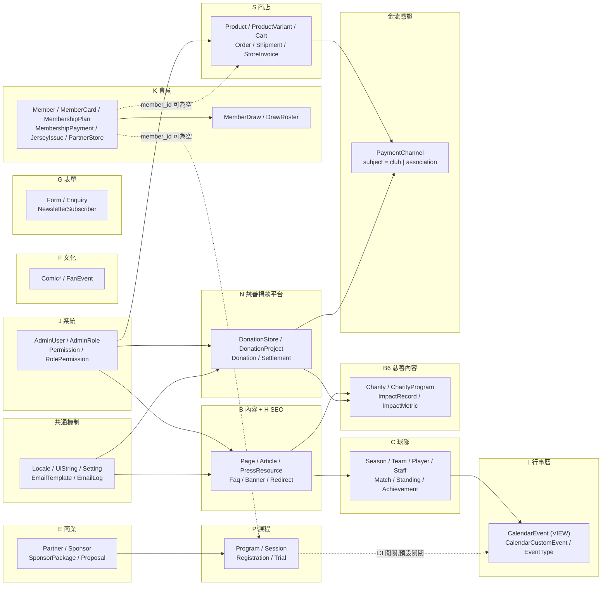

# 12 — 資料庫綱要（技術中立邏輯模型）

> 來源：規劃書 §5（**行 1328–1460**）、§6（**行 1461–1507**）、§4（**行 777–1327**）、§8（**行 1536–1550**）。
> **行號依主站 v3.0（1691 行）。**
>
> 🔴 **本檔尚未完成 v3.0 的同步——動工前必讀下方「v3.0 落差」段落。**
>
> **本檔是 [`04-data-model.md`](04-data-model.md) 的實作展開**：`04` 說「有哪些型別、哪些關係不能搞錯」，
> 本檔說「落到資料表長什麼樣」。衝突時序：**規劃書 → `04` → 本檔**。
>
> 🔵 **DBMS 已定案為 Azure SQL Database**（2026-09-18，見 [`17-deployment.md`](17-deployment.md)）。
> 規劃書仍不涉及技術選型，選型結果只記在導航層。本檔**仍不寫 DDL、不附 seed SQL**，邏輯模型維持可攜；
> 與 DBMS 相關的抉擇集中在 [§1.4](#14-dbms-相依的五件事已定案)，**型別對照見 [§1.1](#11-型別對照)**。
>
> **不含行動 App 的十個型別**（`AdSlot`／`Advertiser`／`AdCampaign`／`AdCreative`／`AdEvent`／`AdDailyStat`／
> `AppDevice`／`PushTopicSubscription`／`PushMessage`／`AppRelease`），見 [`11-mobile-app.md`](11-mobile-app.md)。
> **App 開發前不得建立這些表**，屆時另出延伸設計。
> （**舊版寫「十二個」但只列出十個**——漏掉的 `Club` 與 `Competition` 已於主站 v3.0 移入主站型別表，**它們現在屬於本檔範圍**。）
>
> **本檔沒有任何日誌表**（委託方指示），代價與補償見 [§13.1](#131-沒有稽核與登入日誌表)。
>
> **本組共三份，章節編號沿用原檔不變**（舊的「`docs/12` §6」這類引用仍然有效）：
>
> | 檔案 | 收哪幾節 | 什麼時候讀 |
> |---|---|---|
> | [`12-database-schema.md`](12-database-schema.md) | 檔頭、v3.0 落差、§0–§4、§12–§15 | **入口**。型別詞彙、雙語策略、模組地圖、資料表總覽、踩雷點、落差、檢核表 |
> | [`12a-database-erd.md`](12a-database-erd.md) | §5 ER 圖（17 張） | 要看關聯圖 |
> | [`12b-database-tables.md`](12b-database-tables.md) | §6–§11 | 要寫欄位：明細、權限模型、受限欄位、快照、匯入匯出、索引與唯一鍵 |

---

---

## 🔴 v3.0 落差——本檔尚未完成同步

主站規劃書已升 **v3.5**（多俱樂部架構 v3.0、**後台圖片欄位直傳 v3.5**）、慈善規劃書已升 **v2.2**、App 規劃書已升 **v3.6**。
**本檔的表結構、ERD 與欄位清單尚未逐一改寫。** 在完成前，遇到下列事項一律**以規劃書為準**，不要照本檔實作：

| # | 本檔現在怎麼寫 | 正確的是什麼 | 依據 |
|---|---|---|---|
| 1 | 「女足是 `Page`，不建 `Team`／`Player`／`Match`」「`team.type` 預留 `women` 但不啟用」 | **已推翻。** 藍鯨是第二個俱樂部，`Team`（`BW1`）／`Player`／`Staff`／`Match`／`Season` 全部建立。**`type` 的 `women` 值廢除，改用獨立的 `Team.gender`（`men`／`women`／`mixed`）**；`first_team` 由「全站僅一筆」改為「每俱樂部至多一筆」 | 主站 v3.0 §3.6、4.3 C1、5.1 |
| 2 | 沒有 `Club`／`Competition` 兩張表 | **必須新增。** `Team.club_id` 是必填外鍵，主站表不能指向本檔沒有的型別 | 主站 v3.0 §5.1 |
| 3 | 108 張表沒有任何租戶維度 | **約 40 張必填 `club_id`、8 張可為空（＝兩隊共同）、其餘不加。** 判定準則與逐表清單見主站 v3.0 **§5.4** | 主站 v3.0 §5.4 |
| 4 | `Member` 帶 `tier`／`membership_start_on`／`membership_end_on` | **三欄移入新的 `Membership` 表**（`member_id` × `club_id` × `season_id`）。`Member` 維持一人一帳號、**不加 `club_id`** | 主站 v3.0 §5.1 |
| 5 | `MemberCard` 掛在 `Member` 上 | **`membership_id` 必填——每份會籍一張卡。**「一張卡一組 token」與「驗證頁不得加適用球隊欄位」**兩條未變** | 主站 v3.0 §5.1、§3.14 |
| 6 | `RolePermission.scope_value json`（只存不查） | **刪除。** 改由新增的 `AdminUserClub`（含授權起訖）與 `AdminUserTeam` 承載；`AdminRole` 加 `scope_mode`、`AdminUser` 加 `primary_club_id`、`Permission` 加 `is_club_scoped` | 主站 v3.0 §5.3、§6 |
| 7 | `PaymentChannel.subject enum(club, association)` | **改為 `owner_club_id`**，唯一鍵改 `(owner_club_id, channel_type, environment)`。主站只會有俱樂部一列 | 主站 v3.0 §5.1 |
| 8 | 含慈善 `N` 模組 8 張表 | **移出本檔。** 慈善平台已改為獨立後台與獨立資料庫（另約 22 張表：8 張 `N` ＋ 約 14 張機制表），`Donation` 完全不屬於本系統 | 慈善 v2.0 §2 |
| 9 | `EmailLog.type` 有 13 個值 | **降為 9 個**（會員 5 ＋ 商店 4）。慈善的 4 封隨獨立後台移出 | 主站 v3.0 §5.1 |
| 10 | `Order` 只有 `member_id` | **加 `selling_club_id`（受益方）與 `collecting_club_id`（收款法人）**，`OrderItem`／`StoreInvoice` 一併值複製；`Cart.club_id` 必填（**不得跨俱樂部混買**） | 主站 v3.0 §5.1、4.13 |
| 11 | 唯一鍵：`Page.slug`／`Setting.setting_key`／`Redirect.from_path`／`Season.code`／`NewsletterSubscriber.email` 單欄唯一 | **全部改為 `(club_id, …)` 複合唯一。** 但 `Team.code`／`Article.slug`／`ProductVariant.sku`／`Order.order_no`／`Member.email` **維持全站唯一** | 主站 v3.0 §5.4 |
| 12 | ✅ **已結案**（2026-09-18） | §1.4 已補滿五件並隨 **Azure SQL** 定案，見 [§1.4](#14-dbms-相依的五件事已定案)。⚠️ 第 5 件的**規則語意**仍待釐清，是轉 DDL 的前置 | 主站 v3.0 §5.4 |
| 13 | 圖片以 `media_asset_id` 外鍵指向 `MediaAsset`，另有 `MediaFolder`／`MediaUsage` | **三張表全部移除。** 圖片改為**該表自己的欄位組**（`*_key` 物件鍵、`*_width`、`*_height`、`*_alt_zh`／`*_alt_en`）；多圖以子表承載。已知須改的外鍵 10 處：`Article` 封面、`Banner`、`Partner`／`Sponsor` 的 `logo_dark_id`／`logo_light_id`、`ProposalFile`、`ProductImage`、`ComicPage`、`Charity.logo_id`。**新增 `PressResource`**（7.8 媒體專區）。`club_id` 可為空由 8 張降為 **7 張**。⚠️ **`*_width`／`*_height` 存的是縮圖後的主檔尺寸**（長邊 ≤ 2560px），不是上傳檔的原始尺寸；1280／640／320 與 160px 方形縮圖的鍵由主鍵推導，**不另存欄位**（v3.9） | 主站 v3.9 §4.0、§5.1、§5.4 |

**尚待完成的工作**（轉 DDL 前必做）：
- **§5 ERD 與 §6 明細移除 `media_asset`／`media_folder`／`media_usage`，受影響的 9 處外鍵改為欄位組**（第 13 項）
- §4 資料表總覽逐張標註 `club_id` 欄位
- §5 的 17 張 ERD 重繪（加 `Club`、`Membership`、`AdminUserClub`／`AdminUserTeam`；移除 `N` 群）
- §6 的 `Team`／`Member`／`MemberCard`／`Order`／`PaymentChannel` 五節重寫
- §7 權限模型加資料範圍小節（**下方 §7 已先行更新**）
- §11.1 唯一鍵表重寫
- §14 型別對照檢核表重算
- 慈善獨立庫另出 `docs/14-charity-schema.md`

---

## 0. 一分鐘理解

| 項目 | 內容 |
|---|---|
| 涵蓋範圍 | 主站全部（含站內商店 `S`）＋ 後台帳號與權限 `J`。⚠️ **慈善 `N` 已於 v3.0 移出**（獨立資料庫） |
| 排除範圍 | **行動 App 的十個型別**（`M` 模組與 `E4–E6`）；**慈善捐款平台的全部資料表**（獨立系統） |
| 型別覆蓋 | ⚠️ **待重算**：主站 v3.0 新增 `Club`／`Competition`／`Membership`／`MemberCard`／`AdminUserClub`／`AdminUserTeam`，移出慈善 6 個 |
| 資料表 | ⚠️ **待重算**：原 108 張 −8 張 `N` ＋約 6 張新表 ≈ **106 張**（其中 `CalendarEvent` 是**視圖**）＋ 約 40 張 `*_i18n` 側表 |
| 型別詞彙 | `uuid`／`string(n)`／`text`／`int`／`decimal(p,s)`／`bool`／`date`／`datetime`／`json`／`enum` |
| ER 圖 | 12 張 `erDiagram` ＋ 2 張 `flowchart`，每張 ≤ 12 實體 |

**五條硬規則，一句話版**

1. **值複製快照不得回頭 join**：`OrderItem`、`DrawRoster`、`StoreInvoice`、`MembershipPayment` 是凍結的歷史，母表改名改價一律不追溯。
2. **`Order.member_id` 與 `Registration.member_id` 可為空**：非會員能結帳、能報名，任何 `NOT NULL` 都是錯的。
3. **`CalendarEvent` 是視圖不是資料表**：唯一的行事曆自有資料是 `CalendarCustomEvent`。
4. **五種商業對象五張表、彼此零外鍵**：`Partner`／`Sponsor`／`PartnerStore`／`DonationStore`（／`Advertiser`，本檔不建）。**`Club` 不是第六種**——它是內容主體，不計曝光、無金流、無分潤。
5. **（v3.0）`club_id` 為空＝兩隊共同，且對受範圍限制的帳號一律唯讀**：只有超管能建立與修改。否則「查得到共同內容」與「不能改到別人的內容」無法同時成立。

---

## 1. 通用型別詞彙與共通慣例

### 1.1 型別對照

| 本檔寫法 | 意思 | Azure SQL 的對應（已定案） |
|---|---|---|
| `uuid` | 128-bit 識別碼 | **`uniqueidentifier`**。⚠️ 主鍵設為**非叢集**，另加不對外的 `bigint IDENTITY` 叢集鍵，見 [§1.2](#12-主鍵外鍵與命名慣例) |
| `string(n)` | 有長度上限的單行文字 | **`nvarchar(n)`**——一律以 Unicode 字元數計，非位元組 |
| `text` | 無長度上限的多行文字 | **`nvarchar(max)`**。富文本與區塊內容另見 `json` |
| `int` | 整數。**所有金額欄位都是 `int`，單位「元」** | **`int`**。見 [§1.3](#13-共通欄位) 的金額規則 |
| `decimal(5,2)` | 百分比，`0.00`–`100.00` | **`decimal(5,2)`**。**只有分潤百分比用**，金額不用 |
| `bool` | 真／假 | **`bit`** |
| `date` / `datetime` | 日期／時間戳。`datetime` 一律存 **UTC**，前台依 `Asia/Taipei` 呈現 | **`date`** / **`datetime2(3)`**。⚠️ SQL Server 沒有 `timestamptz`，時區語意由應用層保證（EF Core 設 `DateTimeKind.Utc` convention） |
| `json` | 結構化但不需查詢的資料（區塊內容） | **原生 `json` 型別**（Azure SQL 已 GA，二進位儲存），不用 `nvarchar(max)`。**設計紀律仍是「只存不查」**，見 §1.4 |
| `enum(a,b,c)` | 有限值域 | **`nvarchar` ＋ CHECK 約束**（不用查表、不用數字碼）——值域演進最容易，且後台介面要顯示日常中文（[`06`](06-conventions.md)） |
| `slug` | `string(160)`，`[a-z0-9-]`，**全站唯一或表內唯一**（逐表註明） | |

### 1.2 主鍵、外鍵與命名慣例

| 項目 | 規則 |
|---|---|
| 主鍵 | 一律 `id uuid`。**不用自增整數**——匯入客戶素材與跨環境搬移時會撞號 |
| **叢集鍵**（Azure SQL 定案） | 🔴 **主鍵設為非叢集，另加一欄不對外的 `bigint IDENTITY` 當叢集鍵。** SQL Server 的 `uniqueidentifier` **比較位元組的順序是反的**（先比 byte 10–15，byte 0–3 最後），所以連 **UUIDv7 也無法**取得索引區域性——它的時間戳正好落在最低優先的位元組。`NEWSEQUENTIALID()` 由伺服器端產生，應用層無法在 INSERT 前先知道 id。<br>**這不違反上一列的「不用自增整數」**——那句針對的是對外識別碼，`bigint` 叢集鍵**不對外、不進 API、不進 URL**。詳見 [`17-deployment.md`](17-deployment.md) §6 |
| 外鍵 | `<單數表名>_id`，如 `team_id`、`order_id` |
| 表名 | 文中用 PascalCase（`ProductVariant`）以對應規劃書型別名；**物理表名定為 snake_case 複數**（`product_variants`） |
| 關聯表 | `<A><B>` 或 `<A>_<B>`，複合主鍵，如 `ArticleTag(article_id, tag_id)` |
| i18n 側表 | `<entity>_i18n`，複合主鍵 `(<entity>_id, locale)` |
| 布林欄位 | `is_*` / `has_*` / `can_*` |
| 時間欄位 | `*_at`（時間戳）／`*_on`（純日期） |
| 排序 | `sort_order int`，小到大，預設 `0` |
| 狀態 | `status`，值域逐表定義，**不共用一套全域狀態** |

### 1.3 共通欄位

所有實體表都有：

| 欄位 | 型別 | 說明 |
|---|---|---|
| `id` | `uuid` | 主鍵 |
| `created_at` / `updated_at` | `datetime` | |
| `created_by` / `updated_by` | `uuid` ✓ | → `AdminUser.id`。**保留（本檔沒有日誌表，這兩欄是唯一的追蹤線索）**；系統自動產生的列為空 |

具前台展示的內容表另有：

| 欄位 | 型別 | 說明 |
|---|---|---|
| `slug` | `slug` | URL 識別；客戶素材匯入時作為對應鍵 |
| `status` | `enum(draft,published,scheduled)` | |
| `published_at` | `datetime` ✓ | 排程發布 |
| `seo_title` / `seo_description` / `og_image_id` | | 單頁 SEO（後台 `H`）；**雙語部分落在 i18n 側表** |

**金額規則（重要）**：**所有金額欄位都是 `int`，單位是「元」。**
台幣無角分；慈善站 §8.3 明訂分潤「**無條件捨去至整數元**」。用 `decimal(10,2)` 會製造永遠對不上的尾差。
唯一的例外是**百分比**（`store_share_pct`、`project_share_pct` 及其快照），用 `decimal(5,2)`。

**核心價值標籤**：`value_tags[]`（五大核心價值，可掛任何內容型別）以 `ValueTagLink(entity_type, entity_id, value_tag)` 多型關聯表實作，**不用陣列欄位**（見 §1.4）。

### 1.4 DBMS 相依的五件事（已定案）

本檔刻意迴避的五個 DBMS 相依決策。**DBMS 已定於 Azure SQL Database**，以下為定案結果；
完整脈絡與取捨理由見 [`17-deployment.md`](17-deployment.md) §6。

| # | 議題 | 本檔的技術中立寫法 | **Azure SQL 定案** |
|---|---|---|---|
| 1 | **陣列欄位** | 一律以關聯表表達：`team_codes[]` → `CalendarEventTeam`；`value_tags[]` → `ValueTagLink`；FAQ 複選分類 → `FaqCategoryLink` | **維持關聯表。** SQL Server 無陣列型別，且 `ValueTagLink` 是多型關聯、要能反查「哪些內容掛了這個標籤」，關聯表本來就是對的形狀 |
| 2 | **JSON 欄位的查詢** | `json` 欄位一律「**只存不查**」：`PageBlock.content` 等。任何需要篩選、排序、統計的資料都拉成實欄位。⚠️ **`RolePermission.scope_value` 已於 v3.0 刪除**——它正是「只存不查」害的：資料範圍需要能被查詢，改由 `AdminUserClub`／`AdminUserTeam` 承載 | **用原生 `json` 型別**（已 GA，二進位儲存、`JSON_VALUE` 相容、JSON 索引推出中），不用 `nvarchar(max)`。**「只存不查」維持為設計紀律**，原生型別只是保留逃生口 |
| 3 | **`CalendarEvent` 的實作形式** | 定義為**視圖**（`source_type` + `source_id` UNION）。若效能不足，改為**索引表**並以來源模組的寫入觸發同步 | **第一期用一般 VIEW。** 🔴 **SQL Server 的 indexed view 明文禁止 `UNION`／`UNION ALL`**，所以**沒有 materialized view 這條升級路**——不要去試。效能不足時直接走索引表 ＋ 寫入時同步，或先由 Redis 吸收 |
| 4 | **全文檢索**（G-02 站內搜尋） | 綱要不含任何搜尋索引表，搜尋屬應用層 | **第一期用跨表 `LIKE` 比對**，不建搜尋索引表、不預先加索引（資料量在數百至數千列，掃描可接受）。升級路徑是 **Azure SQL 內建全文檢索**（有中文斷詞），**不需要外掛 Meilisearch／Typesense**。⚠️ 第一期做不到 G-02 要求的分類篩選與關鍵字高亮，屬**已知功能落差** |
| **5** | **可為空的 `club_id` 出現在唯一鍵裡的 NULL 語意** | 技術中立寫法：「`(club_id, slug)` 唯一，**且 `club_id` 為空時 `slug` 亦須全站唯一**」 | **用篩選唯一索引**（`CREATE UNIQUE INDEX … WHERE club_id IS NULL`，SQL Server 支援）。🔴 **但規則本身要先釐清**，見下 |

> 🔴 **第 5 件：規則的語意必須先釐清再實作。**
> 「`club_id` 為空時 `slug` 亦須全站唯一」有強弱兩種讀法，在 SQL Server 上差異是實質的：
> - **弱讀法**：`club_id` 為 NULL 的那些列之間，`slug` 不得重複 → 篩選唯一索引即可。
> - **強讀法**：某列 `club_id` 為 NULL 且 `slug='about'` 時，**任何俱樂部都不得再有 `slug='about'`** → 篩選唯一索引不夠，需要觸發器或應用層約束。
>
> **強讀法才能保證 URL 路由唯一解**（`/about/` 只對應一頁），從路由需求推測應為強讀法，
> 但這是推測不是確認。**定案前不得轉 DDL**，定案後回寫本節與 [`12b` §11.1](12b-database-tables.md)。

> ⛔ **另有一份「不得讀快取」清單**——庫存、金流回呼冪等檢查、會員卡 `/m/<token>` 驗證、會籍與訂單狀態、購物車
> 一律不得走 Redis。清單與規格依據在 [`17-deployment.md`](17-deployment.md) §4，[§12 踩雷點](#12-踩雷點)亦有提示。

---

## 2. 雙語策略

### 2.1 為什麼不用並排的 `zh_*` / `en_*` 欄位

規劃書**同一頁**寫了兩件互相拉扯的事（行 1297、行 1300，`docs/04` §2 原則①，`docs/05` §1）：

> 所有具前台展示的型別皆需支援 **zh / en 雙語欄位**，並保留擴充第三語系的能力。
> 英文可以留空（fallback 繁中並標示），但**欄位必須存在**，且架構要能再加第三語系**而不改程式**。

| 面向 | 並排欄位 `zh_*`／`en_*` | **側表 `<entity>_i18n`（本檔採用）** |
|---|---|---|
| 加第三語系 | **改 DDL、改每個查詢、改每個表單**——直接違反「不改程式」 | **`INSERT` 一列 `Locale`**，零 DDL |
| 翻譯人員權限（§6：僅能編輯 `en` 欄位） | **欄位級 ACL**，多數框架做不好，只能靠 UI 硬擋 | **列級 ACL**：`WHERE locale <> 'zh-Hant'`，權限系統天然支援 |
| I 模組「翻譯狀態總覽矩陣」（行 1013–1015） | 要逐表 count 數十個 nullable `en_*` 欄位，新增欄位就漏 | 一次 `LEFT JOIN` 算出缺哪個語系，新欄位自動納入 |
| Fallback 規則（未翻譯顯示繁中或隱藏） | 每個欄位各自 `COALESCE` | 查不到列就 fallback，**一條規則管全站** |
| 讀取成本 | 少一次 join | 多一次 join（可用視圖包起來） |
| 與規劃書字面一致 | ✅ 完全一致 | ❌ **需記為執行層決定**，見 [§13](#13-與規劃書的已知落差) |

**結論**：`zh_*`／`en_*` 是**列舉了目前啟用的兩個語系**，不是指定物理欄位形狀。側表是唯一能同時滿足兩句話的做法。

**不採單一多型 EAV 表**（`Translation(entity_type, entity_id, field, value)`）：失去型別、失去外鍵、失去唯一鍵、索引爆炸、查詢不可讀。**每個實體一張側表，欄位是真欄位。**

### 2.2 側表形狀

```
Article                          article_i18n
├─ id            uuid  PK        ├─ article_id   uuid  PK,FK
├─ slug          slug            ├─ locale       string(10) PK,FK → Locale.code
├─ status        enum            ├─ title        string(200)
├─ published_at  datetime        ├─ summary      text
└─ …非語系欄位                    ├─ body         json
                                 ├─ seo_title    string(200)
                                 └─ seo_description string(300)
```

- 複合主鍵 `(<entity>_id, locale)`。
- `locale` 外鍵指向 `Locale.code`（`zh-Hant` 預設、`en`；`ja` 等日後 INSERT 即可）。
- **`zh-Hant` 那一列必存**，`en` 那一列可不存（＝未翻譯）。
- 刪除母列時側表 cascade。

### 2.3 三個例外（不走側表）

| 例外 | 做法 | 理由 |
|---|---|---|
| **快照表** | 直接存字串，不做 i18n | `OrderItem`、`DrawRoster`、`SettlementLine`、`StoreInvoice`、`DonationInvoice`、`MembershipPayment` 是**值複製當下的字串**，不隨語系變、不隨母表變 |
| **後台專用表** | 用並排 `name_zh` / `name_en` 欄位 | `AdminRole`、`Permission`。規劃書的雙語要求範圍是「**所有具前台展示的型別**」（行 1297），後台角色名稱不在其中；後台介面文案走 `UiString` |
| **UI 字串** | `UiString` + `UiStringTranslation` | I 模組「字串翻譯表」（按鈕、表單標籤、提示、錯誤訊息）與內容翻譯是**兩套機制**，不要混用 |

### 2.4 與規劃書字面寫法的對應

| 規劃書欄位 | 本檔落點 |
|---|---|
| `Match.opponent_en`、`venue_en`（v2.5 新增，行 1251） | `match_i18n(match_id, locale, opponent, venue)`。**對手與場地是自由文字不是實體**，仍照側表走 |
| K5 各欄「中／英」（行 1287） | `member_draw_i18n(name, prize_description, rules, notes)` |
| `MembershipBenefit`「須 zh／en 雙欄位、不得做成圖片」（行 673） | `membership_benefit_i18n(group_label, free_value, paid_value)` |
| `Partner`／`Sponsor`「名稱（中／英）」（行 1259–1260） | `partner_i18n`、`sponsor_i18n` |
| 慈善站 §9.4「zh / en 雙欄位」 | `donation_store_i18n`、`donation_project_i18n`；站台文案走 `Setting` + `setting_i18n` |

### 2.5 翻譯狀態矩陣與翻譯人員權限怎麼落地

- **翻譯狀態總覽**（I 模組）：對每張 `<entity>_i18n` 做 `LEFT JOIN Locale`，缺列即「缺英文」。新增可翻譯實體時矩陣自動涵蓋。
- **翻譯人員角色**（§6 註記：僅能編輯 `en`，不得改繁中原文與發布狀態）：權限碼 `*.translate` 搭配 `RolePermission.scope_type = 'translate_only'`，執行期條件為「**只能寫 `<entity>_i18n` 且 `locale <> 'zh-Hant'`**」，母表一律唯讀。

---

## 3. 模組地圖

十四個資料域與跨域連線。**這不是 ER 圖**——只畫域邊界，看的是「哪些域彼此有關、哪些刻意零連線」。



**這張圖要看出來的三件事**

1. `K1 → S1` 與 `K1 → P1` 是**虛線**：`member_id` 可為空，非會員能結帳、能報名。
2. `P1 → L1` 是**虛線且標註「預設關閉」**：課程時段永不進行事曆，只有 `Trial` 由 L3 開關決定。
3. `E1`（`Partner`／`Sponsor`）與 `K1`（`PartnerStore`）、`N1`（`DonationStore`）之間**沒有任何連線**——五種商業對象刻意零外鍵，見 [§5.5](12a-database-erd.md#55-e-商業模組-＋-五種商業對象的邊界)。

---

## 4. 資料表總覽

**108 張**（`CalendarEvent` 是視圖）。圖例：🌐 有 i18n 側表｜🔒 含受限或加密欄位｜📸 值複製快照，不可回頭 join。

### 4.0 共通機制（7）

| 表 | 用途 | 標記 | 出處 |
|---|---|---|---|
| `Locale` | 啟用語系（`code`、名稱、是否預設、fallback 對象、排序）。**加第三語系＝INSERT 一列** | | 行 1012–1017 |
| `UiString` | 介面字串鍵（按鈕、標籤、提示、錯誤訊息）與所屬分組 | | 行 1015 |
| `UiStringTranslation` | `(ui_string_id, locale) → value` | | 行 1015 |
| `ValueTagLink` | 五大核心價值標籤的多型關聯 `(entity_type, entity_id, value_tag)` | | `docs/04` §4 |
| `Setting` | 全域設定鍵值（含商店設定、聯絡資訊、社群連結、政策頁、維護模式）；文案類另有 `setting_i18n` | 🌐 | 行 1009–1025 |
| `EmailTemplate` | 系統信樣板 | 🌐 | 行 734–738、378、慈善站 §9.2 |
| `EmailLog` | 系統信寄送紀錄。**`type` 值域是 13 個不是 5 個**：會員五封（行 734–738）＋商店四封（行 382）＋慈善四封（慈善站 §9.2） | 🔒 | 行 1289 |

> ⚠️ `EmailLog` **不是操作日誌，是功能單元**（後台要查「這封信寄出去了沒」）。不在本檔移除日誌表的範圍內。
> ⚠️ **中獎人的人工聯繫不得寫入 `EmailLog`**（行 1099 附近）——系統信維持既有封數，抽獎不新增通知信。

### 4.1 B 內容管理 ＋ H 搜尋與 AI 能見度（18）　行 836–876／996–1010

| 表 | 用途 | 標記 | 後台 |
|---|---|---|---|
| `Page` | 靜態頁面主檔。**藍鯨官網入口頁亦屬此型別**。⚠️ **v3.0：`club_id` 必填，`slug` 唯一鍵改為 `(club_id, slug)`** | 🌐 | B1 |
| `PageBlock` | 頁面區塊（13 種型別），`content json`（**只存不查**）、`sort_order` | 🌐 | B1 |
| `PageVersion` | 版本歷程與還原點、預覽分享 token。**這是內容版本不是操作日誌** | | B1 |
| `Article` | 新聞與故事 | 🌐 | B2 |
| `ArticleCategory` | 7.1–7.8 八分類。**抽獎公布走 7.1 ＋標籤，不新增分類** | 🌐 | B2 |
| `Tag` | 標籤 | 🌐 | B2 |
| `ArticleTag` | `(article_id, tag_id)` | | B2 |
| `ArticleRelation` | 文章的多型關聯 `(article_id, target_type, target_id)` → `Player`／`Team`／`Match`／`Program`／`Partner`／`Charity` | | B2 |
| `PressResource` | 媒體資源（新聞稿／品牌識別包／高解析圖）：類別、檔案、封面、下載數，對應 7.8 | 🌐 | B6 |
| `Banner` | 首頁 Hero 輪播（≤5）：素材、CTA、上下架期間、排序 | 🌐 | B3 |
| `HomeSection` | 首頁九大區塊的開關、排序與精選指定 | | B3 |
| `Faq` | 常見問題；👍／👎 計數 | 🌐 | B4 |
| `FaqCategory` | 主題分類（10 個） | 🌐 | B5 |
| `FaqCategoryLink` | `(faq_id, faq_category_id)`——**一題可屬多分類** | | B5 |
| `FaqSearchMiss` | 零結果搜尋關鍵字與次數。**這是成效統計不是日誌** | | B5 |
| `Redirect` | 301 對照（`from_path`、`to_path`、`is_active`）。**含舊 Wix 商店的 5 個商品與分類網址**，CSV 批次匯入 | | H |

### 4.2 C 球隊管理（14）　行 877–909

| 表 | 用途 | 標記 |
|---|---|---|
| `Season` | 賽季（`code` 如 `2026-27`、起訖日）。**規劃書只在關聯欄提到，本檔升為實體表**——`Match`／`Standing`／`Achievement`／`MembershipPlan` 都以賽季為軸 | 🌐 |
| `Team` | 球隊。**`code` UNIQUE（全站唯一，不得改複合鍵）**，值域 `D1`／**`BW1`**／`U15`／`U14`／`U12`；`type` = `first_team`／`academy`（⚠️ **v3.0 廢除 `women`**）。**v3.0 新增 `club_id` 必填與 `gender`（`men`／`women`／`mixed`）**；`first_team` 由「全站僅一筆」改為「**每俱樂部至多一筆**」 | 🌐 |
| `Player` | 球員：背號、位置、生日、身高體重、國籍、慣用腳、加入日期、狀態（現役／離隊／外借／海外發展） | 🌐 |
| `PlayerSeasonStat` | 逐季數據 `(player_id, season_id)` | |
| `Staff` | 教練與團隊成員：證照（AFC A/B/C）、專長、分組（管理層／行政／醫療／後勤） | 🌐 |
| `StaffTeam` | `(staff_id, team_id)` 帶職務 | |
| `Match` | 賽事。`competition`（聯賽／盃賽／友誼／其他）與 `status`（未開始／進行中／已結束／延期）**是正式欄位不是前台屬性**（v2.5）；對手與場地的英文走 `match_i18n` | 🌐 |
| `MatchTeam` | 本方參賽隊 `(match_id, team_id)` ——一場賽事對應本會哪一隊 | |
| `MatchGoal` | 進球（球員、時間、類型） | |
| `MatchCard` | 黃紅牌 | |
| `MatchLineup` | 先發與替補名單 | |
| `Standing` | 積分榜 `(season_id, team_name, ...)`。**對手隊名是自由文字不是 `Team`**——`Team` 只放本會四隊 | 🌐 |
| `Achievement` | 榮譽（年份、賽事、名次、隊伍） | 🌐 |
| `Milestone` | 里程碑時間軸 | 🌐 |

> ⚠️ **`Team` 只有本會四筆**（`D1`／`U15`／`U14`／`U12`）。`Match.opponent`、`Standing` 的對手都是**字串**，不建對手球隊表——規劃書沒有這個型別，賽事全部人工維護。

### 4.3 P 課程與活動（6）　行 910–933

| 表 | 用途 | 標記 |
|---|---|---|
| `Program` | 課程／營隊／專項項目：類型、對象、年齡區間、區塊內容 | 🌐 |
| `ProgramStaff` | `(program_id, staff_id)` 教練團 | |
| `ProgramPartner` | `(program_id, partner_id)` 合作單位 | |
| `Session` | 梯次／場次：期間、時段、場地、名額、已報名數、原價／早鳥／早鳥截止、報名起訖、狀態。**永不進 `CalendarEvent`** | 🌐 |
| `Registration` | 報名。**`member_id` 可為空**（非會員可報名）；狀態 `待確認→已確認→已繳費→完成／取消／候補`；**繳費線下**，Excel 匯出與簽到表列印 | 🔒 |
| `Trial` | 試訓場次：日期、場地、對象、名額、截止。**是否同步行事曆由 L3 開關決定，預設關閉** | 🌐 |

### 4.4 E 商業模組（5）　行 934–965

| 表 | 用途 | 標記 |
|---|---|---|
| `Partner` | 合作夥伴（B2B Logo 牆）：Logo **深底／淺底兩版**、類型、國家、合作內容與期間、官網、排序、Footer／首頁曝光 | 🌐 |
| `Sponsor` | 贊助商：Logo 兩版、**等級**（主贊助／官方／支持）、合約期間、贊助內容、聯絡窗口、到期提醒、排序 | 🌐 |
| `SponsorPackage` | 贊助方案（9 種）：內容、權益清單、適合對象、價格區間（**可設不公開**）、上下架 | 🌐 |
| `Proposal` | 提案簡介（多版本、多語 PDF） | 🌐 |
| `ProposalFile` | `(proposal_id, locale, file_key, version)` | |

> ⚠️ **提案下載的 Lead 名單仍走 `Enquiry`**（規劃書 §5 明寫 `Enquiry` 涵蓋「7 類表單 + 提案下載 + 捐助洽詢」），不另建 Lead 表。
> ⚠️ 商品一律在 `S1` 維護，`ProductShowcase` **綱要中不存在**。**`E4` 現在是「廣告主與版位管理」**，看到舊文件寫 `E4 商品櫥窗` 一律視為錯誤。

### 4.5 F 文化模組（5）　行 966–981

| 表 | 用途 | 標記 |
|---|---|---|
| `ComicCharacter` | 漫畫角色，`player_id` **可為空**（可對應真實球員為原型） | 🌐 |
| `ComicEpisode` | 集數、閱讀數 | 🌐 |
| `ComicPage` | 內頁 `(episode_id, sort_order, image_key)` ——F1 要求批次上傳與排序 | |
| `FanEvent` | 球迷會活動 | 🌐 |
| `FanEventRegistration` | 活動報名，`member_id` 可為空 | 🔒 |

> ⚠️ 漫畫**全部免費公開、不設付費牆、不需登入**——沒有任何權限或購買欄位。
> ⚠️ **會員名單、會籍方案與權益對照表在 `K`，不在 `F`**。付費會員＝球迷會員，不另建名單。

### 4.6 G 表單與詢問（5）　行 982–997

| 表 | 用途 | 標記 |
|---|---|---|
| `Form` | 表單定義（7 類 ＋ 提案下載 ＋ 捐助洽詢）：通知信收件者（多筆）、自動回覆樣板、CAPTCHA 開關、送出後導向 | 🌐 |
| `FormField` | 動態欄位（型別、必填、驗證、排序） | 🌐 |
| `Enquiry` | 收件：來源頁、UTM、狀態 `新進→處理中→已回覆→已結案／無效`、`assignee_admin_user_id`、備註、標籤 | 🔒 |
| `EnquiryAnswer` | `(enquiry_id, form_field_id, value)` | 🔒 |
| `NewsletterSubscriber` | 電子報名單：來源、訂閱／退訂狀態 | 🔒 |

> ⚠️ **沒有志工報名表**（v2.1 移出範圍）。11 章 CTA 由三種收斂為兩種，有需求走 10.7 一般聯絡表單。

### 4.7 I 網站設定（2）　行 1009–1028

| 表 | 用途 | 標記 |
|---|---|---|
| `MenuItem` | 主選單／Mega Menu／Footer：多層級（`parent_id`）、排序、外部連結 | 🌐 |
| `Venue` | 場地：地址、**`lat`／`lng`**（v2.5）、交通說明、照片 | 🌐 |

> 其餘 I 模組內容（多語系、聯絡資訊、外部服務、全域設定、商店設定）走 `Locale`／`UiString`／`Setting`。
> ⚠️ **LINE Pay 與發票憑證不在 `Setting`**，在 `PaymentChannel`（S6／N7，僅系統管理員）。

### 4.8 J 系統管理（5）　行 1029–1038

| 表 | 用途 | 標記 |
|---|---|---|
| `AdminUser` | 後台帳號。**`username` 是唯一登入識別，不是 Email** | 🔒 |
| `AdminRole` | 角色。九個規劃書角色是 `is_system = true` 的**種子資料**，客戶可自建第十個 | |
| `AdminUserRole` | `(admin_user_id, role_id)`，多角色取聯集 | |
| `Permission` | 權限碼字典 | |
| `RolePermission` | `(role_id, permission_id)` ＋ `scope_type`／`scope_value` | |

明細見 [§7](12b-database-tables.md#7-權限模型j-模組)。**本模組不含 `AuditLog`、`LoginLog`、`ExportLog`**，見 [§13.1](#131-沒有稽核與登入日誌表)。

### 4.9 K 會員管理（9）　行 1039–1155

| 表 | 用途 | 標記 |
|---|---|---|
| `Member` | 會員帳號：`tier`（`registered`／`fan_club`）、會員編號、會籍起訖、註冊來源、**LINE 綁定識別碼（加密）**、Email／電話／生日（受限） | 🔒 |
| `MemberCard` | **電子會員卡，一張一列**（`card_quota` 可 > 1，家庭方案 3 張）：持卡人姓名、`token`（UNIQUE，**不可由會員編號推導**）、狀態、補發次數 | 🔒 |
| `MembershipPlan` | 會籍方案：費用、`season_id`、期間、`card_quota`、`jersey_quota`、季中計價規則 | 🌐 |
| `MembershipPayment` | 會籍付款與開通：方式、金額、日期、交易備註、**經辦人**、開通起訖。**會籍不走商店結帳** | 🔒 |
| `MembershipBenefit` | 權益對照條目：分組、免費層值、付費層值、排序。**單一維護點，前台三處共用**（3.14／8.2／升級頁） | 🌐 |
| `JerseyIssue` | 球衣發放，**一件一列**（`jersey_quota` 可 > 1）：領用人姓名、尺寸、配送方式、地址、狀態 | 🔒 |
| `PartnerStore` | 特約店家：類別、地址、電話、營業時間、地圖、優惠內容、適用層級、合作起訖、**`lat`／`lng`**（K4 人工確認後儲存）。**無金流無分潤** | 🌐 |
| `MemberDraw` | 抽獎活動：`snapshot_at`、開獎時間與場合、領獎期限與逾期處理、狀態（草稿／名單已鎖定／已抽出／已公布／已結案／作廢）、`roster_version`、`total_count`、`roster_hash`、`announcement_article_id` | 🌐 |
| `DrawRoster` | **合格名單快照，一人一列** | 🔒 📸 |

> ⚠️ **抽獎資格是算出來的布林值**（`snapshot_at` 當下 `fan_club` ＋ 會籍有效 ＋ 帳號啟用），**沒有 `DrawEntry`／`Ticket`／`Point`／`Weight` 任何表或欄位**。一人一號，不因消費／簽到／分享增加機會。

### 4.10 L 行事曆管理（5，含 1 視圖）　行 1156–1191

| 表 | 用途 | 標記 |
|---|---|---|
| `CalendarEvent` | **視圖／索引表**：`source_type`（`match`／`trial`／`custom`）＋ `source_id`。**沒有自己的標題與時間欄位** | — |
| `CalendarCustomEvent` | **L2 自建事件——行事曆唯一的自有資料**：雙語標題、全天／多日、場地、封面、CTA、前台可見性 | 🌐 |
| `CalendarEventTeam` | `team_codes[]` 的關聯表實作 `(source_type, source_id, team_id)` | |
| `CalendarEventException` | L2 重複規則（每週／每兩週／每月）的例外日期 | |
| `EventType` | 賽事／活動類型：圖示、色彩、顯示規則、是否公開 | 🌐 |

> ⚠️ **行事曆是彙整層不是資料源。** 賽事在 C4 維護，複製一份到行事曆＝兩個真實來源，必然不同步（行 1301）。
> ⚠️ **`Session` 課程時段永不進入**；`Trial` 由 L3 開關決定、**預設關閉**。

### 4.11 S 商店（15）　行 1192–1241

| 表 | 用途 | 標記 |
|---|---|---|
| `Collection` | 商品分類，含品牌敘事區塊 | 🌐 |
| `Product` | 商品：分類、標籤、敘事、尺碼表、狀態（草稿／上架／缺貨（自動）／下架）、「新上市」標記、排序、SEO。**無會員價欄位** | 🌐 |
| `ProductImage` | 圖集 `(product_id, sort_order, image_key)` | |
| `ProductVariant` | **SKU**：尺寸／顏色、貨號（UNIQUE）、售價、**促銷價（可空）**、**成本（受限）**、庫存量、預留量 | 🔒 |
| `InventoryMovement` | 庫存異動：類型（進貨／銷售／退貨回補／盤點／報損／調整）、數量、原因、**經辦人**、時間、關聯訂單 | |
| `Cart` | 購物車：`member_id`（可空）或 `anonymous_token`；**登入後合併** | |
| `CartItem` | `(cart_id, product_variant_id, quantity)` | |
| `Order` | **訂單**：訂單編號（UNIQUE）、**`member_id` 可為空**、收件人姓名／電話／地址（**受限**）、小計／運費／總計、LINE Pay 交易編號與付款狀態、出貨狀態、查詢 token、`is_manual`（現場銷售補登） | 🔒 |
| `OrderItem` | 訂單品項：**SKU 快照**（商品名稱、規格、單價**值複製**）、數量、小計 | 📸 |
| `Shipment` | 出貨：物流方式、單號（**CSV 回填，不串物流商 API**）、出貨與送達時間、超商門市代碼、自取領取狀態（待領取／已領取／逾期） | 🔒 |
| `RefundRequest` | 退貨退款申請：原因、狀態（申請／審核中／已核准／已退款／已駁回）、退款金額與方式 | |
| `RefundRequestItem` | 退貨品項（支援部分退款） | |
| `StoreInvoice` | **電子發票**：號碼、開立時間、**載具／統編／捐贈碼三選一**、開立結果與重試、作廢與折讓狀態。**抬頭為俱樂部** | 🔒 📸 |
| `InvoiceDonationCode` | 捐贈碼名單（S6 維護） | |
| `PaymentChannel` | 金流與發票憑證：`subject`（**`club`／`association` 二選一**）、`channel_type`（`linepay`／`einvoice`）、`environment`（`sandbox`／`production`）、憑證（加密）、字軌、輪替時間 | 🔒 |

> ⚠️ **付款只有 LINE Pay**——沒有信用卡、超商代碼、ATM、貨到付款欄位。**不存卡號**，結帳導轉金流商代管頁面。
> ⚠️ **不做會員價、折扣碼、運費級距**——`Order` 只有**單一固定運費 ＋ 免運門檻**（設定在 `Setting`），沒有 `discount_code`、`member_price`、`shipping_tier` 任何欄位。

### 4.12 B6 慈善內容（主站，4）　行 855–876

| 表 | 用途 | 標記 |
|---|---|---|
| `Charity` | 受贈公益團體：名稱、簡介、Logo、官網 | 🌐 |
| `CharityProgram` | **已執行的公益計畫**（11.2）：封面、對象、期間、狀態、流程、圖集 | 🌐 |
| `ImpactRecord` | 慈善事蹟紀錄。**三項核心資料必填**：公益團體名稱、捐助內容、活動圖片 | 🌐 |
| `ImpactMetric` | 影響力統計項目（**金額類預設不公開**） | 🌐 |

### 4.13 N 慈善捐款平台（8）　慈善站行 428–513／591–636

**主辦與收款主體是「台灣足球策略發展協會」，不是台中磐石。**

| 表 | 用途 | 標記 |
|---|---|---|
| `DonationStore` | 捐款合作店家：Logo、類別、地址、聯絡人、**`store_slug`（全域唯一且不可由 id 推導）**、`store_share_pct`、合作起訖、狀態 | 🌐 |
| `DonationProject` | 捐款項目：封面、說明、款項用途、`project_slug`、最低／最高金額、`project_share_pct`、撥付對象（`charity_id`）、**`invoice_mode`**（`b2c_invoice`／`donation_receipt`）、`charity_program_id`（可空）、上下架排序 | 🌐 |
| `DonationAmountOption` | 金額選項卡 `(project_id, amount, sort_order)` | |
| `Donation` | **捐款主檔**：`order_no`、金額、狀態、建立與付款時間、`project_id`、**`store_id`（可空）**、`charity_program_id`、捐款人姓名與 Email、具名／匿名、**分潤五欄快照**、發票欄位、退款原因與經辦人 | 🔒 📸 |
| `DonationPayment` | 金流交易：交易識別碼、請求與確認時間、金額、狀態、`raw_response json`（**只存不查**） | 🔒 |
| `DonationInvoice` | 發票／收據：類型、號碼、開立時間、載具或統編或收據資訊、狀態、作廢或折讓 | 🔒 📸 |
| `Settlement` | 結算單：期間、`payee_type`（`store`／`project`）、對象、筆數、捐款總額、應付金額、狀態（待結算→已結算→已付款）、匯款登記 | |
| `SettlementLine` | 結算明細：逐筆捐款的分潤金額，**含退款沖回的負項** | 📸 |

> ⚠️ **捐款人不登入不註冊**——`Donation` **不得有 `member_id` 外鍵**。Email 軟性比對只在 N3 查詢當下做，**不寫入 `Member`、不建關聯欄位、不做歸戶**。
> ⚠️ **`DonationProject` 沒有目標金額、已募得金額、捐款筆數欄位**（v1.2）。前台不做募款進度，累計數字只從 N6 報表算。
> ⚠️ **項目不得附回饋品**——沒有回饋品欄位。**對外不受理退款**，但後台保留人工退款供誤捐個案。

---

> **§5 ER 圖移至 [`12a-database-erd.md`](12a-database-erd.md)；§6–§11 移至 [`12b-database-tables.md`](12b-database-tables.md)。**

## 12. 踩雷點

比照 [`00-harness.md`](00-harness.md) §5 的編號慣例。**這些不是建議，是踩過或必然會踩的坑。**

1. **值複製快照不得回頭 join**：`OrderItem`、`DrawRoster`、`SettlementLine`、`StoreInvoice`、`DonationInvoice`。商品改名改價、會員改名合併刪帳號**都不得改動歷史列**。看到 `orderItem.variant.name` 一律視為錯誤（行 1298–1303）。
2. **`Order.member_id` 與 `Registration.member_id` 可為空**——非會員可結帳、可報名。任何 `NOT NULL` 都是錯的；**報表與統計不得用 inner join**，否則非會員訂單會憑空消失。
3. **`CalendarEvent` 是視圖或索引表**，唯一的行事曆自有資料是 `CalendarCustomEvent`。**`Session` 課程時段永不進入**；`Trial` 由 L3 開關決定、**預設關閉**。複製賽事資料進行事曆 ＝ 兩個真實來源。
4. **五種商業對象五張表、彼此零外鍵**：`Partner`（B2B Logo 牆）／`Sponsor`（贊助商）／`PartnerStore`（特約店家，**無金流無分潤**）／`DonationStore`（慈善站掃碼，**有金流有分潤**）／`Advertiser`（App 廣告主，**本檔不建**）。同一家公司同時是數種就**各建一筆**。唯一允許的關聯 `Advertiser.sponsor_id` 屬 App 範圍。
5. **本檔沒有任何日誌表**，是委託方指示的刻意落差（[§13.1](#131-沒有稽核與登入日誌表)）。反過來說：**`EmailLog`、`InventoryMovement`、`PageVersion`、`FaqSearchMiss`、訂單與捐款的狀態欄位不是日誌，是功能單元**，不得一併刪除。
6. **管理員登入識別是 `username` 不是 Email**。種子超管 `sa@system.local` **長得像 Email，但存在 `username` 欄**。`AdminUser.email` 不設唯一索引、不作登入查詢鍵。**前台 `Member.email` 是另一套系統，維持 Email 登入不變。**
7. **`Team.code` 全站唯一**，值域 `D1`／**`BW1`**／`U15`／`U14`／`U12`，**沒有 `D2`**。⚠️ **v3.0：藍鯨建立完整的 `Team`／`Player`／`Match`**（`club_id` 區隔），`type` 的 `women` 值已廢除改用 `gender`。**`code` 不得改成「俱樂部 × 代號」複合鍵**——它是行事曆訂閱網址與 `/schedule/d1/` 的識別鍵，已在外流通。對手球隊仍是**字串不是實體**。
   🔴 **後半段已被 App v2.0 推翻**：藍鯨一線隊會以 `BW1` 建為正式 `Team`（`code` 仍**全站唯一**，不改複合鍵）。轉 DDL 前須同步，見 [`14-invariants.md`](14-invariants.md)。
8. **`D1` 有雙重身分**：`D1` 是隊別代號（一線隊）。後台課程模組原編 `D1–D4` 已改 `P1–P4`，看到「D1 課程管理」一律是舊資料。**權限碼的 `module_code` 禁用 `D`／`U`／`O`／`M`。**
9. **一份會籍可能多張卡、多件球衣**（`card_quota`／`jersey_quota` 可 > 1，家庭方案），所以 `MemberCard` 與 `JerseyIssue` 是表不是欄位。**每張卡只有一組 token**，官網驗證頁與 App 卡片共用；發兩組＝兩份可撤銷狀態，撤銷必漏一邊。token **不可由 `member_no` 推導**。
10. **抽獎資格是算出來的布林值不是表**：沒有 `DrawEntry`／`Ticket`／`Point`／`Weight` 任何表或欄位。`serial_no` 於 `snapshot_at` 依 `member_no` 升冪**一次性配發**，鎖定後不得重排；有誤只能**整份作廢重產**（`roster_version` +1，舊版保留）。**系統不抽出**，`is_winner` 人工回填。
11. **捐款人沒有帳號**：`Donation` **不得有 `member_id` 外鍵**。Email 軟比對只在 N3 查詢當下做，**不寫入 `Member`、不建關聯欄位、不做歸戶**。
12. **分潤五欄是成立當下的快照**：改設定**不追溯**。退款以**負項 `SettlementLine`（`is_clawback = true`）沖回下一期**，**不改原列、不重算已付款期間**。`store_id` 為空時 `store_share_pct_snapshot = 0` 仍能結算。
13. **`DonationProject` 沒有目標金額、已募得金額、捐款筆數欄位**（v1.2）。前台不做募款進度，累計數字只從 N6 報表算。**不要為了前台顯示回頭加欄位。**
14. **商店與慈善的金流憑證不得同列**：`PaymentChannel.subject` 只能是 `club` 或 `association`，`(subject, channel_type, environment)` 唯一，發票字軌一併分離。**填錯＝款項進錯法人**，同時踩稅務與《公益勸募條例》。
15. **`ProductShowcase` 綱要中不存在**——商品與規格 在 `S1`。**`E4` 現在是「廣告主與版位管理」**，看到「E4 商品櫥窗（Shopify 導流）」一律是錯的。
16. **商店沒有的欄位**：`discount_code`、`member_price`、`points_used`、`card_no`、`shipping_tier`、`subscription_*`、`currency`。**付費會籍權益不含商品折扣**；付款只有 LINE Pay；單一固定運費 ＋ 免運門檻。看到「會員價」「折扣碼」「信用卡」一律是 v2.6 早期草稿殘留。
17. **`Season` 是本檔新增的表**（規劃書只在關聯欄提到 Season，未列為型別），不要當多餘刪掉——`Match`／`Standing`／`Achievement`／`MembershipPlan` 都以它為軸。
18. **刪帳號是欄位清除不是刪列**：`DrawRoster` 只保留 `member_no_snapshot` 與遮罩姓名；`Order` 只留稅法必要欄位。**交易紀錄的保存義務優先於刪除請求。**
19. **陣列欄位一律以關聯表表達**（`team_codes[]` → `CalendarEventTeam`、`value_tags[]` → `ValueTagLink`、FAQ 複選分類 → `FaqCategoryLink`）。**DBMS 已定為 Azure SQL，此項維持關聯表，沒有陣列欄位這個選項**——屬 [§1.4](#14-dbms-相依的五件事已定案)。
20. **`json` 欄位只存不查**：`PageBlock.content`、`RolePermission.scope_value`、`DonationPayment.raw_response`。需要篩選、排序、統計的資料一律拉成實欄位。
21. **i18n 側表不入 ER 圖不代表不存在**，[§4](#4-資料表總覽) 總覽表的 🌐 欄才是權威清單。快照表、後台角色表、UI 字串**不走側表**（[§2.3](#23-三個例外不走側表)）。
22. **金額一律 `int` 存「元」**，只有百分比用 `decimal(5,2)`。台幣無角分，慈善分潤明訂無條件捨去至整數元；用 `decimal(10,2)` 會製造永遠對不上的尾差。
23. **`EmailLog.type` 值域是 13 個不是 5 個**：會員系統五封（行 734–738）＋商店交易四封（行 382）＋慈善平台四封（慈善站 §9.2）。**不要誤縮成五封。** 中獎人的人工聯繫**不得寫入 `EmailLog`**。
24. **`Standing` 的對手是自由文字**：`Team` 只放本會四隊，積分榜其餘球隊是 `team_name` 字串。硬要建對手球隊表會憑空長出規劃書沒有的維護負擔。
25. **`Registration` 同時服務 `session` 與 `trial`**，兩個外鍵**恰有一個非空**。不要為試訓另建報名表。
26. **`Enquiry` 涵蓋 7 類表單 ＋ 提案下載 ＋ 捐助洽詢**，**Lead 名單不另建表**。**沒有志工報名表**（v2.1 移出範圍）。
27. **行事曆權限跟隨來源模組**：`RolePermission.scope_type = 'own_teams'`。學院管理者可調整所屬梯隊賽程，**但不能改一線隊賽程**——這條在資料模型上沒有欄位可擋，只能靠權限 scope。
28. **本檔不含行動 App 的十二個型別**。App 開發前**不得建立**這些表；`Member`／`PartnerStore`／`Venue`／`Registration`／`Match` 上 v2.5 為 App 加的欄位（`lat`／`lng`／`member_id`／英文欄位／`signup_source = 'app'`）**已經在綱要裡**，屆時不必改表結構。
29. ⛔ **有五類資料不得讀快取**：庫存與商品可購買狀態、金流回呼的冪等檢查、會員卡 `/m/<token>` 驗證、會籍與訂單付款狀態、購物車。會員卡那條是**安全問題**——讀到陳舊值等於 token 撤銷機制失效。清單與規格依據在 [`17-deployment.md`](17-deployment.md) §4。
30. 🔴 **`CalendarEvent` 不要試 indexed view**——SQL Server 明文禁止 indexed view 含 `UNION`／`UNION ALL`，而本表的定義就是 UNION。見 [§1.4](#14-dbms-相依的五件事已定案) 第 3 件。

---

## 13. 與規劃書的已知落差

**這三條是本檔刻意偏離規劃書的地方，記錄在此以免下次被當成漏寫再補回去。**

### 13.1 沒有稽核與登入日誌表

**指示**：委託方要求本次資料庫設計不含 log。
**做法**：**不建** `AuditLog`／`LoginLog`／`ExportLog`／`OperationLog`。

**與規劃書衝突的條文**

| 出處 | 條文 |
|---|---|
| 主站 §4.10 J（**行 1033**） | 「**操作稽核記錄**：誰在何時對哪筆資料做了什麼（新增／修改／刪除／發布），保存 **≥ 12 個月**」 |
| 主站 §4.10 J（**行 1034**） | 「**登入紀錄與異常提醒**」 |
| 主站 §6（**行 1321**） | 「會員名單**匯出**須額外授權，且每次匯出寫入稽核日誌（誰、何時、匯出幾筆、用途備註）」 |
| 主站 §6（**行 1322**） | 抽獎名單受限版匯出「須額外授權並寫入稽核」 |
| 主站 §6（**行 1327**） | 「訂單匯出須額外授權並寫入稽核日誌」 |
| 主站 K5（**行 1084–1123**） | 名單產生、中獎回填、版本歷程「全程稽核」；作廢版本不得刪除 |
| 主站 S6（**行 1228**） | LINE Pay 金鑰輪替紀錄 |
| 慈善站 §11.2 | 「後台的**退款、分潤設定、匯出**三類操作全數留下稽核軌跡」 |

**保留下來的補償**（**不是等價替代**）

| 保留項 | 能回答什麼 | 不能回答什麼 |
|---|---|---|
| `created_by` / `updated_by` / `updated_at` | 這筆資料**最後**是誰改的 | 改了什麼、改幾次、誰讀過、誰匯出過 |
| `AdminUser.last_login_at` | 最後登入時間 | 登入歷程、異常偵測、來源 IP |
| `AdminUser.failed_attempt_count` / `locked_until` | 目前是否被鎖 | 失敗歷程 |
| `MembershipPayment.handled_by` | 會籍是誰開通的 | |
| `InventoryMovement.handled_by` | 庫存異動是誰做的 | |
| `RefundRequest.approved_by`、`Donation.refunded_by` | 退款是誰核准的 | |
| `MemberDraw.locked_by` / `locked_at`、`roster_version`、`roster_hash` | 名單是誰鎖的、有沒有被換過 | 中獎回填的逐次歷程 |
| `PaymentChannel.rotated_at` | 憑證最後輪替時間 | 輪替歷程 |
| `PageVersion` | 頁面內容的版本還原點 | 其他型別的修改歷程 |

**直接後果，請客戶知悉**

1. **匯出行為完全無法追蹤**——會員名單、訂單、抽獎中獎人、慈善明細匯出後流向不明，四處「須寫入稽核」的承諾**無法兌現**。
2. **K5 開獎的稽核鏈斷一截**：`roster_hash` 能證明名單沒被換過，但**回填中獎人的過程無紀錄**，公布後修改也留不下理由。
3. **退款與分潤設定變更無獨立軌跡**——慈善站要求的職責分離只剩權限層，事後查不出誰在什麼時候改了百分比。
4. **登入異常提醒做不到**（只有 `last_login_at` 單點）。
5. 若日後法遵或客戶要求補上，**只需新增表，不需改動既有綱要**——所有必要的關聯（`admin_user_id`、`entity_type`／`entity_id`）都已存在。

> **本落差尚未回寫規劃書**（主站維持 v2.6、慈善站維持 v1.5）。實作前若要正式收斂範圍，須依 [`00-harness.md`](00-harness.md) §2.5 的同步鏈 跑完改版鏈。

### 13.2 不含行動 App 的十二個型別

`AdSlot`／`Advertiser`／`AdCampaign`／`AdCreative`／`AdEvent`／`AdDailyStat`／`AppDevice`／`PushTopicSubscription`／`PushMessage`／`AppRelease` **不在本檔**，見 [`11-mobile-app.md`](11-mobile-app.md)。

App 規劃書寫明這些型別「共用主站資料庫」，但本次範圍不含 App，**提前建表只會產生沒人維護的空表**。
**v2.5 為 App 加在既有型別上的欄位已經在綱要裡**（`PartnerStore.lat`／`lng`、`Venue.lat`／`lng`、`Registration.member_id`、`Match` 英文欄位與 `competition`／`status`、`Member.signup_source` 含 `app`），所以 App 開發時**不必改動既有表結構**，只需新增那十張表。

### 13.3 雙語採側表而非並排欄位

規劃書字面寫 `zh_*` / `en_*`，本檔改為 `<entity>_i18n` 側表。**理由與取捨見 [§2.1](#21-為什麼不用並排的-zh_--en_-欄位)**——這是為了兌現同一頁的另一句「架構要能再加第三語系而不改程式」。屬**執行層決定**，不改變任何功能規格。

### 13.4 規劃書 J 模組的「資料備份」不在綱要內

「每日自動備份，可手動還原點」（行 1035）屬**基礎設施設定**，不是資料表，選定 DBMS 與託管環境後再定。

---

## 14. 型別 → 資料表對照（檢核表）

**規劃書 §5 的 48 個型別 ＋ 慈善站 §9 的 6 個型別 ＝ 54 個，全數覆蓋。**

### 14.1 主站 §5（行 1242–1303）48 個

| # | 規劃書型別 | 本檔資料表 | 備註 |
|---:|---|---|---|
| 1 | `Page` | `Page` `PageBlock` `PageVersion` | 藍鯨官網入口頁亦屬此型別 |
| 2 | `Article` | `Article` `ArticleCategory` `Tag` `ArticleTag` `ArticleRelation` | 分類／標籤在關聯欄提到但未列型別 |
| 3 | `Team` | `Team` | `code` 唯一，四筆 |
| 4 | `Player` | `Player` `PlayerSeasonStat` | 逐季數據拆表 |
| 5 | `Staff` | `Staff` `StaffTeam` | 多對多 |
| 6 | `Match` | `Match` `MatchTeam` `MatchGoal` `MatchCard` `MatchLineup` | 賽果細項拆表 |
| 7 | `Standing` | `Standing` | 對手是字串 |
| 8 | `Achievement` | `Achievement` | |
| 9 | `Milestone` | `Milestone` | |
| 10 | `Program` | `Program` `ProgramStaff` `ProgramPartner` | |
| 11 | `Session` | `Session` | **永不進 `CalendarEvent`** |
| 12 | `Registration` | `Registration` | `member_id` 可為空；同時服務 `Session` 與 `Trial` |
| 13 | `Trial` | `Trial` | |
| 14 | `Partner` | `Partner` | |
| 15 | `Sponsor` | `Sponsor` `SponsorPackageLink` | |
| 16 | `SponsorPackage` | `SponsorPackage` | |
| 17 | `Product` | `Product` `ProductImage` `Collection` | 圖集與分類拆表 |
| 18 | `ProductVariant` | `ProductVariant` | 無會員價欄位 |
| 19 | `InventoryMovement` | `InventoryMovement` | **功能單元不是日誌** |
| 20 | `Cart` | `Cart` `CartItem` | 一對多 |
| 21 | `Order` | `Order` | `member_id` 可為空 |
| 22 | `OrderItem` | `OrderItem` | 📸 值複製快照 |
| 23 | `Shipment` | `Shipment` | 單號 CSV 回填 |
| 24 | `RefundRequest` | `RefundRequest` `RefundRequestItem` | 支援部分退款 |
| 25 | `StoreInvoice` | `StoreInvoice` `InvoiceDonationCode` `PaymentChannel` | 憑證與捐贈碼拆表 |
| 26 | `ComicEpisode` | `ComicEpisode` `ComicPage` | 內頁排序拆表 |
| 27 | `ComicCharacter` | `ComicCharacter` | `player_id` 可為空 |
| 28 | `FanEvent` | `FanEvent` `FanEventRegistration` | |
| 29 | `Enquiry` | `Enquiry` `EnquiryAnswer` `Form` `FormField` | G1 設計器要求動態欄位 |
| 30 | `Venue` | `Venue` | `lat`／`lng`（v2.5） |
| 31 | `PressResource` | `PressResource` | 檔案與封面為本表欄位組 |
| 32 | `Faq` | `Faq` `FaqSearchMiss` | 零結果統計 |
| 33 | `FaqCategory` | `FaqCategory` `FaqCategoryLink` | **一題可多分類** |
| 34 | `CharityProgram` | `CharityProgram` | |
| 35 | `ImpactRecord` | `ImpactRecord` | 三項核心資料必填 |
| 36 | `Charity` | `Charity` | |
| 37 | `Donation` | `Donation` | **主檔定義在慈善站 §9.2**，見 14.2 |
| 38 | `ImpactMetric` | `ImpactMetric` | 金額類預設不公開 |
| 39 | `Member` | `Member` | |
| 40 | `MembershipPlan` | `MembershipPlan` | |
| 41 | `MembershipPayment` | `MembershipPayment` | |
| 42 | `MembershipBenefit` | `MembershipBenefit` | 單一維護點 |
| 43 | `PartnerStore` | `PartnerStore` | 無金流無分潤 |
| 44 | `MemberDraw` | `MemberDraw` | |
| 45 | `DrawRoster` | `DrawRoster` | 📸 不可變快照 |
| 46 | `EmailLog` | `EmailLog` `EmailTemplate` | **功能單元不是日誌**，`type` 13 個 |
| 47 | `CalendarEvent` | `CalendarEvent`（**視圖**）`CalendarCustomEvent` `CalendarEventTeam` `CalendarEventException` | 見 14.3 |
| 48 | `EventType` | `EventType` | |

### 14.2 慈善站 §9（行 594–639）6 個

| # | 規劃書型別 | 本檔資料表 | 備註 |
|---:|---|---|---|
| 49 | `DonationStore` | `DonationStore` | `store_slug` 不可由 id 推導 |
| 50 | `DonationProject` | `DonationProject` `DonationAmountOption` | 金額選項拆表；**無目標金額** |
| 51 | `DonationPayment` | `DonationPayment` | `raw_response` 只存不查 |
| 52 | `DonationInvoice` | `DonationInvoice` | 📸 |
| 53 | `Settlement` | `Settlement` | 店家與項目分開結算 |
| 54 | `SettlementLine` | `SettlementLine` | 📸；退款為負項 |

> `Donation`（#37）由慈善站 §9.2 擴充為本平台的捐款主檔，**重用而非新建**——主站的捐款管道已收掉，避免兩份真實來源。

### 14.3 本檔新增、規劃書未列為型別的表

**每一筆都是把規劃書已有的功能落到資料表，不是新增規格。**

| 本檔表 | 來源 | 為什麼需要 |
|---|---|---|
| `Season` | 行 1248–1253 關聯欄提到 Season | `Match`／`Standing`／`Achievement`／`MembershipPlan` 的軸 |
| `ArticleCategory` `Tag` `ArticleTag` `ArticleRelation` | 行 1247 關聯欄列 Category／Tag | B2 的分類、標籤與多型關聯 |
| `ValueTagLink` | `docs/04` §4 `value_tags[]` | 五大核心價值可掛任何型別 |
| `PageBlock` `PageVersion` | B1（行 838–842） | 13 種區塊、版本還原點、預覽 token |
| `Banner` `HomeSection` | B3 | Hero 輪播與首頁區塊開關 |
| `FaqCategoryLink` `FaqSearchMiss` | B4 | 一題多分類、零結果關鍵字排行 |
| `Redirect` | H（行 1002–1004） | 301 批次匯入 |
| `PlayerSeasonStat` `MatchTeam` `MatchGoal` `MatchCard` `MatchLineup` | C2／C4（行 889–904） | 逐季數據、進球、卡、名單 |
| `StaffTeam` `ProgramStaff` `ProgramPartner` `SponsorPackageLink` | C3／P1／E2 | 多對多 |
| `ComicPage` | F1（行 968–974） | 內頁批次上傳與排序 |
| `Form` `FormField` `EnquiryAnswer` | G1（行 984–990） | 表單設計器的動態欄位 |
| `Proposal` `ProposalFile` | E3（行 943–948） | 多版本多語 PDF。**Lead 仍走 `Enquiry`** |
| `MemberCard` | 3.14 電子會員卡；`card_quota`（行 1283） | 一份會籍可多張卡，每張一組 token |
| `JerseyIssue` | K3（行 1056–1061） | `jersey_quota` 可 > 1，逐件登記 |
| `Collection` `ProductImage` `CartItem` `RefundRequestItem` `InvoiceDonationCode` | S1／S5／S6（行 1192–1241） | 一對多與捐贈碼名單 |
| `PaymentChannel` | S6（行 1226–1230）／N7（慈善站 §6.7） | **憑證分離，`subject` 二選一** |
| `CalendarCustomEvent` `CalendarEventTeam` `CalendarEventException` | L2／L3（行 1167–1183） | 自建事件、隊別分類、重複規則例外 |
| `DonationAmountOption` | 慈善站 N2 | 金額選項卡 |
| `Locale` `UiString` `UiStringTranslation` `Setting` `MenuItem` `EmailTemplate` | I（行 1009–1025） | 選單、多語系、字串翻譯表、全域設定 |
| `AdminUser` `AdminRole` `AdminUserRole` `Permission` `RolePermission` | J（行 1029–1032）／§6（行 1304–1334） | **規劃書只有行為描述沒有型別**；「角色建立與功能權限勾選」要求角色是資料 |
| 約 40 張 `*_i18n` | 行 1297、1303 | 雙語與第三語系擴充 |

### 14.4 刻意不存在的表

| 不建 | 理由 |
|---|---|
| `ProductShowcase` | 綱要中不存在；商品與規格 在 `S1` |
| `AuditLog` `LoginLog` `ExportLog` `OperationLog` | 委託方指示，見 §13.1 |
| `DrawEntry` `Ticket` `Point` `Wallet` | 抽獎資格是布林值；**不做點數與電子錢包** |
| `Redemption` `StoreCheckin` | **不做店家掃碼核銷與成效報表** |
| `GuardianLink` `StudentParent` | **學員家長綁定網頁、App、後台三方皆不做** |
| `Notification` `NotificationPreference` | 網頁不做通知中心與 LINE 推播；系統信走 `EmailTemplate`／`EmailLog` |
| `DiscountCode` `MemberPrice` `ShippingTier` | v2.6 定案不做 |
| `TicketOrder` `Seat` | **不做票務與門票套票** |
| `VolunteerApplication` | v2.1 移出範圍 |
| `OpponentTeam` | 賽事人工維護，對手是字串 |
| App 十二型別 | 見 §13.2 |

---

## 15. 行號對照

### 15.1 本檔各節 ↔ 主站規劃書（v2.6，1489 行）

| 本檔 | 規劃書行號 | 章節 |
|---|---|---|
| §4.1 B 內容 ＋ H SEO | 831–871、996–1010 | 4.2 B 內容管理、4.8 H SEO |
| §4.2 C 球隊 | 878–910 | 4.3 C 球隊管理 |
| §4.3 P 課程 | 911–934 | 4.4 P 課程與活動 |
| §4.4 E 商業 | 983–1007 | 4.5 E 商業模組（E1–E3 ＋ E4–E6；**商品在 `S1`**） |
| §4.5 F 文化 | 967–982 | 4.6 F 文化模組 |
| §4.6 G 表單 | 983–1001 | 4.7 G 表單與詢問 |
| §4.7 I 設定 | 1017–1036 | 4.9 I 網站設定 |
| §4.8／§7 J 系統與權限 | 1031–1040、1307–1337 | 4.10 J 系統管理、6 權限與角色矩陣 |
| §4.9 K 會員 | 1047–1164 | 4.11 K 會員管理（**K4：1065–1071、K5：1072–1127、抽獎個資與稅務：1144–1158**） |
| §4.10 L 行事曆 | 1165–1200 | 4.12 L 行事曆管理 |
| §4.11 S 商店 | 1201–1250 | 4.13 S 商店（**S1–S6，沒有 S7**） |
| §4.12 B6 慈善內容 | 850–871、447–482 | B5 慈善與社會影響、3.11 CHARITY |
| §6／§14.1 型別定義 | 1251–1312 | 5 資料模型與內容型別 |
| §8 受限欄位 | 1320–1337、1366–1380 | 6 補充規則、8 非功能性需求 |
| §2 雙語 | 1300–1303、1338–1365 | 5 結語、7 SEO／GEO 與多語系 |
| §13 落差 | 1428–1495 | 10 待確認事項 |

### 15.2 本檔各節 ↔ 慈善捐款平台規劃書（v1.5，755 行）

| 本檔 | 慈善站行號 | 章節 |
|---|---|---|
| §4.13 N 模組 | 427–513 | 6 後台功能規劃（N1–N7） |
| §6.9／§6.10 分潤 | 540–593 | 8 分潤與帳務規則（**進位：560–565、不追溯：566–573、退款沖回：574–581**） |
| §14.2 型別 | 594–639 | 9 資料模型與內容型別 |
| §7 權限 | 640–664 | 10 權限與角色 |
| §8 受限欄位 | 665–691 | 11 個資、安全與法規 |

### 15.3 相關文件

| 文件 | 關係 |
|---|---|
| [`04-data-model.md`](04-data-model.md) | **本檔的上游**：型別清單與三條結構原則 |
| [`03-admin-spec.md`](03-admin-spec.md) | 後台模組代號與權限矩陣的上游 |
| [`10-charity-donation-site.md`](10-charity-donation-site.md) | N 模組導航層 |
| [`11-mobile-app.md`](11-mobile-app.md) | **本檔排除的十二個型別在此** |
| [`06-conventions.md`](06-conventions.md) | 命名、術語、日期與檔名格式 |
| [`00-harness.md`](00-harness.md) | 規劃書行號對照與全站踩雷點 |
