# 12 — 資料庫綱要（技術中立邏輯模型）

> 來源：規劃書 §5（**行 1245–1306**）、§6（**行 1307–1337**）、§4（**行 746–1244**）、§8（**行 1366–1380**）；
> 慈善捐款平台規劃書 §6（**行 424–510**）、§8（**行 537–590**）、§9（**行 591–636**）、§10（**行 637–661**）。
> **行號依主站 v2.6（1489 行）／慈善站 v1.5（755 行）。**
>
> **本檔是 [`04-data-model.md`](04-data-model.md) 的實作展開**：`04` 說「有哪些型別、哪些關係不能搞錯」，
> 本檔說「落到資料表長什麼樣」。衝突時序：**規劃書 → `04` → 本檔**。
>
> **DBMS 未定案**（規劃書第 10 節明列技術選型不在範圍）。本檔**不寫 DDL、不用任何廠商專屬型別、不附 seed SQL**，
> 與 DBMS 相關的抉擇集中在 [§1.4](#14-選型才拍板的四件事)。
>
> **不含行動 App 的十個型別**（`AdSlot`／`Advertiser`／`AdCampaign`／`AdCreative`／`AdEvent`／`AdDailyStat`／
> `AppDevice`／`PushTopicSubscription`／`PushMessage`／`AppRelease`），見 [`11-mobile-app.md`](11-mobile-app.md)。
> **App 開發前不得建立這些表**，屆時另出延伸設計。
>
> **本檔沒有任何日誌表**（委託方指示），代價與補償見 [§13.1](#131-沒有稽核與登入日誌表)。

---

## 0. 一分鐘理解

| 項目 | 內容 |
|---|---|
| 涵蓋範圍 | 主站全部（含 v2.6 站內商店 `S`）＋ 慈善捐款平台 `N` ＋ 後台帳號與權限 `J` |
| 排除範圍 | **行動 App 的十個型別**（`M` 模組與 `E5–E7`）——日後另出 |
| 型別覆蓋 | 規劃書 §5 的 **48 個** ＋ 慈善站 §9 的 **6 個** ＝ **54／54 全覆蓋**（對照表見 [§14](#14-型別--資料表對照檢核表)） |
| 資料表 | **108 張**（其中 `CalendarEvent` 是**視圖**）＋ 約 40 張 `*_i18n` 側表 |
| 型別詞彙 | `uuid`／`string(n)`／`text`／`int`／`decimal(p,s)`／`bool`／`date`／`datetime`／`json`／`enum` |
| ER 圖 | 12 張 `erDiagram` ＋ 2 張 `flowchart`，每張 ≤ 12 實體 |

**四條硬規則，一句話版**

1. **值複製快照不得回頭 join**：`OrderItem`、`DrawRoster`、`SettlementLine`、`StoreInvoice`、`DonationInvoice` 是凍結的歷史，母表改名改價一律不追溯。
2. **`Order.member_id` 與 `Registration.member_id` 可為空**：非會員能結帳、能報名，任何 `NOT NULL` 都是錯的。
3. **`CalendarEvent` 是視圖不是資料表**：唯一的行事曆自有資料是 `CalendarCustomEvent`。
4. **五種商業對象五張表、彼此零外鍵**：`Partner`／`Sponsor`／`PartnerStore`／`DonationStore`（／`Advertiser`，本檔不建）。

---

## 1. 通用型別詞彙與共通慣例

### 1.1 型別對照

| 本檔寫法 | 意思 | 選定 DBMS 後的對應 |
|---|---|---|
| `uuid` | 128-bit 識別碼 | PostgreSQL `uuid`／MySQL `binary(16)` 或 `char(36)`／SQL Server `uniqueidentifier` |
| `string(n)` | 有長度上限的單行文字 | 一律以 Unicode 字元數計，非位元組 |
| `text` | 無長度上限的多行文字 | 富文本與區塊內容另見 `json` |
| `int` | 整數。**所有金額欄位都是 `int`，單位「元」** | 見 [§1.3](#13-共通欄位) 的金額規則 |
| `decimal(5,2)` | 百分比，`0.00`–`100.00` | **只有分潤百分比用**，金額不用 |
| `bool` | 真／假 | |
| `date` / `datetime` | 日期／時間戳。`datetime` 一律存 **UTC**，前台依 `Asia/Taipei` 呈現 | |
| `json` | 結構化但不需查詢的資料（區塊內容、`scope_value`） | **只存不查**，見 §1.4 |
| `enum(a,b,c)` | 有限值域 | 可用原生 enum、`string` + CHECK、或查表，屬選型決定 |
| `slug` | `string(160)`，`[a-z0-9-]`，**全站唯一或表內唯一**（逐表註明） | |

### 1.2 主鍵、外鍵與命名慣例

| 項目 | 規則 |
|---|---|
| 主鍵 | 一律 `id uuid`。**不用自增整數**——匯入客戶素材與跨環境搬移時會撞號 |
| 外鍵 | `<單數表名>_id`，如 `team_id`、`order_id` |
| 表名 | 文中用 PascalCase（`ProductVariant`）以對應規劃書型別名；實作時的物理表名建議 snake_case 複數（`product_variants`），**選型時一併定案** |
| 關聯表 | `<A><B>` 或 `<A>_<B>`，複合主鍵，如 `ArticleTag(article_id, tag_id)` |
| i18n 側表 | `<entity>_i18n`，複合主鍵 `(<entity>_id, locale)` |
| 布林欄位 | `is_*` / `has_*` / `can_*` |
| 時間欄位 | `*_at`（時間戳）／`*_on`（純日期） |
| 排序 | `sort_order int`，小到大，預設 `0` |
| 狀態 | `status`，值域逐表定義，**不共用一套全域狀態** |

### 1.3 共通欄位

所有實體表都有：

| 欄位 | 型別 | 說明 |
|---|---|---|
| `id` | `uuid` | 主鍵 |
| `created_at` / `updated_at` | `datetime` | |
| `created_by` / `updated_by` | `uuid` ✓ | → `AdminUser.id`。**保留（本檔沒有日誌表，這兩欄是唯一的追蹤線索）**；系統自動產生的列為空 |

具前台展示的內容表另有：

| 欄位 | 型別 | 說明 |
|---|---|---|
| `slug` | `slug` | URL 識別；客戶素材匯入時作為對應鍵 |
| `status` | `enum(draft,published,scheduled)` | |
| `published_at` | `datetime` ✓ | 排程發布 |
| `seo_title` / `seo_description` / `og_image_id` | | 單頁 SEO（後台 `H`）；**雙語部分落在 i18n 側表** |

**金額規則（重要）**：**所有金額欄位都是 `int`，單位是「元」。**
台幣無角分；慈善站 §8.3 明訂分潤「**無條件捨去至整數元**」。用 `decimal(10,2)` 會製造永遠對不上的尾差。
唯一的例外是**百分比**（`store_share_pct`、`project_share_pct` 及其快照），用 `decimal(5,2)`。

**核心價值標籤**：`value_tags[]`（五大核心價值，可掛任何內容型別）以 `ValueTagLink(entity_type, entity_id, value_tag)` 多型關聯表實作，**不用陣列欄位**（見 §1.4）。

### 1.4 選型才拍板的四件事

本檔刻意迴避的四個 DBMS 相依決策。**選定 DBMS 前不要提早決定，選定後回頭改這四處即可，不影響其餘綱要。**

| # | 議題 | 本檔的技術中立做法 | 選型後可能的優化 |
|---|---|---|---|
| 1 | **陣列欄位** | 一律以關聯表表達：`team_codes[]` → `CalendarEventTeam`；`value_tags[]` → `ValueTagLink`；FAQ 複選分類 → `FaqCategoryLink` | PostgreSQL 可改陣列欄位 ＋ GIN 索引；MySQL／SQL Server 不行，維持關聯表 |
| 2 | **JSON 欄位的查詢** | `json` 欄位一律「**只存不查**」：`PageBlock.content`、`RolePermission.scope_value`、`DonationPayment.raw_response`。任何需要篩選、排序、統計的資料都拉成實欄位 | PostgreSQL `jsonb` + GIN、MySQL 8 functional index 可放寬此限；SQLite／D1 不建議 |
| 3 | **`CalendarEvent` 的實作形式** | 定義為**視圖**（`source_type` + `source_id` UNION）。若效能不足，改為**索引表**並以來源模組的寫入觸發同步 | PostgreSQL 可用 materialized view + REFRESH；MySQL 只有一般 VIEW，量大時直接走索引表 |
| 4 | **全文檢索**（G-02 站內搜尋） | 綱要不含任何搜尋索引表，搜尋屬應用層 | PostgreSQL `tsvector`＋GIN／MySQL FULLTEXT／外掛 Meilisearch、Typesense 三選一 |

---

## 2. 雙語策略

### 2.1 為什麼不用並排的 `zh_*` / `en_*` 欄位

規劃書**同一頁**寫了兩件互相拉扯的事（行 1300、行 1303，`docs/04` §2 原則①，`docs/05` §1）：

> 所有具前台展示的型別皆需支援 **zh / en 雙語欄位**，並保留擴充第三語系的能力。
> 英文可以留空（fallback 繁中並標示），但**欄位必須存在**，且架構要能再加第三語系**而不改程式**。

| 面向 | 並排欄位 `zh_*`／`en_*` | **側表 `<entity>_i18n`（本檔採用）** |
|---|---|---|
| 加第三語系 | **改 DDL、改每個查詢、改每個表單**——直接違反「不改程式」 | **`INSERT` 一列 `Locale`**，零 DDL |
| 翻譯人員權限（§6：僅能編輯 `en` 欄位） | **欄位級 ACL**，多數框架做不好，只能靠 UI 硬擋 | **列級 ACL**：`WHERE locale <> 'zh-Hant'`，權限系統天然支援 |
| I 模組「翻譯狀態總覽矩陣」（行 1015–1017） | 要逐表 count 數十個 nullable `en_*` 欄位，新增欄位就漏 | 一次 `LEFT JOIN` 算出缺哪個語系，新欄位自動納入 |
| Fallback 規則（未翻譯顯示繁中或隱藏） | 每個欄位各自 `COALESCE` | 查不到列就 fallback，**一條規則管全站** |
| 讀取成本 | 少一次 join | 多一次 join（可用視圖包起來） |
| 與規劃書字面一致 | ✅ 完全一致 | ❌ **需記為執行層決定**，見 [§13](#13-與規劃書的已知落差) |

**結論**：`zh_*`／`en_*` 是**列舉了目前啟用的兩個語系**，不是指定物理欄位形狀。側表是唯一能同時滿足兩句話的做法。

**不採單一多型 EAV 表**（`Translation(entity_type, entity_id, field, value)`）：失去型別、失去外鍵、失去唯一鍵、索引爆炸、查詢不可讀。**每個實體一張側表，欄位是真欄位。**

### 2.2 側表形狀

```
Article                          article_i18n
├─ id            uuid  PK        ├─ article_id   uuid  PK,FK
├─ slug          slug            ├─ locale       string(10) PK,FK → Locale.code
├─ status        enum            ├─ title        string(200)
├─ published_at  datetime        ├─ summary      text
└─ …非語系欄位                    ├─ body         json
                                 ├─ seo_title    string(200)
                                 └─ seo_description string(300)
```

- 複合主鍵 `(<entity>_id, locale)`。
- `locale` 外鍵指向 `Locale.code`（`zh-Hant` 預設、`en`；`ja` 等日後 INSERT 即可）。
- **`zh-Hant` 那一列必存**，`en` 那一列可不存（＝未翻譯）。
- 刪除母列時側表 cascade。

### 2.3 三個例外（不走側表）

| 例外 | 做法 | 理由 |
|---|---|---|
| **快照表** | 直接存字串，不做 i18n | `OrderItem`、`DrawRoster`、`SettlementLine`、`StoreInvoice`、`DonationInvoice`、`MembershipPayment` 是**值複製當下的字串**，不隨語系變、不隨母表變 |
| **後台專用表** | 用並排 `name_zh` / `name_en` 欄位 | `AdminRole`、`Permission`。規劃書的雙語要求範圍是「**所有具前台展示的型別**」（行 1300），後台角色名稱不在其中；後台介面文案走 `UiString` |
| **UI 字串** | `UiString` + `UiStringTranslation` | I 模組「字串翻譯表」（按鈕、表單標籤、提示、錯誤訊息）與內容翻譯是**兩套機制**，不要混用 |

### 2.4 與規劃書字面寫法的對應

| 規劃書欄位 | 本檔落點 |
|---|---|
| `Match.opponent_en`、`venue_en`（v2.5 新增，行 1254） | `match_i18n(match_id, locale, opponent, venue)`。**對手與場地是自由文字不是實體**，仍照側表走 |
| K5 各欄「中／英」（行 1290） | `member_draw_i18n(name, prize_description, rules, notes)` |
| `MembershipBenefit`「須 zh／en 雙欄位、不得做成圖片」（行 670） | `membership_benefit_i18n(group_label, free_value, paid_value)` |
| `Partner`／`Sponsor`「名稱（中／英）」（行 1262–1263） | `partner_i18n`、`sponsor_i18n` |
| 慈善站 §9.4「zh / en 雙欄位」 | `donation_store_i18n`、`donation_project_i18n`；站台文案走 `Setting` + `setting_i18n` |

### 2.5 翻譯狀態矩陣與翻譯人員權限怎麼落地

- **翻譯狀態總覽**（I 模組）：對每張 `<entity>_i18n` 做 `LEFT JOIN Locale`，缺列即「缺英文」。新增可翻譯實體時矩陣自動涵蓋。
- **翻譯人員角色**（§6 註記：僅能編輯 `en`，不得改繁中原文與發布狀態）：權限碼 `*.translate` 搭配 `RolePermission.scope_type = 'translate_only'`，執行期條件為「**只能寫 `<entity>_i18n` 且 `locale <> 'zh-Hant'`**」，母表一律唯讀。

---

## 3. 模組地圖

十四個資料域與跨域連線。**這不是 ER 圖**——只畫域邊界，看的是「哪些域彼此有關、哪些刻意零連線」。

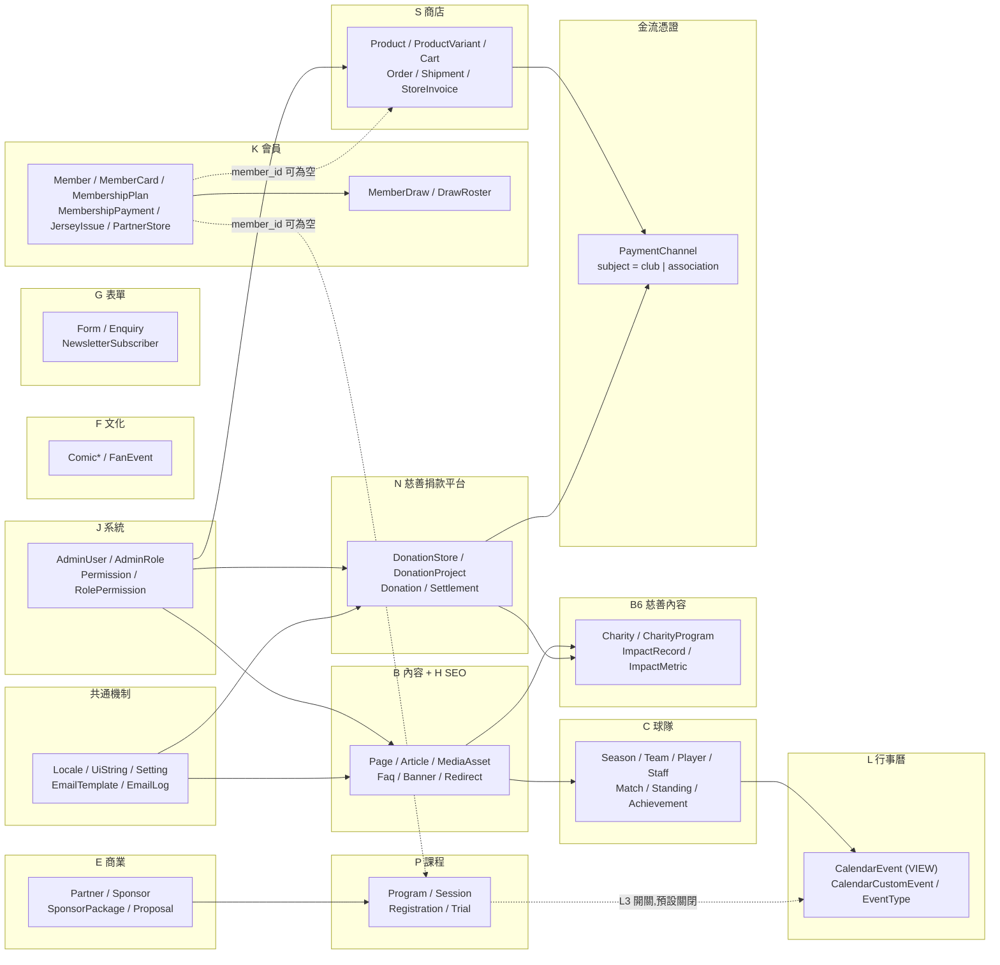
```mermaid
flowchart LR
  subgraph CORE["共通機制"]
    L["Locale / UiString / Setting<br/>EmailTemplate / EmailLog"]
  end
  subgraph B["B 內容 + H SEO"]
    B1["Page / Article / MediaAsset<br/>Faq / Banner / Redirect"]
  end
  subgraph C["C 球隊"]
    C1["Season / Team / Player / Staff<br/>Match / Standing / Achievement"]
  end
  subgraph LL["L 行事曆"]
    L1["CalendarEvent (VIEW)<br/>CalendarCustomEvent / EventType"]
  end
  subgraph P["P 課程"]
    P1["Program / Session<br/>Registration / Trial"]
  end
  subgraph E["E 商業"]
    E1["Partner / Sponsor<br/>SponsorPackage / Proposal"]
  end
  subgraph F["F 文化"]
    F1["Comic* / FanEvent"]
  end
  subgraph G["G 表單"]
    G1["Form / Enquiry<br/>NewsletterSubscriber"]
  end
  subgraph K["K 會員"]
    K1["Member / MemberCard / MembershipPlan<br/>MembershipPayment / JerseyIssue / PartnerStore"]
    K5["MemberDraw / DrawRoster"]
  end
  subgraph S["S 商店"]
    S1["Product / ProductVariant / Cart<br/>Order / Shipment / StoreInvoice"]
  end
  subgraph CH["B6 慈善內容"]
    CH1["Charity / CharityProgram<br/>ImpactRecord / ImpactMetric"]
  end
  subgraph N["N 慈善捐款平台"]
    N1["DonationStore / DonationProject<br/>Donation / Settlement"]
  end
  subgraph J["J 系統"]
    J1["AdminUser / AdminRole<br/>Permission / RolePermission"]
  end
  subgraph PAY["金流憑證"]
    PAY1["PaymentChannel<br/>subject = club | association"]
  end

  C1 --> L1
  P1 -. "L3 開關,預設關閉" .-> L1
  B1 --> C1
  B1 --> CH1
  K1 --> K5
  K1 -. "member_id 可為空" .-> S1
  K1 -. "member_id 可為空" .-> P1
  S1 --> PAY1
  N1 --> PAY1
  N1 --> CH1
  E1 --> P1
  J1 --> B1
  J1 --> S1
  J1 --> N1
  L --> B1
  L --> N1
```

**這張圖要看出來的三件事**

1. `K1 → S1` 與 `K1 → P1` 是**虛線**：`member_id` 可為空，非會員能結帳、能報名。
2. `P1 → L1` 是**虛線且標註「預設關閉」**：課程時段永不進行事曆，只有 `Trial` 由 L3 開關決定。
3. `E1`（`Partner`／`Sponsor`）與 `K1`（`PartnerStore`）、`N1`（`DonationStore`）之間**沒有任何連線**——五種商業對象刻意零外鍵，見 [§5.5](#55-e-商業模組)。

---

## 4. 資料表總覽

**108 張**（`CalendarEvent` 是視圖）。圖例：🌐 有 i18n 側表｜🔒 含受限或加密欄位｜📸 值複製快照，不可回頭 join。

### 4.0 共通機制（7）

| 表 | 用途 | 標記 | 出處 |
|---|---|---|---|
| `Locale` | 啟用語系（`code`、名稱、是否預設、fallback 對象、排序）。**加第三語系＝INSERT 一列** | | 行 1014–1019 |
| `UiString` | 介面字串鍵（按鈕、標籤、提示、錯誤訊息）與所屬分組 | | 行 1017 |
| `UiStringTranslation` | `(ui_string_id, locale) → value` | | 行 1017 |
| `ValueTagLink` | 五大核心價值標籤的多型關聯 `(entity_type, entity_id, value_tag)` | | `docs/04` §4 |
| `Setting` | 全域設定鍵值（含商店設定、聯絡資訊、社群連結、政策頁、維護模式）；文案類另有 `setting_i18n` | 🌐 | 行 1011–1027 |
| `EmailTemplate` | 系統信樣板 | 🌐 | 行 731–735、378、慈善站 §9.2 |
| `EmailLog` | 系統信寄送紀錄。**`type` 值域是 13 個不是 5 個**：會員五封（行 731–735）＋商店四封（行 378）＋慈善四封（慈善站 §9.2） | 🔒 | 行 1292 |

> ⚠️ `EmailLog` **不是操作日誌，是功能單元**（後台要查「這封信寄出去了沒」）。不在本檔移除日誌表的範圍內。
> ⚠️ **中獎人的人工聯繫不得寫入 `EmailLog`**（行 1101 附近）——系統信維持既有封數，抽獎不新增通知信。

### 4.1 B 內容管理 ＋ H SEO 與行銷（18）　行 831–871／996–1010

| 表 | 用途 | 標記 | 後台 |
|---|---|---|---|
| `Page` | 靜態頁面主檔。**女足介紹頁亦屬此型別**（不建 `Team`／`Player`／`Match`） | 🌐 | B1 |
| `PageBlock` | 頁面區塊（13 種型別），`content json`（**只存不查**）、`sort_order` | 🌐 | B1 |
| `PageVersion` | 版本歷程與還原點、預覽分享 token。**這是內容版本不是操作日誌** | | B1 |
| `Article` | 新聞與故事 | 🌐 | B2 |
| `ArticleCategory` | 7.1–7.8 八分類。**抽獎公布走 7.1 ＋標籤，不新增分類** | 🌐 | B2 |
| `Tag` | 標籤 | 🌐 | B2 |
| `ArticleTag` | `(article_id, tag_id)` | | B2 |
| `ArticleRelation` | 文章的多型關聯 `(article_id, target_type, target_id)` → `Player`／`Team`／`Match`／`Program`／`Partner`／`Charity` | | B2 |
| `MediaAsset` | 媒體資產（圖／影／PDF）、多尺寸裁切、`is_public_download`（7.8 媒體中心） | 🌐 alt | B3 |
| `MediaFolder` | 資料夾階層 | | B3 |
| `MediaUsage` | 使用處追蹤 `(media_asset_id, entity_type, entity_id)`，刪除前警告 | | B3 |
| `Banner` | 首頁 Hero 輪播（≤5）：素材、CTA、上下架期間、排序 | 🌐 | B4 |
| `HomeSection` | 首頁九大區塊的開關、排序與精選指定 | | B4 |
| `Faq` | 常見問題；👍／👎 計數 | 🌐 | B5 |
| `FaqCategory` | 主題分類（10 個） | 🌐 | B5 |
| `FaqCategoryLink` | `(faq_id, faq_category_id)`——**一題可屬多分類** | | B5 |
| `FaqSearchMiss` | 零結果搜尋關鍵字與次數。**這是成效統計不是日誌** | | B5 |
| `Redirect` | 301 對照（`from_path`、`to_path`、`is_active`）。**含舊 Wix 商店的 5 個商品與分類網址**，CSV 批次匯入 | | H |

### 4.2 C 球隊管理（14）　行 872–904

| 表 | 用途 | 標記 |
|---|---|---|
| `Season` | 賽季（`code` 如 `2026-27`、起訖日）。**規劃書只在關聯欄提到，本檔升為實體表**——`Match`／`Standing`／`Achievement`／`MembershipPlan` 都以賽季為軸 | 🌐 |
| `Team` | 球隊。**`code` UNIQUE，值域只有 `D1`／`U15`／`U14`／`U12`**；`type` = `first_team`／`academy`／`women`（**`women` 預留不啟用**） | 🌐 |
| `Player` | 球員：背號、位置、生日、身高體重、國籍、慣用腳、加入日期、狀態（現役／離隊／外借／海外發展） | 🌐 |
| `PlayerSeasonStat` | 逐季數據 `(player_id, season_id)` | |
| `Staff` | 教練與團隊成員：證照（AFC A/B/C）、專長、分組（管理層／行政／醫療／後勤） | 🌐 |
| `StaffTeam` | `(staff_id, team_id)` 帶職務 | |
| `Match` | 賽事。`competition`（聯賽／盃賽／友誼／其他）與 `status`（未開始／進行中／已結束／延期）**是正式欄位不是前台屬性**（v2.5）；對手與場地的英文走 `match_i18n` | 🌐 |
| `MatchTeam` | 本方參賽隊 `(match_id, team_id)` ——一場賽事對應本會哪一隊 | |
| `MatchGoal` | 進球（球員、時間、類型） | |
| `MatchCard` | 黃紅牌 | |
| `MatchLineup` | 先發與替補名單 | |
| `Standing` | 積分榜 `(season_id, team_name, ...)`。**對手隊名是自由文字不是 `Team`**——`Team` 只放本會四隊 | 🌐 |
| `Achievement` | 榮譽（年份、賽事、名次、隊伍） | 🌐 |
| `Milestone` | 里程碑時間軸 | 🌐 |

> ⚠️ **`Team` 只有本會四筆**（`D1`／`U15`／`U14`／`U12`）。`Match.opponent`、`Standing` 的對手都是**字串**，不建對手球隊表——規劃書沒有這個型別，賽事全部人工維護。

### 4.3 P 課程與活動（6）　行 905–928

| 表 | 用途 | 標記 |
|---|---|---|
| `Program` | 課程／營隊／專項項目：類型、對象、年齡區間、區塊內容 | 🌐 |
| `ProgramStaff` | `(program_id, staff_id)` 教練團 | |
| `ProgramPartner` | `(program_id, partner_id)` 合作單位 | |
| `Session` | 梯次／場次：期間、時段、場地、名額、已報名數、原價／早鳥／早鳥截止、報名起訖、狀態。**永不進 `CalendarEvent`** | 🌐 |
| `Registration` | 報名。**`member_id` 可為空**（非會員可報名）；狀態 `待確認→已確認→已繳費→完成／取消／候補`；**繳費線下**，Excel 匯出與簽到表列印 | 🔒 |
| `Trial` | 試訓場次：日期、場地、對象、名額、截止。**是否同步行事曆由 L3 開關決定，預設關閉** | 🌐 |

### 4.4 E 商業模組（5）　行 929–960

| 表 | 用途 | 標記 |
|---|---|---|
| `Partner` | 合作夥伴（B2B Logo 牆）：Logo **深底／淺底兩版**、類型、國家、合作內容與期間、官網、排序、Footer／首頁曝光 | 🌐 |
| `Sponsor` | 贊助商：Logo 兩版、**等級**（主贊助／官方／支持）、合約期間、贊助內容、聯絡窗口、到期提醒、排序 | 🌐 |
| `SponsorPackage` | 贊助方案（9 種）：內容、權益清單、適合對象、價格區間（**可設不公開**）、上下架 | 🌐 |
| `Proposal` | 提案簡介（多版本、多語 PDF） | 🌐 |
| `ProposalFile` | `(proposal_id, locale, media_asset_id, version)` | |

> ⚠️ **提案下載的 Lead 名單仍走 `Enquiry`**（規劃書 §5 明寫 `Enquiry` 涵蓋「7 類表單 + 提案下載 + 捐助洽詢」），不另建 Lead 表。
> ⚠️ `E4 商品櫥窗` **已於 v2.6 併入 `S1`、代號停用不回收**，`ProductShowcase` 型別退役——**綱要中不存在**。

### 4.5 F 文化模組（5）　行 961–976

| 表 | 用途 | 標記 |
|---|---|---|
| `ComicCharacter` | 漫畫角色，`player_id` **可為空**（可對應真實球員為原型） | 🌐 |
| `ComicEpisode` | 集數、閱讀數 | 🌐 |
| `ComicPage` | 內頁 `(episode_id, sort_order, media_asset_id)` ——F1 要求批次上傳與排序 | |
| `FanEvent` | 球迷會活動 | 🌐 |
| `FanEventRegistration` | 活動報名，`member_id` 可為空 | 🔒 |

> ⚠️ 漫畫**全部免費公開、不設付費牆、不需登入**——沒有任何權限或購買欄位。
> ⚠️ **會員名單、會籍方案與權益對照表在 `K`，不在 `F`**。付費會員＝球迷會員，不另建名單。

### 4.6 G 表單與詢問（5）　行 977–995

| 表 | 用途 | 標記 |
|---|---|---|
| `Form` | 表單定義（7 類 ＋ 提案下載 ＋ 捐助洽詢）：通知信收件者（多筆）、自動回覆樣板、CAPTCHA 開關、送出後導向 | 🌐 |
| `FormField` | 動態欄位（型別、必填、驗證、排序） | 🌐 |
| `Enquiry` | 收件：來源頁、UTM、狀態 `新進→處理中→已回覆→已結案／無效`、`assignee_admin_user_id`、備註、標籤 | 🔒 |
| `EnquiryAnswer` | `(enquiry_id, form_field_id, value)` | 🔒 |
| `NewsletterSubscriber` | 電子報名單：來源、訂閱／退訂狀態 | 🔒 |

> ⚠️ **沒有志工報名表**（v2.1 移出範圍）。11 章 CTA 由三種收斂為兩種，有需求走 10.7 一般聯絡表單。

### 4.7 I 網站設定（2）　行 1011–1030

| 表 | 用途 | 標記 |
|---|---|---|
| `MenuItem` | 主選單／Mega Menu／Footer：多層級（`parent_id`）、排序、外部連結 | 🌐 |
| `Venue` | 場地：地址、**`lat`／`lng`**（v2.5）、交通說明、照片 | 🌐 |

> 其餘 I 模組內容（多語系、聯絡資訊、外部服務、全域設定、商店設定）走 `Locale`／`UiString`／`Setting`。
> ⚠️ **LINE Pay 與發票憑證不在 `Setting`**，在 `PaymentChannel`（S6／N7，僅系統管理員）。

### 4.8 J 系統管理（5）　行 1031–1040

| 表 | 用途 | 標記 |
|---|---|---|
| `AdminUser` | 後台帳號。**`username` 是唯一登入識別，不是 Email** | 🔒 |
| `AdminRole` | 角色。九個規劃書角色是 `is_system = true` 的**種子資料**，客戶可自建第十個 | |
| `AdminUserRole` | `(admin_user_id, role_id)`，多角色取聯集 | |
| `Permission` | 權限碼字典 | |
| `RolePermission` | `(role_id, permission_id)` ＋ `scope_type`／`scope_value` | |

明細見 [§7](#7-權限模型j-模組)。**本模組不含 `AuditLog`、`LoginLog`、`ExportLog`**，見 [§13.1](#131-沒有稽核與登入日誌表)。

### 4.9 K 會員管理（9）　行 1041–1158

| 表 | 用途 | 標記 |
|---|---|---|
| `Member` | 會員帳號：`tier`（`registered`／`fan_club`）、會員編號、會籍起訖、註冊來源、**LINE 綁定識別碼（加密）**、Email／電話／生日（受限） | 🔒 |
| `MemberCard` | **電子會員卡，一張一列**（`card_quota` 可 > 1，家庭方案 3 張）：持卡人姓名、`token`（UNIQUE，**不可由會員編號推導**）、狀態、補發次數 | 🔒 |
| `MembershipPlan` | 會籍方案：費用、`season_id`、期間、`card_quota`、`jersey_quota`、季中計價規則 | 🌐 |
| `MembershipPayment` | 會籍付款與開通：方式、金額、日期、交易備註、**經辦人**、開通起訖。**會籍不走商店結帳** | 🔒 |
| `MembershipBenefit` | 權益對照條目：分組、免費層值、付費層值、排序。**單一維護點，前台三處共用**（3.14／8.2／升級頁） | 🌐 |
| `JerseyIssue` | 球衣發放，**一件一列**（`jersey_quota` 可 > 1）：領用人姓名、尺寸、配送方式、地址、狀態 | 🔒 |
| `PartnerStore` | 特約店家：類別、地址、電話、營業時間、地圖、優惠內容、適用層級、合作起訖、**`lat`／`lng`**（K4 人工確認後儲存）。**無金流無分潤** | 🌐 |
| `MemberDraw` | 抽獎活動：`snapshot_at`、開獎時間與場合、領獎期限與逾期處理、狀態（草稿／名單已鎖定／已抽出／已公布／已結案／作廢）、`roster_version`、`total_count`、`roster_hash`、`announcement_article_id` | 🌐 |
| `DrawRoster` | **合格名單快照，一人一列** | 🔒 📸 |

> ⚠️ **抽獎資格是算出來的布林值**（`snapshot_at` 當下 `fan_club` ＋ 會籍有效 ＋ 帳號啟用），**沒有 `DrawEntry`／`Ticket`／`Point`／`Weight` 任何表或欄位**。一人一號，不因消費／簽到／分享增加機會。

### 4.10 L 行事曆管理（5，含 1 視圖）　行 1159–1194

| 表 | 用途 | 標記 |
|---|---|---|
| `CalendarEvent` | **視圖／索引表**：`source_type`（`match`／`trial`／`custom`）＋ `source_id`。**沒有自己的標題與時間欄位** | — |
| `CalendarCustomEvent` | **L2 自建事件——行事曆唯一的自有資料**：雙語標題、全天／多日、場地、封面、CTA、前台可見性 | 🌐 |
| `CalendarEventTeam` | `team_codes[]` 的關聯表實作 `(source_type, source_id, team_id)` | |
| `CalendarEventException` | L2 重複規則（每週／每兩週／每月）的例外日期 | |
| `EventType` | 賽事／活動類型：圖示、色彩、顯示規則、是否公開 | 🌐 |

> ⚠️ **行事曆是彙整層不是資料源。** 賽事在 C4 維護，複製一份到行事曆＝兩個真實來源，必然不同步（行 1304）。
> ⚠️ **`Session` 課程時段永不進入**；`Trial` 由 L3 開關決定、**預設關閉**。

### 4.11 S 商店（15）　行 1195–1244

| 表 | 用途 | 標記 |
|---|---|---|
| `Collection` | 商品分類，含品牌敘事區塊 | 🌐 |
| `Product` | 商品：分類、標籤、敘事、尺碼表、狀態（草稿／上架／缺貨（自動）／下架）、「新上市」標記、排序、SEO。**無會員價欄位** | 🌐 |
| `ProductImage` | 圖集 `(product_id, sort_order, media_asset_id)` | |
| `ProductVariant` | **SKU**：尺寸／顏色、貨號（UNIQUE）、售價、**促銷價（可空）**、**成本（受限）**、庫存量、預留量 | 🔒 |
| `InventoryMovement` | 庫存異動：類型（進貨／銷售／退貨回補／盤點／報損／調整）、數量、原因、**經辦人**、時間、關聯訂單 | |
| `Cart` | 購物車：`member_id`（可空）或 `anonymous_token`；**登入後合併** | |
| `CartItem` | `(cart_id, product_variant_id, quantity)` | |
| `Order` | **訂單**：訂單編號（UNIQUE）、**`member_id` 可為空**、收件人姓名／電話／地址（**受限**）、小計／運費／總計、LINE Pay 交易編號與付款狀態、出貨狀態、查詢 token、`is_manual`（現場銷售補登） | 🔒 |
| `OrderItem` | 訂單品項：**SKU 快照**（商品名稱、規格、單價**值複製**）、數量、小計 | 📸 |
| `Shipment` | 出貨：物流方式、單號（**CSV 回填，不串物流商 API**）、出貨與送達時間、超商門市代碼、自取領取狀態（待領取／已領取／逾期） | 🔒 |
| `RefundRequest` | 退貨退款申請：原因、狀態（申請／審核中／已核准／已退款／已駁回）、退款金額與方式 | |
| `RefundRequestItem` | 退貨品項（支援部分退款） | |
| `StoreInvoice` | **電子發票**：號碼、開立時間、**載具／統編／捐贈碼三選一**、開立結果與重試、作廢與折讓狀態。**抬頭為俱樂部** | 🔒 📸 |
| `InvoiceDonationCode` | 捐贈碼名單（S6 維護） | |
| `PaymentChannel` | 金流與發票憑證：`subject`（**`club`／`association` 二選一**）、`channel_type`（`linepay`／`einvoice`）、`environment`（`sandbox`／`production`）、憑證（加密）、字軌、輪替時間 | 🔒 |

> ⚠️ **付款只有 LINE Pay**——沒有信用卡、超商代碼、ATM、貨到付款欄位。**不存卡號**，結帳導轉金流商代管頁面。
> ⚠️ **不做會員價、折扣碼、運費級距**——`Order` 只有**單一固定運費 ＋ 免運門檻**（設定在 `Setting`），沒有 `discount_code`、`member_price`、`shipping_tier` 任何欄位。

### 4.12 B6 慈善內容（主站，4）　行 850–871

| 表 | 用途 | 標記 |
|---|---|---|
| `Charity` | 受贈公益團體：名稱、簡介、Logo、官網 | 🌐 |
| `CharityProgram` | **已執行的公益計畫**（11.2）：封面、對象、期間、狀態、流程、圖集 | 🌐 |
| `ImpactRecord` | 慈善事蹟紀錄。**三項核心資料必填**：公益團體名稱、捐助內容、活動圖片 | 🌐 |
| `ImpactMetric` | 影響力統計項目（**金額類預設不公開**） | 🌐 |

### 4.13 N 慈善捐款平台（8）　慈善站行 424–510／591–636

**主辦與收款主體是「台灣足球策略發展協會」，不是台中磐石。**

| 表 | 用途 | 標記 |
|---|---|---|
| `DonationStore` | 捐款合作店家：Logo、類別、地址、聯絡人、**`store_slug`（全域唯一且不可由 id 推導）**、`store_share_pct`、合作起訖、狀態 | 🌐 |
| `DonationProject` | 捐款項目：封面、說明、款項用途、`project_slug`、最低／最高金額、`project_share_pct`、撥付對象（`charity_id`）、**`invoice_mode`**（`b2c_invoice`／`donation_receipt`）、`charity_program_id`（可空）、上下架排序 | 🌐 |
| `DonationAmountOption` | 金額選項卡 `(project_id, amount, sort_order)` | |
| `Donation` | **捐款主檔**：`order_no`、金額、狀態、建立與付款時間、`project_id`、**`store_id`（可空）**、`charity_program_id`、捐款人姓名與 Email、具名／匿名、**分潤五欄快照**、發票欄位、退款原因與經辦人 | 🔒 📸 |
| `DonationPayment` | 金流交易：交易識別碼、請求與確認時間、金額、狀態、`raw_response json`（**只存不查**） | 🔒 |
| `DonationInvoice` | 發票／收據：類型、號碼、開立時間、載具或統編或收據資訊、狀態、作廢或折讓 | 🔒 📸 |
| `Settlement` | 結算單：期間、`payee_type`（`store`／`project`）、對象、筆數、捐款總額、應付金額、狀態（待結算→已結算→已付款）、匯款登記 | |
| `SettlementLine` | 結算明細：逐筆捐款的分潤金額，**含退款沖回的負項** | 📸 |

> ⚠️ **捐款人不登入不註冊**——`Donation` **不得有 `member_id` 外鍵**。Email 軟性比對只在 N3 查詢當下做，**不寫入 `Member`、不建關聯欄位、不做歸戶**。
> ⚠️ **`DonationProject` 沒有目標金額、已募得金額、捐款筆數欄位**（v1.2）。前台不做募款進度，累計數字只從 N6 報表算。
> ⚠️ **項目不得附回饋品**——沒有回饋品欄位。**對外不受理退款**，但後台保留人工退款供誤捐個案。

---

## 5. ER 圖

**圖例約定（全節適用）**

| 符號 | 意思 |
|---|---|
| `||--o{` 實線 | 真外鍵，一對多 |
| `||--||` 實線 | 一對一 |
| `}o--o{` 實線 | 多對多（經關聯表） |
| `..` **虛線** | **軟關聯，沒有外鍵**：跨圖 ghost 節點、`Donation` 對 `Member` 的 Email 軟比對、`CalendarEvent` 對來源的視圖引用 |

- 實體名一律**英文 snake_case 物理表名**；中文名回 [§4](#4-資料表總覽) 查。
- ERD 屬性型別**不帶括號**（`string_64`），長度回 §4／§6 查。
- **i18n 側表一律不入圖**（否則 12 張變 24 張且看不懂），§4 的 🌐 欄才是權威清單。
- 標 `GHOST` 的實體是**其他圖擁有的表**，在此只畫關係不畫欄位。

### 5.1 B 內容管理 — 頁面與新聞

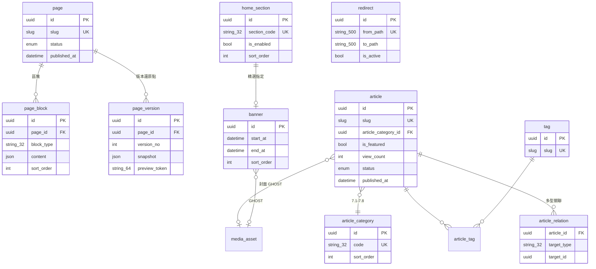
```mermaid
erDiagram
  page ||--o{ page_block : "區塊"
  page ||--o{ page_version : "版本還原點"
  article }o--|| article_category : "7.1-7.8"
  article ||--o{ article_tag : ""
  tag ||--o{ article_tag : ""
  article ||--o{ article_relation : "多型關聯"
  article }o--o| media_asset : "封面 GHOST"
  banner }o--o| media_asset : "GHOST"
  home_section ||--o| banner : "精選指定"
  page {
    uuid id PK
    slug slug UK
    enum status
    datetime published_at
  }
  page_block {
    uuid id PK
    uuid page_id FK
    string_32 block_type
    json content
    int sort_order
  }
  page_version {
    uuid id PK
    uuid page_id FK
    int version_no
    json snapshot
    string_64 preview_token
  }
  article {
    uuid id PK
    slug slug UK
    uuid article_category_id FK
    bool is_featured
    int view_count
    enum status
    datetime published_at
  }
  article_category {
    uuid id PK
    string_32 code UK
    int sort_order
  }
  tag {
    uuid id PK
    slug slug UK
  }
  article_relation {
    uuid article_id FK
    string_32 target_type
    uuid target_id
  }
  banner {
    uuid id PK
    datetime start_at
    datetime end_at
    int sort_order
  }
  home_section {
    uuid id PK
    string_32 section_code UK
    bool is_enabled
    int sort_order
  }
  redirect {
    uuid id PK
    string_500 from_path UK
    string_500 to_path
    bool is_active
  }
```

> `redirect` 無關聯，獨立於圖中。`article_relation.target_type` 指向 `player`／`team`／`match`／`program`／`partner`／`charity`，**刻意用多型而非六個外鍵**——關聯型別會隨內容策略增減。

### 5.1b B 媒體庫與 FAQ

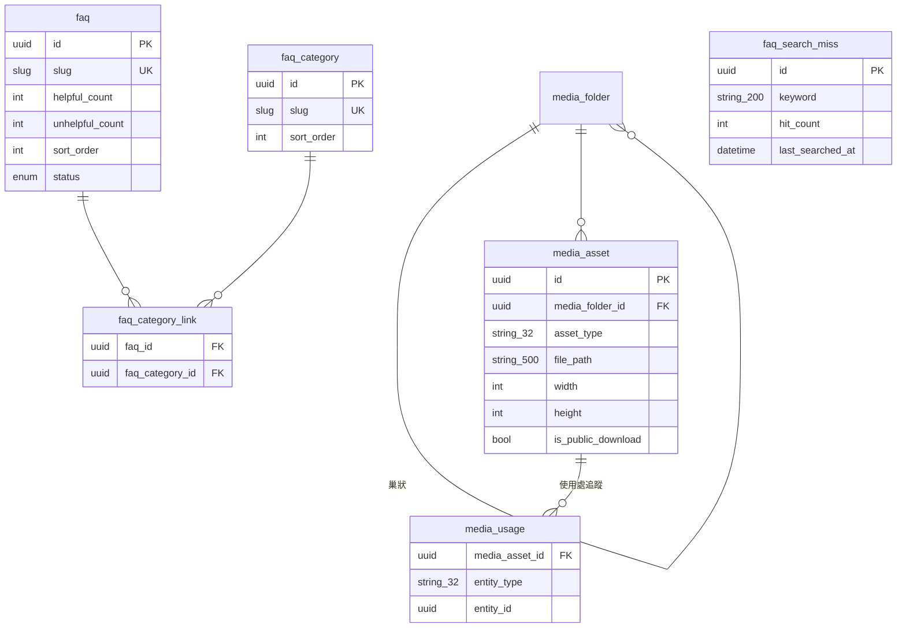
```mermaid
erDiagram
  media_folder ||--o{ media_folder : "巢狀"
  media_folder ||--o{ media_asset : ""
  media_asset ||--o{ media_usage : "使用處追蹤"
  faq ||--o{ faq_category_link : ""
  faq_category ||--o{ faq_category_link : ""
  media_asset {
    uuid id PK
    uuid media_folder_id FK
    string_32 asset_type
    string_500 file_path
    int width
    int height
    bool is_public_download
  }
  media_usage {
    uuid media_asset_id FK
    string_32 entity_type
    uuid entity_id
  }
  faq {
    uuid id PK
    slug slug UK
    int helpful_count
    int unhelpful_count
    int sort_order
    enum status
  }
  faq_category {
    uuid id PK
    slug slug UK
    int sort_order
  }
  faq_category_link {
    uuid faq_id FK
    uuid faq_category_id FK
  }
  faq_search_miss {
    uuid id PK
    string_200 keyword
    int hit_count
    datetime last_searched_at
  }
```

> `faq_category_link` 是關聯表而非 `faq.category_id`：**一題可掛多個主題**（B5 明訂）。
> `faq_search_miss` 是**成效統計**（B5「零結果關鍵字排行」），不是搜尋日誌——只存關鍵字與次數，不存誰搜的。

### 5.2 C 球隊與賽事

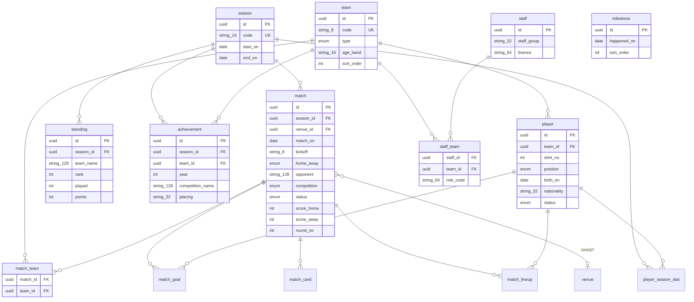
```mermaid
erDiagram
  season ||--o{ match : ""
  season ||--o{ standing : ""
  season ||--o{ achievement : ""
  season ||--o{ player_season_stat : ""
  team ||--o{ player : ""
  team ||--o{ staff_team : ""
  staff ||--o{ staff_team : ""
  team ||--o{ match_team : ""
  match ||--o{ match_team : ""
  match ||--o{ match_goal : ""
  match ||--o{ match_card : ""
  match ||--o{ match_lineup : ""
  player ||--o{ player_season_stat : ""
  player ||--o{ match_goal : ""
  player ||--o{ match_lineup : ""
  match }o--o| venue : "GHOST"
  team ||--o{ achievement : ""
  season {
    uuid id PK
    string_16 code UK
    date start_on
    date end_on
  }
  team {
    uuid id PK
    string_8 code UK
    enum type
    string_16 age_band
    int sort_order
  }
  player {
    uuid id PK
    uuid team_id FK
    int shirt_no
    enum position
    date birth_on
    string_32 nationality
    enum status
  }
  staff {
    uuid id PK
    string_32 staff_group
    string_64 licence
  }
  staff_team {
    uuid staff_id FK
    uuid team_id FK
    string_64 role_code
  }
  match {
    uuid id PK
    uuid season_id FK
    uuid venue_id FK
    date match_on
    string_8 kickoff
    enum home_away
    string_128 opponent
    enum competition
    enum status
    int score_home
    int score_away
    int round_no
  }
  match_team {
    uuid match_id FK
    uuid team_id FK
  }
  standing {
    uuid id PK
    uuid season_id FK
    string_128 team_name
    int rank
    int played
    int points
  }
  achievement {
    uuid id PK
    uuid season_id FK
    uuid team_id FK
    int year
    string_128 competition_name
    string_32 placing
  }
  milestone {
    uuid id PK
    date happened_on
    int sort_order
  }
```

> ⚠️ **`team` 全站只有四筆**（`D1`／`U15`／`U14`/`U12`）。`match.opponent` 與 `standing.team_name` 是**自由文字**，不建對手球隊表——賽事全部人工維護、不串外部 API。
> ⚠️ 女足**不建 `team`／`player`／`match`**，是 `page`；`team.type` 預留 `women` 但不啟用。

### 5.3 L 行事曆（視圖）

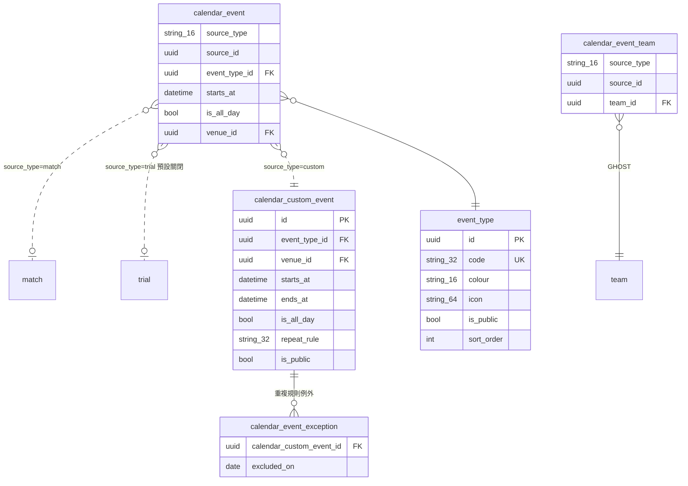
```mermaid
erDiagram
  calendar_event }o..o| match : "source_type=match"
  calendar_event }o..o| trial : "source_type=trial 預設關閉"
  calendar_event }o..|| calendar_custom_event : "source_type=custom"
  calendar_event }o--|| event_type : ""
  calendar_event_team }o--|| team : "GHOST"
  calendar_custom_event ||--o{ calendar_event_exception : "重複規則例外"
  calendar_event {
    string_16 source_type
    uuid source_id
    uuid event_type_id FK
    datetime starts_at
    bool is_all_day
    uuid venue_id FK
  }
  calendar_custom_event {
    uuid id PK
    uuid event_type_id FK
    uuid venue_id FK
    datetime starts_at
    datetime ends_at
    bool is_all_day
    string_32 repeat_rule
    bool is_public
  }
  calendar_event_team {
    string_16 source_type
    uuid source_id
    uuid team_id FK
  }
  calendar_event_exception {
    uuid calendar_custom_event_id FK
    date excluded_on
  }
  event_type {
    uuid id PK
    string_32 code UK
    string_16 colour
    string_64 icon
    bool is_public
    int sort_order
  }
```

> **`calendar_event` 是 VIEW（或索引表），不是實體表**——虛線代表它從來源讀取而非持有資料。
> `calendar_custom_event` 是行事曆**唯一的自有資料**（L2 自建事件：記者會、簽約、球迷見面會、公開訓練、休館公告）。
> ⚠️ **`session` 課程時段不在圖上，也永遠不會在**（規劃書：行事曆以比賽為核心，課程不納入）。

### 5.4 P 課程、梯次與報名

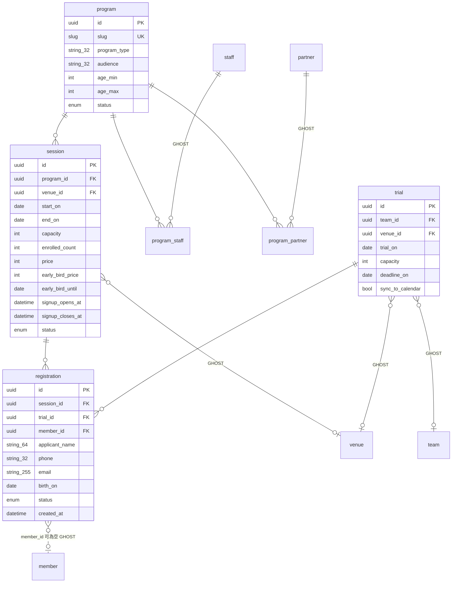
```mermaid
erDiagram
  program ||--o{ session : ""
  program ||--o{ program_staff : ""
  program ||--o{ program_partner : ""
  staff ||--o{ program_staff : "GHOST"
  partner ||--o{ program_partner : "GHOST"
  session ||--o{ registration : ""
  session }o--o| venue : "GHOST"
  trial ||--o{ registration : ""
  trial }o--o| venue : "GHOST"
  trial }o--o| team : "GHOST"
  registration }o..o| member : "member_id 可為空 GHOST"
  program {
    uuid id PK
    slug slug UK
    string_32 program_type
    string_32 audience
    int age_min
    int age_max
    enum status
  }
  session {
    uuid id PK
    uuid program_id FK
    uuid venue_id FK
    date start_on
    date end_on
    int capacity
    int enrolled_count
    int price
    int early_bird_price
    date early_bird_until
    datetime signup_opens_at
    datetime signup_closes_at
    enum status
  }
  registration {
    uuid id PK
    uuid session_id FK
    uuid trial_id FK
    uuid member_id FK
    string_64 applicant_name
    string_32 phone
    string_255 email
    date birth_on
    enum status
    datetime created_at
  }
  trial {
    uuid id PK
    uuid team_id FK
    uuid venue_id FK
    date trial_on
    int capacity
    date deadline_on
    bool sync_to_calendar
  }
```

> ⚠️ **`registration.member_id` 可為空**——非會員仍可報名（v2.5，行 1260）。**這條不得更動。**
> ⚠️ **繳費線下**：`registration` 沒有金流欄位，狀態走 `待確認→已確認→已繳費→完成／取消／候補`，`已繳費` 由後台人工標記。
> ⚠️ `registration` 同時服務 `session` 與 `trial`，兩個外鍵**恰有一個非空**。

### 5.4b G 表單與詢問

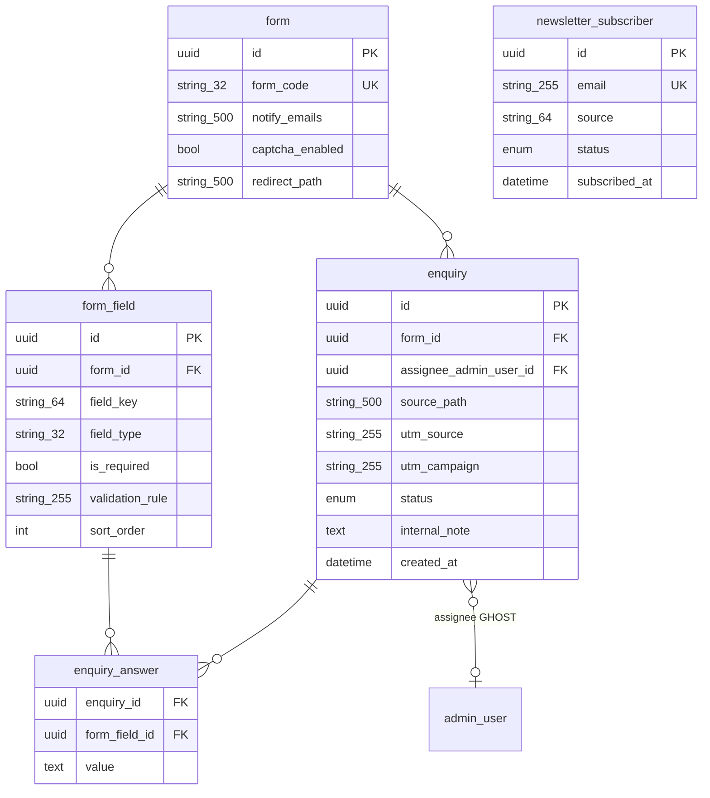
```mermaid
erDiagram
  form ||--o{ form_field : ""
  form ||--o{ enquiry : ""
  enquiry ||--o{ enquiry_answer : ""
  form_field ||--o{ enquiry_answer : ""
  enquiry }o--o| admin_user : "assignee GHOST"
  form {
    uuid id PK
    string_32 form_code UK
    string_500 notify_emails
    bool captcha_enabled
    string_500 redirect_path
  }
  form_field {
    uuid id PK
    uuid form_id FK
    string_64 field_key
    string_32 field_type
    bool is_required
    string_255 validation_rule
    int sort_order
  }
  enquiry {
    uuid id PK
    uuid form_id FK
    uuid assignee_admin_user_id FK
    string_500 source_path
    string_255 utm_source
    string_255 utm_campaign
    enum status
    text internal_note
    datetime created_at
  }
  enquiry_answer {
    uuid enquiry_id FK
    uuid form_field_id FK
    text value
  }
  newsletter_subscriber {
    uuid id PK
    string_255 email UK
    string_64 source
    enum status
    datetime subscribed_at
  }
```

> `enquiry` 涵蓋 **7 類表單 ＋ 提案下載 ＋ 捐助洽詢**（規劃書 §5）。**提案下載的 Lead 名單就是 `form_code = 'proposal_download'` 的 `enquiry`**，不另建表。
> ⚠️ **沒有志工報名表**（v2.1 移出）。

### 5.5 E 商業模組 ＋ 五種商業對象的邊界

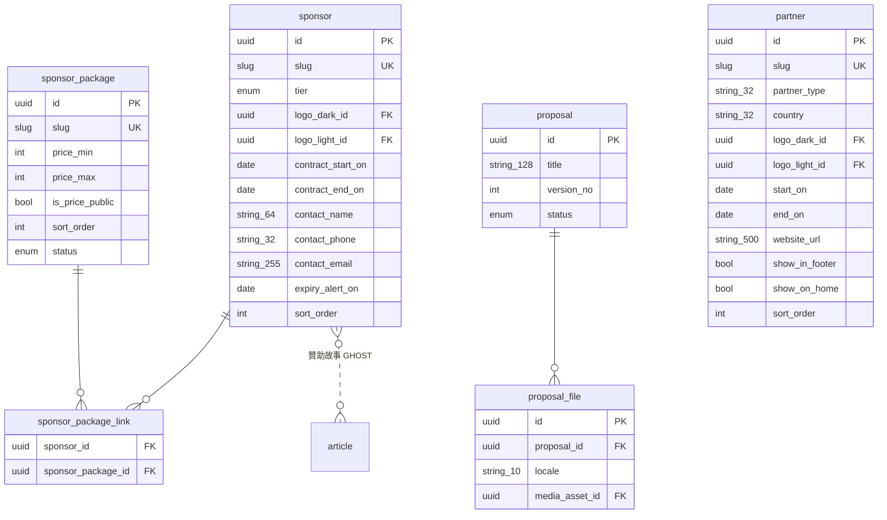
```mermaid
erDiagram
  sponsor ||--o{ sponsor_package_link : ""
  sponsor_package ||--o{ sponsor_package_link : ""
  proposal ||--o{ proposal_file : ""
  sponsor }o..o{ article : "贊助故事 GHOST"
  partner {
    uuid id PK
    slug slug UK
    string_32 partner_type
    string_32 country
    uuid logo_dark_id FK
    uuid logo_light_id FK
    date start_on
    date end_on
    string_500 website_url
    bool show_in_footer
    bool show_on_home
    int sort_order
  }
  sponsor {
    uuid id PK
    slug slug UK
    enum tier
    uuid logo_dark_id FK
    uuid logo_light_id FK
    date contract_start_on
    date contract_end_on
    string_64 contact_name
    string_32 contact_phone
    string_255 contact_email
    date expiry_alert_on
    int sort_order
  }
  sponsor_package {
    uuid id PK
    slug slug UK
    int price_min
    int price_max
    bool is_price_public
    int sort_order
    enum status
  }
  sponsor_package_link {
    uuid sponsor_id FK
    uuid sponsor_package_id FK
  }
  proposal {
    uuid id PK
    string_128 title
    int version_no
    enum status
  }
  proposal_file {
    uuid id PK
    uuid proposal_id FK
    string_10 locale
    uuid media_asset_id FK
  }
```

**五種商業對象：五張表，彼此零外鍵**

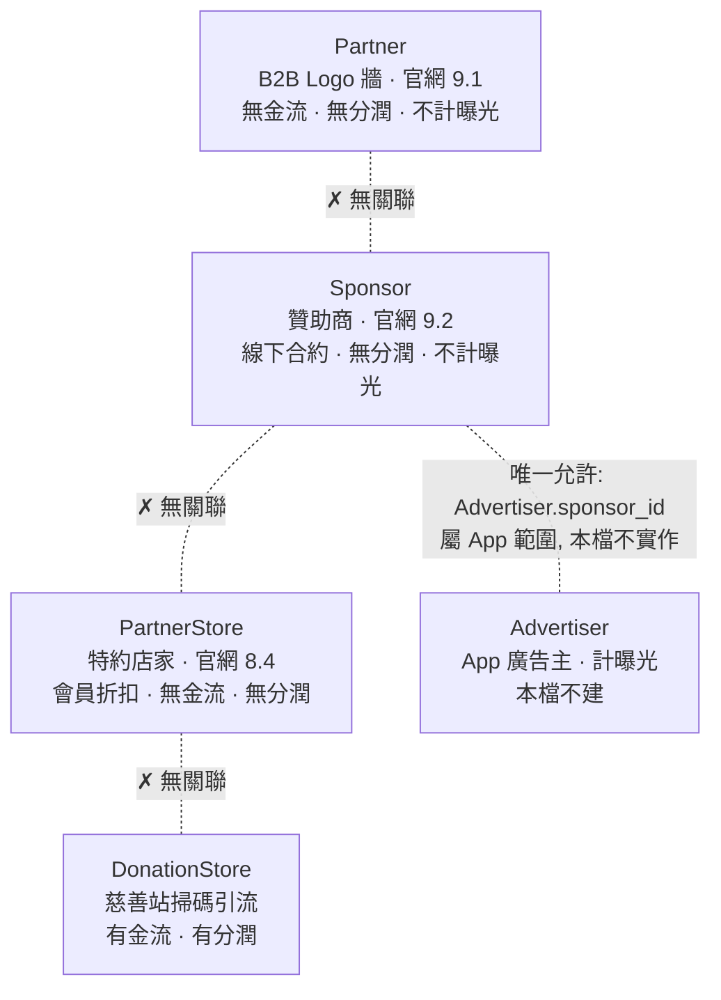
```mermaid
flowchart TB
  P["Partner<br/>B2B Logo 牆 · 官網 9.1<br/>無金流 · 無分潤 · 不計曝光"]
  S["Sponsor<br/>贊助商 · 官網 9.2<br/>線下合約 · 無分潤 · 不計曝光"]
  PS["PartnerStore<br/>特約店家 · 官網 8.4<br/>會員折扣 · 無金流 · 無分潤"]
  DS["DonationStore<br/>慈善站掃碼引流<br/>有金流 · 有分潤"]
  AD["Advertiser<br/>App 廣告主 · 計曝光<br/>本檔不建"]
  P -. "✗ 無關聯" .- S
  S -. "✗ 無關聯" .- PS
  PS -. "✗ 無關聯" .- DS
  S -. "唯一允許: Advertiser.sponsor_id<br/>屬 App 範圍, 本檔不實作" .- AD
```

> ⚠️ **同一家實體公司可能同時是數種，各建一筆、不共用紀錄。** 後台介面也必須把名稱分清楚（慈善站 §6.1 明訂）。
> ⚠️ **贊助商 Logo 牆不計曝光、不進廣告報表。**

### 5.6 K 會員、會籍與特約店家

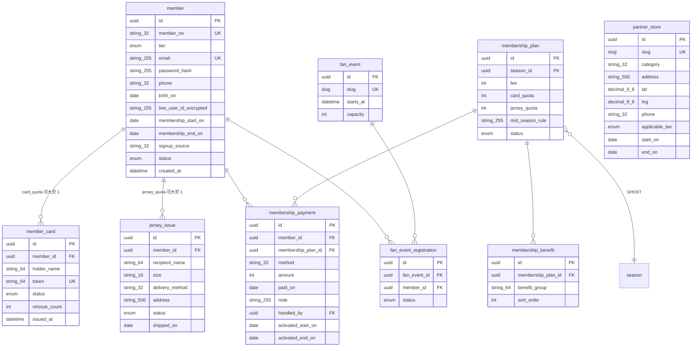
```mermaid
erDiagram
  member ||--o{ member_card : "card_quota 可大於 1"
  member ||--o{ jersey_issue : "jersey_quota 可大於 1"
  member ||--o{ membership_payment : ""
  membership_plan ||--o{ membership_payment : ""
  membership_plan ||--o{ membership_benefit : ""
  membership_plan }o--|| season : "GHOST"
  member ||--o{ fan_event_registration : ""
  fan_event ||--o{ fan_event_registration : ""
  member {
    uuid id PK
    string_32 member_no UK
    enum tier
    string_255 email UK
    string_255 password_hash
    string_32 phone
    date birth_on
    string_255 line_user_id_encrypted
    date membership_start_on
    date membership_end_on
    string_32 signup_source
    enum status
    datetime created_at
  }
  member_card {
    uuid id PK
    uuid member_id FK
    string_64 holder_name
    string_64 token UK
    enum status
    int reissue_count
    datetime issued_at
  }
  membership_plan {
    uuid id PK
    uuid season_id FK
    int fee
    int card_quota
    int jersey_quota
    string_255 mid_season_rule
    enum status
  }
  membership_payment {
    uuid id PK
    uuid member_id FK
    uuid membership_plan_id FK
    string_32 method
    int amount
    date paid_on
    string_255 note
    uuid handled_by FK
    date activated_start_on
    date activated_end_on
  }
  membership_benefit {
    uuid id PK
    uuid membership_plan_id FK
    string_64 benefit_group
    int sort_order
  }
  jersey_issue {
    uuid id PK
    uuid member_id FK
    string_64 recipient_name
    string_16 size
    string_32 delivery_method
    string_500 address
    enum status
    date shipped_on
  }
  partner_store {
    uuid id PK
    slug slug UK
    string_32 category
    string_500 address
    decimal_9_6 lat
    decimal_9_6 lng
    string_32 phone
    enum applicable_tier
    date start_on
    date end_on
  }
  fan_event {
    uuid id PK
    slug slug UK
    datetime starts_at
    int capacity
  }
  fan_event_registration {
    uuid id PK
    uuid fan_event_id FK
    uuid member_id FK
    enum status
  }
```

> ⚠️ **`member_card` 的 `token` 只有一組**：行動錢包 pass 與 App 內卡片**共用同一 token**。發兩組等於兩份可撤銷狀態，撤銷必然漏一邊。token **不可由 `member_no` 推導**。
> ⚠️ **付費會員＝球迷會員**（`tier = 'fan_club'`），**不是兩種身分**，球迷會不另建名單。
> ⚠️ **家庭會籍只是 `card_quota`／`jersey_quota` 不同，不建立學員綁定關係**——網頁、App、後台三方皆不做。
> ⚠️ `partner_store` **與 `product` 是完全不同的東西**：前者是會員到店出示卡片的折扣店家（**無金流**），後者是本站自己賣的商品（**有金流**）。

### 5.7 K5 抽獎（刻意單獨一張——重點是「沒有連線」）

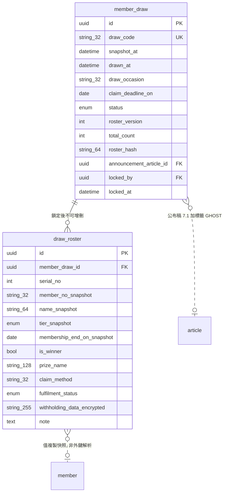
```mermaid
erDiagram
  member_draw ||--o{ draw_roster : "鎖定後不可增刪"
  member_draw }o..o| article : "公布稿 7.1 加標籤 GHOST"
  draw_roster }o..o| member : "值複製快照, 非外鍵解析"
  member_draw {
    uuid id PK
    string_32 draw_code UK
    datetime snapshot_at
    datetime drawn_at
    string_32 draw_occasion
    date claim_deadline_on
    enum status
    int roster_version
    int total_count
    string_64 roster_hash
    uuid announcement_article_id FK
    uuid locked_by FK
    datetime locked_at
  }
  draw_roster {
    uuid id PK
    uuid member_draw_id FK
    int serial_no
    string_32 member_no_snapshot
    string_64 name_snapshot
    enum tier_snapshot
    date membership_end_on_snapshot
    bool is_winner
    string_128 prize_name
    string_32 claim_method
    enum fulfilment_status
    string_255 withholding_data_encrypted
    text note
  }
```

> ⚠️ **`draw_roster` 對 `member` 是虛線**——值複製快照，**不是外鍵解析**。會員日後改名、合併帳號或刪除帳號，**都不得改動已鎖定的名單**。不要「優化」成即時 query，那會讓開獎失去稽核能力，也無法穩定配發序號。
> ⚠️ **`serial_no` 於 `snapshot_at` 依 `member_no` 升冪一次性配發，一人一號**。鎖定後不得重排；有誤只能**整份作廢重產**（`roster_version` +1，舊版保留）。
> ⚠️ **沒有 `DrawEntry`／`Ticket`／`Point`／`Weight`**——抽獎資格是會籍算出來的布林值，不因消費／簽到／分享／參加次數增加機會。
> ⚠️ **系統不抽出**：`is_winner` 由後台人工回填，實體開獎在現場或直播進行。
> ⚠️ **中獎只以最新消息公布**（遮罩），**不發中獎通知信**——`email_log` 不因抽獎新增類型。
> ⚠️ 刪帳號時 `draw_roster` **只保留 `member_no_snapshot` 與遮罩姓名**，其餘個資清除，**列不刪**。

### 5.8 S 商店 — 商品、庫存與購物車

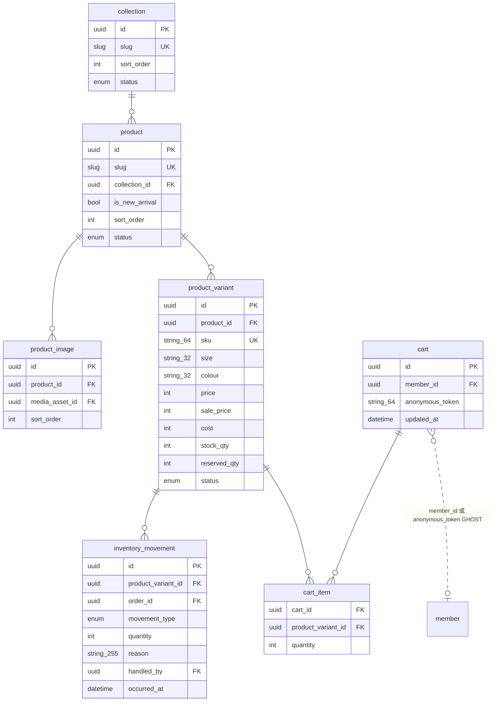
```mermaid
erDiagram
  collection ||--o{ product : ""
  product ||--o{ product_image : ""
  product ||--o{ product_variant : ""
  product_variant ||--o{ inventory_movement : ""
  product_variant ||--o{ cart_item : ""
  cart ||--o{ cart_item : ""
  cart }o..o| member : "member_id 或 anonymous_token GHOST"
  collection {
    uuid id PK
    slug slug UK
    int sort_order
    enum status
  }
  product {
    uuid id PK
    slug slug UK
    uuid collection_id FK
    bool is_new_arrival
    int sort_order
    enum status
  }
  product_image {
    uuid id PK
    uuid product_id FK
    uuid media_asset_id FK
    int sort_order
  }
  product_variant {
    uuid id PK
    uuid product_id FK
    string_64 sku UK
    string_32 size
    string_32 colour
    int price
    int sale_price
    int cost
    int stock_qty
    int reserved_qty
    enum status
  }
  inventory_movement {
    uuid id PK
    uuid product_variant_id FK
    uuid order_id FK
    enum movement_type
    int quantity
    string_255 reason
    uuid handled_by FK
    datetime occurred_at
  }
  cart {
    uuid id PK
    uuid member_id FK
    string_64 anonymous_token
    datetime updated_at
  }
  cart_item {
    uuid cart_id FK
    uuid product_variant_id FK
    int quantity
  }
```

> ⚠️ **`product_variant` 沒有 `member_price`**——v2.6 定案不做會員價與折扣碼，付費會籍權益不含商品折扣。
> ⚠️ `cost` 是**受限欄位**（僅特定角色可見）。
> ⚠️ `reserved_qty` 是下單預留：付款失敗或逾時自動釋回，取消或退貨回補。**`inventory_movement` 是功能單元不是日誌**，不在移除範圍。

### 5.8b S 商店 — 訂單、出貨、退款與發票

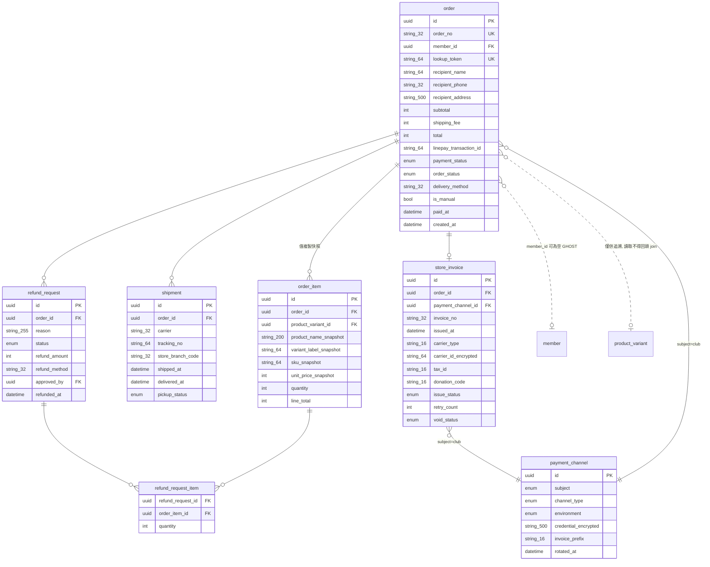
```mermaid
erDiagram
  order ||--o{ order_item : "值複製快照"
  order ||--o{ shipment : ""
  order ||--o{ refund_request : ""
  order ||--o| store_invoice : ""
  refund_request ||--o{ refund_request_item : ""
  order_item ||--o{ refund_request_item : ""
  order }o..o| member : "member_id 可為空 GHOST"
  order }o..o| product_variant : "僅供追溯, 讀取不得回頭 join"
  store_invoice }o--|| payment_channel : "subject=club"
  order }o--|| payment_channel : "subject=club"
  order {
    uuid id PK
    string_32 order_no UK
    uuid member_id FK
    string_64 lookup_token UK
    string_64 recipient_name
    string_32 recipient_phone
    string_500 recipient_address
    int subtotal
    int shipping_fee
    int total
    string_64 linepay_transaction_id
    enum payment_status
    enum order_status
    string_32 delivery_method
    bool is_manual
    datetime paid_at
    datetime created_at
  }
  order_item {
    uuid id PK
    uuid order_id FK
    uuid product_variant_id FK
    string_200 product_name_snapshot
    string_64 variant_label_snapshot
    string_64 sku_snapshot
    int unit_price_snapshot
    int quantity
    int line_total
  }
  shipment {
    uuid id PK
    uuid order_id FK
    string_32 carrier
    string_64 tracking_no
    string_32 store_branch_code
    datetime shipped_at
    datetime delivered_at
    enum pickup_status
  }
  refund_request {
    uuid id PK
    uuid order_id FK
    string_255 reason
    enum status
    int refund_amount
    string_32 refund_method
    uuid approved_by FK
    datetime refunded_at
  }
  refund_request_item {
    uuid refund_request_id FK
    uuid order_item_id FK
    int quantity
  }
  store_invoice {
    uuid id PK
    uuid order_id FK
    uuid payment_channel_id FK
    string_32 invoice_no
    datetime issued_at
    string_16 carrier_type
    string_64 carrier_id_encrypted
    string_16 tax_id
    string_16 donation_code
    enum issue_status
    int retry_count
    enum void_status
  }
  payment_channel {
    uuid id PK
    enum subject
    enum channel_type
    enum environment
    string_500 credential_encrypted
    string_16 invoice_prefix
    datetime rotated_at
  }
```

> ⚠️ **`order_item` 是值複製快照**：`product_name_snapshot`／`variant_label_snapshot`／`unit_price_snapshot` 在建單當下寫死。`product_variant_id` **僅供追溯，讀取訂單時不得回頭 join 取名稱與價格**——商品改名或改價**不得改動歷史訂單**，否則對帳與客訴舉證失去依據。
> ⚠️ **`order.member_id` 可為空**——非會員能結帳。報表統計**不得用 inner join**。
> ⚠️ **付款只有 LINE Pay**：沒有信用卡、超商代碼、ATM、貨到付款欄位；**不存卡號**。回呼須驗簽且冪等，未付款逾時取消並釋回庫存。
> ⚠️ **沒有 `discount_code`、`member_price`、`shipping_tier`**：單一固定運費 ＋ 免運門檻，設定放 `setting`。
> ⚠️ **`payment_channel.subject` 只能是 `club` 或 `association`**，`(subject, channel_type, environment)` 唯一。**填錯＝款項進錯法人**；發票字軌一併分離。
> ⚠️ **物流不串 API**：`shipment.tracking_no` 由人工或 CSV 回填。

### 5.9 B6 慈善內容（主站）

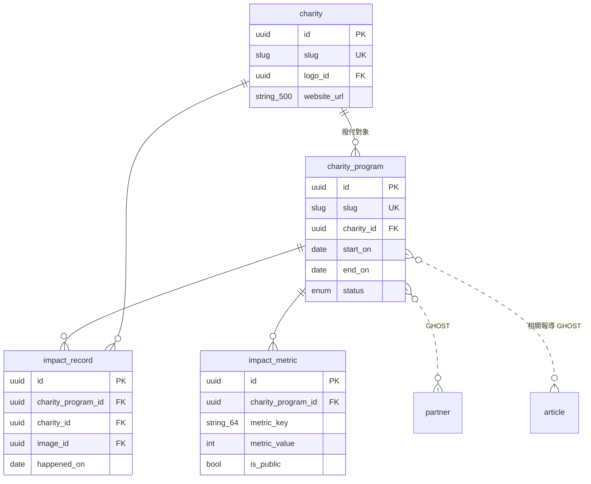
```mermaid
erDiagram
  charity ||--o{ charity_program : "撥付對象"
  charity_program ||--o{ impact_record : ""
  charity ||--o{ impact_record : ""
  charity_program ||--o{ impact_metric : ""
  charity_program }o..o{ partner : "GHOST"
  charity_program }o..o{ article : "相關報導 GHOST"
  charity {
    uuid id PK
    slug slug UK
    uuid logo_id FK
    string_500 website_url
  }
  charity_program {
    uuid id PK
    slug slug UK
    uuid charity_id FK
    date start_on
    date end_on
    enum status
  }
  impact_record {
    uuid id PK
    uuid charity_program_id FK
    uuid charity_id FK
    uuid image_id FK
    date happened_on
  }
  impact_metric {
    uuid id PK
    uuid charity_program_id FK
    string_64 metric_key
    int metric_value
    bool is_public
  }
```

> ⚠️ `impact_record` 的**三項核心資料必填**：公益團體名稱、捐助內容、活動圖片。
> ⚠️ **慈善金額預設不公開**（`impact_metric.is_public` 預設 `false`）。
> ⚠️ **主站不做站內捐款**——這四張表只做陳列，捐款走慈善捐款平台（[§5.10](#510-n-慈善捐款平台)）。

### 5.10 N 慈善捐款平台

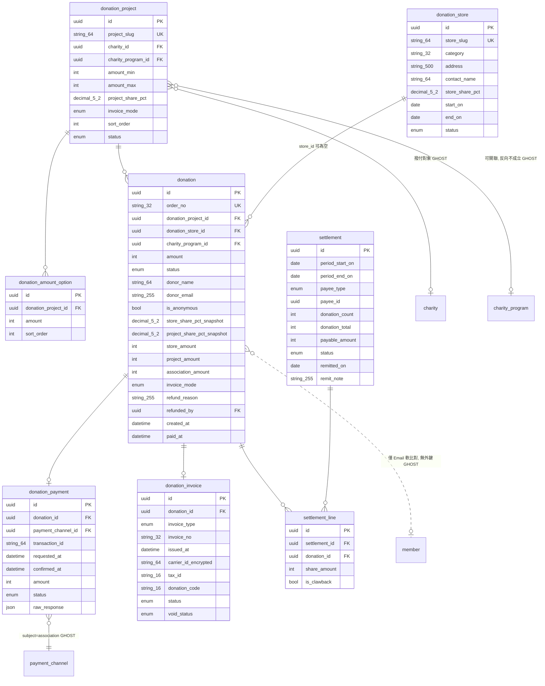
```mermaid
erDiagram
  donation_project ||--o{ donation_amount_option : ""
  donation_project ||--o{ donation : ""
  donation_store ||--o{ donation : "store_id 可為空"
  donation ||--o| donation_payment : ""
  donation ||--o| donation_invoice : ""
  donation ||--o{ settlement_line : ""
  settlement ||--o{ settlement_line : ""
  donation_project }o--o| charity : "撥付對象 GHOST"
  donation_project }o--o| charity_program : "可關聯, 反向不成立 GHOST"
  donation }o..o| member : "僅 Email 軟比對, 無外鍵 GHOST"
  donation_payment }o--|| payment_channel : "subject=association GHOST"
  donation_store {
    uuid id PK
    string_64 store_slug UK
    string_32 category
    string_500 address
    string_64 contact_name
    decimal_5_2 store_share_pct
    date start_on
    date end_on
    enum status
  }
  donation_project {
    uuid id PK
    string_64 project_slug UK
    uuid charity_id FK
    uuid charity_program_id FK
    int amount_min
    int amount_max
    decimal_5_2 project_share_pct
    enum invoice_mode
    int sort_order
    enum status
  }
  donation_amount_option {
    uuid id PK
    uuid donation_project_id FK
    int amount
    int sort_order
  }
  donation {
    uuid id PK
    string_32 order_no UK
    uuid donation_project_id FK
    uuid donation_store_id FK
    uuid charity_program_id FK
    int amount
    enum status
    string_64 donor_name
    string_255 donor_email
    bool is_anonymous
    decimal_5_2 store_share_pct_snapshot
    decimal_5_2 project_share_pct_snapshot
    int store_amount
    int project_amount
    int association_amount
    enum invoice_mode
    string_255 refund_reason
    uuid refunded_by FK
    datetime created_at
    datetime paid_at
  }
  donation_payment {
    uuid id PK
    uuid donation_id FK
    uuid payment_channel_id FK
    string_64 transaction_id
    datetime requested_at
    datetime confirmed_at
    int amount
    enum status
    json raw_response
  }
  donation_invoice {
    uuid id PK
    uuid donation_id FK
    enum invoice_type
    string_32 invoice_no
    datetime issued_at
    string_64 carrier_id_encrypted
    string_16 tax_id
    string_16 donation_code
    enum status
    enum void_status
  }
  settlement {
    uuid id PK
    date period_start_on
    date period_end_on
    enum payee_type
    uuid payee_id
    int donation_count
    int donation_total
    int payable_amount
    enum status
    date remitted_on
    string_255 remit_note
  }
  settlement_line {
    uuid id PK
    uuid settlement_id FK
    uuid donation_id FK
    int share_amount
    bool is_clawback
  }
```

> ⚠️ **主辦與收款主體是台灣足球策略發展協會**：前台標誌、發票與收據抬頭、系統信署名、對帳單一律為協會。分潤留存方是 `association_amount`。
> ⚠️ **捐款人不登入不註冊**：`donation` **不得有 `member_id` 外鍵**。Email 軟比對只在 N3 查詢當下做，**不寫入 `member`、不歸戶**。
> ⚠️ **分潤五欄是成立當下的快照**：`store_share_pct_snapshot`／`project_share_pct_snapshot` 決定三個金額，**改設定不追溯**。`store_id` 為空時 `store_share_pct_snapshot = 0` 仍能結算。
> ⚠️ **退款以負項 `settlement_line`（`is_clawback = true`）沖回下一期**，**不改原列、不重算已付款期間**。
> ⚠️ **`donation_project` 沒有目標金額、已募得、捐款筆數欄位**（v1.2）——前台不做募款進度，不要為了顯示回頭加。
> ⚠️ **`settlement` 店家與項目分開結算**，`payee_type` 二選一，兩份不同的對帳單。**實際匯款人工執行**，系統只登記日期與方式。
> ⚠️ **`donation_store` 與 `partner_store` 是兩張表**，同一家店既引流又給會員折扣就**兩邊各建一筆、不建外鍵**。

### 5.11 J 系統管理與共通機制

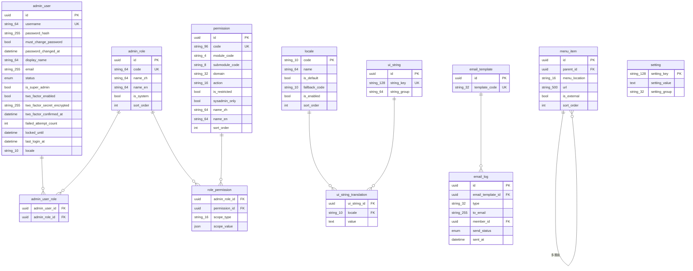
```mermaid
erDiagram
  admin_user ||--o{ admin_user_role : ""
  admin_role ||--o{ admin_user_role : ""
  admin_role ||--o{ role_permission : ""
  permission ||--o{ role_permission : ""
  locale ||--o{ ui_string_translation : ""
  ui_string ||--o{ ui_string_translation : ""
  menu_item ||--o{ menu_item : "多層級"
  email_template ||--o{ email_log : ""
  admin_user {
    uuid id PK
    string_64 username UK
    string_255 password_hash
    bool must_change_password
    datetime password_changed_at
    string_64 display_name
    string_255 email
    enum status
    bool is_super_admin
    bool two_factor_enabled
    string_255 two_factor_secret_encrypted
    datetime two_factor_confirmed_at
    int failed_attempt_count
    datetime locked_until
    datetime last_login_at
    string_10 locale
  }
  admin_role {
    uuid id PK
    string_64 code UK
    string_64 name_zh
    string_64 name_en
    bool is_system
    int sort_order
  }
  admin_user_role {
    uuid admin_user_id FK
    uuid admin_role_id FK
  }
  permission {
    uuid id PK
    string_96 code UK
    string_4 module_code
    string_8 submodule_code
    string_32 domain
    string_16 action
    bool is_restricted
    bool sysadmin_only
    string_64 name_zh
    string_64 name_en
    int sort_order
  }
  role_permission {
    uuid admin_role_id FK
    uuid permission_id FK
    string_16 scope_type
    json scope_value
  }
  locale {
    string_10 code PK
    string_64 name
    bool is_default
    string_10 fallback_code
    bool is_enabled
    int sort_order
  }
  ui_string {
    uuid id PK
    string_128 string_key UK
    string_64 string_group
  }
  ui_string_translation {
    uuid ui_string_id FK
    string_10 locale FK
    text value
  }
  menu_item {
    uuid id PK
    uuid parent_id FK
    string_16 menu_location
    string_500 url
    bool is_external
    int sort_order
  }
  setting {
    string_128 setting_key PK
    text setting_value
    string_32 setting_group
  }
  email_template {
    uuid id PK
    string_32 template_code UK
  }
  email_log {
    uuid id PK
    uuid email_template_id FK
    string_32 type
    string_255 to_email
    uuid member_id FK
    enum send_status
    datetime sent_at
  }
```

> ⚠️ **`admin_user.username` 是唯一登入識別，`email` 不是。** `email` 只作系統通知與密碼重設，**不設唯一索引、不作登入查詢鍵**。
> ⚠️ **本圖沒有 `audit_log`、`login_log`、`export_log`** —— 見 [§13.1](#131-沒有稽核與登入日誌表)。`failed_attempt_count`／`locked_until`／`last_login_at` 是**狀態欄位不是日誌表**。
> ⚠️ **`email_log` 是功能單元**（後台要查信寄出去了沒），`type` 值域 13 個。

### 5.12 i18n 機制示例

其餘約 40 張 `*_i18n` 側表形狀相同，**不再入圖**。

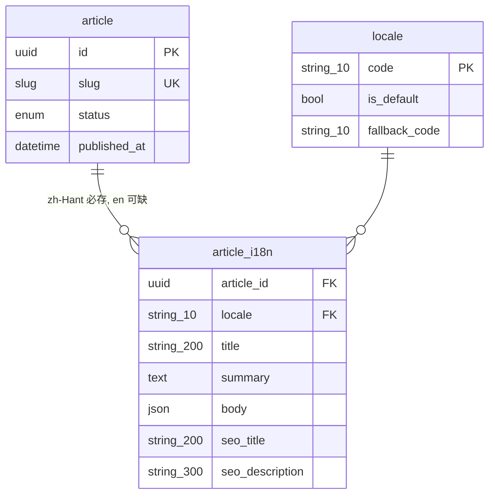
```mermaid
erDiagram
  article ||--o{ article_i18n : "zh-Hant 必存, en 可缺"
  locale ||--o{ article_i18n : ""
  article {
    uuid id PK
    slug slug UK
    enum status
    datetime published_at
  }
  article_i18n {
    uuid article_id FK
    string_10 locale FK
    string_200 title
    text summary
    json body
    string_200 seo_title
    string_300 seo_description
  }
  locale {
    string_10 code PK
    bool is_default
    string_10 fallback_code
  }
```

---

## 6. 關鍵資料表明細

ER 圖已給欄位與型別，本節只補**值域、唯一鍵與約束**——這 12 張表是最容易做錯的。

### 6.1 `Team`

| 項目 | 規則 |
|---|---|
| `code` | **UNIQUE**。值域**只有** `D1`／`U15`／`U14`／`U12`。**全站沒有 `D2`** |
| `type` | `first_team`（**全站僅一筆，即 `D1`**）／`academy`（U15／U14／U12）／`women`（**預留不啟用**） |
| 用途 | 行事曆第一層分類、篩選標籤、訂閱網址 `/schedule/d1/`。新增梯隊（U18／U10）只需 C1 新增一筆，前台分類自動出現 |
| 對外顯示 | `D1` 是代號，前台一律顯示 `First Team / 一線隊` |

### 6.2 `Member`

| 欄位 | 值域與約束 |
|---|---|
| `tier` | `registered`（免費）／`fan_club`（付費＝球迷會員）。**不是兩種身分，是同一個 `Member` 上的層級標記** |
| `member_no` | UNIQUE。格式建議 `TCR-<球季>-<流水號>`（待確認事項第 7 點） |
| `email` | UNIQUE，🔒 受限。**前台登入識別**（與後台 `AdminUser.username` 無關） |
| `signup_source` | `web`／`line`／`admin`／`app`。**不含 `google`**——不採用 Google 登入 |
| `line_user_id_encrypted` | 🔒 加密儲存，**不得匯出** |
| `status` | `active`／`suspended`／`deleted` |
| 會籍計期 | **球季制**，全體同時到期；`membership_start_on`／`membership_end_on` 由 `MembershipPayment` 開通時寫入 |
| 抽獎資格 | **算出來的布林值**：`tier = 'fan_club'` AND `membership_end_on >= snapshot_at` AND `status = 'active'`。**沒有欄位、沒有表** |
| 刪帳號 | **欄位清除不是刪列**：保留 `member_no` 與遮罩姓名，其餘個資清除。稅法要求保留的訂單與發票**優先於刪除請求** |

### 6.3 `MemberCard`

| 項目 | 規則 |
|---|---|
| 列數 | **一張卡一列**，數量上限為 `MembershipPlan.card_quota`（家庭方案可為 3） |
| `token` | UNIQUE，**不可由 `member_no` 推導**。公開驗證頁 `/m/<token>` 使用 |
| 唯一性 | **一張卡只有一組 token**，行動錢包 pass 與 App 內卡片共用。發兩組＝兩份可撤銷狀態，撤銷必漏一邊 |
| 折扣使用 | 到店**出示卡片目視即可**，QR 指向公開唯讀驗證頁。**不核銷、不計次、店家不需系統**——所以沒有 `redemption` 任何表 |

### 6.4 `MemberDraw` / `DrawRoster`

| 項目 | 規則 |
|---|---|
| `MemberDraw.status` | `draft`／`roster_locked`／`drawn`／`announced`／`closed`／`voided` |
| `snapshot_at` | 資格基準時間。名單於此刻**一次性寫入**，會員無法自行建立 |
| `roster_version` | 名單版本。有誤只能**整份作廢重產**（版本 +1），**舊版保留不刪** |
| `roster_hash` | 名單雜湊，供開獎當下的完整性佐證 |
| `DrawRoster.serial_no` | **依 `member_no` 升冪連號配發，一人一號**。`(member_draw_id, serial_no)` UNIQUE。鎖定後不得重排 |
| 快照欄位 | `member_no_snapshot`／`name_snapshot`／`tier_snapshot`／`membership_end_on_snapshot` 皆**值複製**，母表變動不追溯 |
| `is_winner` | **後台人工回填**——系統不抽出，實體開獎在現場或直播進行 |
| `withholding_data_encrypted` | 🔒 **僅達扣繳門檻時蒐集**，加密、預設遮罩 |
| 通知 | **不發中獎通知信、不推播**。中獎只以最新消息公布（7.1 ＋`球迷會員抽獎` 標籤，遮罩） |

### 6.5 `Order`

| 欄位 | 值域與約束 |
|---|---|
| `order_no` | UNIQUE。**若商店與 App 會籍付款共用 LINE Pay 商店號，須以訂單前綴區分以利對帳**（待確認事項第 22 點） |
| `member_id` | **可為空**——非會員可結帳。**這條不得更動** |
| `lookup_token` | UNIQUE。非會員訂單查詢用（`/zh/order/lookup/`） |
| `payment_status` | `pending`／`paid`／`failed`／`expired`／`refunded`。**逾時未付款自動取消並釋回庫存** |
| `order_status` | `待付款`／`已付款`／`備貨中`／`已出貨`／`已完成`／`已取消`／`退貨處理中`／`已退款` |
| `delivery_method` | `home_delivery`／`cvs_pickup`／`onsite_pickup`（實際開哪幾種待確認第 24 點） |
| `shipping_fee` | **單一固定運費**，免運門檻另存 `Setting`。**沒有級距、沒有重量計費** |
| `is_manual` | 現場銷售補登（S3），退款人工執行並記 `handled_by` |
| 收件人三欄 | 🔒 **視同會員個資**：完整值僅系統管理員、客服／行政與出貨角色可見 |
| 不存在的欄位 | `discount_code`、`member_price`、`points_used`、`card_no`、`shipping_tier` ——**一律沒有** |

### 6.6 `OrderItem`（📸 快照）

| 項目 | 規則 |
|---|---|
| 快照四欄 | `product_name_snapshot`／`variant_label_snapshot`／`sku_snapshot`／`unit_price_snapshot`，建單當下**值複製** |
| `product_variant_id` | **僅供追溯**。讀取訂單時**不得回頭 join 取名稱與價格** |
| 理由 | 商品改名、改價、下架**都不得改動歷史訂單**，否則對帳與客訴舉證失去依據 |
| 同類 | `DrawRoster`、`SettlementLine`、`StoreInvoice`、`DonationInvoice` 適用同一原則 |

### 6.7 `StoreInvoice`

| 項目 | 規則 |
|---|---|
| 抬頭 | **俱樂部**。與協會發票**分屬不同字軌**，不得共用 |
| 三選一 | `carrier_type`＋`carrier_id_encrypted`（載具）／`tax_id`（統編）／`donation_code`（捐贈碼）——**恰有一組非空** |
| `issue_status` | `pending`／`issued`／`failed`，失敗可重試（`retry_count`） |
| `void_status` | `none`／`voided`（作廢）／`allowance`（折讓）。**退貨必須作廢或折讓** |
| 前提 | **LINE Pay 本身不開發票**，須另接發票服務（待確認第 23 點） |

### 6.8 `PaymentChannel`

| 項目 | 規則 |
|---|---|
| `subject` | **`club`（俱樂部）／`association`（協會）二選一** |
| 唯一鍵 | `(subject, channel_type, environment)` UNIQUE |
| `channel_type` | `linepay`／`einvoice` |
| `environment` | `sandbox`／`production` |
| 憑證 | 🔒 加密儲存，**僅系統管理員可見**（S6／N7）。輪替記 `rotated_at` |
| 風險 | **填錯商店號＝款項進錯法人**，同時踩稅務與《公益勸募條例》 |

### 6.9 `Donation`

| 項目 | 規則 |
|---|---|
| 收款主體 | **協會**。發票與收據抬頭、系統信署名、對帳單一律為協會 |
| `store_id` | **可為空**（非掃碼進入時）。為空時 `store_share_pct_snapshot = 0`，仍能結算 |
| 分潤五欄 | `store_share_pct_snapshot`／`project_share_pct_snapshot`（`decimal(5,2)`）→ `store_amount`／`project_amount`／`association_amount`（`int`，元）。**無條件捨去至整數元**，三者相加須等於 `amount` |
| 約束 | `store_share_pct + project_share_pct <= 100`（N2 驗證） |
| 捐款人 | 只有 `donor_name`／`donor_email`／`is_anonymous`。**不建帳號、不歸戶、不得有 `member_id`** |
| `invoice_mode` | `b2c_invoice`／`donation_receipt`，**由 `DonationProject` 決定**，建單時快照 |
| 退款 | **對外不受理**，後台保留人工退款供誤捐個案，記 `refund_reason` 與 `refunded_by` |

### 6.10 `Settlement` / `SettlementLine`

| 項目 | 規則 |
|---|---|
| `payee_type` | **`store`／`project` 二選一，兩份不同的對帳單** |
| 計算基準 | **只計 `status = 'paid'` 的捐款**，用**捐款當下的快照百分比**，改設定不追溯 |
| 退款沖回 | 以**負項** `SettlementLine`（`is_clawback = true`）進入下一期，**不改原列、不重算已付款期間** |
| `status` | `待結算`／`已結算`／`已付款`。**實際匯款人工執行**，系統只登記 `remitted_on` 與 `remit_note` |
| 職責分離 | 標記「已付款」的人與執行匯款的人**不得為同一人**（慈善站 §10）——以權限碼分離，不落資料表 |

### 6.11 `CalendarEvent`（視圖）

| 項目 | 規則 |
|---|---|
| 實作 | **視圖或索引表**，以 `source_type` + `source_id` 指向來源，**不複製資料** |
| `source_type` | `match`（來源 C4）／`trial`（**L3 開關，預設關閉**）／`custom`（來源 `CalendarCustomEvent`） |
| 隊別分類 | `CalendarEventTeam` 關聯表（`team_codes[]` 的實作），第一層分類 |
| **永不進入** | **`Session` 課程時段**——行事曆以比賽為核心，學院課程、營隊、專項訓練不納入 |
| 權限 | **跟隨來源模組**：能編輯哪些事件取決於對賽事資料的權限（學院管理者可改梯隊賽程、不能改一線隊） |

### 6.12 `AdminUser`

見 [§7.6](#76-管理員用-username-不用-email)。

---

## 7. 權限模型（J 模組）

### 7.1 五張表

`AdminUser` → `AdminUserRole` → `AdminRole` → `RolePermission` → `Permission`

有效權限 ＝ 使用者所有角色的權限**聯集**；`is_super_admin = true` 者**跳過整個查詢**。

### 7.2 九個角色是資料不是列舉

規劃書 §4.10 明寫「**角色建立與功能權限勾選**」——所以角色必須是**資料列**。
§6 的九個角色只是 `is_system = true` 的**種子資料**：**不可刪除，但權限可調**；客戶可自建第十個角色。

| `code` | `name_zh` | 備註 |
|---|---|---|
| `super_admin` | 系統管理員 | 全模組全權限 |
| `content_editor` | 內容編輯 | 送審→發布流程中具發布權 |
| `team_manager` | 競技／球隊管理 | |
| `academy_manager` | 學院／課程管理 | 賽事權限限 `scope_type = academy_only` |
| `business` | 商務／贊助 | 商店限 S1／S6 且**訂單個資遮罩** |
| `pr_media` | 公關／媒體 | |
| `support` | 客服／行政 | 會員與商店 S2–S5 |
| `translator` | 翻譯人員 | `scope_type = translate_only` |
| `viewer` | 檢視者 | 唯讀，商店不含金額 |

### 7.3 權限碼命名

`<domain>.<object>.<action>`，例：`shop.order.export`、`member.pii.reveal`、`shop.refund.execute`。

| `Permission` 欄位 | 值域 |
|---|---|
| `module_code` | `A` `B` `C` `E` `F` `G` `H` `I` `J` `K` `L` `P` `S` `N`。**禁用 `D`（撞 `D1`）／`U`（撞 `U15`）／`O`（形近 `0`）／`M`（App，本檔不含）** |
| `submodule_code` | `B1`–`B6`、`C1`–`C5`、`P1`–`P4`、`E1`–`E3`（**`E4` 停用不回收**）、`F1`–`F2`、`G1`–`G3`、`K1`–`K5`、`L1`–`L4`、`S1`–`S6`、`N1`–`N7` |
| `domain` | `content` `faq` `charity` `team` `program` `calendar` `member` `business` `shop` `donation` `enquiry` `seo` `system`（§6 十二欄 ＋ 慈善站第十三欄 `donation`） |
| `action` | `view` `create` `update` `delete` `publish` `export` `translate` `execute` `reveal` |
| `is_restricted` | **須額外授權**：會員名單匯出、訂單匯出、K5 winners 匯出、慈善明細匯出、分潤設定 |
| `sysadmin_only` | **僅系統管理員**：`shop.refund.execute`、`shop.credential.*`、`donation.refund.execute`、`donation.share.update` |

### 7.4 §6 權限矩陣 → 權限碼對照

`RolePermission.scope_type` 用來表達矩陣裡**不是布林**的格子：

| `scope_type` | 意思 | 出現在 |
|---|---|---|
| `all` | 全部 | 預設 |
| `own_teams` | 只有自己負責的隊伍 | 「賽事事件」「梯隊賽事」——**行事曆權限跟隨來源模組** |
| `academy_only` | 只有 `team.type = 'academy'` | 學院／課程管理的球隊欄 |
| `masked` | 可見但個資遮罩 | 商務／贊助的商店欄「訂單個資遮罩」 |
| `translate_only` | 只能寫 `*_i18n` 且 `locale <> 'zh-Hant'` | 翻譯人員全列 |

逐格對照（節錄關鍵格；其餘依同一規則展開）：

| 角色 | 矩陣格 | 權限碼集合 |
|---|---|---|
| 客服／行政 | 商店 **✔ S2–S5** | `shop.inventory.*`、`shop.order.view/update`、`shop.order.recipient.reveal`、`shop.shipment.*`、`shop.refund.view/update`（**不含 `shop.refund.execute`**）、`shop.order.export`（`is_restricted`） |
| 客服／行政 | 會員 **✔ 檢視／處理** | `member.*.view/update`、`member.pii.reveal`、`member.export`（`is_restricted`）、`draw.roster.create/lock`、`draw.winner.update` |
| 商務／贊助 | 商店 **S1／S6（訂單個資遮罩）** | `shop.product.*`、`shop.report.view`（**不含** `shop.order.recipient.reveal`、`shop.refund.execute`、`shop.credential.*`） |
| 學院／課程管理 | 球隊 **學院梯隊** | `team.*.update` with `scope_type = academy_only` |
| 內容編輯 | 行事曆 **自建事件** | `calendar.custom_event.*`（**不含** `calendar.match.update`） |
| 內容編輯 | 商店 **S1 文案／圖** | `shop.product.update`（**不含** `shop.variant.price.update`、`shop.variant.cost.view`） |
| 翻譯人員 | 全列 **僅翻譯欄位** | `*.translate` with `scope_type = translate_only` |
| 檢視者 | 商店 **唯讀（不含金額）** | `shop.product.view`（**不含** `shop.variant.cost.view`、`shop.report.view`） |

### 7.5 遮罩與「額外授權」怎麼表達

**不另建表。**

- **遮罩** ＝ 缺少對應的 `*.reveal` 權限碼：`member.pii.reveal`、`order.recipient.reveal`、`draw.pii.reveal`、`donor.pii.reveal`。無此碼者，API 層一律回傳遮罩值（`a***@gmail.com`）。
- **額外授權** ＝ `is_restricted = true` 的權限碼 ＋ **執行當下的二次驗證**（重輸密碼或 2FA）。二次驗證屬應用層流程，**不落資料表**。

> ⚠️ 規劃書多處承諾「匯出須寫入稽核日誌（誰、何時、幾筆、用途）」。**本版無稽核表故無法兌現**，見 [§13.1](#131-沒有稽核與登入日誌表)。

### 7.6 管理員用 `username` 不用 Email

| 項目 | 規則 |
|---|---|
| **登入識別** | **`AdminUser.username`，UNIQUE。這是唯一的登入查詢鍵** |
| `AdminUser.email` | 🔒 **僅供系統通知與密碼重設。不設唯一索引、不得作為登入查詢鍵、可為空** |
| 種子超級管理員 | `username` = **`sa@system.local`**（**它長得像 Email，但存在 `username` 欄，不是 Email**）；`display_name` = `Super Admin`；`is_super_admin = true` |
| 種子密碼 | **`Admin@123`**，以**雜湊儲存**（演算法待選型，優先 Argon2id，次選 bcrypt）。`must_change_password = true`，**首次登入強制更換** |
| 密碼政策 | J 模組要求，以 `password_changed_at` 支援到期強制更換 |
| 2FA | `two_factor_enabled`／`two_factor_secret_encrypted`／`two_factor_confirmed_at`。§8 非功能性需求明訂**後台強制 2FA** |
| 登入失敗鎖定 | `failed_attempt_count` ＋ `locked_until`。**這是狀態欄位不是日誌表** |
| 最後登入 | `last_login_at` **單一欄位**，取代規劃書 J 的「登入紀錄」表 |
| 系統保護 | 至少保留一筆 `is_super_admin = true` 且 `status = 'active'` 的帳號，**不可全數停用** |

> ⚠️ **前台 `Member.email` 是另一件事**，會員維持 Email ＋ LINE 一鍵登入不變（**不用 Google**）。兩套帳號系統**完全獨立，不共用表、不共用登入**。

---

## 8. 受限與加密欄位盤點

分三級。**分級決定的是儲存方式，可見範圍由 [§7.5](#75-遮罩與額外授權怎麼表達) 的 `*.reveal` 權限碼決定。**

| 級 | 意思 | 儲存 |
|---|---|---|
| 🔒 遮罩 | 明文存，讀取時依權限遮罩 | 一般欄位 |
| 🔐 加密 | 加密存，解密須權限 | 應用層加密，金鑰不入庫 |
| ⚖️ 法定保存 | 稅法／個資法要求保留，**優先於刪除帳號請求** | 刪帳號時只清其餘欄位，**列不刪** |

| 表 | 欄位 | 級 | 完整值可見角色 | 出處 |
|---|---|---|---|---|
| `Member` | `email`、`phone`、`birth_on` | 🔒 | 系統管理員、客服／行政 | 行 1323 |
| `Member` | `line_user_id_encrypted` | 🔐 | 系統管理員 | 行 1285 |
| `JerseyIssue` | `recipient_name`、`address` | 🔒 | 系統管理員、客服／行政、出貨角色 | K3 |
| `Order` | `recipient_name`、`recipient_phone`、`recipient_address` | 🔒 ⚖️ | 系統管理員、客服／行政、出貨角色 | 行 1330 |
| `OrderItem`／`StoreInvoice` | 全表 | ⚖️ | — | 稅法保存，年限待確認第 28 點 |
| `StoreInvoice` | `carrier_id_encrypted` | 🔐 | 系統管理員 | S6 |
| `ProductVariant` | `cost` | 🔒 | 系統管理員、商務／贊助 | S1 |
| `PaymentChannel` | `credential_encrypted` | 🔐 | **僅系統管理員** | S6／N7 |
| `DrawRoster` | `name_snapshot` | 🔒 | 系統管理員、客服／行政（公關只拿遮罩版） | 行 1325 |
| `DrawRoster` | `withholding_data_encrypted` | 🔐 ⚖️ | **僅系統管理員**，達扣繳門檻才蒐集 | 行 1144–1158 |
| `Donation` | `donor_name`、`donor_email` | 🔒 ⚖️ | 系統管理員、客服／行政 | 慈善站 N3 |
| `DonationInvoice` | `carrier_id_encrypted`、`tax_id` | 🔐 ⚖️ | 系統管理員 | 慈善站 §5 |
| `Registration`／`Enquiry`／`EnquiryAnswer` | 姓名、電話、Email、生日 | 🔒 | 依模組權限 | 行 1323 |
| `NewsletterSubscriber` | `email` | 🔒 | 系統管理員、公關／媒體 | G3 |
| `AdminUser` | `password_hash`、`two_factor_secret_encrypted` | 🔐 | **不可讀取，僅比對** | J |
| `AdminUser` | `email` | 🔒 | **不作登入鍵**，僅通知用 | 本檔決定 |

**個資保存期限未定**：規劃書要求七類表單顯示保存期限說明，但實際年限未定（待確認第 15 點，法遵項目，**擋表單上線**）。交易紀錄的年限待會計師確認（第 28 點）。

---

## 9. 快照、視圖與不可變資料

三條結構原則的完整論證。**違反其中任何一條，錯誤都不會立刻顯現，而是在對帳或客訴時才爆。**

### 9.1 值複製快照：讀取不得回頭 join

適用：`OrderItem`、`DrawRoster`、`SettlementLine`、`StoreInvoice`、`DonationInvoice`。

| 情境 | 若做成外鍵解析會怎樣 |
|---|---|
| 商品調價 | 半年前的訂單顯示今天的價格，**對帳永遠對不起來** |
| 商品改名或下架 | 客訴時舉不出當初賣的是什麼 |
| 會員改名 | 已鎖定的抽獎名單被改動，**開獎失去稽核能力** |
| 會員合併或刪帳號 | 名單少一列或序號斷號，**無法證明開獎當下的名單** |
| 分潤百分比調整 | 已結算期間的金額被回頭改寫 |

**實作規則**：快照表可保留來源外鍵（如 `OrderItem.product_variant_id`）**僅供追溯**，但**所有讀取路徑都必須用快照欄位**。程式碼審查時看到 `orderItem.variant.name` 一律視為錯誤。

### 9.2 `CalendarEvent` 是彙整層不是資料源

| 情境 | 正確做法 |
|---|---|
| 賽事改期 | 改 `Match`，行事曆自動反映 |
| 行事曆上拖曳改期（L1） | **寫回 `Match`**，不寫行事曆 |
| 俱樂部自建活動 | 寫 `CalendarCustomEvent`——這是行事曆**唯一的自有資料** |
| 課程梯次 | **永不進入**。App 的「我的報名」可顯示梯次時間，但不得寫入 `CalendarEvent`，也不得出現在賽程分頁 |
| 試訓 | `source_type = 'trial'`，由 L3 開關決定，**預設關閉** |

複製一份賽事資料到行事曆 ＝ **製造兩個真實來源，必然不同步**。

### 9.3 不可變名單：`DrawRoster` 的鎖定語意

| 階段 | 允許的操作 |
|---|---|
| `draft` | 尚未產生名單 |
| `roster_locked` | **一次性寫入完成**。此後**不得新增、不得刪除任何列** |
| `drawn` | **只有 `is_winner`／`prize_name`／`claim_method` 可回填** |
| `announced` | 加上 `fulfilment_status` 可更新；公布後的修改須附理由 |
| `closed` / `voided` | 唯讀。作廢版本**保留不刪**，重產時 `roster_version` +1 |

**有誤只能整份作廢重產**，不能局部修補——局部修補會讓序號與 `roster_hash` 對不上。

---

## 10. 批次匯入與匯出對應

### 10.1 CSV 匯入（規劃書明確要求）

| 項目 | 落到哪張表 | 出處 |
|---|---|---|
| 整季賽程 | `Match`（＋`MatchTeam`、`match_i18n`） | C4／L4 共用機制 |
| 積分榜 | `Standing` | C4 |
| FAQ 題目 | `Faq`＋`FaqCategoryLink`＋`faq_i18n`（匯入 ＋ 匯出） | B5 |
| 301 轉址對照 | `Redirect`。**含舊 Wix 商店的 5 個商品與分類網址** | H |
| 物流單號 | `Shipment.tracking_no`。**v2.6 不串物流商 API，以 CSV 回填** | S4 |
| 店家名單 | `DonationStore`（＋`donation_store_i18n`） | 慈善站 N1 |

> ⚠️ 目前 [`../content/migration/舊官網URL盤點.csv`](../content/migration/舊官網URL盤點.csv) 的「客戶決定」與「新站對應頁面」兩欄**全空**，301 對照表尚無法產生。

### 10.2 匯出

| 項目 | 來源 | 額外授權 |
|---|---|---|
| 報名名單 Excel、簽到表 | `Registration` + `Session` | |
| Lead 名單 CSV | `Enquiry`（`form_code = 'proposal_download'`） | |
| 詢問 CSV | `Enquiry` + `EnquiryAnswer` | |
| **會員 CSV** | `Member` | ✔ `is_restricted` |
| 球衣出貨清單 CSV | `JerseyIssue` | ✔ |
| 續會名單 CSV | `Member` + `MembershipPayment` | ✔ |
| 賽事 CSV／.ics | `Match` + `CalendarEvent` | |
| **抽獎名單 CSV（兩種）** | `DrawRoster`：公開遮罩版／受限中獎人版 | 受限版 ✔ |
| **訂單 CSV** | `Order` + `OrderItem` | ✔ |
| 商店報表 | `Order` 彙總 | ✔ |
| 發票會計 CSV | `StoreInvoice`／`DonationInvoice` | ✔ |
| 對帳單 ＋ CSV | `Settlement` + `SettlementLine` | ✔ |
| **QR 批次 zip** | `DonationStore`（PNG／SVG／印刷版 PDF） | |

---

## 11. 索引與唯一鍵建議

技術中立寫法。**部分索引、覆蓋索引、GIN 等屬選型後的優化，不在此指定。**

### 11.1 唯一鍵（違反即資料錯誤）

| 表 | 唯一鍵 |
|---|---|
| `Team` | `code` |
| `Member` | `member_no`、`email` |
| `MemberCard` | `token` |
| `AdminUser` | **`username`**（**`email` 不設唯一**） |
| `AdminRole` / `Permission` | `code` |
| `ProductVariant` | `sku` |
| `Order` | `order_no`、`lookup_token` |
| `DonationStore` / `DonationProject` | `store_slug` / `project_slug` |
| `Donation` | `order_no` |
| `PaymentChannel` | `(subject, channel_type, environment)` |
| `DrawRoster` | `(member_draw_id, serial_no)`、`(member_draw_id, member_no_snapshot)` |
| `Locale` | `code` |
| `Redirect` | `from_path` |
| 所有 `*_i18n` | `(<entity>_id, locale)` |
| 所有內容表 | `slug`（表內唯一） |

### 11.2 查詢索引

| 表 | 索引 | 用途 |
|---|---|---|
| `Article` | `(status, published_at desc)`、`(article_category_id, published_at desc)` | 新聞列表與分類頁 |
| `Match` | `(season_id, match_on)`、`(status, match_on)` | 賽程／賽果切換 |
| `CalendarEventTeam` | `(team_id, source_type)` | 行事曆隊別篩選 |
| `Registration` | `(session_id, status)`、`(member_id)` | 報名管理與我的報名 |
| `Order` | `(member_id, created_at desc)`、`(order_status)`、`(payment_status, created_at)` | 我的訂單、出貨佇列、逾時清理 |
| `OrderItem` | `(order_id)` | |
| `InventoryMovement` | `(product_variant_id, occurred_at desc)` | 庫存異動查詢 |
| `Donation` | `(status, paid_at)`、`(donation_store_id, paid_at)`、`(donation_project_id, paid_at)` | N4 結算與 N6 報表 |
| `SettlementLine` | `(settlement_id)`、`(donation_id)` | 沖回對應 |
| `DrawRoster` | `(member_draw_id, serial_no)` | 名單匯出 |
| `EmailLog` | `(member_id, sent_at desc)`、`(type, sent_at)` | |
| `Enquiry` | `(form_id, status, created_at desc)`、`(assignee_admin_user_id)` | 收件匣 |
| 所有 `*_i18n` | `(locale)` | 翻譯狀態矩陣 |

### 11.3 外鍵刪除行為

| 關係 | 行為 |
|---|---|
| 母表 → `*_i18n` | `CASCADE` |
| `Order` → `OrderItem`／`Shipment`／`StoreInvoice` | **`RESTRICT`**（⚖️ 法定保存，不得刪） |
| `MemberDraw` → `DrawRoster` | **`RESTRICT`**（不可變名單） |
| `Member` → `Order`／`Registration` | **`SET NULL`**（刪帳號後訂單與報名仍在） |
| `Product` → `OrderItem` | **無外鍵約束的刪除行為**——`OrderItem` 是快照，商品下架不影響歷史訂單 |
| `Settlement` → `SettlementLine` | `RESTRICT` |
| `Cart` → `CartItem` | `CASCADE` |

---

## 12. 踩雷點

比照 [`00-harness.md`](00-harness.md) §5 的編號慣例。**這些不是建議，是踩過或必然會踩的坑。**

1. **值複製快照不得回頭 join**：`OrderItem`、`DrawRoster`、`SettlementLine`、`StoreInvoice`、`DonationInvoice`。商品改名改價、會員改名合併刪帳號**都不得改動歷史列**。看到 `orderItem.variant.name` 一律視為錯誤（行 1301–1306）。
2. **`Order.member_id` 與 `Registration.member_id` 可為空**——非會員可結帳、可報名。任何 `NOT NULL` 都是錯的；**報表與統計不得用 inner join**，否則非會員訂單會憑空消失。
3. **`CalendarEvent` 是視圖或索引表**，唯一的行事曆自有資料是 `CalendarCustomEvent`。**`Session` 課程時段永不進入**；`Trial` 由 L3 開關決定、**預設關閉**。複製賽事資料進行事曆 ＝ 兩個真實來源。
4. **五種商業對象五張表、彼此零外鍵**：`Partner`（B2B Logo 牆）／`Sponsor`（贊助商）／`PartnerStore`（特約店家，**無金流無分潤**）／`DonationStore`（慈善站掃碼，**有金流有分潤**）／`Advertiser`（App 廣告主，**本檔不建**）。同一家公司同時是數種就**各建一筆**。唯一允許的關聯 `Advertiser.sponsor_id` 屬 App 範圍。
5. **本檔沒有任何日誌表**，是委託方指示的刻意落差（[§13.1](#131-沒有稽核與登入日誌表)）。反過來說：**`EmailLog`、`InventoryMovement`、`PageVersion`、`FaqSearchMiss`、訂單與捐款的狀態欄位不是日誌，是功能單元**，不得一併刪除。
6. **管理員登入識別是 `username` 不是 Email**。種子超管 `sa@system.local` **長得像 Email，但存在 `username` 欄**。`AdminUser.email` 不設唯一索引、不作登入查詢鍵。**前台 `Member.email` 是另一套系統，維持 Email 登入不變。**
7. **`Team.code` 唯一且只有 `D1`／`U15`／`U14`／`U12`**，全站**沒有 `D2`**。女足是 `Page`，**不建 `Team`／`Player`／`Match`**，`type` 預留 `women` 但不啟用。對手球隊是**字串不是實體**。
8. **`D1` 有雙重身分**：`D1` 是隊別代號（一線隊）。後台課程模組原編 `D1–D4` 已改 `P1–P4`，看到「D1 課程管理」一律是舊資料。**權限碼的 `module_code` 禁用 `D`／`U`／`O`／`M`。**
9. **一份會籍可能多張卡、多件球衣**（`card_quota`／`jersey_quota` 可 > 1，家庭方案），所以 `MemberCard` 與 `JerseyIssue` 是表不是欄位。**每張卡只有一組 token**，Wallet pass 與 App 卡片共用；發兩組＝兩份可撤銷狀態，撤銷必漏一邊。token **不可由 `member_no` 推導**。
10. **抽獎資格是算出來的布林值不是表**：沒有 `DrawEntry`／`Ticket`／`Point`／`Weight` 任何表或欄位。`serial_no` 於 `snapshot_at` 依 `member_no` 升冪**一次性配發**，鎖定後不得重排；有誤只能**整份作廢重產**（`roster_version` +1，舊版保留）。**系統不抽出**，`is_winner` 人工回填。
11. **捐款人沒有帳號**：`Donation` **不得有 `member_id` 外鍵**。Email 軟比對只在 N3 查詢當下做，**不寫入 `Member`、不建關聯欄位、不做歸戶**。
12. **分潤五欄是成立當下的快照**：改設定**不追溯**。退款以**負項 `SettlementLine`（`is_clawback = true`）沖回下一期**，**不改原列、不重算已付款期間**。`store_id` 為空時 `store_share_pct_snapshot = 0` 仍能結算。
13. **`DonationProject` 沒有目標金額、已募得金額、捐款筆數欄位**（v1.2）。前台不做募款進度，累計數字只從 N6 報表算。**不要為了前台顯示回頭加欄位。**
14. **商店與慈善的金流憑證不得同列**：`PaymentChannel.subject` 只能是 `club` 或 `association`，`(subject, channel_type, environment)` 唯一，發票字軌一併分離。**填錯＝款項進錯法人**，同時踩稅務與《公益勸募條例》。
15. **`ProductShowcase` 已退役、`E4` 停用不回收**——綱要中不存在。`S` 是新代號不是回收（與 `K5` 的回收案例相反）。看到「E4 商品櫥窗（Shopify 導流）」一律是舊規格。
16. **商店沒有的欄位**：`discount_code`、`member_price`、`points_used`、`card_no`、`shipping_tier`、`subscription_*`、`currency`。**付費會籍權益不含商品折扣**；付款只有 LINE Pay；單一固定運費 ＋ 免運門檻。看到「會員價」「折扣碼」「信用卡」一律是 v2.6 早期草稿殘留。
17. **`Season` 是本檔新增的表**（規劃書只在關聯欄提到 Season，未列為型別），不要當多餘刪掉——`Match`／`Standing`／`Achievement`／`MembershipPlan` 都以它為軸。
18. **刪帳號是欄位清除不是刪列**：`DrawRoster` 只保留 `member_no_snapshot` 與遮罩姓名；`Order` 只留稅法必要欄位。**交易紀錄的保存義務優先於刪除請求。**
19. **陣列欄位一律以關聯表表達**（`team_codes[]` → `CalendarEventTeam`、`value_tags[]` → `ValueTagLink`、FAQ 複選分類 → `FaqCategoryLink`）。選 PostgreSQL 後可改陣列＋GIN，MySQL 不行——屬 [§1.4](#14-選型才拍板的四件事)。
20. **`json` 欄位只存不查**：`PageBlock.content`、`RolePermission.scope_value`、`DonationPayment.raw_response`。需要篩選、排序、統計的資料一律拉成實欄位。
21. **i18n 側表不入 ER 圖不代表不存在**，[§4](#4-資料表總覽) 總覽表的 🌐 欄才是權威清單。快照表、後台角色表、UI 字串**不走側表**（[§2.3](#23-三個例外不走側表)）。
22. **金額一律 `int` 存「元」**，只有百分比用 `decimal(5,2)`。台幣無角分，慈善分潤明訂無條件捨去至整數元；用 `decimal(10,2)` 會製造永遠對不上的尾差。
23. **`EmailLog.type` 值域是 13 個不是 5 個**：會員系統五封（行 731–735）＋商店交易四封（行 378）＋慈善平台四封（慈善站 §9.2）。**不要誤縮成五封。** 中獎人的人工聯繫**不得寫入 `EmailLog`**。
24. **`Standing` 的對手是自由文字**：`Team` 只放本會四隊，積分榜其餘球隊是 `team_name` 字串。硬要建對手球隊表會憑空長出規劃書沒有的維護負擔。
25. **`Registration` 同時服務 `session` 與 `trial`**，兩個外鍵**恰有一個非空**。不要為試訓另建報名表。
26. **`Enquiry` 涵蓋 7 類表單 ＋ 提案下載 ＋ 捐助洽詢**，**Lead 名單不另建表**。**沒有志工報名表**（v2.1 移出範圍）。
27. **行事曆權限跟隨來源模組**：`RolePermission.scope_type = 'own_teams'`。學院管理者可調整所屬梯隊賽程，**但不能改一線隊賽程**——這條在資料模型上沒有欄位可擋，只能靠權限 scope。
28. **本檔不含行動 App 的十個型別**。App 開發前**不得建立**這些表；`Member`／`PartnerStore`／`Venue`／`Registration`／`Match` 上 v2.5 為 App 加的欄位（`lat`／`lng`／`member_id`／英文欄位／`signup_source = 'app'`）**已經在綱要裡**，屆時不必改表結構。

---

## 13. 與規劃書的已知落差

**這三條是本檔刻意偏離規劃書的地方，記錄在此以免下次被當成漏寫再補回去。**

### 13.1 沒有稽核與登入日誌表

**指示**：委託方要求本次資料庫設計不含 log。
**做法**：**不建** `AuditLog`／`LoginLog`／`ExportLog`／`OperationLog`。

**與規劃書衝突的條文**

| 出處 | 條文 |
|---|---|
| 主站 §4.10 J（**行 1035**） | 「**操作稽核記錄**：誰在何時對哪筆資料做了什麼（新增／修改／刪除／發布），保存 **≥ 12 個月**」 |
| 主站 §4.10 J（**行 1036**） | 「**登入紀錄與異常提醒**」 |
| 主站 §6（**行 1324**） | 「會員名單**匯出**須額外授權，且每次匯出寫入稽核日誌（誰、何時、匯出幾筆、用途備註）」 |
| 主站 §6（**行 1325**） | 抽獎名單受限版匯出「須額外授權並寫入稽核」 |
| 主站 §6（**行 1330**） | 「訂單匯出須額外授權並寫入稽核日誌」 |
| 主站 K5（**行 1086–1125**） | 名單產生、中獎回填、版本歷程「全程稽核」；作廢版本不得刪除 |
| 主站 S6（**行 1231**） | LINE Pay 金鑰輪替紀錄 |
| 慈善站 §11.2 | 「後台的**退款、分潤設定、匯出**三類操作全數留下稽核軌跡」 |

**保留下來的補償**（**不是等價替代**）

| 保留項 | 能回答什麼 | 不能回答什麼 |
|---|---|---|
| `created_by` / `updated_by` / `updated_at` | 這筆資料**最後**是誰改的 | 改了什麼、改幾次、誰讀過、誰匯出過 |
| `AdminUser.last_login_at` | 最後登入時間 | 登入歷程、異常偵測、來源 IP |
| `AdminUser.failed_attempt_count` / `locked_until` | 目前是否被鎖 | 失敗歷程 |
| `MembershipPayment.handled_by` | 會籍是誰開通的 | |
| `InventoryMovement.handled_by` | 庫存異動是誰做的 | |
| `RefundRequest.approved_by`、`Donation.refunded_by` | 退款是誰核准的 | |
| `MemberDraw.locked_by` / `locked_at`、`roster_version`、`roster_hash` | 名單是誰鎖的、有沒有被換過 | 中獎回填的逐次歷程 |
| `PaymentChannel.rotated_at` | 憑證最後輪替時間 | 輪替歷程 |
| `PageVersion` | 頁面內容的版本還原點 | 其他型別的修改歷程 |

**直接後果，請客戶知悉**

1. **匯出行為完全無法追蹤**——會員名單、訂單、抽獎中獎人、慈善明細匯出後流向不明，四處「須寫入稽核」的承諾**無法兌現**。
2. **K5 開獎的稽核鏈斷一截**：`roster_hash` 能證明名單沒被換過，但**回填中獎人的過程無紀錄**，公布後修改也留不下理由。
3. **退款與分潤設定變更無獨立軌跡**——慈善站要求的職責分離只剩權限層，事後查不出誰在什麼時候改了百分比。
4. **登入異常提醒做不到**（只有 `last_login_at` 單點）。
5. 若日後法遵或客戶要求補上，**只需新增表，不需改動既有綱要**——所有必要的關聯（`admin_user_id`、`entity_type`／`entity_id`）都已存在。

> **本落差尚未回寫規劃書**（主站維持 v2.6、慈善站維持 v1.5）。實作前若要正式收斂範圍，須依 [`../CLAUDE.md`](../CLAUDE.md) 工作守則 #3 跑完改版鏈。

### 13.2 不含行動 App 的十個型別

`AdSlot`／`Advertiser`／`AdCampaign`／`AdCreative`／`AdEvent`／`AdDailyStat`／`AppDevice`／`PushTopicSubscription`／`PushMessage`／`AppRelease` **不在本檔**，見 [`11-mobile-app.md`](11-mobile-app.md)。

App 規劃書寫明這些型別「共用主站資料庫」，但本次範圍不含 App，**提前建表只會產生沒人維護的空表**。
**v2.5 為 App 加在既有型別上的欄位已經在綱要裡**（`PartnerStore.lat`／`lng`、`Venue.lat`／`lng`、`Registration.member_id`、`Match` 英文欄位與 `competition`／`status`、`Member.signup_source` 含 `app`），所以 App 開發時**不必改動既有表結構**，只需新增那十張表。

### 13.3 雙語採側表而非並排欄位

規劃書字面寫 `zh_*` / `en_*`，本檔改為 `<entity>_i18n` 側表。**理由與取捨見 [§2.1](#21-為什麼不用並排的-zh--en-欄位)**——這是為了兌現同一頁的另一句「架構要能再加第三語系而不改程式」。屬**執行層決定**，不改變任何功能規格。

### 13.4 規劃書 J 模組的「資料備份」不在綱要內

「每日自動備份，可手動還原點」（行 1037）屬**基礎設施設定**，不是資料表，選定 DBMS 與託管環境後再定。

---

## 14. 型別 → 資料表對照（檢核表）

**規劃書 §5 的 48 個型別 ＋ 慈善站 §9 的 6 個型別 ＝ 54 個，全數覆蓋。**

### 14.1 主站 §5（行 1245–1306）48 個

| # | 規劃書型別 | 本檔資料表 | 備註 |
|---:|---|---|---|
| 1 | `Page` | `Page` `PageBlock` `PageVersion` | 女足介紹頁亦屬此型別 |
| 2 | `Article` | `Article` `ArticleCategory` `Tag` `ArticleTag` `ArticleRelation` | 分類／標籤在關聯欄提到但未列型別 |
| 3 | `Team` | `Team` | `code` 唯一，四筆 |
| 4 | `Player` | `Player` `PlayerSeasonStat` | 逐季數據拆表 |
| 5 | `Staff` | `Staff` `StaffTeam` | 多對多 |
| 6 | `Match` | `Match` `MatchTeam` `MatchGoal` `MatchCard` `MatchLineup` | 賽果細項拆表 |
| 7 | `Standing` | `Standing` | 對手是字串 |
| 8 | `Achievement` | `Achievement` | |
| 9 | `Milestone` | `Milestone` | |
| 10 | `Program` | `Program` `ProgramStaff` `ProgramPartner` | |
| 11 | `Session` | `Session` | **永不進 `CalendarEvent`** |
| 12 | `Registration` | `Registration` | `member_id` 可為空；同時服務 `Session` 與 `Trial` |
| 13 | `Trial` | `Trial` | |
| 14 | `Partner` | `Partner` | |
| 15 | `Sponsor` | `Sponsor` `SponsorPackageLink` | |
| 16 | `SponsorPackage` | `SponsorPackage` | |
| 17 | `Product` | `Product` `ProductImage` `Collection` | 圖集與分類拆表 |
| 18 | `ProductVariant` | `ProductVariant` | 無會員價欄位 |
| 19 | `InventoryMovement` | `InventoryMovement` | **功能單元不是日誌** |
| 20 | `Cart` | `Cart` `CartItem` | 一對多 |
| 21 | `Order` | `Order` | `member_id` 可為空 |
| 22 | `OrderItem` | `OrderItem` | 📸 值複製快照 |
| 23 | `Shipment` | `Shipment` | 單號 CSV 回填 |
| 24 | `RefundRequest` | `RefundRequest` `RefundRequestItem` | 支援部分退款 |
| 25 | `StoreInvoice` | `StoreInvoice` `InvoiceDonationCode` `PaymentChannel` | 憑證與捐贈碼拆表 |
| 26 | `ComicEpisode` | `ComicEpisode` `ComicPage` | 內頁排序拆表 |
| 27 | `ComicCharacter` | `ComicCharacter` | `player_id` 可為空 |
| 28 | `FanEvent` | `FanEvent` `FanEventRegistration` | |
| 29 | `Enquiry` | `Enquiry` `EnquiryAnswer` `Form` `FormField` | G1 設計器要求動態欄位 |
| 30 | `Venue` | `Venue` | `lat`／`lng`（v2.5） |
| 31 | `MediaAsset` | `MediaAsset` `MediaFolder` `MediaUsage` | 使用處追蹤拆表 |
| 32 | `Faq` | `Faq` `FaqSearchMiss` | 零結果統計 |
| 33 | `FaqCategory` | `FaqCategory` `FaqCategoryLink` | **一題可多分類** |
| 34 | `CharityProgram` | `CharityProgram` | |
| 35 | `ImpactRecord` | `ImpactRecord` | 三項核心資料必填 |
| 36 | `Charity` | `Charity` | |
| 37 | `Donation` | `Donation` | **主檔定義在慈善站 §9.2**，見 14.2 |
| 38 | `ImpactMetric` | `ImpactMetric` | 金額類預設不公開 |
| 39 | `Member` | `Member` | |
| 40 | `MembershipPlan` | `MembershipPlan` | |
| 41 | `MembershipPayment` | `MembershipPayment` | |
| 42 | `MembershipBenefit` | `MembershipBenefit` | 單一維護點 |
| 43 | `PartnerStore` | `PartnerStore` | 無金流無分潤 |
| 44 | `MemberDraw` | `MemberDraw` | |
| 45 | `DrawRoster` | `DrawRoster` | 📸 不可變快照 |
| 46 | `EmailLog` | `EmailLog` `EmailTemplate` | **功能單元不是日誌**，`type` 13 個 |
| 47 | `CalendarEvent` | `CalendarEvent`（**視圖**）`CalendarCustomEvent` `CalendarEventTeam` `CalendarEventException` | 見 14.3 |
| 48 | `EventType` | `EventType` | |

### 14.2 慈善站 §9（行 591–636）6 個

| # | 規劃書型別 | 本檔資料表 | 備註 |
|---:|---|---|---|
| 49 | `DonationStore` | `DonationStore` | `store_slug` 不可由 id 推導 |
| 50 | `DonationProject` | `DonationProject` `DonationAmountOption` | 金額選項拆表；**無目標金額** |
| 51 | `DonationPayment` | `DonationPayment` | `raw_response` 只存不查 |
| 52 | `DonationInvoice` | `DonationInvoice` | 📸 |
| 53 | `Settlement` | `Settlement` | 店家與項目分開結算 |
| 54 | `SettlementLine` | `SettlementLine` | 📸；退款為負項 |

> `Donation`（#37）由慈善站 §9.2 擴充為本平台的捐款主檔，**重用而非新建**——主站的捐款管道已收掉，避免兩份真實來源。

### 14.3 本檔新增、規劃書未列為型別的表

**每一筆都是把規劃書已有的功能落到資料表，不是新增規格。**

| 本檔表 | 來源 | 為什麼需要 |
|---|---|---|
| `Season` | 行 1251–1256 關聯欄提到 Season | `Match`／`Standing`／`Achievement`／`MembershipPlan` 的軸 |
| `ArticleCategory` `Tag` `ArticleTag` `ArticleRelation` | 行 1250 關聯欄列 Category／Tag | B2 的分類、標籤與多型關聯 |
| `ValueTagLink` | `docs/04` §4 `value_tags[]` | 五大核心價值可掛任何型別 |
| `PageBlock` `PageVersion` | B1（行 833–837） | 13 種區塊、版本還原點、預覽 token |
| `Banner` `HomeSection` | B4（行 849–852） | Hero 輪播與首頁區塊開關 |
| `MediaFolder` `MediaUsage` | B3（行 844–848） | 資料夾與使用處追蹤（刪除前警告） |
| `FaqCategoryLink` `FaqSearchMiss` | B5（行 853–860） | 一題多分類、零結果關鍵字排行 |
| `Redirect` | H（行 1004–1006） | 301 批次匯入 |
| `PlayerSeasonStat` `MatchTeam` `MatchGoal` `MatchCard` `MatchLineup` | C2／C4（行 884–899） | 逐季數據、進球、卡、名單 |
| `StaffTeam` `ProgramStaff` `ProgramPartner` `SponsorPackageLink` | C3／P1／E2 | 多對多 |
| `ComicPage` | F1（行 963–969） | 內頁批次上傳與排序 |
| `Form` `FormField` `EnquiryAnswer` | G1（行 979–985） | 表單設計器的動態欄位 |
| `Proposal` `ProposalFile` | E3（行 938–943） | 多版本多語 PDF。**Lead 仍走 `Enquiry`** |
| `MemberCard` | 3.14 電子會員卡；`card_quota`（行 1286） | 一份會籍可多張卡，每張一組 token |
| `JerseyIssue` | K3（行 1058–1063） | `jersey_quota` 可 > 1，逐件登記 |
| `Collection` `ProductImage` `CartItem` `RefundRequestItem` `InvoiceDonationCode` | S1／S5／S6（行 1195–1244） | 一對多與捐贈碼名單 |
| `PaymentChannel` | S6（行 1229–1233）／N7（慈善站 §6.7） | **憑證分離，`subject` 二選一** |
| `CalendarCustomEvent` `CalendarEventTeam` `CalendarEventException` | L2／L3（行 1170–1186） | 自建事件、隊別分類、重複規則例外 |
| `DonationAmountOption` | 慈善站 N2 | 金額選項卡 |
| `Locale` `UiString` `UiStringTranslation` `Setting` `MenuItem` `EmailTemplate` | I（行 1011–1027） | 選單、多語系、字串翻譯表、全域設定 |
| `AdminUser` `AdminRole` `AdminUserRole` `Permission` `RolePermission` | J（行 1031–1034）／§6（行 1307–1337） | **規劃書只有行為描述沒有型別**；「角色建立與功能權限勾選」要求角色是資料 |
| 約 40 張 `*_i18n` | 行 1300、1303 | 雙語與第三語系擴充 |

### 14.4 刻意不存在的表

| 不建 | 理由 |
|---|---|
| `ProductShowcase` | v2.6 退役，`E4` 併入 `S1` 且代號停用不回收 |
| `AuditLog` `LoginLog` `ExportLog` `OperationLog` | 委託方指示，見 §13.1 |
| `DrawEntry` `Ticket` `Point` `Wallet` | 抽獎資格是布林值；**不做點數與電子錢包** |
| `Redemption` `StoreCheckin` | **不做店家掃碼核銷與成效報表** |
| `GuardianLink` `StudentParent` | **學員家長綁定網頁、App、後台三方皆不做** |
| `Notification` `NotificationPreference` | 網頁不做通知中心與 LINE 推播；系統信走 `EmailTemplate`／`EmailLog` |
| `DiscountCode` `MemberPrice` `ShippingTier` | v2.6 定案不做 |
| `TicketOrder` `Seat` | **不做票務與門票套票** |
| `VolunteerApplication` | v2.1 移出範圍 |
| `OpponentTeam` | 賽事人工維護，對手是字串 |
| App 十型別 | 見 §13.2 |

---

## 15. 行號對照

### 15.1 本檔各節 ↔ 主站規劃書（v2.6，1489 行）

| 本檔 | 規劃書行號 | 章節 |
|---|---|---|
| §4.1 B 內容 ＋ H SEO | 831–871、996–1010 | 4.2 B 內容管理、4.8 H SEO |
| §4.2 C 球隊 | 872–904 | 4.3 C 球隊管理 |
| §4.3 P 課程 | 905–928 | 4.4 P 課程與活動 |
| §4.4 E 商業 | 929–960 | 4.5 E 商業模組（**E4 併入 S1：944–950**） |
| §4.5 F 文化 | 961–976 | 4.6 F 文化模組 |
| §4.6 G 表單 | 977–995 | 4.7 G 表單與詢問 |
| §4.7 I 設定 | 1011–1030 | 4.9 I 網站設定 |
| §4.8／§7 J 系統與權限 | 1031–1040、1307–1337 | 4.10 J 系統管理、6 權限與角色矩陣 |
| §4.9 K 會員 | 1041–1158 | 4.11 K 會員管理（**K4：1065–1071、K5：1072–1127、抽獎個資與稅務：1144–1158**） |
| §4.10 L 行事曆 | 1159–1194 | 4.12 L 行事曆管理 |
| §4.11 S 商店 | 1195–1244 | 4.13 S 商店（**S1–S6，沒有 S7**） |
| §4.12 B6 慈善內容 | 850–871、447–482 | B6 慈善事蹟管理、3.11 CHARITY |
| §6／§14.1 型別定義 | 1245–1306 | 5 資料模型與內容型別 |
| §8 受限欄位 | 1320–1337、1366–1380 | 6 補充規則、8 非功能性需求 |
| §2 雙語 | 1300–1303、1338–1365 | 5 結語、7 SEO／GEO 與多語系 |
| §13 落差 | 1422–1489 | 10 待確認事項 |

### 15.2 本檔各節 ↔ 慈善捐款平台規劃書（v1.5，755 行）

| 本檔 | 慈善站行號 | 章節 |
|---|---|---|
| §4.13 N 模組 | 424–510 | 6 後台功能規劃（N1–N7） |
| §6.9／§6.10 分潤 | 537–590 | 8 分潤與帳務規則（**進位：560–565、不追溯：566–573、退款沖回：574–581**） |
| §14.2 型別 | 591–636 | 9 資料模型與內容型別 |
| §7 權限 | 637–661 | 10 權限與角色 |
| §8 受限欄位 | 662–688 | 11 個資、安全與法規 |

### 15.3 相關文件

| 文件 | 關係 |
|---|---|
| [`04-data-model.md`](04-data-model.md) | **本檔的上游**：型別清單與三條結構原則 |
| [`03-admin-spec.md`](03-admin-spec.md) | 後台模組代號與權限矩陣的上游 |
| [`10-charity-donation-site.md`](10-charity-donation-site.md) | N 模組導航層 |
| [`11-mobile-app.md`](11-mobile-app.md) | **本檔排除的十個型別在此** |
| [`06-conventions.md`](06-conventions.md) | 命名、術語、日期與檔名格式 |
| [`00-harness.md`](00-harness.md) | 規劃書行號對照與全站踩雷點 |
