# 12a — 資料庫 ER 圖

> 本檔是 [`12-database-schema.md`](12-database-schema.md) 的一部分，**章節編號沿用原檔**。
> 🔴 **v3.0 同步尚未完成**——動工前必讀主檔的「v3.0 落差」段落，遇衝突一律以規劃書為準。
> **DBMS 未定案**：不寫 DDL、不用廠商專屬型別。

> 其餘部分：型別詞彙與資料表總覽見主檔，欄位明細與索引見 [`12b-database-tables.md`](12b-database-tables.md)。

## 5. ER 圖

**圖例約定（全節適用）**

| 符號 | 意思 |
|---|---|
| `||--o{` 實線 | 真外鍵，一對多 |
| `||--||` 實線 | 一對一 |
| `}o--o{` 實線 | 多對多（經關聯表） |
| `..` **虛線** | **軟關聯，沒有外鍵**：跨圖 ghost 節點、`Donation` 對 `Member` 的 Email 軟比對、`CalendarEvent` 對來源的視圖引用 |

- 實體名用**英文 snake_case 單數**便於閱讀；🔴 **物理表名是 `snake_case` 複數**（`article` → `articles`，見 [`12` §1.2](12-database-schema.md#12-主鍵外鍵與命名慣例)）。中文名回 [§4](12-database-schema.md#4-資料表總覽) 查。
- ERD 屬性型別**不帶括號**（`string_64`），長度回 §4／§6 查。
- **i18n 側表一律不入圖**（否則 12 張變 24 張且看不懂），§4 的 🌐 欄才是權威清單。
- 標 `GHOST` 的實體是**其他圖擁有的表**，在此只畫關係不畫欄位。**`club` 的欄位只畫在 [5.11](#511-j-系統管理與共通機制)**。
- 🔵 **`club_id` 的必填／可為空是 [§4](12-database-schema.md#4-資料表總覽) 的權威清單**，ERD 只畫欄位存在與否，不畫是否可空。
- 🔵 **圖片沒有外鍵。** 全系統不設媒體庫（規劃書 §4.0），圖片是**該表自己的欄位組**：
  `<名稱>_key`（物件儲存鍵，`string_500`）＋ `<名稱>_width`／`<名稱>_height` ＋ `<名稱>_alt_zh`／`<名稱>_alt_en`（走 i18n 側表，故不入圖）。
  **ERD 只畫 `_key`**，寬高與 Alt 為省版面略去；多圖情境（`product_image`／`proposal_file`／圖集）以子表承載，每列一組欄位加 `sort_order`。

### 5.1 B 內容管理 — 頁面與新聞

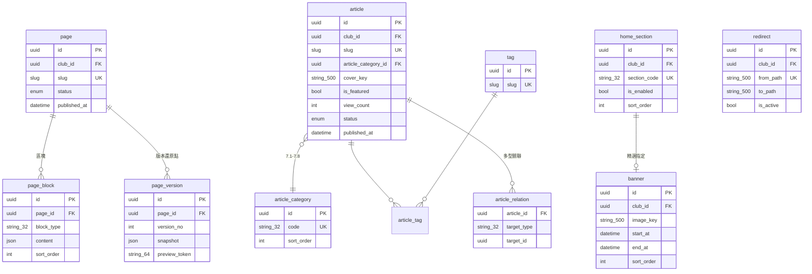
```mermaid
erDiagram
  page ||--o{ page_block : "區塊"
  page ||--o{ page_version : "版本還原點"
  article }o--|| article_category : "7.1-7.8"
  article ||--o{ article_tag : ""
  tag ||--o{ article_tag : ""
  article ||--o{ article_relation : "多型關聯"
  home_section ||--o| banner : "精選指定"
  page {
    uuid id PK
    uuid club_id FK
    slug slug UK
    enum status
    datetime published_at
  }
  page_block {
    uuid id PK
    uuid page_id FK
    string_32 block_type
    json content
    int sort_order
  }
  page_version {
    uuid id PK
    uuid page_id FK
    int version_no
    json snapshot
    string_64 preview_token
  }
  article {
    uuid id PK
    uuid club_id FK
    slug slug UK
    uuid article_category_id FK
    string_500 cover_key
    bool is_featured
    int view_count
    enum status
    datetime published_at
  }
  article_category {
    uuid id PK
    string_32 code UK
    int sort_order
  }
  tag {
    uuid id PK
    slug slug UK
  }
  article_relation {
    uuid article_id FK
    string_32 target_type
    uuid target_id
  }
  banner {
    uuid id PK
    uuid club_id FK
    string_500 image_key
    datetime start_at
    datetime end_at
    int sort_order
  }
  home_section {
    uuid id PK
    uuid club_id FK
    string_32 section_code UK
    bool is_enabled
    int sort_order
  }
  redirect {
    uuid id PK
    uuid club_id FK
    string_500 from_path UK
    string_500 to_path
    bool is_active
  }
```

> `redirect` 無關聯，獨立於圖中。`article_relation.target_type` 指向 `player`／`team`／`match`／`program`／`partner`／`charity`，**刻意用多型而非六個外鍵**——關聯型別會隨內容策略增減。

### 5.1b B 媒體資源與 FAQ

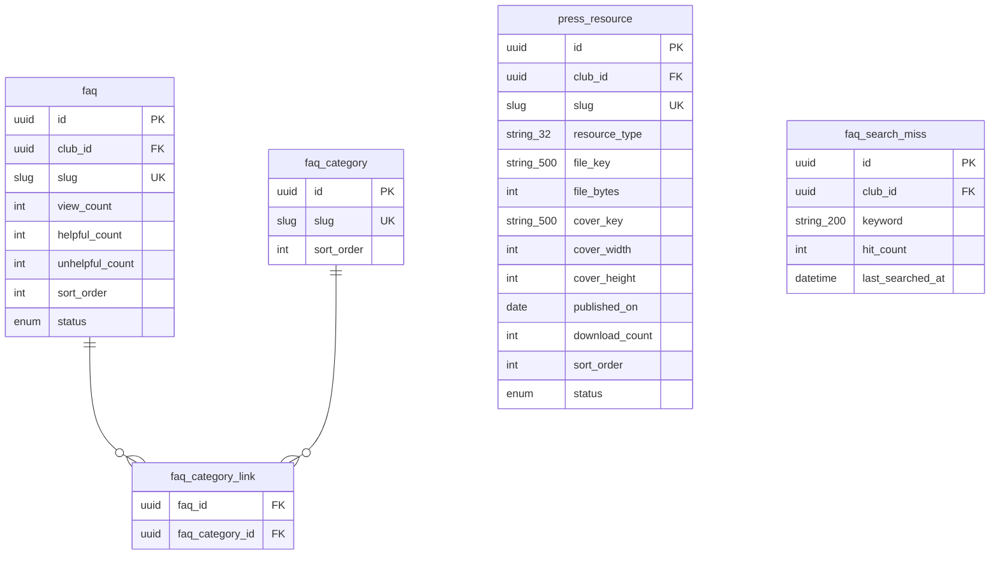
```mermaid
erDiagram
  faq ||--o{ faq_category_link : ""
  faq_category ||--o{ faq_category_link : ""
  press_resource {
    uuid id PK
    uuid club_id FK
    slug slug UK
    string_32 resource_type
    string_500 file_key
    int file_bytes
    string_500 cover_key
    int cover_width
    int cover_height
    date published_on
    int download_count
    int sort_order
    enum status
  }
  faq {
    uuid id PK
    uuid club_id FK
    slug slug UK
    int view_count
    int helpful_count
    int unhelpful_count
    int sort_order
    enum status
  }
  faq_category {
    uuid id PK
    slug slug UK
    int sort_order
  }
  faq_category_link {
    uuid faq_id FK
    uuid faq_category_id FK
  }
  faq_search_miss {
    uuid id PK
    uuid club_id FK
    string_200 keyword
    int hit_count
    datetime last_searched_at
  }
```

> `faq_category_link` 是關聯表而非 `faq.category_id`：**一題可掛多個主題**（B5 明訂）。
> `faq_search_miss` 是**成效統計**（B5「零結果關鍵字排行」），不是搜尋日誌——只存關鍵字與次數，不存誰搜的。

### 5.2 C 球隊與賽事

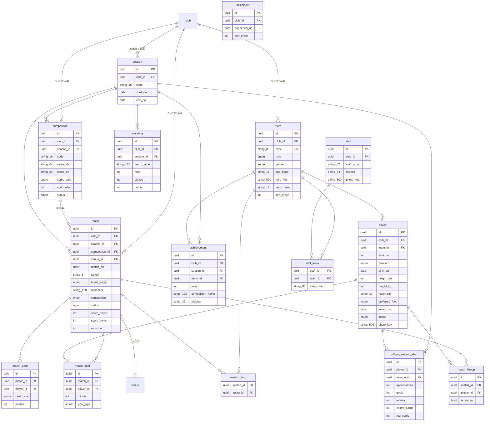
```mermaid
erDiagram
  club ||--o{ season : "GHOST 必填"
  club ||--o{ team : "GHOST 必填"
  club ||--o{ competition : "GHOST 必填"
  club ||--o{ match : "GHOST 必填"
  season ||--o{ competition : ""
  competition ||--o{ match : "可為空"
  season ||--o{ match : ""
  season ||--o{ standing : ""
  season ||--o{ achievement : ""
  season ||--o{ player_season_stat : ""
  team ||--o{ player : ""
  team ||--o{ staff_team : ""
  staff ||--o{ staff_team : ""
  team ||--o{ match_team : ""
  match ||--o{ match_team : ""
  match ||--o{ match_goal : ""
  match ||--o{ match_card : ""
  match ||--o{ match_lineup : ""
  player ||--o{ player_season_stat : ""
  player ||--o{ match_goal : ""
  player ||--o{ match_lineup : ""
  match }o--o| venue : "GHOST"
  team ||--o{ achievement : ""
  season {
    uuid id PK
    uuid club_id FK
    string_16 code
    date start_on
    date end_on
  }
  competition {
    uuid id PK
    uuid club_id FK
    uuid season_id FK
    string_16 code
    string_64 name_zh
    string_64 name_en
    enum comp_type
    int sort_order
    enum status
  }
  team {
    uuid id PK
    uuid club_id FK
    string_8 code UK
    enum type
    enum gender
    string_16 age_band
    string_500 hero_key
    string_16 team_color
    int sort_order
  }
  player_season_stat {
    uuid id PK
    uuid player_id FK
    uuid season_id FK
    int appearances
    int goals
    int assists
    int yellow_cards
    int red_cards
  }
  match_goal {
    uuid id PK
    uuid match_id FK
    uuid player_id FK
    int minute
    enum goal_type
  }
  match_card {
    uuid id PK
    uuid match_id FK
    uuid player_id FK
    enum card_type
    int minute
  }
  match_lineup {
    uuid id PK
    uuid match_id FK
    uuid player_id FK
    bool is_starter
  }
  player {
    uuid id PK
    uuid club_id FK
    uuid team_id FK
    int shirt_no
    enum position
    date birth_on
    int height_cm
    int weight_kg
    string_32 nationality
    enum preferred_foot
    date joined_on
    enum status
    string_500 photo_key
  }
  staff {
    uuid id PK
    uuid club_id FK
    string_32 staff_group
    string_64 licence
    string_500 photo_key
  }
  staff_team {
    uuid staff_id FK
    uuid team_id FK
    string_64 role_code
  }
  match {
    uuid id PK
    uuid club_id FK
    uuid season_id FK
    uuid competition_id FK
    uuid venue_id FK
    date match_on
    string_8 kickoff
    enum home_away
    string_128 opponent
    enum competition
    enum status
    int score_home
    int score_away
    int round_no
  }
  match_team {
    uuid match_id FK
    uuid team_id FK
  }
  standing {
    uuid id PK
    uuid club_id FK
    uuid season_id FK
    string_128 team_name
    int rank
    int played
    int points
  }
  achievement {
    uuid id PK
    uuid club_id FK
    uuid season_id FK
    uuid team_id FK
    int year
    string_128 competition_name
    string_32 placing
  }
  milestone {
    uuid id PK
    uuid club_id FK
    date happened_on
    int sort_order
  }
```

> 🔴 **`team` 是兩隊各自的隊伍**：磐石 `D1`／`U15`／`U14`／`U12`，藍鯨 `BW1` 與其青年隊，以 `club_id` 區隔。
> **`team.code` 維持全站唯一，不得改成 `(club_id, code)`**——它是行事曆訂閱網址與 `/schedule/d1/` 的識別鍵，已在外流通。
> **藍鯨一線隊是 `BW1` 不是第二個 `D1`**；`first_team` 由「全站僅一筆」改為「**每俱樂部至多一筆**」。
> 🔴 **性別用獨立的 `team.gender`（`men`／`women`／`mixed`）**，`type` 的 `women` 值已廢除。
> 🔴 **兩隊都有「一線隊」**，所以任何同時呈現兩隊賽事的畫面，**每張卡片都必須標球隊**。
> ⚠️ **`competition`（賽事系列）與 `match.competition` 四值 enum 並存不互相取代**：後者是粗分類，前者是有名字的實際賽事。
> 賽程卡片顯示 `competition` 名稱，篩選面板的「賽事類型」仍用 enum。
> ⚠️ `match.opponent` 與 `standing.team_name` 是**自由文字**，不建對手球隊表——賽事全部人工維護、不串外部 API。

### 5.3 L 行事曆（視圖）

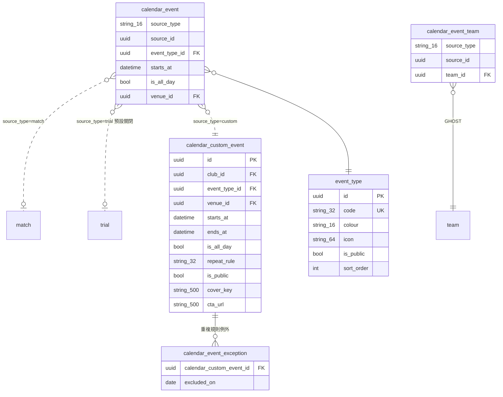
```mermaid
erDiagram
  calendar_event }o..o| match : "source_type=match"
  calendar_event }o..o| trial : "source_type=trial 預設關閉"
  calendar_event }o..|| calendar_custom_event : "source_type=custom"
  calendar_event }o--|| event_type : ""
  calendar_event_team }o--|| team : "GHOST"
  calendar_custom_event ||--o{ calendar_event_exception : "重複規則例外"
  calendar_event {
    string_16 source_type
    uuid source_id
    uuid event_type_id FK
    datetime starts_at
    bool is_all_day
    uuid venue_id FK
  }
  calendar_custom_event {
    uuid id PK
    uuid club_id FK
    uuid event_type_id FK
    uuid venue_id FK
    datetime starts_at
    datetime ends_at
    bool is_all_day
    string_32 repeat_rule
    bool is_public
    string_500 cover_key
    string_500 cta_url
  }
  calendar_event_team {
    string_16 source_type
    uuid source_id
    uuid team_id FK
  }
  calendar_event_exception {
    uuid calendar_custom_event_id FK
    date excluded_on
  }
  event_type {
    uuid id PK
    string_32 code UK
    string_16 colour
    string_64 icon
    bool is_public
    int sort_order
  }
```

> **`calendar_event` 是 VIEW（或索引表），不是實體表**——虛線代表它從來源讀取而非持有資料。
> `calendar_custom_event` 是行事曆**唯一的自有資料**（L2 自建事件：記者會、簽約、球迷見面會、公開訓練、休館公告）。
> ⚠️ **`session` 課程時段不在圖上，也永遠不會在**（規劃書：行事曆以比賽為核心，課程不納入）。

### 5.4 P 課程、梯次與報名

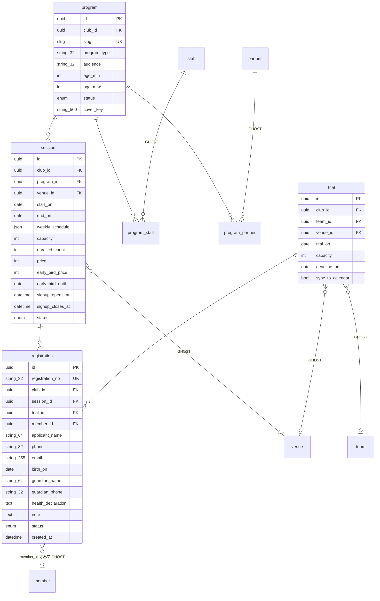
```mermaid
erDiagram
  program ||--o{ session : ""
  program ||--o{ program_staff : ""
  program ||--o{ program_partner : ""
  staff ||--o{ program_staff : "GHOST"
  partner ||--o{ program_partner : "GHOST"
  session ||--o{ registration : ""
  session }o--o| venue : "GHOST"
  trial ||--o{ registration : ""
  trial }o--o| venue : "GHOST"
  trial }o--o| team : "GHOST"
  registration }o..o| member : "member_id 可為空 GHOST"
  program {
    uuid id PK
    uuid club_id FK
    slug slug UK
    string_32 program_type
    string_32 audience
    int age_min
    int age_max
    enum status
    string_500 cover_key
  }
  session {
    uuid id PK
    uuid club_id FK
    uuid program_id FK
    uuid venue_id FK
    date start_on
    date end_on
    json weekly_schedule
    int capacity
    int enrolled_count
    int price
    int early_bird_price
    date early_bird_until
    datetime signup_opens_at
    datetime signup_closes_at
    enum status
  }
  registration {
    uuid id PK
    string_32 registration_no UK
    uuid club_id FK
    uuid session_id FK
    uuid trial_id FK
    uuid member_id FK
    string_64 applicant_name
    string_32 phone
    string_255 email
    date birth_on
    string_64 guardian_name
    string_32 guardian_phone
    text health_declaration
    text note
    enum status
    datetime created_at
  }
  trial {
    uuid id PK
    uuid club_id FK
    uuid team_id FK
    uuid venue_id FK
    date trial_on
    int capacity
    date deadline_on
    bool sync_to_calendar
  }
```

> ⚠️ **`registration.member_id` 可為空**——非會員仍可報名（v2.5，行 1257）。**這條不得更動。**
> ⚠️ **繳費線下**：`registration` 沒有金流欄位，狀態走 `待確認→已確認→已繳費→完成／取消／候補`，`已繳費` 由後台人工標記。
> ⚠️ `registration` 同時服務 `session` 與 `trial`，兩個外鍵**恰有一個非空**。

### 5.4b G 表單與詢問

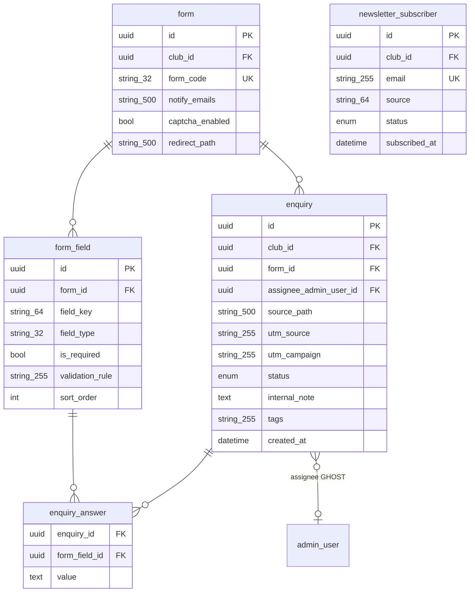
```mermaid
erDiagram
  form ||--o{ form_field : ""
  form ||--o{ enquiry : ""
  enquiry ||--o{ enquiry_answer : ""
  form_field ||--o{ enquiry_answer : ""
  enquiry }o--o| admin_user : "assignee GHOST"
  form {
    uuid id PK
    uuid club_id FK
    string_32 form_code UK
    string_500 notify_emails
    bool captcha_enabled
    string_500 redirect_path
  }
  form_field {
    uuid id PK
    uuid form_id FK
    string_64 field_key
    string_32 field_type
    bool is_required
    string_255 validation_rule
    int sort_order
  }
  enquiry {
    uuid id PK
    uuid club_id FK
    uuid form_id FK
    uuid assignee_admin_user_id FK
    string_500 source_path
    string_255 utm_source
    string_255 utm_campaign
    enum status
    text internal_note
    string_255 tags
    datetime created_at
  }
  enquiry_answer {
    uuid enquiry_id FK
    uuid form_field_id FK
    text value
  }
  newsletter_subscriber {
    uuid id PK
    uuid club_id FK
    string_255 email UK
    string_64 source
    enum status
    datetime subscribed_at
  }
```

> `enquiry` 涵蓋 **7 類表單 ＋ 提案下載 ＋ 捐助洽詢**（規劃書 §5）。**提案下載的 Lead 名單就是 `form_code = 'proposal_download'` 的 `enquiry`**，不另建表。
> ⚠️ **沒有志工報名表**（v2.1 移出）。
> 🔵 **S0-3d 新增 `enquiry.tags`**（行 1150：「指派負責人、內部備註、標籤」）：與「指派負責人」「內部備註」並列，屬**內部**分類用途（後台篩選），非前台顯示文字，故留在主表、不走 i18n 側表——與 `Product.tags`（前台可見的商品分類文案，見 `docs/12c` §3.11）性質不同。

### 5.5 E 商業模組 ＋ 五種商業對象的邊界

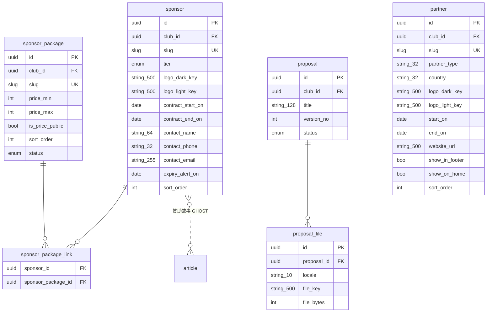
```mermaid
erDiagram
  sponsor ||--o{ sponsor_package_link : ""
  sponsor_package ||--o{ sponsor_package_link : ""
  proposal ||--o{ proposal_file : ""
  sponsor }o..o{ article : "贊助故事 GHOST"
  partner {
    uuid id PK
    uuid club_id FK
    slug slug UK
    string_32 partner_type
    string_32 country
    string_500 logo_dark_key
    string_500 logo_light_key
    date start_on
    date end_on
    string_500 website_url
    bool show_in_footer
    bool show_on_home
    int sort_order
  }
  sponsor {
    uuid id PK
    uuid club_id FK
    slug slug UK
    enum tier
    string_500 logo_dark_key
    string_500 logo_light_key
    date contract_start_on
    date contract_end_on
    string_64 contact_name
    string_32 contact_phone
    string_255 contact_email
    date expiry_alert_on
    int sort_order
  }
  sponsor_package {
    uuid id PK
    uuid club_id FK
    slug slug UK
    int price_min
    int price_max
    bool is_price_public
    int sort_order
    enum status
  }
  sponsor_package_link {
    uuid sponsor_id FK
    uuid sponsor_package_id FK
  }
  proposal {
    uuid id PK
    uuid club_id FK
    string_128 title
    int version_no
    enum status
  }
  proposal_file {
    uuid id PK
    uuid proposal_id FK
    string_10 locale
    string_500 file_key
    int file_bytes
  }
```

**五種商業對象：五張表，彼此零外鍵**

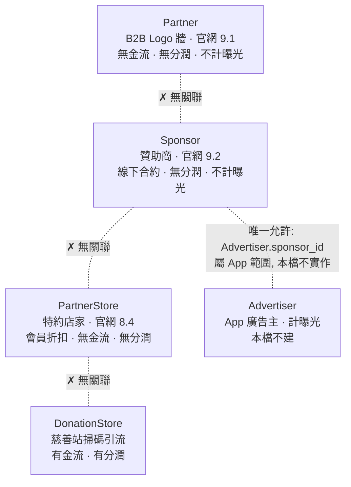
```mermaid
flowchart TB
  P["Partner<br/>B2B Logo 牆 · 官網 9.1<br/>無金流 · 無分潤 · 不計曝光"]
  S["Sponsor<br/>贊助商 · 官網 9.2<br/>線下合約 · 無分潤 · 不計曝光"]
  PS["PartnerStore<br/>特約店家 · 官網 8.4<br/>會員折扣 · 無金流 · 無分潤"]
  DS["DonationStore<br/>慈善站掃碼引流<br/>有金流 · 有分潤"]
  AD["Advertiser<br/>App 廣告主 · 計曝光<br/>本檔不建"]
  P -. "✗ 無關聯" .- S
  S -. "✗ 無關聯" .- PS
  PS -. "✗ 無關聯" .- DS
  S -. "唯一允許: Advertiser.sponsor_id<br/>屬 App 範圍, 本檔不實作" .- AD
```

> ⚠️ **同一家實體公司可能同時是數種，各建一筆、不共用紀錄。** 後台介面也必須把名稱分清楚（慈善站 §6.1 明訂）。
> ⚠️ **贊助商 Logo 牆不計曝光、不進廣告報表。**

### 5.5b F 文化模組 — 漫畫

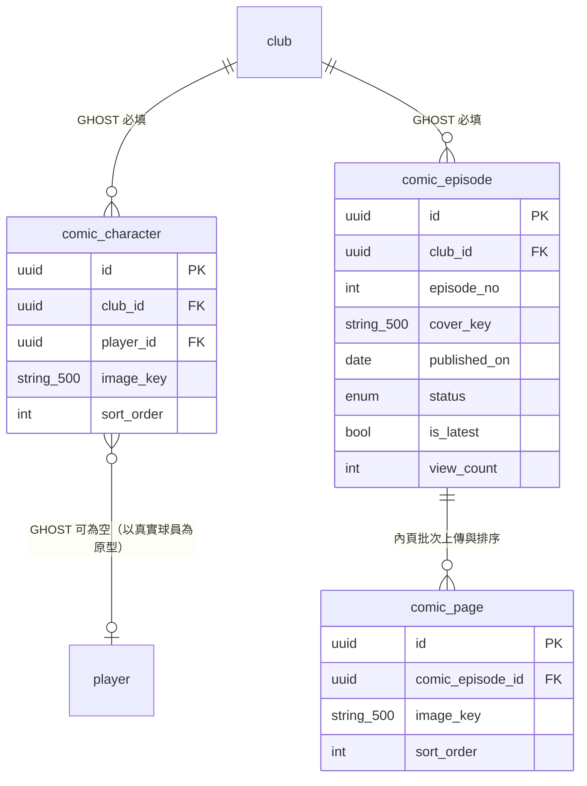
```mermaid
erDiagram
  club ||--o{ comic_character : "GHOST 必填"
  club ||--o{ comic_episode : "GHOST 必填"
  comic_episode ||--o{ comic_page : "內頁批次上傳與排序"
  comic_character }o--o| player : "GHOST 可為空（以真實球員為原型）"
  comic_character {
    uuid id PK
    uuid club_id FK
    uuid player_id FK
    string_500 image_key
    int sort_order
  }
  comic_episode {
    uuid id PK
    uuid club_id FK
    int episode_no
    string_500 cover_key
    date published_on
    enum status
    bool is_latest
    int view_count
  }
  comic_page {
    uuid id PK
    uuid comic_episode_id FK
    string_500 image_key
    int sort_order
  }
```

> ⚠️ **漫畫全部免費公開、不設付費牆、不需登入**——**沒有任何權限或購買欄位**。
> ⚠️ **`is_latest` 是自動判定不是人工勾選**（主站 §4.6 F1）。
> ⚠️ `comic_character.player_id` **可為空**——角色不一定對應真實球員。
> ⚠️ **8.1 About 的世界觀說明頁是 `Page` 不是漫畫表**。
> ⚠️ `comic_page` **不帶 `club_id`**，由 `comic_episode` 推導（§5.4 判定準則）。
> 🔵 角色名與設定、集數標題走 `*_i18n` 側表，**不入圖**。

---

### 5.6 K 會員、會籍與特約店家

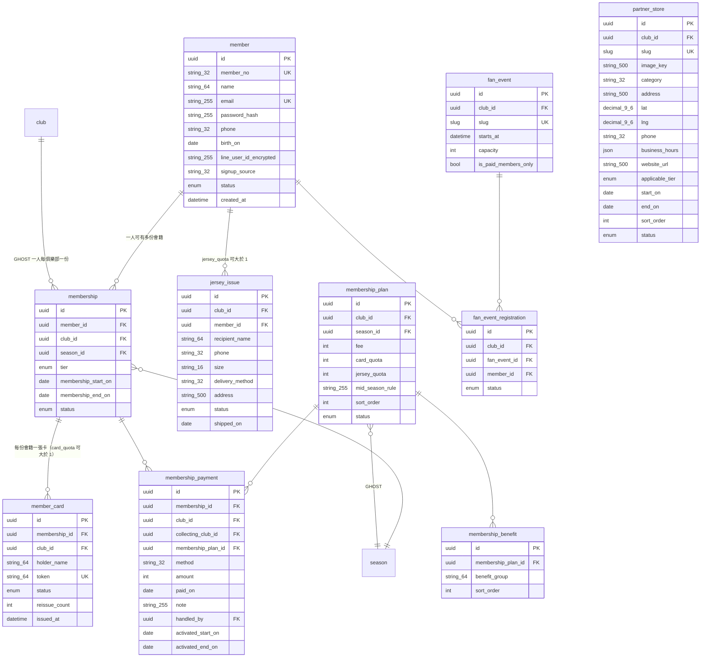
```mermaid
erDiagram
  club ||--o{ membership : "GHOST 一人每俱樂部一份"
  member ||--o{ membership : "一人可有多份會籍"
  membership ||--o{ member_card : "每份會籍一張卡（card_quota 可大於 1）"
  membership ||--o{ membership_payment : ""
  member ||--o{ jersey_issue : "jersey_quota 可大於 1"
  membership_plan ||--o{ membership_payment : ""
  membership_plan ||--o{ membership_benefit : ""
  membership_plan }o--|| season : "GHOST"
  membership }o--|| season : ""
  member ||--o{ fan_event_registration : ""
  fan_event ||--o{ fan_event_registration : ""
  member {
    uuid id PK
    string_32 member_no UK
    string_64 name
    string_255 email UK
    string_255 password_hash
    string_32 phone
    date birth_on
    string_255 line_user_id_encrypted
    string_32 signup_source
    enum status
    datetime created_at
  }
  membership {
    uuid id PK
    uuid member_id FK
    uuid club_id FK
    uuid season_id FK
    enum tier
    date membership_start_on
    date membership_end_on
    enum status
  }
  member_card {
    uuid id PK
    uuid membership_id FK
    uuid club_id FK
    string_64 holder_name
    string_64 token UK
    enum status
    int reissue_count
    datetime issued_at
  }
  membership_plan {
    uuid id PK
    uuid club_id FK
    uuid season_id FK
    int fee
    int card_quota
    int jersey_quota
    string_255 mid_season_rule
    int sort_order
    enum status
  }
  membership_payment {
    uuid id PK
    uuid membership_id FK
    uuid club_id FK
    uuid collecting_club_id FK
    uuid membership_plan_id FK
    string_32 method
    int amount
    date paid_on
    string_255 note
    uuid handled_by FK
    date activated_start_on
    date activated_end_on
  }
  membership_benefit {
    uuid id PK
    uuid membership_plan_id FK
    string_64 benefit_group
    int sort_order
  }
  jersey_issue {
    uuid id PK
    uuid club_id FK
    uuid member_id FK
    string_64 recipient_name
    string_32 phone
    string_16 size
    string_32 delivery_method
    string_500 address
    enum status
    date shipped_on
  }
  partner_store {
    uuid id PK
    uuid club_id FK
    slug slug UK
    string_500 image_key
    string_32 category
    string_500 address
    decimal_9_6 lat
    decimal_9_6 lng
    string_32 phone
    json business_hours
    string_500 website_url
    enum applicable_tier
    date start_on
    date end_on
    int sort_order
    enum status
  }
  fan_event {
    uuid id PK
    uuid club_id FK
    slug slug UK
    datetime starts_at
    int capacity
    bool is_paid_members_only
  }
  fan_event_registration {
    uuid id PK
    uuid club_id FK
    uuid fan_event_id FK
    uuid member_id FK
    enum status
  }
```

> ⚠️ **`member_card` 的 `token` 只有一組**：官網驗證頁與 App 內卡片**共用同一 token**。發兩組等於兩份可撤銷狀態，撤銷必然漏一邊。token **不可由 `member_no` 推導**。
> 🔴 **`tier`／`membership_start_on`／`membership_end_on` 在 `membership` 上，不在 `member` 上**（v3.0）。看到還畫在 `member` 的是舊規格。
> 🔴 **`member` 不帶 `club_id`**——Email 是登入鍵、LINE 綁定 1:1、個資法上的當事人是「人」不是「會籍」。俱樂部維度在 `membership`。
> 🔴 **每份會籍一張卡**：持兩隊會籍者有兩張卡，各帶該俱樂部標誌與品牌色。`member_card.membership_id` **必填**。
> ⚠️ **付費會員＝球迷會員**（`membership.tier = 'fan_club'`），**不是兩種身分**，球迷會不另建名單。
> ⚠️ **`membership_payment.collecting_club_id` 是收款法人**——藍鯨會籍採代收代付，收款方仍是俱樂部；**系統不做分潤計算**。
> ⚠️ **家庭會籍只是 `card_quota`／`jersey_quota` 不同，不建立學員綁定關係**——網頁、App、後台三方皆不做。
> ⚠️ **`partner_store.club_id` 可為空＝兩隊共同**（適用範圍可設單一俱樂部或兩隊共同，主站 §3.14）；`membership_benefit` **不帶 `club_id`**，由父表 `membership_plan` 推導。
> ⚠️ `partner_store` **與 `product` 是完全不同的東西**：前者是會員到店出示卡片的折扣店家（**無金流**），後者是本站自己賣的商品（**有金流**）。

### 5.7 K5 抽獎（刻意單獨一張——重點是「沒有連線」）

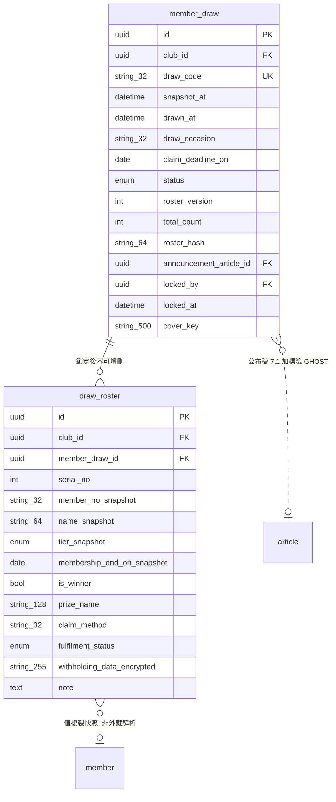
```mermaid
erDiagram
  member_draw ||--o{ draw_roster : "鎖定後不可增刪"
  member_draw }o..o| article : "公布稿 7.1 加標籤 GHOST"
  draw_roster }o..o| member : "值複製快照, 非外鍵解析"
  member_draw {
    uuid id PK
    uuid club_id FK
    string_32 draw_code UK
    datetime snapshot_at
    datetime drawn_at
    string_32 draw_occasion
    date claim_deadline_on
    enum status
    int roster_version
    int total_count
    string_64 roster_hash
    uuid announcement_article_id FK
    uuid locked_by FK
    datetime locked_at
    string_500 cover_key
  }
  draw_roster {
    uuid id PK
    uuid club_id FK
    uuid member_draw_id FK
    int serial_no
    string_32 member_no_snapshot
    string_64 name_snapshot
    enum tier_snapshot
    date membership_end_on_snapshot
    bool is_winner
    string_128 prize_name
    string_32 claim_method
    enum fulfilment_status
    string_255 withholding_data_encrypted
    text note
  }
```

> ⚠️ **`draw_roster` 對 `member` 是虛線**——值複製快照，**不是外鍵解析**。會員日後改名、合併帳號或刪除帳號，**都不得改動已鎖定的名單**。不要「優化」成即時 query，那會讓開獎失去稽核能力，也無法穩定配發序號。
> ⚠️ **`serial_no` 於 `snapshot_at` 依 `member_no` 升冪一次性配發，一人一號**。鎖定後不得重排；有誤只能**整份作廢重產**（`roster_version` +1，舊版保留）。
> ⚠️ **沒有 `DrawEntry`／`Ticket`／`Point`／`Weight`**——抽獎資格是會籍算出來的布林值，不因消費／簽到／分享／參加次數增加機會。
> ⚠️ **系統不抽出**：`is_winner` 由後台人工回填，實體開獎在現場或直播進行。
> ⚠️ **中獎只以最新消息公布**（遮罩），**不發中獎通知信**——`email_log` 不因抽獎新增類型。
> ⚠️ 刪帳號時 `draw_roster` **只保留 `member_no_snapshot` 與遮罩姓名**，其餘個資清除，**列不刪**。

### 5.8 S 商店 — 商品、庫存與購物車

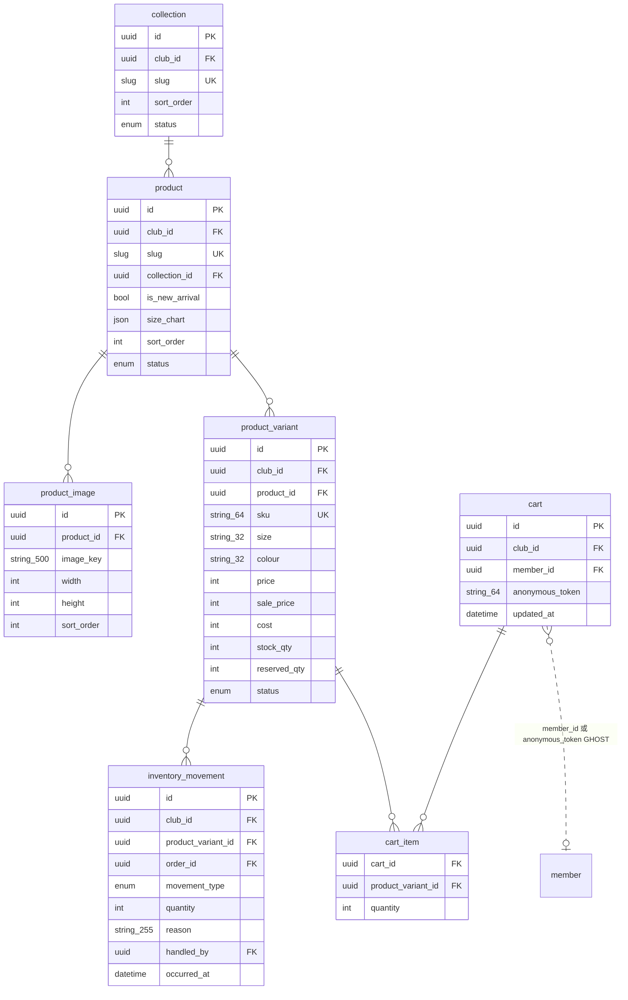
```mermaid
erDiagram
  collection ||--o{ product : ""
  product ||--o{ product_image : ""
  product ||--o{ product_variant : ""
  product_variant ||--o{ inventory_movement : ""
  product_variant ||--o{ cart_item : ""
  cart ||--o{ cart_item : ""
  cart }o..o| member : "member_id 或 anonymous_token GHOST"
  collection {
    uuid id PK
    uuid club_id FK
    slug slug UK
    int sort_order
    enum status
  }
  product {
    uuid id PK
    uuid club_id FK
    slug slug UK
    uuid collection_id FK
    bool is_new_arrival
    json size_chart
    int sort_order
    enum status
  }
  product_image {
    uuid id PK
    uuid product_id FK
    string_500 image_key
    int width
    int height
    int sort_order
  }
  product_variant {
    uuid id PK
    uuid club_id FK
    uuid product_id FK
    string_64 sku UK
    string_32 size
    string_32 colour
    int price
    int sale_price
    int cost
    int stock_qty
    int reserved_qty
    enum status
  }
  inventory_movement {
    uuid id PK
    uuid club_id FK
    uuid product_variant_id FK
    uuid order_id FK
    enum movement_type
    int quantity
    string_255 reason
    uuid handled_by FK
    datetime occurred_at
  }
  cart {
    uuid id PK
    uuid club_id FK
    uuid member_id FK
    string_64 anonymous_token
    datetime updated_at
  }
  cart_item {
    uuid cart_id FK
    uuid product_variant_id FK
    int quantity
  }
```

> ⚠️ **`product_variant` 沒有 `member_price`**——v2.6 定案不做會員價與折扣碼，付費會籍權益不含商品折扣。
> ⚠️ `cost` 是**受限欄位**（僅特定角色可見）。
> ⚠️ `reserved_qty` 是下單預留：付款失敗或逾時自動釋回，取消或退貨回補。**`inventory_movement` 是功能單元不是日誌**，不在移除範圍。

### 5.8b S 商店 — 訂單、出貨、退款與發票

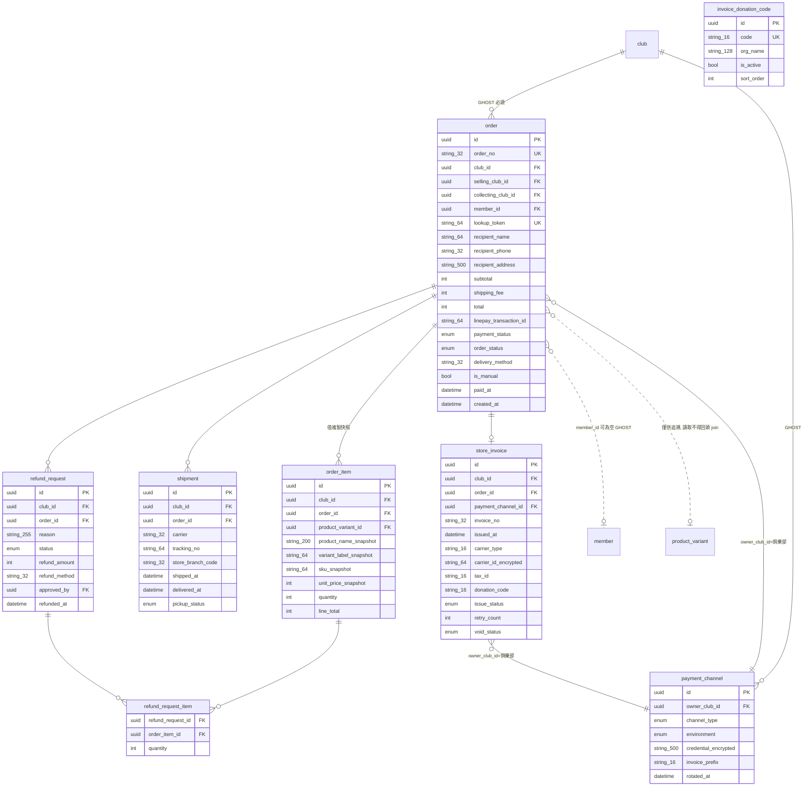
```mermaid
erDiagram
  order ||--o{ order_item : "值複製快照"
  order ||--o{ shipment : ""
  order ||--o{ refund_request : ""
  order ||--o| store_invoice : ""
  refund_request ||--o{ refund_request_item : ""
  order_item ||--o{ refund_request_item : ""
  order }o..o| member : "member_id 可為空 GHOST"
  order }o..o| product_variant : "僅供追溯, 讀取不得回頭 join"
  store_invoice }o--|| payment_channel : "owner_club_id=俱樂部"
  order }o--|| payment_channel : "owner_club_id=俱樂部"
  club ||--o{ order : "GHOST 必填"
  club ||--o{ payment_channel : "GHOST"
  order {
    uuid id PK
    string_32 order_no UK
    uuid club_id FK
    uuid selling_club_id FK
    uuid collecting_club_id FK
    uuid member_id FK
    string_64 lookup_token UK
    string_64 recipient_name
    string_32 recipient_phone
    string_500 recipient_address
    int subtotal
    int shipping_fee
    int total
    string_64 linepay_transaction_id
    enum payment_status
    enum order_status
    string_32 delivery_method
    bool is_manual
    datetime paid_at
    datetime created_at
  }
  order_item {
    uuid id PK
    uuid club_id FK
    uuid order_id FK
    uuid product_variant_id FK
    string_200 product_name_snapshot
    string_64 variant_label_snapshot
    string_64 sku_snapshot
    int unit_price_snapshot
    int quantity
    int line_total
  }
  shipment {
    uuid id PK
    uuid club_id FK
    uuid order_id FK
    string_32 carrier
    string_64 tracking_no
    string_32 store_branch_code
    datetime shipped_at
    datetime delivered_at
    enum pickup_status
  }
  refund_request {
    uuid id PK
    uuid club_id FK
    uuid order_id FK
    string_255 reason
    enum status
    int refund_amount
    string_32 refund_method
    uuid approved_by FK
    datetime refunded_at
  }
  refund_request_item {
    uuid refund_request_id FK
    uuid order_item_id FK
    int quantity
  }
  store_invoice {
    uuid id PK
    uuid club_id FK
    uuid order_id FK
    uuid payment_channel_id FK
    string_32 invoice_no
    datetime issued_at
    string_16 carrier_type
    string_64 carrier_id_encrypted
    string_16 tax_id
    string_16 donation_code
    enum issue_status
    int retry_count
    enum void_status
  }
  invoice_donation_code {
    uuid id PK
    string_16 code UK
    string_128 org_name
    bool is_active
    int sort_order
  }
  payment_channel {
    uuid id PK
    uuid owner_club_id FK
    enum channel_type
    enum environment
    string_500 credential_encrypted
    string_16 invoice_prefix
    datetime rotated_at
  }
```

> ⚠️ **`order_item` 是值複製快照**：`product_name_snapshot`／`variant_label_snapshot`／`unit_price_snapshot` 在建單當下寫死。`product_variant_id` **僅供追溯，讀取訂單時不得回頭 join 取名稱與價格**——商品改名或改價**不得改動歷史訂單**，否則對帳與客訴舉證失去依據。
> ⚠️ **`order.member_id` 可為空**——非會員能結帳。報表統計**不得用 inner join**。
> ⚠️ **付款只有 LINE Pay**：沒有信用卡、超商代碼、ATM、貨到付款欄位；**不存卡號**。回呼須驗簽且冪等，未付款逾時取消並釋回庫存。
> ⚠️ **沒有 `discount_code`、`member_price`、`shipping_tier`**：單一固定運費 ＋ 免運門檻，設定放 `setting`。
> 🔴 **`payment_channel.owner_club_id`**（v3.0 取代原本的 `subject` enum），唯一鍵 `(owner_club_id, channel_type, environment)`。
> **主站只會有俱樂部一列**；協會的憑證在慈善獨立庫，**三方的 LINE Pay 商店號一律不得共用**。**填錯＝款項進錯法人**，同時踩稅務與《公益勸募條例》；發票字軌一併分離。
> 🔴 **`order.selling_club_id`（受益方）與 `collecting_club_id`（收款法人）**：藍鯨採**代收代付**，收款方仍是俱樂部。**系統不做分潤計算**，只記歸屬並提供加總匯出。
> 🔴 **`order_item`／`store_invoice` 的 `club_id` 值複製自 `order`，絕對不可為空**——快照凍結的包含歸屬。
> 🔴 **`cart.club_id` 必填，不得跨俱樂部混買**，切換站台即切換購物車。
> ⚠️ **「訂單是否於結帳時依俱樂部拆單」尚未定案**（`STATUS.md` B-8）。現行禁止混買故不會發生，**開放混買前必須先答**。
> ⚠️ **物流不串 API**：`shipment.tracking_no` 由人工或 CSV 回填。

### 5.9 B6 慈善內容（主站）

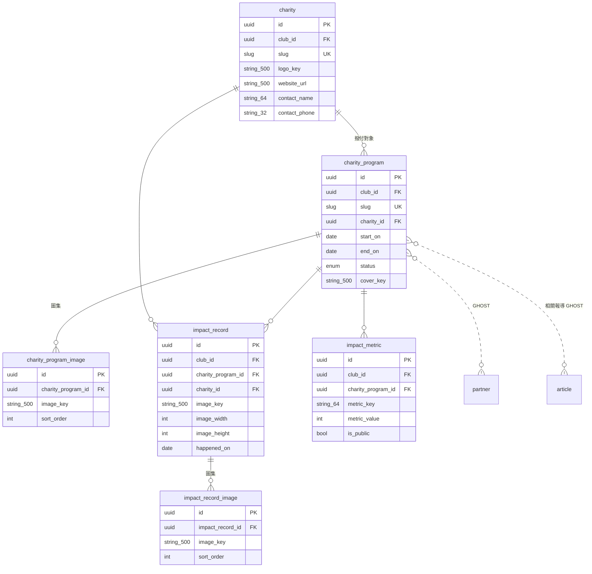
```mermaid
erDiagram
  charity ||--o{ charity_program : "撥付對象"
  charity_program ||--o{ charity_program_image : "圖集"
  charity_program ||--o{ impact_record : ""
  charity ||--o{ impact_record : ""
  impact_record ||--o{ impact_record_image : "圖集"
  charity_program ||--o{ impact_metric : ""
  charity_program }o..o{ partner : "GHOST"
  charity_program }o..o{ article : "相關報導 GHOST"
  charity {
    uuid id PK
    uuid club_id FK
    slug slug UK
    string_500 logo_key
    string_500 website_url
    string_64 contact_name
    string_32 contact_phone
  }
  charity_program_image {
    uuid id PK
    uuid charity_program_id FK
    string_500 image_key
    int sort_order
  }
  charity_program {
    uuid id PK
    uuid club_id FK
    slug slug UK
    uuid charity_id FK
    date start_on
    date end_on
    enum status
    string_500 cover_key
  }
  impact_record {
    uuid id PK
    uuid club_id FK
    uuid charity_program_id FK
    uuid charity_id FK
    string_500 image_key
    int image_width
    int image_height
    date happened_on
  }
  impact_record_image {
    uuid id PK
    uuid impact_record_id FK
    string_500 image_key
    int sort_order
  }
  impact_metric {
    uuid id PK
    uuid club_id FK
    uuid charity_program_id FK
    string_64 metric_key
    int metric_value
    bool is_public
  }
```

> ⚠️ `impact_record` 的**三項核心資料必填**：公益團體名稱、捐助內容、活動圖片。
> ⚠️ **慈善金額預設不公開**（`impact_metric.is_public` 預設 `false`）。
> ⚠️ **主站不做站內捐款**——這四張表只做陳列，捐款走慈善捐款平台（[§5.10](#510-慈善捐款平台不在本檔)）。
> 🔴 **這四張是主檔留在主站**，慈善獨立庫只有唯讀快照；`club_id` **可為空＝兩隊共同**。
> ⚠️ **`charity_program` 有兩種圖片情境**（主站 §4.2 B5 行 1018）：單張 `cover_key`（封面）＋ 多張 `charity_program_image` 子表（圖集／§3.11 的「活動圖片藝廊」，兩處措辭不同指同一件事）。
> 多圖一律以子表承載、每列一組欄位加 `sort_order`，比照 `product_image`／`proposal_file`。
> 🔵 **S0-3d 新增 `impact_record_image`**：規劃書行 1025「活動圖片（可多張）」原本無子表承接。`impact_record` 主表既有的
> `image_key`／`image_width`／`image_height` 暫留作代表圖，比照 `charity_program` 的「封面＋圖集」雙軌模式；此為判斷（規劃書未明講兩者並存），待人工確認是否改為完全由子表取代。

### 5.10 慈善捐款平台（不在本檔）

🔴 慈善平台自 v2.0 起是**獨立後台與獨立資料庫**，其約 22 張表（8 張 `N` ＋ 約 14 張機制表）
與 ER 圖另出 [`16-charity-schema.md`](16-charity-schema.md)（`STATUS.md` S0-5）。

⚠️ **唯一的交界**是 [5.9](#59-b6-慈善內容主站) 的 `charity`／`charity_program`／`impact_record`／`impact_metric` 四張——
**主檔留在主站**，慈善庫只持有唯讀快照。**兩邊不同步時以主站為準、不得即時 join**（Azure SQL 不支援跨庫查詢）。

### 5.11 J 系統管理與共通機制

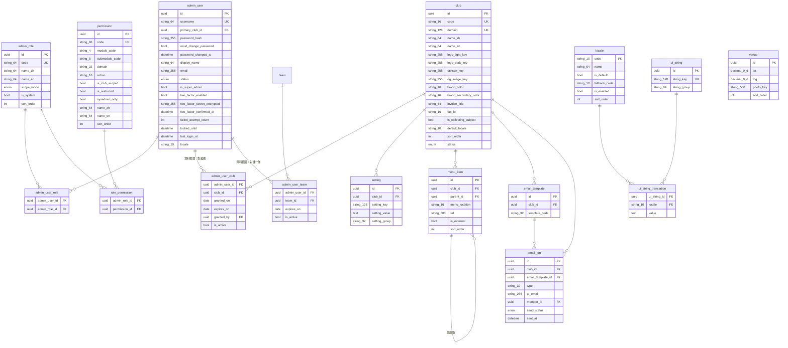
```mermaid
erDiagram
  admin_user ||--o{ admin_user_role : ""
  admin_role ||--o{ admin_user_role : ""
  admin_role ||--o{ role_permission : ""
  permission ||--o{ role_permission : ""
  admin_user ||--o{ admin_user_club : "資料範圍：對誰做"
  club ||--o{ admin_user_club : ""
  admin_user ||--o{ admin_user_team : "資料範圍：對哪一隊"
  team ||--o{ admin_user_team : ""
  club ||--o{ setting : ""
  club ||--o{ menu_item : ""
  club ||--o{ email_template : ""
  club ||--o{ email_log : ""
  locale ||--o{ ui_string_translation : ""
  ui_string ||--o{ ui_string_translation : ""
  menu_item ||--o{ menu_item : "多層級"
  email_template ||--o{ email_log : ""
  club {
    uuid id PK
    string_16 code UK
    string_128 domain UK
    string_64 name_zh
    string_64 name_en
    string_255 logo_light_key
    string_255 logo_dark_key
    string_255 favicon_key
    string_255 og_image_key
    string_16 brand_color
    string_16 brand_secondary_color
    string_64 invoice_title
    string_16 tax_id
    bool is_collecting_subject
    string_10 default_locale
    int sort_order
    enum status
  }
  admin_user {
    uuid id PK
    string_64 username UK
    uuid primary_club_id FK
    string_255 password_hash
    bool must_change_password
    datetime password_changed_at
    string_64 display_name
    string_255 email
    enum status
    bool is_super_admin
    bool two_factor_enabled
    string_255 two_factor_secret_encrypted
    datetime two_factor_confirmed_at
    int failed_attempt_count
    datetime locked_until
    datetime last_login_at
    string_10 locale
  }
  admin_role {
    uuid id PK
    string_64 code UK
    string_64 name_zh
    string_64 name_en
    enum scope_mode
    bool is_system
    int sort_order
  }
  admin_user_club {
    uuid admin_user_id FK
    uuid club_id FK
    date granted_on
    date expires_on
    uuid granted_by FK
    bool is_active
  }
  admin_user_team {
    uuid admin_user_id FK
    uuid team_id FK
    date expires_on
    bool is_active
  }
  admin_user_role {
    uuid admin_user_id FK
    uuid admin_role_id FK
  }
  permission {
    uuid id PK
    string_96 code UK
    string_4 module_code
    string_8 submodule_code
    string_32 domain
    string_16 action
    bool is_club_scoped
    bool is_restricted
    bool sysadmin_only
    string_64 name_zh
    string_64 name_en
    int sort_order
  }
  role_permission {
    uuid admin_role_id FK
    uuid permission_id FK
  }
  locale {
    string_10 code PK
    string_64 name
    bool is_default
    string_10 fallback_code
    bool is_enabled
    int sort_order
  }
  ui_string {
    uuid id PK
    string_128 string_key UK
    string_64 string_group
  }
  ui_string_translation {
    uuid ui_string_id FK
    string_10 locale FK
    text value
  }
  venue {
    uuid id PK
    decimal_9_6 lat
    decimal_9_6 lng
    string_500 photo_key
    int sort_order
  }
  menu_item {
    uuid id PK
    uuid club_id FK
    uuid parent_id FK
    string_16 menu_location
    string_500 url
    bool is_external
    int sort_order
  }
  setting {
    uuid id PK
    uuid club_id FK
    string_128 setting_key
    text setting_value
    string_32 setting_group
  }
  email_template {
    uuid id PK
    uuid club_id FK
    string_32 template_code
  }
  email_log {
    uuid id PK
    uuid club_id FK
    uuid email_template_id FK
    string_32 type
    string_255 to_email
    uuid member_id FK
    enum send_status
    datetime sent_at
  }
```

> ⚠️ **`admin_user.username` 是唯一登入識別，`email` 不是。** `email` 只作系統通知與密碼重設，**不設唯一索引、不作登入查詢鍵**。
> ⚠️ **本圖沒有 `audit_log`、`login_log`、`export_log`** —— 見 [§13.1](12-database-schema.md#131-沒有稽核與登入日誌表)。`failed_attempt_count`／`locked_until`／`last_login_at` 是**狀態欄位不是日誌表**。
> ⚠️ **`email_log` 是功能單元**（後台要查信寄出去了沒），`type` 值域 **9 個**（會員 5 ＋ 商店 4）。
> 🔴 **「能做什麼」與「對誰做」拆開**（v3.0）：能做什麼＝`admin_role` → `role_permission` → `permission`；
> **對誰做＝ `admin_user_club`／`admin_user_team`，掛在「人」不掛在「角色」**——掛角色的話每多一個俱樂部就要複製九個角色。
> 🔴 **`role_permission.scope_value json` 已刪除**——資料範圍需要能被查詢，`json` 的「只存不查」紀律做不到。
> 🔴 **`admin_user.primary_club_id` 只是站台切換器的預設值，不是資料範圍。**
> 🔴 **資料範圍必須在資料存取層強制**，介面隱藏不算數——擋不住直接呼叫端點與匯出。`expires_on` **到期自動失效，不需人工回收**。
> ⚠️ `club_id` 為空的列（共同內容）對 `scope_mode = own_clubs` 的帳號**一律唯讀**，只有超管能建立與修改。

### 5.12 i18n 機制示例

其餘約 40 張 `*_i18n` 側表**結構形狀相同**（複合主鍵 `(<entity>_id, locale)` ＋ 內容欄位），**不再入圖**。
🔴 **但「形狀相同」不等於「欄位相同」**——每張側表各自放哪些內容欄位，**目前只有 8 張寫明**
（`article`／`faq`／`match`／`member_draw`／`membership_benefit`／`partner`／`sponsor`／`setting`）。
**其餘約 38 張的欄位清單尚未定義，轉 DDL 前必須補**（`STATUS.md` **S0-3b**）。

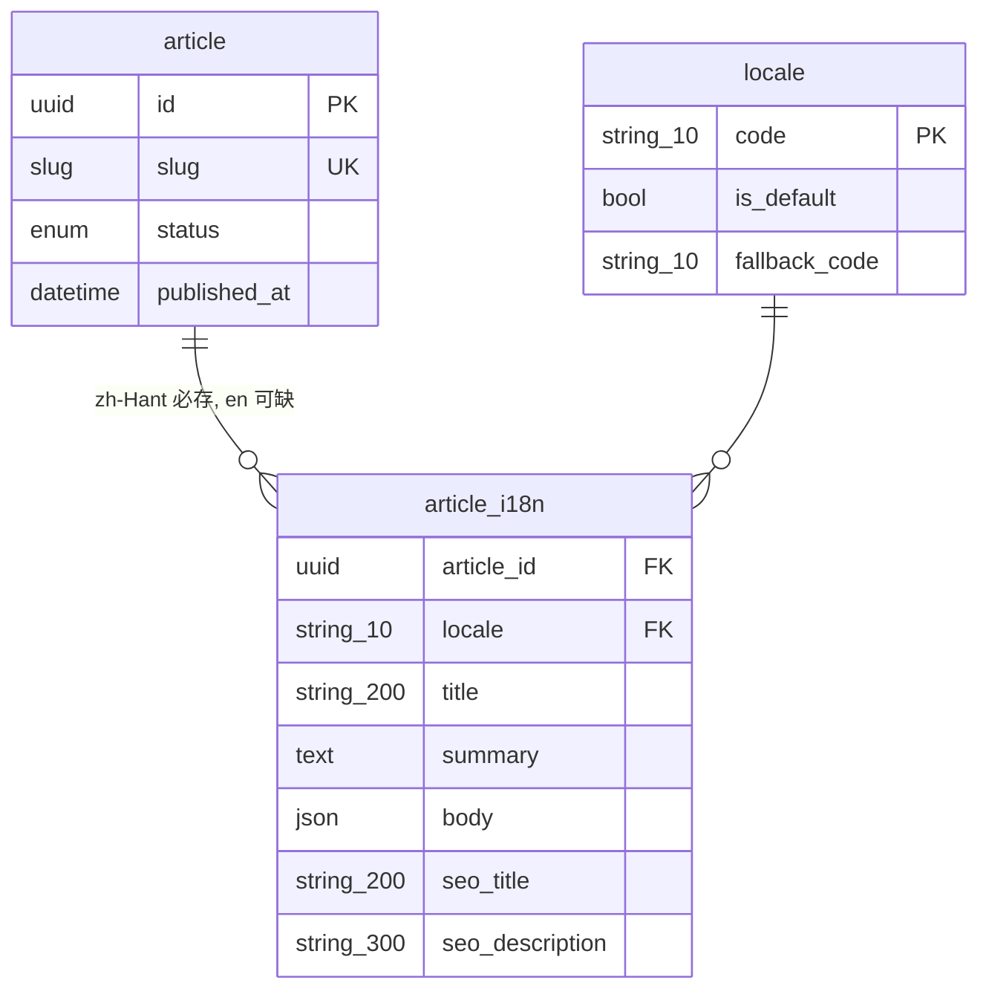
```mermaid
erDiagram
  article ||--o{ article_i18n : "zh-Hant 必存, en 可缺"
  locale ||--o{ article_i18n : ""
  article {
    uuid id PK
    slug slug UK
    enum status
    datetime published_at
  }
  article_i18n {
    uuid article_id FK
    string_10 locale FK
    string_200 title
    text summary
    json body
    string_200 seo_title
    string_300 seo_description
  }
  locale {
    string_10 code PK
    bool is_default
    string_10 fallback_code
  }
```

---
