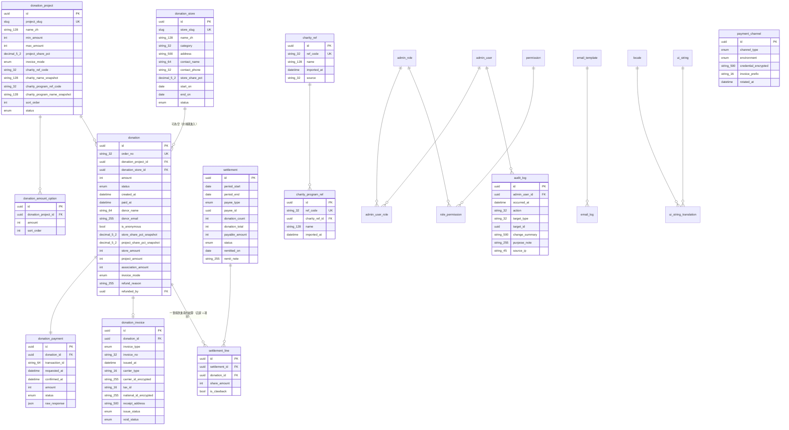

# 16 — 慈善捐款平台資料表綱要

> 🔵 **獨立系統、獨立資料庫。** 慈善平台自 v2.0 起是獨立網域、獨立前台、獨立後台、**獨立資料庫**，
> **主辦與收款主體是台灣足球策略發展協會，不是台中磐石足球俱樂部**。
> 本檔與 [`12-database-schema.md`](12-database-schema.md) **平行且互不包含**——主站綱要明文不含這裡的任何一張表。
>
> 來源：[`../output/TCRFC_慈善捐款平台功能規劃書.md`](../output/TCRFC_慈善捐款平台功能規劃書.md)（**v2.5，共 806 行**）。
> 功能看 [`10-charity-donation-site.md`](10-charity-donation-site.md)；部署與快取看 [`17-deployment.md`](17-deployment.md)。
> 本檔是導航層，不得新增規劃書沒有的規格。
>
> ⚠️ **`docs/12` 的慣例不是全部都適用**——四項刻意的差異列在 [§9](#9-與主站綱要的四項差異)。

---

## 0. 一分鐘理解

| 項目 | 決定 |
|---|---|
| 資料庫 | **`sqldb-charity`，與 `sqldb-club` 完全獨立**（Azure SQL，各自單庫） |
| 表數 | **23 張** ＋ 4 張 `*_i18n` 側表 |
| 租戶維度 | **沒有 `club_id`**——單一法人，不是多俱樂部架構 |
| 會員 | **沒有 `Member`**——捐款人不登入不註冊，只填姓名與 Email |
| 稽核 | 🔴 **有 `AuditLog`**（與主站相反，理由見 [§9](#9-與主站綱要的四項差異)） |
| 快取 | 🔴 **完全不接 Redis**（[`14-invariants.md`](14-invariants.md)） |
| 金額 | `int` 存「元」；百分比 `decimal(5,2)`。**分潤無條件捨去至整數元** |
| 主鍵 | `id uniqueidentifier` **非叢集** ＋ 另一欄 `bigint IDENTITY` 當叢集鍵（同主站，理由見 [`12` §1.2](12-database-schema.md#12-主鍵外鍵與命名慣例)） |
| **共通欄位** | 🔴 **沿用 [`12` §1.3](12-database-schema.md#13-共通欄位)**：所有實體表都有 `id`／`created_at`／`updated_at`／`created_by`／`updated_by`。**本庫有 `AuditLog` 不代表可以省略這四欄**——稽核記的是「發生過什麼動作」，共通欄位記的是「這一列現在的歸屬與時間」，兩者用途不同 |
| **命名與型別慣例** | 沿用 [`12` §1.2](12-database-schema.md#12-主鍵外鍵與命名慣例)（表名、欄位名、外鍵命名）與 §1.3 的金額規則 |

> ⚠️ **三類表不套共通欄位**——判準是**結構**不是名稱：
>
> | 類型 | 表 | 為什麼 |
> |---|---|---|
> | **純關聯表** | `AdminUserRole`、`RolePermission` | 複合主鍵即足，沒有自己的生命週期 |
> | **翻譯側表** | 四張 `*_i18n` **＋ `UiStringTranslation`** | 形狀同 [`12` §2.2](12-database-schema.md#22-側表形狀) 的 `article_i18n`——複合主鍵 ＋ 內容欄位，**主站的側表也沒有這四欄**。`UiStringTranslation` 雖然列在 §2.5 的共通機制，但它**結構上就是側表** |
> | 🔴 **`AuditLog`** | | **稽核紀錄是 append-only**。有 `updated_at`／`updated_by` 等於宣告稽核可以被改，**軌跡就失去意義**——而它正是勸募法遵要求的東西。另外 `created_at` 與 `occurred_at`、`created_by` 與 `admin_user_id` 語意重複 |
>
> **`Locale` 以 `code` 為自然鍵**（所有側表的 `locale` 欄直接指向它），不另設 `uuid` 主鍵。

---

## 1. 與主站的邊界

**主站的 `Charity`／`CharityProgram`／`ImpactRecord`／`ImpactMetric` 四張是主檔，留在主站。**
本平台只持有**唯讀複本**，用於 N2 選撥付對象、以及把名稱印在對帳單與收據上。

🔴 **跨系統參照的三條規則**（慈善規劃書 §9.3）：

1. **主站是公益團體與慈善計畫的唯一主檔。** 本平台的 `*_name_snapshot` 是唯讀複本，兩邊不同步時一律以主站為準。**絕不可讓本平台成為第二個真實來源。**
2. **不得即時 join、不得同步查詢主站資料庫。** 本平台**不得持有主站資料庫的連線**。清單同步走 N2 後台的 CSV 匯入，或主站提供的唯讀 API 定期拉取。
   ⚠️ **Azure SQL 本身也不支援跨庫查詢**，這條在技術上是硬的（[`17` §6](17-deployment.md)）。
3. **快照是刻意的，不是妥協。** 撥付對象名稱要印在對帳單與捐贈收據上——那是已開立的憑證，**不得隨主站日後改名而變動**。

> ⚠️ **慈善規劃書 §9.3 表格最後一列寫「受贈的公益團體 → `Charity`（主站既有），本平台的項目撥付對象直接關聯它」，
> 與上面三條規則牴觸**（v2.0 已改為值複製快照，不是外鍵）。
> **以三條規則為準**；該列是 v1.x 殘留，已登記於 [§10](#10-本檔不決定的事)。

**五種商業對象不可混用**（[`14-invariants.md`](14-invariants.md)）：
`DonationStore`（本平台，掃碼引流，**有金流有分潤**）與 `PartnerStore`（主站 8.4，會員折扣，**無金流無分潤**）
**是兩張不同資料庫裡的不同表**。同一家店既引流又給會員折扣，**兩邊各建一筆，不共用紀錄、不建外鍵**。

---

## 2. 資料表總覽（23）

圖例：🌐 有 i18n 側表｜🔒 含受限或加密欄位｜📸 值複製快照，不可回頭 join。

### 2.1 `N` 捐款核心（8）

| 表 | 用途 | 標記 | 後台 |
|---|---|---|---|
| `DonationStore` | **捐款合作店家**：名稱、Logo、類別、地址、聯絡人與電話、合作起訖、狀態、**`store_share_pct`**、**`store_slug`**（全站唯一、**不可由編號推導**、可重產且舊 QR 立即失效） | 🌐 🔒 | N1 |
| `DonationProject` | **捐款項目**：名稱、封面、一句話說明、說明內文、款項用途、`project_slug`、最低／最高金額、**`project_share_pct`**、**`invoice_mode`**、上下架與排序、**撥付對象與慈善計畫的四個快照欄位** | 🌐 | N2 |
| `DonationAmountOption` | 金額選項卡 `(donation_project_id, amount, sort_order)` | | N2 |
| `Donation` | **捐款主檔**：`order_no`、金額、狀態、建立與付款時間、`donation_project_id`、`donation_store_id`（**可為空**）、捐款人姓名與 Email、具名／匿名、**分潤五欄快照**、發票欄位、退款原因與經辦人 | 🔒 📸 | N3 |
| `DonationPayment` | 金流交易：交易識別碼、請求與確認時間、金額、狀態、`raw_response json`（**只存不查**） | 🔒 | N3 |
| `DonationInvoice` | 發票／收據：類型、號碼、開立時間、載具或統編或收據資訊、狀態、作廢或折讓 | 🔒 📸 | N5 |
| `Settlement` | 結算單：期間、`payee_type`（`store`／`project`）、對象、筆數、捐款總額、應付金額、狀態、匯款登記 | | N4 |
| `SettlementLine` | 結算明細：逐筆捐款的分潤金額，**含退款沖回的負項** | 📸 | N4 |

### 2.2 主站主檔的唯讀複本（2）

| 表 | 用途 | 標記 |
|---|---|---|
| `CharityRef` | 受贈公益團體的**唯讀清單**：`ref_code`、名稱、匯入時間、來源 | 🔒 |
| `CharityProgramRef` | 慈善計畫的**唯讀清單**：`ref_code`、名稱、所屬 `CharityRef`、匯入時間 | |

> 🔴 **這兩張只供 N2 選撥付對象用，選定後把 `ref_code` 與名稱值複製進 `DonationProject`。**
> **不得從 `DonationProject` 外鍵指向它們**——否則清單重新匯入時會改動已開立憑證上的名稱。
> 🟡 **這兩張表是 §9.3 第 2 條「清單同步採 CSV 匯入或唯讀 API 拉取」的落地形式**，屬實作手段；
> 規劃書沒有把它們列為型別，**建表前請確認這個讀法**（[§10](#10-本檔不決定的事)）。

### 2.3 後台帳號與權限（5）

| 表 | 用途 | 標記 |
|---|---|---|
| `AdminUser` | 後台帳號。**`username` 是唯一登入識別不是 Email**；強制 2FA；密碼雜湊優先 Argon2id 次選 bcrypt | 🔒 |
| `AdminRole` | 角色。**沿用主站 §6 的九個角色**，`is_system = true` 的種子資料 | |
| `AdminUserRole` | `(admin_user_id, admin_role_id)`，多角色取聯集 | |
| `Permission` | 權限碼字典 ＋ `is_restricted`／`sysadmin_only` | |
| `RolePermission` | `(admin_role_id, permission_id)` | |

> 🔴 **沒有 `AdminUserClub`／`AdminUserTeam`**——本平台是單一法人，沒有資料範圍維度。
> 🔴 **`Permission` 與主站同形**（[`12b` §7.3](12b-database-tables.md#73-權限碼命名)）：保留 `module_code`／`submodule_code`／`domain`／`action` 四欄分解
> ——本庫的 `module_code` 是 `N`、`submodule_code` 是 `N1`–`N7`，有實際值域。
> **唯一不要的是 `is_club_scoped`**（沒有俱樂部維度）。
> 🔴 **這是另一套帳號**，與主站後台完全獨立、不共用表、不共用登入（[`17` §5](17-deployment.md)）。

### 2.4 稽核（1）

| 表 | 用途 | 標記 |
|---|---|---|
| `AuditLog` | **操作稽核**：操作者、時間、動作、對象型別與 id、變更摘要、用途備註、來源 IP | 🔒 |

> 🔴 **主站刻意沒有日誌表，本平台刻意有。** 慈善規劃書 §11.2 明訂
> **退款、分潤百分比設定、含個資的明細匯出三類操作全數留下稽核軌跡**，這是勸募法遵的要求不是可選項。
> 🔴 **`AuditLog` 是 append-only**：**不得有 `updated_at`／`updated_by`**，也不重複 `created_at`（用 `occurred_at`）與 `created_by`（用 `admin_user_id`）。
> 完整差異見 [§9](#9-與主站綱要的四項差異)。

### 2.5 共通機制（7）

| 表 | 用途 | 標記 |
|---|---|---|
| `Locale` | 啟用語系（`code`、名稱、是否預設、fallback、排序）。**加第三語系＝INSERT 一列** | |
| `UiString` | 介面字串鍵與所屬分組 | |
| `UiStringTranslation` | `(ui_string_id, locale) → value` | |
| `Setting` | 站台設定與文案（首頁說明、感謝語樣板、捐款須知、隱私權政策、金額上下限預設值、徵信名單顯示規則）；文案類另有 `setting_i18n` | 🌐 |
| `EmailTemplate` | 系統信樣板（**四封**） | 🌐 |
| `EmailLog` | 系統信寄送紀錄。**`type` 值域 4 個**——本平台自己的四封 | 🔒 |
| `PaymentChannel` | **協會**的 LINE Pay 與發票加值中心憑證：`channel_type`／`environment`／憑證（加密）／字軌／輪替時間 | 🔒 |

> 🔴 **`PaymentChannel` 這裡只有協會的憑證。** 俱樂部的在主站庫，**三方的 LINE Pay 商店號一律不得共用**——
> 收款主體錯誤會同時踩稅務與《公益勸募條例》。
> ⚠️ 正式環境須於商店管理後台登記**付款伺服器的出口 IP**，見 [`17` §3](17-deployment.md)。
> 🔴 **沒有 `subject` 欄也沒有 `owner_club_id`**——本庫只服務協會一個法人。

### 2.6 i18n 側表（4）

`donation_store_i18n`、`donation_project_i18n`、`setting_i18n`、`email_template_i18n`，
一律 `(<entity>_id, locale)` 唯一。**側表不計入 23 張。**

---

## 3. ER 圖

> ⚠️ **`admin_user`／`admin_role`／`permission` 等五張的欄位與主站同形，此處省略**——見 [`12b` §7](12b-database-tables.md#7-權限模型j-模組)。
> ⚠️ **i18n 側表不入圖**（同主站慣例），§2.6 才是權威清單。
> 🔴 **`donation` 對 `charity_ref` 沒有線**——項目的撥付對象是**值複製進 `donation_project` 的四個快照欄位**，不是外鍵。

---

## 4. 關鍵資料表明細

### 4.1 `Donation`

| 項目 | 規則 |
|---|---|
| 收款主體 | **協會**。發票與收據抬頭、系統信署名、對帳單一律為協會 |
| `donation_store_id` | **可為空**（非掃碼進入時）。為空時 `store_share_pct_snapshot = 0`，**仍能結算** |
| 分潤五欄 | `store_share_pct_snapshot`／`project_share_pct_snapshot`（`decimal(5,2)`）→ `store_amount`／`project_amount`／`association_amount`（`int`，元）。**無條件捨去至整數元**，三者相加須等於 `amount` |
| 約束 | `store_share_pct + project_share_pct <= 100`（N2 儲存時驗證，超過即擋下） |
| 捐款人 | 只有 `donor_name`／`donor_email`／`is_anonymous`。🔴 **不建帳號、不歸戶、不得有 `member_id` 外鍵** |
| 會員比對 | 僅以 Email **軟性比對**於 N3 查詢當下進行，**不寫入任何表、不建關聯欄位** |
| `invoice_mode` | `b2c_invoice`／`donation_receipt`，**由 `DonationProject` 決定**，建單時快照 |
| 退款 | **對外不受理**，後台保留人工退款供誤捐個案，記 `refund_reason` 與 `refunded_by`，**並寫 `AuditLog`** |
| ⛔ 不存在的欄位 | **目標金額、已募得金額、捐款筆數**——前台不做募款進度，累計數字只從 N6 報表算 |
| ⛔ 不存在的欄位 | **回饋品**——項目不得附回饋品 |

### 4.2 `Settlement` / `SettlementLine`

| 項目 | 規則 |
|---|---|
| `payee_type` | **`store`／`project` 二選一，兩份不同的對帳單** |
| 計算基準 | **只計 `status = 'paid'` 的捐款**，用**捐款當下的快照百分比**。🔴 **改設定不追溯** |
| 退款沖回 | 以**負項** `SettlementLine`（`is_clawback = true`）進入下一期，**不改原列、不重算已付款期間** |
| `status` | `待結算` → `已結算` → `已付款`。**實際匯款在系統外執行**，系統只登記 `remitted_on` 與 `remit_note` |
| 職責分離 | 標記「已付款」的人與執行匯款的人**不得為同一人**——**以權限碼分離，不落資料表** |

### 4.3 `DonationStore`

| 項目 | 規則 |
|---|---|
| `store_slug` | **全站唯一、系統產生、不可由編號推導**。可重新產生，**舊 QR 立即失效**，須二次確認並**記錄操作者** |
| QR | 產生 PNG／SVG／含店名的印刷版 PDF；批次匯出 zip。**QR 內容只帶 `store_slug`** |
| 🔴 網址 | **不得攜帶金額或分潤參數**——`store_slug` 僅為歸屬標記 |
| 不做 | **掃碼核銷、店家帳號、核銷報表**——店家完全不涉入系統操作 |

### 4.4 `DonationInvoice`

| 項目 | 規則 |
|---|---|
| 兩種模式 | `b2c_invoice`（電子發票：載具／統編／捐贈碼）／`donation_receipt`（捐贈收據：**身分證字號與地址**） |
| 🔐 加密 | **`national_id_encrypted` 必須加密儲存**，後台預設遮罩，**僅在開立收據的必要範圍內使用** |
| `issue_status` | `pending`／`issued`／`failed`，失敗可重試或手動填入外部號碼 |
| `void_status` | `none`／`voided`／`allowance`。**作廢與折讓依稅法保留，不隨「對外不受理退款」而移除** |
| 抬頭 | **協會**。與俱樂部發票**分屬不同字軌，不得共用** |

---

## 5. 權限模型

沿用主站 §6 的**九個角色**（慈善規劃書 §10），**不新增第十個**——本平台沒有合作球隊維度。

🔴 **三類操作需獨立授權且每次寫 `AuditLog`**：

| 操作 | 為什麼 |
|---|---|
| **退款** | 涉及金流沖回與發票作廢 |
| **分潤百分比設定** | 直接改變應付金額 |
| **含個資的明細匯出** | 須額外授權**並記錄用途備註**（`AuditLog.purpose_note`） |

**受限資料**：捐款人姓名／Email／身分證字號／地址——**僅系統管理員與客服／行政可完整檢視**，其餘角色見遮罩值。
遮罩一律在 **API 層**回傳遮罩後的值（如 `a***@gmail.com`），**不是前端隱藏**。

---

## 6. 索引與唯一鍵

**唯一鍵**：

| 表 | 唯一鍵 |
|---|---|
| `DonationStore` | `store_slug` |
| `DonationProject` | `project_slug` |
| `Donation` | `order_no` |
| `DonationInvoice` | `invoice_no`（**已開立者**；未開立為空，用篩選唯一索引） |
| `CharityRef` / `CharityProgramRef` | `ref_code` |
| `AdminUser` | **`username`**（`email` 不設唯一） |
| `AdminRole` / `Permission` | `code` |
| `Locale` | `code` |
| 所有 `*_i18n` | `(<entity>_id, locale)` |

**查詢索引**：

| 表 | 索引 | 用途 |
|---|---|---|
| `Donation` | `(status, paid_at)`、`(donation_store_id, paid_at)`、`(donation_project_id, paid_at)` | N4 結算與 N6 報表 |
| `Donation` | `(status, created_at)` | **異常佇列**：已扣款但確認失敗 |
| `DonationInvoice` | `(issue_status, issued_at)` | 異常佇列：發票開立失敗 |
| `SettlementLine` | `(settlement_id)`、`(donation_id)` | 沖回對應 |
| `AuditLog` | `(occurred_at desc)`、`(admin_user_id, occurred_at desc)`、`(target_type, target_id)` | 稽核查詢 |
| 所有 `*_i18n` | `(locale)` | 翻譯狀態矩陣 |

**外鍵刪除行為**：

| 關係 | 行為 |
|---|---|
| `Donation` → `DonationPayment`／`DonationInvoice` | **`RESTRICT`**（⚖️ 法定保存，不得刪） |
| `Settlement` → `SettlementLine` | **`RESTRICT`** |
| `DonationProject` → `Donation` | **`RESTRICT`** |
| `DonationStore` → `Donation` | **`SET NULL`**（店家終止合作後捐款紀錄仍在，歸屬已快照在分潤欄位） |
| 母表 → `*_i18n` | `CASCADE` |

---

## 7. 不得讀快取

🔴 **本平台完全不接 Redis**（[`14-invariants.md`](14-invariants.md)、[`17` §4](17-deployment.md)）。
金流回呼的冪等檢查與捐款狀態本來就在主站的「五類不得讀快取」之列，
而本平台的資料量（數千至數萬筆）在 Azure SQL 上直接查即可，**多一層快取只會多一個出錯的地方**。

---

## 8. DBMS 相依的決定

沿用 [`12` §1.4](12-database-schema.md#14-dbms-相依的五件事已定案) 的五項定案，其中兩項在本庫有不同落點：

| 議題 | 本庫的落點 |
|---|---|
| **JSON 欄位** | 只有 `DonationPayment.raw_response` 一處，**只存不查**，用原生 `json` 型別 |
| **NULL 語意** | 本庫**沒有可為空的租戶維度**，`slug` 類一律單欄唯一，不需要複合鍵也不需要路由優先順序 |
| 陣列欄位 | 無 |
| `CalendarEvent` | 無 |
| 全文檢索 | 無（後台以篩選為主，前台項目數量個位到數十） |

---

## 9. 與主站綱要的四項差異

| # | 差異 | 為什麼 |
|---|---|---|
| 1 | 🔴 **有 `AuditLog`，主站沒有** | 主站「不建任何日誌表」是**委託方指示**（[`12` §13.1](12-database-schema.md#131-沒有稽核與登入日誌表)）；本平台的退款、分潤設定、個資匯出三類操作**由慈善規劃書 §11.2 明訂須留稽核軌跡**，是勸募法遵要求 |
| 2 | 🔴 **沒有 `club_id`** | 單一法人（協會），不是多俱樂部架構。連帶：沒有 `AdminUserClub`／`AdminUserTeam`、沒有站台切換器、`PaymentChannel` 沒有主體欄位 |
| 3 | 🔴 **沒有 `Member`** | 捐款人**不登入不註冊**。會員比對只在 N3 查詢當下以 Email 軟性進行，**不寫入任何表** |
| 4 | 🔴 **`Charity`／`CharityProgram` 是唯讀快照不是外鍵** | 兩個資料庫互相獨立、Azure SQL 不支援跨庫查詢；且撥付對象名稱要印在已開立的憑證上，**不得隨主站改名而變動** |

---

## 10. 本檔不決定的事

- 🔴 **`CharityRef`／`CharityProgramRef` 兩張表的存在形式** —— 規劃書 §9.3 只說「清單同步採 CSV 匯入或唯讀 API 拉取」，**沒有列為型別**。本檔的讀法是「要匯入就要有地方放」，但**建表前應確認**；若改為「每次在 N2 現場貼上名稱」則兩張表不需要
- 🔴 **慈善規劃書 §9.3 表格最後一列與跨系統三條規則牴觸**（「撥付對象直接關聯 `Charity`」vs「值複製快照不是外鍵」）——**須走同步鏈修掉那一列**，屬 `E-02` 型的殘留
- **個資保存期限** —— 規劃書 §11.1 標為待客戶與法務確認，直接影響 `Donation`／`DonationInvoice` 的清理策略
- **協會的法人登記與統編** —— `STATUS.md` **B-7**，**這是上線前提不是一般待確認事項**
- **定序、Redis 持久化、CI 管線** —— 同 [`17` §8](17-deployment.md)
