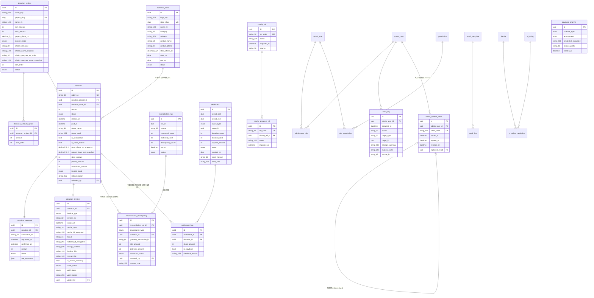

# 16 — 慈善捐款平台資料表綱要

> 🔵 **獨立系統、獨立資料庫。** 慈善平台自 v2.0 起是獨立網域、獨立前台、獨立後台、**獨立資料庫**，
> **主辦與收款主體是台灣足球策略發展協會，不是台中磐石足球俱樂部**。
> 本檔與 [`12-database-schema.md`](12-database-schema.md) **平行且互不包含**——主站綱要明文不含這裡的任何一張表。
>
> 來源：[`../output/TCRFC_慈善捐款平台功能規劃書.md`](../output/TCRFC_慈善捐款平台功能規劃書.md)（**v2.5，共 806 行**）。
> 功能看 [`10-charity-donation-site.md`](10-charity-donation-site.md)；部署與快取看 [`17-deployment.md`](17-deployment.md)。
> 本檔是導航層，不得新增規劃書沒有的規格。
>
> ⚠️ **`docs/12` 的慣例不是全部都適用**——四項刻意的差異列在 [§9](#9-與主站綱要的四項差異)。

---

## 0. 一分鐘理解

| 項目 | 決定 |
|---|---|
| 資料庫 | **`tcrfc_charity`（原稱 `sqldb-charity`），與 `tcrfc_club`（原稱 `sqldb-club`）完全獨立**（Azure SQL，各自單庫） |
| 表數 | **26 張**（含 CH-3 新增的 `AdminRefreshToken`）＋ 4 張 `*_i18n` 側表 |
| 租戶維度 | **沒有 `club_id`**——單一法人，不是多俱樂部架構 |
| 會員 | **沒有 `Member`**——捐款人不登入不註冊，只填姓名與 Email |
| 稽核 | 🔴 **有 `AuditLog`**（與主站相反，理由見 [§9](#9-與主站綱要的四項差異)） |
| 快取 | 🔴 **完全不接 Redis**（[`14-invariants.md`](14-invariants.md)） |
| 金額 | `int` 存「元」；百分比 `decimal(5,2)`。**分潤無條件捨去至整數元** |
| **表名** | 🔴 **`snake_case` 複數**（`donation_stores`／`donations`／`settlements`），同 [`12` §1.2](12-database-schema.md#12-主鍵外鍵與命名慣例)。ERD 用單數只是為了好讀 |
| 主鍵 | `id uniqueidentifier` **非叢集** ＋ 另一欄 `bigint IDENTITY` 當叢集鍵（同主站，理由見 [`12` §1.2](12-database-schema.md#12-主鍵外鍵與命名慣例)） |
| **共通欄位** | 🔴 **沿用 [`12` §1.3](12-database-schema.md#13-共通欄位)**：所有實體表都有 `id`／`created_at`／`updated_at`／`created_by`／`updated_by`。**本庫有 `AuditLog` 不代表可以省略這四欄**——稽核記的是「發生過什麼動作」，共通欄位記的是「這一列現在的歸屬與時間」，兩者用途不同 |
| **命名與型別慣例** | 沿用 [`12` §1.2](12-database-schema.md#12-主鍵外鍵與命名慣例)（表名、欄位名、外鍵命名）與 §1.3 的金額規則 |

> ⚠️ **三類表不套共通欄位**——判準是**結構**不是名稱：
>
> | 類型 | 表 | 為什麼 |
> |---|---|---|
> | **純關聯表** | `AdminUserRole`、`RolePermission` | 複合主鍵即足，沒有自己的生命週期 |
> | **翻譯側表** | 四張 `*_i18n` **＋ `UiStringTranslation`** | 形狀同 [`12` §2.2](12-database-schema.md#22-側表形狀) 的 `article_i18n`——複合主鍵 ＋ 內容欄位，**主站的側表也沒有這四欄**。`UiStringTranslation` 雖然列在 §2.5 的共通機制，但它**結構上就是側表** |
> | 🔴 **`AuditLog`** | | **稽核紀錄是 append-only**。有 `updated_at`／`updated_by` 等於宣告稽核可以被改，**軌跡就失去意義**——而它正是勸募法遵要求的東西。另外 `created_at` 與 `occurred_at`、`created_by` 與 `admin_user_id` 語意重複 |
>
> **`Locale` 以 `code` 為自然鍵**（所有側表的 `locale` 欄直接指向它），不另設 `uuid` 主鍵。

---

## 1. 與主站的邊界

**主站的 `Charity`／`CharityProgram`／`ImpactRecord`／`ImpactMetric` 四張是主檔，留在主站。**
本平台只持有**唯讀複本**，用於 N2 選撥付對象、以及把名稱印在對帳單與收據上。

🔴 **跨系統參照的三條規則**（慈善規劃書 §9.3）：

1. **主站是公益團體與慈善計畫的唯一主檔。** 本平台的 `*_name_snapshot` 是唯讀複本，兩邊不同步時一律以主站為準。**絕不可讓本平台成為第二個真實來源。**
2. **不得即時 join、不得同步查詢主站資料庫。** 本平台**不得持有主站資料庫的連線**。清單同步走 N2 後台的 CSV 匯入，或主站提供的唯讀 API 定期拉取。
   ⚠️ **Azure SQL 本身也不支援跨庫查詢**，這條在技術上是硬的（[`17` §6](17-deployment.md)）。
3. **快照是刻意的，不是妥協。** 撥付對象名稱要印在對帳單與捐贈收據上——那是已開立的憑證，**不得隨主站日後改名而變動**。

> ⚠️ **慈善規劃書 §9.3 表格最後一列寫「受贈的公益團體 → `Charity`（主站既有），本平台的項目撥付對象直接關聯它」，
> 與上面三條規則牴觸**（v2.0 已改為值複製快照，不是外鍵）。
> **以三條規則為準**；該列是 v1.x 殘留，已登記於 [§10](#10-本檔不決定的事)。

**五種商業對象不可混用**（[`14-invariants.md`](14-invariants.md)）：
`DonationStore`（本平台，掃碼引流，**有金流有分潤**）與 `PartnerStore`（主站 8.4，會員折扣，**無金流無分潤**）
**是兩張不同資料庫裡的不同表**。同一家店既引流又給會員折扣，**兩邊各建一筆，不共用紀錄、不建外鍵**。

---

## 2. 資料表總覽（26）

圖例：🌐 有 i18n 側表｜🔒 含受限或加密欄位｜📸 值複製快照，不可回頭 join。

### 2.1 `N` 捐款核心（8）

| 表 | 用途 | 標記 | 後台 |
|---|---|---|---|
| `DonationStore` | **捐款合作店家**：名稱、**`logo_key` Logo 或照片**、類別、地址、聯絡人與電話、合作起訖、狀態、**`store_share_pct`**、**`store_slug`**（全站唯一、**不可由編號推導**、可重產且舊 QR 立即失效） | 🌐 🔒 | N1 |
| `DonationProject` | **捐款項目**：名稱、封面、一句話說明、說明內文、款項用途、`project_slug`、最低／最高金額、**`project_share_pct`**、**`invoice_mode`**、上下架與排序、**撥付對象與慈善計畫的四個快照欄位** | 🌐 | N2 |
| `DonationAmountOption` | 金額選項卡 `(donation_project_id, amount, sort_order)` | | N2 |
| `Donation` | **捐款主檔**：`order_no`、金額、狀態、建立與付款時間、`donation_project_id`、`donation_store_id`（**可為空**）、捐款人姓名與 Email、具名／匿名、**`is_credit_hidden` 後台逐筆隱藏於徵信名單**（CH-5）、**分潤五欄快照**、發票欄位、退款原因與經辦人 | 🔒 📸 | N3 |
| `DonationPayment` | 金流交易：交易識別碼、請求與確認時間、金額、狀態、`raw_response json`（**只存不查**） | 🔒 | N3 |
| `DonationInvoice` | 發票／收據：類型、號碼、開立時間、載具或統編或收據資訊、狀態、**發票抬頭**（統編模式必填）、**收據抬頭**（預設帶入捐款人姓名**可修改**）、**年度彙總開立旗標**、作廢或折讓＋**原因與經辦人** | 🔒 📸 | N5 |
| `Settlement` | 結算單：期間、`payee_type`（`store`／`project`）、對象、筆數、捐款總額、應付金額、狀態、匯款登記（**日期、方式、備註**三項） | | N4 |
| `SettlementLine` | 結算明細：逐筆捐款的分潤金額，**含退款沖回的負項**與**沖回原因** | 📸 | N4 |

### 2.1b 對帳（2）

規劃書 §4.5（行 402–406）：「每日將本站的 `paid` 捐款單與 LINE Pay 的交易明細比對／
差異情形（**本站有金流無、金流有本站無、金額不符**）列為異常清單供人工處理／**對帳結果保留供稽核**」。
N3 的異常佇列（行 517）也把「對帳差異」列為三類待人工處理之一。

| 表 | 用途 | 標記 | 後台 |
|---|---|---|---|
| `ReconciliationRun` | **每日對帳批次**：對帳日、來源、比對筆數、相符筆數、差異筆數、執行時間、狀態 | | N3 |
| `ReconciliationDiscrepancy` | **對帳差異明細**：差異類型（三值）、`donation_id`（可空）、金流端交易識別碼（可空）、本站金額、金流端金額、處理狀態、處理人與備註 | 🔒 | N3 |

> 🔴 **「對帳結果保留供稽核」＝這兩張表不可清除**，比照 `AuditLog` 的 append-only 性質；
> `ReconciliationDiscrepancy` 的處理狀態可更新，**但差異本身的記錄不得刪除**。
> ⚠️ 三種差異類型對應規劃書字面：`site_only`（本站有金流無）／`gateway_only`（金流有本站無）／`amount_mismatch`（金額不符）。

### 2.2 主站主檔的唯讀複本（2）

| 表 | 用途 | 標記 |
|---|---|---|
| `CharityRef` | 受贈公益團體的**唯讀清單**：`ref_code`、名稱、匯入時間、來源 | 🔒 |
| `CharityProgramRef` | 慈善計畫的**唯讀清單**：`ref_code`、名稱、所屬 `CharityRef`、匯入時間 | |

> 🔴 **這兩張只供 N2 選撥付對象用，選定後把 `ref_code` 與名稱值複製進 `DonationProject`。**
> **不得從 `DonationProject` 外鍵指向它們**——否則清單重新匯入時會改動已開立憑證上的名稱。
> 🟡 **這兩張表是 §9.3 第 2 條「清單同步採 CSV 匯入或唯讀 API 拉取」的落地形式**，屬實作手段；
> 規劃書沒有把它們列為型別，**建表前請確認這個讀法**（[§10](#10-本檔不決定的事)）。

### 2.3 後台帳號與權限（6）

| 表 | 用途 | 標記 |
|---|---|---|
| `AdminUser` | 後台帳號。**`username` 是唯一登入識別不是 Email**；2FA 不強制，獨立後台介面暫不提供設定入口（系統能力保留、日後可開放；已啟用者登入仍須驗證碼；使用者 2026-09-30 裁決，比照主站 v3.17）；`must_change_password` 預設 `0`，僅供管理員要求某帳號改密碼，不做首次登入強制；密碼雜湊優先 Argon2id 次選 bcrypt | 🔒 |
| `AdminRole` | 角色。**沿用主站 §6 的九個角色**，`is_system = true` 的種子資料 | |
| `AdminUserRole` | `(admin_user_id, admin_role_id)`，多角色取聯集 | |
| `Permission` | 權限碼字典 ＋ `is_restricted`／`sysadmin_only` | |
| `RolePermission` | `(admin_role_id, permission_id)` | |
| `AdminRefreshToken` | **更新權杖的工作階段狀態**（CH-3，2026-10-01 新增，形狀與用意同主站 [`12b` §7.7](12b-database-tables.md#77-admin_refresh_tokens更新權杖的工作階段狀態s1-3-新增2026-09-23-補文件)）：`token_hash`（只存 SHA-256）、`issued_at`／`expires_at`、`revoked_at`、`replaced_by_id`（輪替鏈，重放偵測用）。**登入輪替與重放偵測的必要狀態，不是日誌表**；刻意不存來源 IP 與裝置字串。⚠️ **規劃書 §10 只寫「帳號與權限」，沒有寫這個實作機制**，列為待裁決（[§10](#10-本檔不決定的事)） | 🔒 |

> 🔴 **沒有 `AdminUserClub`／`AdminUserTeam`**——本平台是單一法人，沒有資料範圍維度。
> 🔴 **`Permission` 與主站同形**（[`12b` §7.3](12b-database-tables.md#73-權限碼命名)）：保留 `module_code`／`submodule_code`／`domain`／`action` 四欄分解
> ——本庫的 `module_code` 是 `N`、`submodule_code` 是 `N1`–`N7`，有實際值域。
> **唯一不要的是 `is_club_scoped`**（沒有俱樂部維度）。
> 🔴 **這是另一套帳號**，與主站後台完全獨立、不共用表、不共用登入（[`17` §5](17-deployment.md)）。

### 2.4 稽核（1）

| 表 | 用途 | 標記 |
|---|---|---|
| `AuditLog` | **操作稽核**：操作者、時間、動作、對象型別與 id、變更摘要、用途備註、來源 IP | 🔒 |

> 🔴 **主站刻意沒有日誌表，本平台刻意有。** 慈善規劃書 §11.2 明訂
> **退款、分潤百分比設定、含個資的明細匯出三類操作全數留下稽核軌跡**，這是勸募法遵的要求不是可選項。
> 🔴 **`AuditLog` 是 append-only**：**不得有 `updated_at`／`updated_by`**，也不重複 `created_at`（用 `occurred_at`）與 `created_by`（用 `admin_user_id`）。
> 完整差異見 [§9](#9-與主站綱要的四項差異)。

### 2.5 共通機制（7）

| 表 | 用途 | 標記 |
|---|---|---|
| `Locale` | 啟用語系（`code`、名稱、是否預設、fallback、排序）。**加第三語系＝INSERT 一列** | |
| `UiString` | 介面字串鍵與所屬分組 | |
| `UiStringTranslation` | `(ui_string_id, locale) → value` | |
| `Setting` | 站台設定與文案（首頁說明、感謝語樣板、捐款須知、隱私權政策、金額上下限預設值、徵信名單顯示規則）；文案類另有 `setting_i18n` | 🌐 |
| `EmailTemplate` | 系統信樣板（**四封**） | 🌐 |
| `EmailLog` | 系統信寄送紀錄。**`type` 值域 4 個**——本平台自己的四封 | 🔒 |
| `PaymentChannel` | **協會**的 LINE Pay 與發票加值中心憑證：`channel_type`／`environment`／憑證（加密）／字軌／輪替時間 | 🔒 |

> 🔴 **`PaymentChannel` 這裡只有協會的憑證。** 俱樂部的在主站庫，**三方的 LINE Pay 商店號一律不得共用**——
> 收款主體錯誤會同時踩稅務與《公益勸募條例》。
> ⚠️ 正式環境須於商店管理後台登記**付款伺服器的出口 IP**，見 [`17` §3](17-deployment.md)。
> 🔴 **沒有 `subject` 欄也沒有 `owner_club_id`**——本庫只服務協會一個法人。

### 2.6 i18n 側表（4）

`donation_store_i18n`、`donation_project_i18n`、`setting_i18n`、`email_template_i18n`，
一律 `(<entity>_id, locale)` 唯一。**側表不計入 23 張。**

---

## 3. ER 圖

```mermaid
erDiagram
  donation_project ||--o{ donation_amount_option : ""
  donation_project ||--o{ donation : ""
  donation_store ||--o{ donation : "可為空（非掃碼進入）"
  donation ||--|| donation_payment : ""
  donation ||--o| donation_invoice : ""
  reconciliation_run ||--o{ reconciliation_discrepancy : "差異明細"
  donation ||--o{ reconciliation_discrepancy : "可為空（金流有本站無時）"
  donation ||--o{ settlement_line : "一筆捐款進兩份結算（店家＋項目）"
  settlement ||--o{ settlement_line : ""
  charity_ref ||--o{ charity_program_ref : ""
  admin_user ||--o{ admin_user_role : ""
  admin_role ||--o{ admin_user_role : ""
  admin_role ||--o{ role_permission : ""
  permission ||--o{ role_permission : ""
  admin_user ||--o{ audit_log : ""
  admin_user ||--o{ admin_refresh_token : "登入工作階段（CH-3）"
  admin_refresh_token |o--o| admin_refresh_token : "輪替鏈 replaced_by_id"
  email_template ||--o{ email_log : ""
  locale ||--o{ ui_string_translation : ""
  ui_string ||--o{ ui_string_translation : ""
  donation_store {
    uuid id PK
    string_500 logo_key
    slug store_slug UK
    string_128 name_zh
    string_32 category
    string_500 address
    string_64 contact_name
    string_32 contact_phone
    decimal_5_2 store_share_pct
    date start_on
    date end_on
    enum status
  }
  donation_project {
    uuid id PK
    string_500 cover_key
    slug project_slug UK
    string_128 name_zh
    int min_amount
    int max_amount
    decimal_5_2 project_share_pct
    enum invoice_mode
    string_32 charity_ref_code
    string_128 charity_name_snapshot
    string_32 charity_program_ref_code
    string_128 charity_program_name_snapshot
    int sort_order
    enum status
  }
  donation_amount_option {
    uuid id PK
    uuid donation_project_id FK
    int amount
    int sort_order
  }
  donation {
    uuid id PK
    string_32 order_no UK
    uuid donation_project_id FK
    uuid donation_store_id FK
    int amount
    enum status
    datetime created_at
    datetime paid_at
    string_64 donor_name
    string_255 donor_email
    bool is_anonymous
    bool is_credit_hidden
    decimal_5_2 store_share_pct_snapshot
    decimal_5_2 project_share_pct_snapshot
    int store_amount
    int project_amount
    int association_amount
    enum invoice_mode
    string_255 refund_reason
    uuid refunded_by FK
  }
  donation_payment {
    uuid id PK
    uuid donation_id FK
    string_64 transaction_id
    datetime requested_at
    datetime confirmed_at
    int amount
    enum status
    json raw_response
  }
  donation_invoice {
    uuid id PK
    uuid donation_id FK
    enum invoice_type
    string_32 invoice_no
    datetime issued_at
    string_16 carrier_type
    string_255 carrier_id_encrypted
    string_16 tax_id
    string_255 national_id_encrypted
    string_500 receipt_address
    string_128 invoice_title
    string_128 receipt_title
    bool is_annual_summary
    enum issue_status
    enum void_status
    string_255 void_reason
    uuid voided_by FK
  }
  settlement {
    uuid id PK
    date period_start
    date period_end
    enum payee_type
    uuid payee_id
    int donation_count
    int donation_total
    int payable_amount
    enum status
    date remitted_on
    string_32 remit_method
    string_255 remit_note
  }
  settlement_line {
    uuid id PK
    uuid settlement_id FK
    uuid donation_id FK
    int share_amount
    bool is_clawback
    string_255 clawback_reason
  }
  reconciliation_run {
    uuid id PK
    date run_on
    string_32 source
    int compared_count
    int matched_count
    int discrepancy_count
    datetime ran_at
    enum status
  }
  reconciliation_discrepancy {
    uuid id PK
    uuid reconciliation_run_id FK
    enum discrepancy_type
    uuid donation_id FK
    string_64 gateway_transaction_id
    int site_amount
    int gateway_amount
    enum resolution_status
    uuid resolved_by FK
    string_255 resolve_note
  }
  charity_ref {
    uuid id PK
    string_32 ref_code UK
    string_128 name
    datetime imported_at
    string_32 source
  }
  charity_program_ref {
    uuid id PK
    string_32 ref_code UK
    uuid charity_ref_id FK
    string_128 name
    datetime imported_at
  }
  admin_refresh_token {
    uuid id PK
    uuid admin_user_id FK
    string_128 token_hash UK
    datetime issued_at
    datetime expires_at
    datetime revoked_at
    uuid replaced_by_id FK
  }
  audit_log {
    uuid id PK
    uuid admin_user_id FK
    datetime occurred_at
    string_32 action
    string_32 target_type
    uuid target_id
    string_500 change_summary
    string_255 purpose_note
    string_45 source_ip
  }
  payment_channel {
    uuid id PK
    enum channel_type
    enum environment
    string_500 credential_encrypted
    string_16 invoice_prefix
    datetime rotated_at
  }
```

> ⚠️ **`admin_user`／`admin_role`／`permission` 等五張的欄位與主站同形，此處省略**——見 [`12b` §7](12b-database-tables.md#7-權限模型j-模組)。
> ⚠️ **i18n 側表不入圖**（同主站慣例），§2.6 才是權威清單。
> 🔴 **`donation` 對 `charity_ref` 沒有線**——項目的撥付對象是**值複製進 `donation_project` 的四個快照欄位**，不是外鍵。

---

## 4. 關鍵資料表明細

### 4.1 `Donation`

| 項目 | 規則 |
|---|---|
| 收款主體 | **協會**。發票與收據抬頭、系統信署名、對帳單一律為協會 |
| `donation_store_id` | **可為空**（非掃碼進入時）。為空時 `store_share_pct_snapshot = 0`，**仍能結算** |
| 分潤五欄 | `store_share_pct_snapshot`／`project_share_pct_snapshot`（`decimal(5,2)`）→ `store_amount`／`project_amount`／`association_amount`（`int`，元）。**無條件捨去至整數元**，三者相加須等於 `amount` |
| 約束 | `store_share_pct + project_share_pct <= 100`（N2 儲存時驗證，超過即擋下） |
| 捐款人 | 只有 `donor_name`／`donor_email`／`is_anonymous`。🔴 **不建帳號、不歸戶、不得有 `member_id` 外鍵** |
| 徵信名單 | **公開條件缺一不可**：`status = paid`、`is_anonymous = 0`（捐款人在表單明示選具名＝規劃書 §11.1「以明示同意為前提」）、`is_credit_hidden = 0`（後台逐筆隱藏，CH-5 新增，預設 0）、站台設定沒有整站關閉。**只輸出姓名**（同名去重、依姓名排序） |
| 會員比對 | 僅以 Email **軟性比對**於 N3 查詢當下進行，**不寫入任何表、不建關聯欄位** |
| `invoice_mode` | `b2c_invoice`／`donation_receipt`，**由 `DonationProject` 決定**，建單時快照 |
| 退款 | **對外不受理**，後台保留人工退款供誤捐個案，記 `refund_reason` 與 `refunded_by`，**並寫 `AuditLog`** |
| ⛔ 不存在的欄位 | **目標金額、已募得金額、捐款筆數**——前台不做募款進度，累計數字只從 N6 報表算 |
| ⛔ 不存在的欄位 | **回饋品**——項目不得附回饋品 |

### 4.2 `Settlement` / `SettlementLine`

| 項目 | 規則 |
|---|---|
| `payee_type` | **`store`／`project` 二選一，兩份不同的對帳單** |
| 計算基準 | **只計 `status = 'paid'` 的捐款**，用**捐款當下的快照百分比**。🔴 **改設定不追溯** |
| 退款沖回 | 以**負項** `SettlementLine`（`is_clawback = true`）進入下一期，**不改原列、不重算已付款期間** |
| `status` | `待結算` → `已結算` → `已付款`。**實際匯款在系統外執行**，系統只登記 `remitted_on` 與 `remit_note` |
| 職責分離 | 標記「已付款」的人與執行匯款的人**不得為同一人**——**以權限碼分離，不落資料表**（CH-4：`n4.settlement.execute` 與 `n4.settlement.mark_paid` 是兩個碼） |
| 狀態異動歷程 | 每次異動（確認結算、登記付款）的經辦人與時間由 **`audit_logs`** 承載（append-only），不加欄位（[`16a`](16a-charity-field-audit.md) §0 結案） |
| 負項明細 | 沖回的 `SettlementLine`：`is_clawback = 1`、`share_amount` 為**負數**（原分潤的反向）、`clawback_reason` 為「捐款單 {單號} 已退款：{原因}」。同一筆捐款對同一類對象至多一條正項、一條負項；`(settlement_id, donation_id, is_clawback)` 唯一 |

### 4.3 `DonationStore`

| 項目 | 規則 |
|---|---|
| `store_slug` | **全站唯一、系統產生、不可由編號推導**。可重新產生，**舊 QR 立即失效**，須二次確認並**記錄操作者** |
| QR | 產生 PNG／SVG／含店名的印刷版 PDF；批次匯出 zip。**QR 內容只帶 `store_slug`** |
| 🔴 網址 | **不得攜帶金額或分潤參數**——`store_slug` 僅為歸屬標記 |
| 不做 | **掃碼核銷、店家帳號、核銷報表**——店家完全不涉入系統操作 |

### 4.4 `DonationInvoice`

| 項目 | 規則 |
|---|---|
| 兩種模式 | `b2c_invoice`（電子發票：載具／統編／捐贈碼）／`donation_receipt`（捐贈收據：**身分證字號與地址**） |
| 🔐 加密 | **`national_id_encrypted` 必須加密儲存**，後台預設遮罩，**僅在開立收據的必要範圍內使用** |
| `issue_status` | `pending`／`issued`／`failed`，失敗可重試或手動填入外部號碼 |
| `void_status` | `none`／`voided`／`allowance`。**作廢與折讓依稅法保留，不隨「對外不受理退款」而移除** |
| 抬頭 | **協會**。與俱樂部發票**分屬不同字軌，不得共用** |

---

## 5. 權限模型

沿用主站 §6 的**九個角色**（慈善規劃書 §10），**不新增第十個**——本平台沒有合作球隊維度。

🔴 **三類操作需獨立授權且每次寫 `AuditLog`**：

| 操作 | 為什麼 |
|---|---|
| **退款** | 涉及金流沖回與發票作廢 |
| **分潤百分比設定** | 直接改變應付金額 |
| **含個資的明細匯出** | 須額外授權**並記錄用途備註**（`AuditLog.purpose_note`） |

**受限資料**：捐款人姓名／Email／身分證字號／地址——**僅系統管理員與客服／行政可完整檢視**，其餘角色見遮罩值。
遮罩一律在 **API 層**回傳遮罩後的值（如 `a***@gmail.com`），**不是前端隱藏**。

---

## 6. 索引與唯一鍵

**唯一鍵**：

| 表 | 唯一鍵 |
|---|---|
| `DonationStore` | `store_slug` |
| `DonationProject` | `project_slug` |
| `Donation` | `order_no` |
| `DonationInvoice` | `invoice_no`（**已開立者**；未開立為空，用篩選唯一索引） |
| `CharityRef` / `CharityProgramRef` | `ref_code` |
| `AdminUser` | **`username`**（`email` 不設唯一） |
| `AdminRole` / `Permission` | `code` |
| `Locale` | `code` |
| 所有 `*_i18n` | `(<entity>_id, locale)` |

**查詢索引**：

| 表 | 索引 | 用途 |
|---|---|---|
| `Donation` | `(status, paid_at)`、`(donation_store_id, paid_at)`、`(donation_project_id, paid_at)` | N4 結算與 N6 報表 |
| `Donation` | `(status, created_at)` | **異常佇列**：已扣款但確認失敗 |
| `DonationInvoice` | `(issue_status, issued_at)` | 異常佇列：發票開立失敗 |
| `SettlementLine` | `(settlement_id)`、`(donation_id)` | 沖回對應 |
| `SettlementLine` | **唯一** `(settlement_id, donation_id, is_clawback)` | CH-4 新增：同一份結算單內一筆捐款最多一條正項、一條負項（資料層後盾；跨結算單的「每種對象只進一份」由應用程式以 `sp_getapplock` 串行化＋排除查詢保證） |
| `AuditLog` | `(occurred_at desc)`、`(admin_user_id, occurred_at desc)`、`(target_type, target_id)` | 稽核查詢 |
| 所有 `*_i18n` | `(locale)` | 翻譯狀態矩陣 |

**外鍵刪除行為**：

| 關係 | 行為 |
|---|---|
| `Donation` → `DonationPayment`／`DonationInvoice` | **`RESTRICT`**（⚖️ 法定保存，不得刪） |
| `Settlement` → `SettlementLine` | **`RESTRICT`** |
| `DonationProject` → `Donation` | **`RESTRICT`** |
| `DonationStore` → `Donation` | **`SET NULL`**（店家終止合作後捐款紀錄仍在，歸屬已快照在分潤欄位） |
| 母表 → `*_i18n` | `CASCADE` |

---

## 7. 不得讀快取

🔴 **本平台完全不接 Redis**（[`14-invariants.md`](14-invariants.md)、[`17` §4](17-deployment.md)）。
金流回呼的冪等檢查與捐款狀態本來就在主站的「五類不得讀快取」之列，
而本平台的資料量（數千至數萬筆）在 Azure SQL 上直接查即可，**多一層快取只會多一個出錯的地方**。

---

## 8. DBMS 相依的決定

沿用 [`12` §1.4](12-database-schema.md#14-dbms-相依的五件事已定案) 的五項定案，其中兩項在本庫有不同落點：

| 議題 | 本庫的落點 |
|---|---|
| **JSON 欄位** | 只有 `DonationPayment.raw_response` 一處，**只存不查**，用原生 `json` 型別 |
| **NULL 語意** | 本庫**沒有可為空的租戶維度**，`slug` 類一律單欄唯一，不需要複合鍵也不需要路由優先順序 |
| 陣列欄位 | 無 |
| `CalendarEvent` | 無 |
| 全文檢索 | 無（後台以篩選為主，前台項目數量個位到數十） |

---

## 9. 與主站綱要的四項差異

| # | 差異 | 為什麼 |
|---|---|---|
| 1 | 🔴 **有 `AuditLog`，主站沒有** | 主站「不建任何日誌表」是**委託方指示**（[`12` §13.1](12-database-schema.md#131-沒有稽核與登入日誌表)）；本平台的退款、分潤設定、個資匯出三類操作**由慈善規劃書 §11.2 明訂須留稽核軌跡**，是勸募法遵要求 |
| 2 | 🔴 **沒有 `club_id`** | 單一法人（協會），不是多俱樂部架構。連帶：沒有 `AdminUserClub`／`AdminUserTeam`、沒有站台切換器、`PaymentChannel` 沒有主體欄位 |
| 3 | 🔴 **沒有 `Member`** | 捐款人**不登入不註冊**。會員比對只在 N3 查詢當下以 Email 軟性進行，**不寫入任何表** |
| 4 | 🔴 **`Charity`／`CharityProgram` 是唯讀快照不是外鍵** | 兩個資料庫互相獨立、Azure SQL 不支援跨庫查詢；且撥付對象名稱要印在已開立的憑證上，**不得隨主站改名而變動** |

---

## 10. 本檔不決定的事

- ✅ **`CharityRef`／`CharityProgramRef` 已定案建表**（2026-09-20）：§9.3 說清單同步採 CSV 匯入或唯讀 API 拉取，匯入就要有地方放。
- ✅ **`DonationPayment.status` 已定案為四值**（2026-09-20）：`requested`／`confirmed`／`failed`／**`cancelled`**——對帳與客訴時「使用者取消」與「金流失敗」是兩回事。
- 🟡 **`Permission.domain` 的值域待權限碼盤點後再定**（2026-09-20 決議：現在硬定會綁死，DDL 先留白不加 `CHECK`）。
- ~~原：`CharityRef`／`CharityProgramRef` 兩張表的存在形式~~ —— 規劃書 §9.3 只說「清單同步採 CSV 匯入或唯讀 API 拉取」，**沒有列為型別**。本檔的讀法是「要匯入就要有地方放」，但**建表前應確認**；若改為「每次在 N2 現場貼上名稱」則兩張表不需要
- 🔴 **慈善規劃書 §9.3 表格最後一列與跨系統三條規則牴觸**（「撥付對象直接關聯 `Charity`」vs「值複製快照不是外鍵」）——**須走同步鏈修掉那一列**，屬 `E-02` 型的殘留
- **個資保存期限** —— 規劃書 §11.1 標為待客戶與法務確認，直接影響 `Donation`／`DonationInvoice` 的清理策略
- **協會的法人登記與統編** —— `STATUS.md` **B-7**，**這是上線前提不是一般待確認事項**
- **定序、Redis 持久化、CI 管線** —— 同 [`17` §8](17-deployment.md)
- 🟡 **`AdminRefreshToken` 是規劃書沒寫的實作機制**（CH-3，2026-10-01）：沒有它登入工作階段無法安全輪替或撤銷（存取權杖只有 15 分鐘，沒有更新權杖就得每 15 分鐘重新登入）。
  比照主站 `admin_refresh_tokens` 的先例（[`12` §2](12-database-schema.md) 把它歸為功能單元不是日誌）新增，**請確認**這個讀法；若不接受，替代方案是只發長效存取權杖（安全性較差，不建議）。
- 🟡 **`carrier_type` 值域沒有定義**：種子（CH-1b）存的是中文標籤（`手機條碼載具`／`捐贈發票`／`統一編號`），API 寫入一律用代碼 `mobile_carrier`／`love_code`／`tax_id`，讀取時把舊的中文標籤正規化回代碼。是否要把種子改成代碼並加 `CHECK`，待裁決。
- 🟡 **規劃書要求但資料模型沒有承載、本輪沒做的功能**（不自己發明欄位，列為待裁決）：
  ① ~~**徵信名單逐筆隱藏**（規劃書 §3.6「亦可逐筆隱藏」、§6.3「隱藏於徵信名單」）——`donations` 沒有隱藏旗標~~ ✅ **2026-10-02 已解**：新增 `donations.is_credit_hidden`（見 §4.1、§12）；
  ② **N3 的「以 Email 軟性比對會員」**（§6.3）——v2.0 起本庫不得持有主站連線、Azure SQL 不支援跨庫查詢，只能由主站提供唯讀 API，**主站尚無此端點**；
  ③ **捐款人語系**（系統信要不要寄英文版）——`donations` 沒有記錄語系的欄位，目前系統信一律繁中；
  ④ **發票自動重試的嘗試次數**（§5.3「自動重試若干次（含退避）」）——`donation_invoices` 沒有嘗試次數欄位，目前是固定間隔重試＋總期限（預設 10 分鐘），不是指數退避。
- 🔴 **「待人工處理」（已扣款但 Confirm 失敗）沒有專屬欄位**：規劃書 §4.3 要求「標記為待人工處理、進異常佇列」，但 `donations`／`donation_payments` 沒有這個旗標。**CH-3 的執行層定義（見 [§11](#11-ch-2ch-3-實作補記執行層決定)）：`donations.status = 'pending'` ＋最近一次 `donation_payments.status = 'failed'`**——因為金流明確回覆的失敗一律把捐款單轉成 `failed`，所以「單 pending、付款 failed」只可能是「結果未知」。請確認這個讀法，否則需要加欄位。

---

## 11. CH-2／CH-3 實作補記（執行層決定）

> 2026-10-01，`backend-engineer`。以下是實作時規劃書與本檔都答不到、由執行層決定的事；細節與契約在 [`apps/api/README.md`](../apps/api/README.md)「慈善 CH-2／CH-3」。

| 議題 | 決定 |
|---|---|
| **冪等鍵怎麼存** | 資料庫沒有 `idempotency_key` 欄位，**不自己發明**。改讓單號成為冪等鍵的函式：`order_no = "CH" ＋ HMAC-SHA256(伺服器秘密, "order\|" ＋ 冪等鍵) 前 80 bits 的 Base32（16 碼）`。同一個冪等鍵永遠算出同一個單號，並發的兩個請求撞 `UQ_donations_order_no`，輸的回頭讀贏的那張。單號同時是結果頁網址的一部分，沒有秘密就算不出來（80 bits，不可猜測） |
| **分潤快照時點** | 建單時寫「暫算」的分潤（`CHECK` 約束要求三個金額相加等於 `amount`，所以不能留空），**付款成立（`paid`）時依當下設定重算並覆寫**（規劃書 §8.4）。事後改設定不追溯 |
| **狀態轉移** | 一律條件式更新（`UPDATE … WHERE status IN (預期狀態)`），由資料庫保證只有一個請求贏得轉移；贏的才寄信、開票。逾時工作把 `created` 與「最近一次付款已發起超過 30 分鐘」的 `pending` 轉 `expired`，**不碰「待人工處理」的單**；`expired` 的單金流端晚到的成功仍會被收下 |
| **付款重試** | 重試沿用原單（`failed`／`expired`／`created` → `pending`），每次發起付款新增一列 `donation_payments`，`PaymentRequest.Attempt` 讓正式金流實作組出不重複的金流端 orderId |
| **憑證開立** | 付款確認當下先試一次；失敗的由背景工作固定間隔重試，超過期限（預設自付款成功起 10 分鐘）標記 `failed`、寄開立失敗通知給協會（`CHARITY_ASSOCIATION_NOTIFY_EMAIL`）。加值中心明確拒絕不重試、直接 `failed`。**年度彙總開立**（`is_annual_summary`）不在逐筆流程內，留給年底作業 |
| **退款連動** | 金流退款成功後才改本站狀態：憑證當期（台灣時間單數月起的雙月期）內作廢、跨期折讓；憑證作廢失敗不影響退款，進異常佇列 `invoice_void_pending`。**回饋金沖回（§8.5）屬 N4 結算（CH-4）**，本輪只把狀態改成 `refunded` |
| **退款串行化** | 沒有「退款中」這個捐款單狀態（`CHECK` 約束沒有），只靠最後的條件式更新擋不住並發退款——兩個請求會各打一次金流退款。同一筆捐款的退款用**交易層級的 `sp_getapplock`**（`LockTimeout = 0`）包住「讀取檢查 → 金流退款 → 更新與稽核 → 提交」，拿不到鎖回 `409`。實測：沒有鎖 6 個並發請求打了 6 次金流退款，有鎖 1 次 |
| **個資加密** | `national_id_encrypted`／`carrier_id_encrypted`／`two_factor_secret_encrypted` 用 ASP.NET Core Data Protection，三個用途字串互相隔離。🔴 **金鑰環遺失 ＝ 已加密的身分證字號永久無法解密**（捐款人不登入，沒有管道補填），正式環境務必持久化金鑰環（`DATA_PROTECTION_KEYS_PATH`）或改接 Key Vault |
| **權限碼** | 沿用種子的 23 個；**新增 `n3.donation.recheck_payment`**（異常佇列的「重新確認付款結果」，系統管理員與客服／行政）。種子裡檢視者的 `scope_type = 'masked'` 不解讀——個資預設遮罩、`reveal` 才看明文是同一件事 |
| **稽核** | 規劃書三類操作（退款、分潤設定、含個資匯出）＋個資明文檢視、店家 QR 網址重產、重寄感謝信、重開憑證、重新確認付款。稽核與被稽核的變更在同一次 `SaveChanges` 提交；`AuditLogger` 只有 `Stage`，沒有更新與刪除的方法 |

---

## 12. CH-3 補完／CH-4／CH-5 實作補記（執行層決定）

> 2026-10-02，`backend-engineer`。以下是實作時規劃書與本檔都答不到、由執行層決定的事；契約在 [`apps/api/README.md`](../apps/api/README.md)「慈善 CH-3 補完／CH-4 帳務與報表／CH-5 延伸」。**資料表結構的變動只有兩處**：`donations.is_credit_hidden` 與 `settlement_lines` 的唯一索引；對帳的兩張表（`ReconciliationRun`／`ReconciliationDiscrepancy`）本來就在 §2.1b 與 DDL 裡，CH-4 只是實作了寫入它們的流程。

| 議題 | 決定 |
|---|---|
| **店家 CSV 匯入的重複處理** | 規劃書只寫「可批次匯入（CSV）」。`store_slug` 由系統產生，沒有可靠的自然鍵能做更新，所以**匯入只做新增**；**繁中店名＋地址（去空白、不分大小寫）相同**視為重複，對照既有全部店家與檔案內較前面的列。預設重複＝錯誤、整批不寫入（比照主站 FAQ 匯入的整批驗證），所以同一份檔案重複匯入不會產生重複店家；`skipDuplicates=true` 改為略過並回報。一次最多 500 列、1 MB |
| **結算單的狀態語意** | `pending`（待結算）＝**草稿**（可重算、可刪除，會納入期間內新符合的捐款與沖回）；`settled`（已結算）＝鎖定金額，只允許因退款而「扣除重出」；`paid`（已付款）＝完全鎖定。產生結算單的 `periodEnd` 必須早於今天（期間沒結束就結算，當天稍後付款的捐款會永遠漏掉） |
| **一筆捐款只進一份結算單** | 對「店家」與「項目」各一份（兩個不同對象的撥付，規劃書 §8.1），但對同一類對象**最多進一份**（含草稿）。產生結算單的排除查詢讓「重按一次」天然冪等；產生／重算／確認／刪除草稿共用 `sp_getapplock` 串行化。同一對象的期間與既有結算單重疊時略過並說明 |
| **分潤為 0 的捐款** | 不進結算單（沒有應付金額可寫）。無店家歸屬的捐款只進「項目」結算 |
| **已付款後退款的沖回** | 下一次為該對象產生（或重算草稿）結算單時自動納入負項，**同一筆只沖回一次**。⚠️ 負項合計大於本期正項時，應付金額為負數——照常產生、允許登記付款（代表對象退款給協會）；要不要改為遞延，列為待裁決 |
| **「已付款」與「執行結算」的權限分離** | 新增權限碼 `n4.settlement.mark_paid`（受限、非 sysadmin_only）。種子只有系統管理員持有 N4 的 `execute`／`mark_paid`——規劃書九個角色裡沒有財務，要落實「核對的人」與「登記付款的人」不同，需客戶決定指派 |
| **對帳的比對規則** | 比對鍵是金流交易識別碼。本站側＝當天（台灣日期）付款成立且狀態 `paid` 或 `refunded` 的捐款（當天付款後來退款的不誤判為本站有金流無）；金流側剩下的若本站有同識別碼，差異連到該捐款單。`site_only` 的 `gateway_transaction_id` 留空（依 DDL 約定，本站的識別碼可由 `donation_id` 查到）。`(run_on, source)` 唯一，重跑同一天更新同一批次：新差異新增、既有保留、已一致的待處理差異自動標記已處理（附註，`resolved_by` 為空） |
| **取不到金流明細** | 記成該日 `failed` 的批次（已有成功批次不覆蓋）並對外回 503，**絕不拿空清單去比對**（那會把當天所有捐款判成差異）。排程 30 分鐘後才重試 |
| **差異處理狀態** | `pending`／`resolved` 兩值（沿用種子）；處理必須寫說明（2–255 字）、只能處理一次、**差異記錄不刪除** |
| **對帳排程** | 台灣時間過了 `CHARITY_RECONCILIATION_AFTER_HOUR`（預設 4）後對昨天對帳一次。刻意不放進整合測試會直接呼叫的 `CharityMaintenanceRunner.RunOnceAsync` |
| **本機對帳來源** | `FakePaymentReconciliationSource` 以本站自己的金流紀錄當金流端明細（永遠一致，只驗證流程）；差異偵測由測試的可編排替身驗證。正式串接卡 `B-7` |
| **N5 憑證操作** | 作廢限**開立當期**（雙月期，跨期請折讓）；尚未開立的憑證作廢不呼叫加值中心；折讓限已開立、全額。手動填入外部號碼會寄出「憑證通知」信。**列表與 CSV 不含個資**（捐贈收據申報若需要捐款人身分證字號，須另走含個資授權，列為待裁決） |
| **N6 報表口徑** | 期間依**付款時間**（轉換率的母體例外，依**建單時間**）；預設只計 `paid`，可切 `refunded`／`all`；「已結算」＝進了已確認或已付款的結算單。全部報表（含逐筆明細）不含捐款人個資。**不輸出「目標達成率」**（規劃書 §7.2 與 §1.2／§6.2 自相矛盾，見 [`16a`](16a-charity-field-audit.md) §0） |
| **N7 環境切換** | 作用中環境存在 `settings`（`payment.active_environment.{channel_type}`），沒設定時依執行環境推定；切到正式前該環境必須已有憑證（電子發票另需字軌）。電子發票開立讀的字軌依作用中環境。金流憑證用專屬 Data Protection 用途（`Tcrfc.Charity.PaymentChannelCredential.v1`）加密、只寫不讀。假實作的環境防線（`CharityFakeGuard`）不因切到測試而放寬 |
| **新增的權限碼** | `n4.settlement.mark_paid`（受限）、`n7.audit_log.view`（受限、`sysadmin_only`）、`n3.donation.hide_credit`（系統管理員、客服／行政）。以 EF migration `AddCh4Ch5Permissions` 補進既有的庫（冪等），新建庫由種子產生器的 `EXTRA_PERMISSIONS` 與 `db/prod/charity-reference-data.sql` 取得。**2026-10-03 再加四個後台帳號與角色管理權限碼**：`n7.admin_account.view`／`.manage`、`n7.admin_role.view`／`.manage`，**全部 `sysadmin_only`、受限**，只掛給 `system_admin` 角色（比照主站 `system.account.*`／`system.role.*`；`module_code=N`、`submodule_code=N7`），migration `AddAdminAccessPermissions`（冪等，同一組決定性 UUID）。本庫 `admin_roles` 無 `scope_mode`／`sort_order`、`permissions` 無 `is_club_scoped`：API 回應補固定值以維持與主站相同的 JSON 形狀（`scopeMode` 恆為 `all_clubs`、`sortOrder` 取 `seq`、`isClubScoped` 恆為 `false`） |
| **稽核動作** | 新增：店家批次匯入、徵信名單顯示調整、結算（產生／重算／確認／登記付款／刪除草稿）、對帳（手動／處理差異）、憑證（填入號碼／作廢／折讓／匯出）、站台設定、系統信樣板、金流憑證與環境切換、項目內文編輯。動作代碼與中文標籤在 `CharityAuditActions.Labels`（稽核查詢畫面用） |
| **徵信名單與成果回顧** | 見 §4.1。成果回顧只輸出項目建立當下的快照（計畫名稱、公益團體名稱、參照碼），不即時查主站（§1 第 2 條）；導回主站的網址是 N7 設定的 `clubSiteUrl`（俱樂部官網網址），不自己組路徑 |
